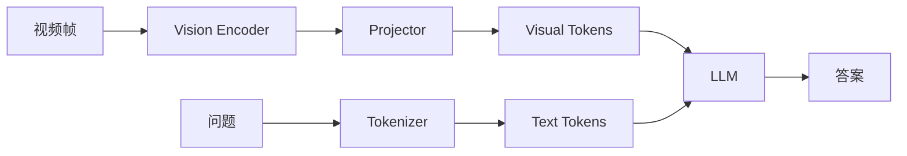
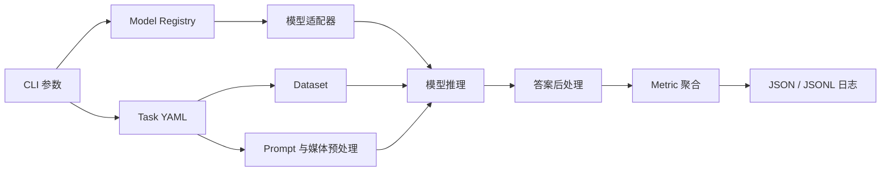

[TOC]

---

## 一、VLLM 的推理流程

VLLM 通常由三部分组成：



1. **视觉编码**：把每一帧划分为 patch，再编码成视觉 token。
2. **模态对齐**：Projector 把视觉特征映射到 LLM 的词向量空间。
3. **Prefill**：LLM 同时处理视觉 token 与问题 token，并建立 KV Cache。
4. **Decode**：利用 KV Cache 自回归生成答案。

设视频包含 $F$ 帧，每帧产生 $N_v$ 个 token，则原始视觉 token 数为：

$$
n_v=F\times N_v
$$

视频越长、分辨率越高，$n_v$ 越大。实际输入长度还包括系统提示与问题：

$$
n=n_{sys}+n_v+n_q
$$

视觉 token 往往占据绝大部分，因此 VLLM 的主要瓶颈不是答案生成，而是**长视觉序列的 Prefill**。

---

## 二、为什么要压缩视觉 Token

设 LLM 有 $L$ 层，隐藏维度为 $d$，FFN 中间维度为 $m$。处理长度为 $n$ 的序列时，计算量近似为：

$$
\boxed{\text{FLOPs}=L(4nd^2+2n^2d+2ndm)}
$$

其中：

- $4nd^2$ 来自注意力中的线性投影。
- $2n^2d$ 来自注意力矩阵计算，随序列长度平方增长。
- $2ndm$ 来自 FFN。

减少视觉 token 会同时带来三种收益：

| 收益 | 原因 |
| ---- | ---- |
| Prefill 更快 | 每层处理的 token 更少 |
| 显存更低 | KV Cache 中保存的视觉键和值更少 |
| 可读取更多帧 | 相同 token 预算下可以覆盖更长的视频 |

视频中存在大量冗余：同一背景会连续出现，相邻 patch 可能表达相同物体，大面积区域也可能与问题无关。压缩的关键不是简单地“少看几帧”，而是：

> 用更少的 token 保留时间顺序、关键细节和问题所需的信息。

---

## 三、压缩发生在哪里

| 范式 | 压缩位置 | 优点 | 缺点 |
| ---- | -------- | ---- | ---- |
| Before-LLM | 进入 LLM 前 | 所有 LLM 层都享受加速，容易与 KV Cache、FlashAttention 配合 | 压缩时还不知道 LLM 的深层语义判断 |
| Inner-LLM | LLM 的中间层 | 可以利用问题与视觉 token 的注意力 | 前几层仍需处理完整序列 |
| Hybrid | LLM 前与中间层 | 兼顾前期降本和问题相关性 | 实现与缓存管理更复杂 |

??? example "三种方法处理 6272 个视觉 Token"

    假设 32 帧视频每帧产生 196 个 token，共有：

    $$
    32\times196=6272
    $$

    - Before-LLM 保留 20%，则每一层只处理约 1254 个视觉 token。
    - Inner-LLM 在第 3 层后保留 20%，前 3 层仍要处理全部 6272 个 token。
    - Hybrid 可以先保留 40%，再在中间层压到 20%。

    所以相同的最终保留率，不代表相同的真实计算量。

---

## 四、选择、剪枝与合并

### 1、Token Selection

为每个 token 计算重要性分数，只保留 Top-K：

$$
\mathcal{S}=\operatorname{TopK}(s_1,s_2,\ldots,s_n)
$$

分数可以来自 CLS Attention、问题到视觉的 Attention、事件相关性或特征密度。

选择的优点是快，缺点是被删除 token 中的信息完全丢失。

### 2、Token Merging

先为 token 找到语义相近的目标，再聚合到目标 token：

$$
v'_j=\operatorname{Agg}\{v_i\mid a(i)=j\}
$$

合并能保留被压缩 token 的部分信息，但需要计算相似度和分配关系。如果聚类本身很慢，压缩节省的时间可能被前处理抵消。

### 3、时间与空间冗余

- **空间冗余**：同一帧中相邻或语义相似的 patch。
- **时间冗余**：连续帧中重复出现的背景与物体。
- **时空耦合冗余**：物体移动后空间位置发生变化，但语义仍然相同。

只按固定空间坐标比较相邻帧，无法处理移动物体；只做全局聚类，又可能打乱原始时间顺序。

---

## 五、常用评价指标

| 指标 | 含义 |
| ---- | ---- |
| Retention Ratio | 压缩后保留的视觉 token 比例 |
| FLOPs | 理论浮点运算量 |
| TTFT | 从请求开始到生成第一个 token 的时间 |
| Prefill Latency | 处理输入序列并建立 KV Cache 的时间 |
| Decode Throughput | 每秒生成的 token 数 |
| Peak Memory | 推理过程中的峰值显存 |

压缩率越高不一定越好。一个有效的方法必须同时观察：

1. 压缩本身是否足够快。
2. 时间顺序是否仍然正确。
3. 小目标与瞬时事件是否被保留。
4. 多轮对话时能否复用压缩后的视觉 token。

---

## 六、常见评价数据集

| 数据集 | 规模 | 主要内容 | 注意点 |
| ------ | ---- | -------- | ------ |
| [MVBench](https://arxiv.org/abs/2311.17005) | 20 类视频任务 | 动作顺序、运动方向、物体交互与状态变化 | 重点观察细粒度时间信息是否丢失 |
| [Video-MME](https://arxiv.org/abs/2405.21075) | 900 个视频、2700 组问答 | 覆盖 11 秒到 1 小时的短、中、长视频 | 比较时要统一是否使用字幕 |
| [LongVideoBench](https://arxiv.org/abs/2407.15754) | 3763 个视频、6678 道选择题 | 长视频中的信息定位与推理 | 重点观察稀疏证据是否被压缩掉 |
| [MLVU](https://arxiv.org/abs/2406.04264) | 多类型长视频、多种任务 | 电影、监控、第一人称视频、动画与游戏 | 适合观察不同场景下的稳定性 |
| [EgoSchema](https://arxiv.org/abs/2308.09126) | 5000 多道五选一问题 | 第一人称长视频中的行为理解 | 重点观察长程因果与行为线索 |

比较不同方法时，Backbone、输入帧数、Token Budget、字幕设置和评测数据划分必须一致。

---

## 七、LMMs-Eval

[LMMs-Eval](https://github.com/EvolvingLMMs-Lab/lmms-eval) 是统一的多模态评测框架，不是一个评价数据集。它把模型实现与数据集评测逻辑分开，使同一个模型可以运行多个任务，同一个任务也可以测试多个模型。



### 1、核心组成

| 组成 | 作用 |
| ---- | ---- |
| Model Adapter | 加载模型，把统一请求转换成模型需要的输入格式 |
| Task YAML | 声明数据集、数据划分、输出类型与评价指标 |
| `doc_to_messages` | 把一条样本转换为文本、图像、视频或音频消息 |
| `process_results` | 从模型输出中解析答案并生成指标所需结果 |
| Metric Aggregation | 汇总准确率等指标，并处理多进程结果 |
| Sample Log | 保存每条样本的输入、输出与评分，便于检查错误 |

现代多模态模型优先使用 Chat 接口。任务样本会被转换为带角色和媒体类型的结构化消息，再由模型自己的 Chat Template 编码。

### 2、最小运行命令

```bash
python -m lmms_eval \
  --model qwen2_5_vl \
  --model_args pretrained=Qwen/Qwen2.5-VL-3B-Instruct \
  --tasks video_mme \
  --batch_size 1 \
  --limit 8
```

常用参数：

| 参数 | 含义 |
| ---- | ---- |
| `--model` | 模型适配器名称 |
| `--model_args` | 权重路径、设备映射等模型参数 |
| `--tasks` | 一个或多个任务名称 |
| `--batch_size` | 推理批大小 |
| `--limit` | 只运行部分样本，适合 Smoke Test |
| `--log_samples` | 保存逐样本输出 |
| `--output_path` | 指定结果与日志目录 |

??? example "评测一个 Token 压缩方法"

    假设为 LLaVA-OneVision 接入一个压缩比例参数 `retention_ratio`，应保持下面设置完全一致：

    ```bash
    # Vanilla
    python -m lmms_eval \
      --model llava_onevision \
      --model_args pretrained=MODEL,retention_ratio=1.0 \
      --tasks mvbench,video_mme \
      --batch_size 1 \
      --log_samples \
      --output_path results/vanilla

    # Compressed
    python -m lmms_eval \
      --model llava_onevision \
      --model_args pretrained=MODEL,retention_ratio=0.1 \
      --tasks mvbench,video_mme \
      --batch_size 1 \
      --log_samples \
      --output_path results/compressed
    ```

    两次实验只改变压缩比例。模型权重、视频解码后端、采样帧数、Prompt、任务版本和随机种子都要保持一致。

### 3、接入新方法

将 FlashVID 等压缩方法接入 LMMs-Eval 时，通常修改模型适配器中的视觉特征路径：

```text
load video
    ↓
sample frames
    ↓
vision encoder
    ↓
compress_visual_tokens(...)   ← 接入方法
    ↓
projector + LLM.generate(...)
```

除了任务分数，还应在同一份日志中记录：

- 原始与压缩后的视觉 token 数。
- 压缩算子耗时。
- Vision Encoder、Prefill、Decode 的分段耗时。
- 峰值显存与生成 token 数。
- 每条样本的帧数、视频时长与保留率。

这样才能区分“理论 FLOPs 下降”和“端到端推理真的变快”。

!!! warning

    `--limit` 只适合检查代码能否运行，不能作为正式结论。部分样本可能改变任务分布，正式对比应运行相同的完整数据划分，并保留逐样本日志。

---

## 八、资料

- [VisionZip Paper](https://arxiv.org/abs/2412.04467)
- [PruneVid Paper](https://arxiv.org/abs/2412.16117)
- [FastVID Paper](https://arxiv.org/abs/2503.11187)
- [HoliTom Paper](https://arxiv.org/abs/2505.21334)
- [FlashVID Paper](https://arxiv.org/abs/2602.08024)
- [MVBench](https://arxiv.org/abs/2311.17005)
- [Video-MME](https://arxiv.org/abs/2405.21075)
- [LongVideoBench](https://arxiv.org/abs/2407.15754)
- [MLVU](https://arxiv.org/abs/2406.04264)
- [EgoSchema](https://arxiv.org/abs/2308.09126)
- [LMMs-Eval Official Repository](https://github.com/EvolvingLMMs-Lab/lmms-eval)
