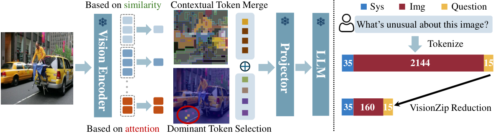

[TOC]

---

## 一、核心问题

VisionZip 观察到：视觉编码器产生的 token 数量远多于文本 token，但注意力并不是均匀分布的。少量 token 接收了大部分注意力，其余 token 中存在明显冗余。

它把视觉 token 分为两类：

- **Dominant Token**：注意力高，负责保留主要语义。
- **Contextual Token**：由剩余 token 合并而来，负责补充局部细节。



VisionZip 在视觉编码器之后、进入 LLM 之前完成压缩，不需要读取问题内容，因此属于 **text-agnostic Before-LLM Compression**。

---

## 二、Dominant Token Selection

设视觉编码器某一层的注意力矩阵为：

$$
S_h=\operatorname{Softmax}\left(\frac{Q_hK_h^T}{\sqrt{d_h}}\right)
$$

### 1、有 CLS Token

CLIP 等视觉编码器使用 CLS token 汇总整张图的信息。把所有注意力头中 CLS 对 patch 的注意力相加，再选择 Top-K：

$$
a_j=\sum_h S_h[\text{CLS},j]
$$

$$
\mathcal{I}_{dom}=\operatorname{TopK}(a,K)
$$

### 2、没有 CLS Token

SigLIP 没有显式 CLS token，此时使用每个 token 从其他 token 接收到的平均注意力：

$$
a_j=\frac{1}{HN}\sum_{h=1}^{H}\sum_{i=1}^{N}S_h[i,j]
$$

分数越高，说明该 token 被更多位置关注，更适合作为主导 token。

---

## 三、Contextual Token Merging

只保留 Top-K 会丢失小物体和局部纹理，所以 VisionZip 不会直接删除全部低注意力 token，而是把它们压缩成少量上下文 token。

1. 从原始 token 中移除主导 token。
2. 把剩余 token 均匀拆成 target 集合与 merge 集合。
3. 使用视觉编码器中的 Key 计算语义相似度。
4. 每个 merge token 分配给最相似的 target token。
5. 对同组 token 取平均，生成 contextual token。

$$
a(i)=\arg\max_{j\in\mathcal{T}}K_iK_j^T
$$

$$
c_j=\operatorname{Mean}\left(\{v_j\}\cup\{v_i\mid a(i)=j\}\right)
$$

最后送入 LLM 的视觉序列为：

$$
X_{zip}=X_{dominant}\cup X_{contextual}
$$

??? example "核心实现"

    ```python
    output = vision_tower(images, output_attentions=True,
                          output_hidden_states=True)
    attn = output.attentions[selected_layer]
    tokens = output.hidden_states[selected_layer]

    received = attn[:, :, cls_idx, cls_idx + 1:].sum(dim=1)
    dominant_idx = received.topk(num_dominant, dim=1).indices
    dominant = gather(tokens, dominant_idx)

    remaining = remove(tokens, dominant_idx)
    targets, to_merge = uniform_split(remaining, num_context)
    similarity = to_merge.key @ targets.key.transpose(-1, -2)
    assignment = similarity.argmax(dim=-1)
    contextual = average_merge(targets, to_merge, assignment)
    ```

---

## 四、特点与局限

| 特点 | 说明 |
| ---- | ---- |
| Training-free | 不修改原模型参数即可使用 |
| Text-agnostic | 同一图像的压缩结果可用于不同问题与多轮对话 |
| 兼顾选择与合并 | 主导 token 保语义，上下文 token 补细节 |
| 易于接入 | 压缩发生在 LLM 前，不改变 LLM 层结构 |

局限也很明显：

- 最初面向图像 VLM 设计，没有显式建模视频时间顺序。
- Dominant Token 依赖视觉编码器的注意力是否可靠。
- Uniform Split 简单高效，但不一定是最优的 target 选择方式。
- 对瞬时出现的小目标，低注意力并不等于不重要。

VisionZip 的意义不只是一个具体方法，它建立了后续方法常用的基本结构：**重要 token 直接保留，剩余 token 不丢弃而是合并**。

---

## 五、资料

- [Paper: VisionZip](https://arxiv.org/abs/2412.04467)
- [Official Repository](https://github.com/JIA-Lab-research/VisionZip)
