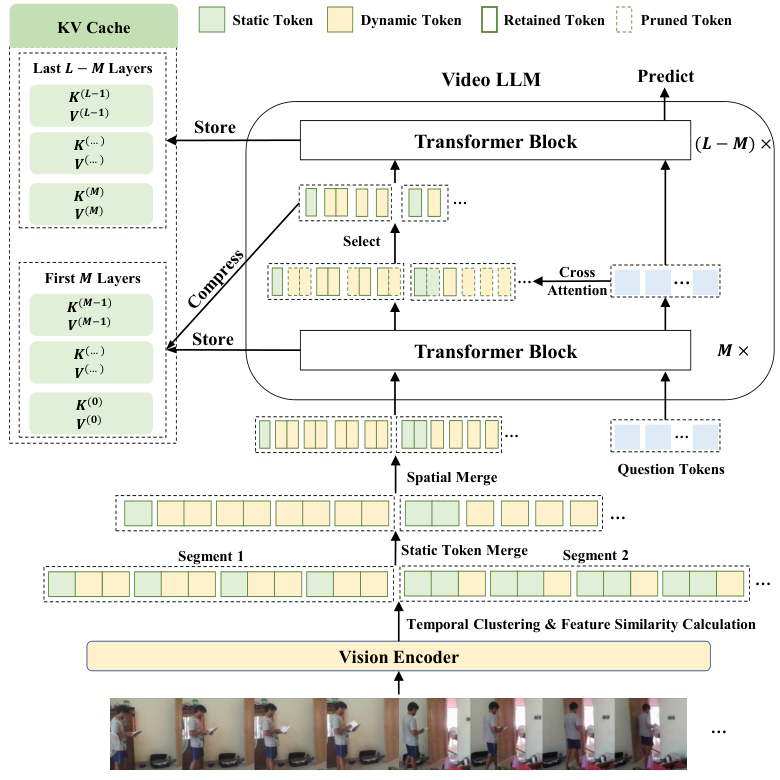

[TOC]

---

## 一、核心思路

PruneVid 认为视频中有两种不同的冗余：

- 背景等**静态区域**在时间维度上反复出现。
- 同一帧中的相似 patch 形成**空间冗余**。

因此它先在 LLM 外部进行时空合并，再进入 LLM，利用问题到视觉 token 的注意力继续选择，并同步压缩 KV Cache。



---

## 二、Spatial-Temporal Token Merging

### 1、视频分段

对第 $t$ 帧的所有 token 平均池化，得到帧特征：

$$
f^{(t)}=\frac{1}{N_v}\sum_{i=1}^{N_v}X_v^{(t)}(i)
$$

使用 DPC-KNN 根据帧特征把视频划分为若干连续片段。片段内部场景相似，片段之间对应明显的内容变化。

### 2、区分静态与动态 Token

在同一片段内，对固定空间位置 $i$ 的 token 计算两两余弦相似度：

$$
s_i^{(t,t')}=\frac{X_v^{(t)}(i)^TX_v^{(t')}(i)}
{\|X_v^{(t)}(i)\|\|X_v^{(t')}(i)\|}
$$

再求平均相似度：

$$
\bar{s}_i=\frac{2}{|\mathcal{T}_b|(|\mathcal{T}_b|-1)}
\sum_{t<t'}s_i^{(t,t')}
$$

若 $\bar{s}_i\geq\tau$，该位置被视为静态 token；否则视为动态 token。

### 3、时间合并与空间合并

静态 token 在片段内沿时间维度取平均：

$$
\tilde{X}_v^{(b)}(i)=\frac{1}{|\mathcal{T}_b|}
\sum_{t\in\mathcal{T}_b}X_v^{(t)}(i)
$$

动态 token 不做时间平均，以免抹掉动作变化。随后分别对静态和动态 token 使用 DPC-KNN 做空间聚类，并用簇内平均值表示整个簇。

??? example "为什么静态与动态区域要分开"

    假设 8 帧中桌面完全不动，但人的手从左侧移动到右侧。

    - 桌面 token 可以把 8 次重复表示合并为 1 次。
    - 手部 token 若直接跨帧平均，会把运动轨迹混成模糊特征。
    - PruneVid 只对静态位置做时间平均，动态位置仍保留逐帧变化。

---

## 三、LLM-Guided Token Selection

时空合并只能判断视觉冗余，无法判断当前问题需要什么。PruneVid 在 LLM 的第 $M$ 层读取问题到视觉 token 的注意力子矩阵：

$$
A_{qv}^{(M)}\in\mathbb{R}^{N_q\times N'_v}
$$

对每个视觉 token，取所有问题 token 注意力的最大值：

$$
a_v(j)=\max_{1\leq i\leq N_q}A_{qv}^{(M)}(i,j)
$$

再保留分数最高的 $\alpha\%$：

$$
\mathcal{S}=\operatorname{TopK}(a_v,\lceil\alpha N'_v\rceil)
$$

使用最大值而不是平均值，是因为问题中的某个关键词可能只强烈关注少数视觉区域。平均后，这种局部但关键的相关性容易被稀释。

---

## 四、压缩 KV Cache

如果只删除隐藏状态，却保留前 $M$ 层中所有视觉 token 的 Key 和 Value，解码阶段仍会占用多余显存。PruneVid 用相同索引 $\mathcal{S}$ 裁剪缓存：

$$
\tilde{K}_v^{(l)}=K_v^{(l)}[\mathcal{S},:],\qquad
\tilde{V}_v^{(l)}=V_v^{(l)}[\mathcal{S},:]
$$

核心流程可以写成：

```text
video tokens
    ↓ DPC-KNN 时间分段
static / dynamic token 解耦
    ↓ 时间合并 + 空间聚类
merged visual tokens
    ↓ 运行前 M 层 LLM
question-to-visual attention
    ↓ Top-K 选择
selected tokens + compressed KV cache
    ↓ 运行剩余 L-M 层
answer
```

---

## 五、特点与局限

| 特点 | 说明 |
| ---- | ---- |
| 两阶段压缩 | 先去视觉冗余，再保留问题相关信息 |
| 静动态解耦 | 避免把动作 token 当作重复背景合并 |
| KV Cache 同步裁剪 | Prefill 与 Decode 都能受益 |
| Training-free | 不需要重新训练主模型 |

局限：

- DPC-KNN 和两级聚类会引入额外延迟。
- 固定空间位置的比较不擅长处理明显位移、缩放或镜头运动。
- 压缩结果依赖问题，新的问题可能需要重新执行 LLM 内选择。
- 选择层 $M$ 太浅时语义不足，太深时前面已经付出了较多计算。

---

## 六、资料

- [Paper: PruneVid](https://arxiv.org/abs/2412.16117)
- [Official Repository](https://github.com/Visual-AI/PruneVid)
