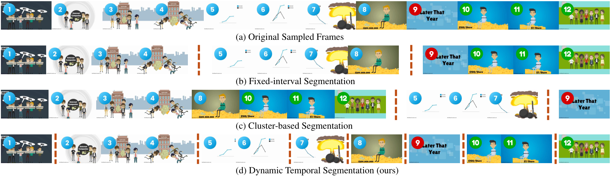
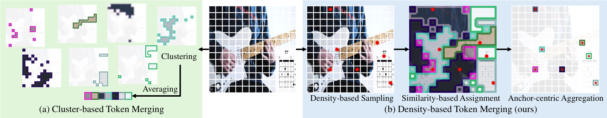

[TOC]

---

## 一、核心思路

FastVID 的目标是在 LLM 之前压缩视频 token，同时保留两件事：

1. **Temporal Context**：帧的顺序和场景变化不能被打乱。
2. **Visual Context**：既要保留整体内容，也要保留显著细节。

它由两个模块组成：

- **DySeg**：按视频复杂度动态划分连续时间片段。
- **STPrune**：在每个片段内部进行密度时空剪枝。

STPrune 又分为：

- **DTM**：Density-based Token Merging，保留全局视觉上下文。
- **ATS**：Attention-based Token Selection，保留显著细节。

---

## 二、Dynamic Temporal Segmentation

固定长度分段可能把两个场景切进同一片段；直接聚类虽然能找相似帧，却可能打乱时间顺序。DySeg 只在相邻帧之间寻找边界。



设 $f_i$ 是第 $i$ 帧的全局特征，相邻帧的转移相似度为：

$$
t_i=\cos(f_i,f_{i+1}),\qquad i=1,2,\ldots,F-1
$$

DySeg 使用两组边界：

$$
S_1=\operatorname{argmin}_{c-1}\{t_i\}
$$

$$
S_2=\{i\mid t_i<\tau\}
$$

$$
\boxed{S=S_1\cup S_2}
$$

- $S_1$ 保证至少产生 $c$ 个片段。
- $S_2$ 捕获相似度低于阈值的明显场景变化。
- 简单视频通常由 $S_1$ 决定边界，复杂视频会由 $S_2$ 自动产生更多片段。

??? example "动态确定分段边界"

    假设 6 帧之间的相似度为：

    $$
    T=[0.94,\ 0.91,\ 0.42,\ 0.89,\ 0.35]
    $$

    令最少片段数 $c=2$，阈值 $\tau=0.5$：

    - $S_1=\{5\}$，因为 $0.35$ 最小。
    - $S_2=\{3,5\}$，因为 $0.42$ 与 $0.35$ 小于阈值。
    - 最终 $S=\{3,5\}$，视频被切成 $[1,2,3]$、$[4,5]$、$[6]$。

---

## 三、Density-based Token Merging

对于含 $P$ 帧、每帧含 $N$ 个 token 的片段，若总保留率为 $r$，则 STPrune 保留 $rPN$ 个 token：

$$
\underbrace{drPN}_{DTM}+\underbrace{(1-d)rPN}_{ATS}=rPN
$$

DTM 每隔 $p$ 帧采样一个 anchor frame，再从 anchor frame 中寻找密度峰 token。

对 token $v_i$，局部密度为：

$$
\rho_i=\exp\left(-\frac{1}{k}\sum_{v_j\in\operatorname{kNN}(v_i)}d(v_i,v_j)^2\right)
$$

到更高密度 token 的最近距离为：

$$
\delta_i=
\begin{cases}
\min_{j:\rho_j>\rho_i}d(v_i,v_j), & \exists j:\rho_j>\rho_i\\
\max_jd(v_i,v_j), & \text{otherwise}
\end{cases}
$$

最终使用 $\rho_i\delta_i$ 选择 anchor：

- $\rho_i$ 高：附近存在许多相似 token，具有代表性。
- $\delta_i$ 高：离其他高密度区域较远，具有区分度。

其余 token 根据余弦相似度分配给最近的 anchor。对 anchor $a$ 及其成员 $b_1,\ldots,b_n$：

$$
a^*=\beta a+\frac{1-\beta}{n}\sum_{i=1}^{n}b_i
$$



DTM 更新原位置上的 anchor，而不是把聚类中心重新拼成一段，因此更容易保留供 RoPE 使用的时空位置关系。

---

## 四、Attention-based Token Selection

DTM 擅长保存整体上下文，但小而显著的区域可能不是密度峰。ATS 使用视觉编码器的 CLS Attention，额外选择每帧最显著的 $(1-d)rN$ 个 token。

对于默认不输出 CLS 的 SigLIP，FastVID 重新接入预训练的 SigLIP Head 来获得 CLS Attention，再对注意力图执行与视觉 token 相同的池化。

核心流程为：

```text
相邻帧全局特征
    ↓ DySeg
按时间顺序排列的高冗余片段
    ├─ DTM：密度峰 anchor + 相似 token 合并
    └─ ATS：CLS Attention Top-K
             ↓
       按原顺序组成压缩序列
             ↓
            LLM
```

---

## 五、特点与局限

| 特点 | 说明 |
| ---- | ---- |
| 保留时间顺序 | 只在连续片段内剪枝，不把不同时段随意聚类 |
| 密度峰采样 | 同时考虑代表性与区分度 |
| 全局与细节互补 | DTM 保存上下文，ATS 保存显著区域 |
| Before-LLM | 容易与 FlashAttention、KV Cache 和多轮对话配合 |

论文在 LLaVA-OneVision-7B 的设置中报告：剪除 90.3% 视频 token、FLOPs 降至 8.3%、Prefill 加速 7.1 倍，同时保留 98.0% 的原始平均准确率。该结果只代表论文对应模型与评测设置。

局限：

- DySeg 依据相邻帧全局特征，局部瞬时事件可能不足以触发分段。
- DTM 需要 kNN、距离矩阵和分配操作，端到端收益取决于实现效率。
- ATS 依赖视觉编码器注意力；对 SigLIP 还需要额外接入 Head。
- 压缩不读取问题，同一视觉表示可复用，但不能针对具体问题调整预算。

---

## 六、资料

- [Paper: FastVID](https://arxiv.org/abs/2503.11187)
- [Official Repository](https://github.com/LunarShen/FastVID)
