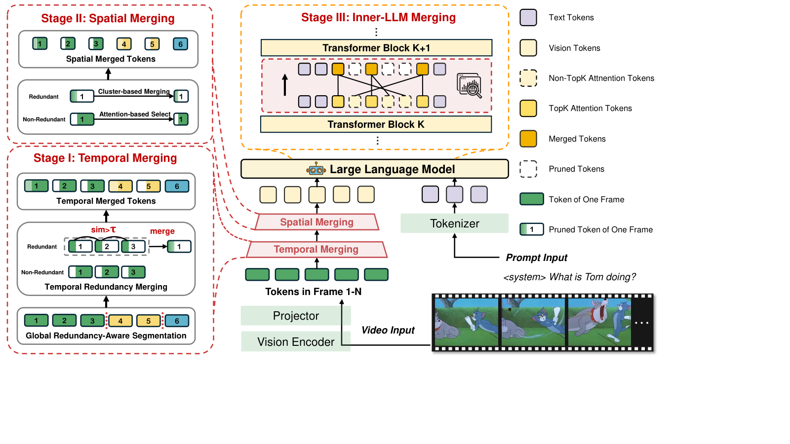

[TOC]

---

## 一、核心思路

HoliTom 的 Holistic 指压缩覆盖完整推理链路，而不只处理某一个位置：

1. **Temporal Merging**：在 LLM 前合并时间冗余。
2. **Spatial Merging**：在 LLM 前继续压缩空间冗余。
3. **Inner-LLM Merging**：在 LLM 中间层合并低注意力 token。



前两步让所有 LLM 层处理更短的序列，第三步再利用 LLM 内部语义继续压缩。

---

## 二、Global Redundancy-Aware Temporal Merging

设每帧有 $N_v$ 个 token。当固定位置 $k$ 在相邻两帧中的特征相似度超过阈值 $\tau$ 时，认为该位置连续冗余。

对于片段 $[t_s,t_e)$，只有在片段内每一对相邻帧都满足阈值的 token，才能从后续帧合并到第一次出现的位置。

可剪 token 数为：

$$
g(t_s,t_e)=
\left(\sum_{k=1}^{N_v}
\prod_{m=t_s}^{t_e-2}
\mathbb{I}(\operatorname{sim}(h_{m,k},h_{m+1,k})>\tau)
\right)(t_e-t_s-1)
$$

HoliTom 不使用固定片段长度，而是在所有连续分段方案中最大化可合并 token 总数：

$$
\max_{K,\{t_i\}}\sum_{i=1}^{K}g(t_i,t_{i+1})
$$

这是一个标准动态规划：

$$
dp[i]=\max_{1\leq j<i}\{dp[j]+g(j,i)\}
$$

同时记录：

$$
prev[i]=\arg\max_{1\leq j<i}\{dp[j]+g(j,i)\}
$$

最后从 $B+1$ 沿 `prev` 回溯，即可得到全局最优分段。

??? example "动态规划为什么优于贪心"

    假设在前 6 帧中：

    - $[1,4)$ 可以剪 30 个 token。
    - $[4,7)$ 可以剪 28 个 token。
    - 直接选择 $[1,7)$ 只能剪 45 个 token。

    贪心地追求最长片段会得到 45；动态规划比较所有最后片段的起点，会选择两个片段并得到 $30+28=58$。

---

## 三、Spatial Merging

时间合并后，token 被分成两类，HoliTom 使用不同方法处理：

### 1、非时间冗余 Token

计算视觉塔内部注意力：

$$
A=\operatorname{Softmax}\left(\frac{QK^T}{\sqrt d}\right)
$$

对每个 token 接收到的注意力取平均，选择高分 token。它们对应发生变化或较显著的区域，直接保留比再次聚类更稳妥。

### 2、时间冗余 Token

对已经合并到片段首帧的冗余 token 使用 DPC-KNN：

$$
\gamma_i=\rho_i\delta_i
$$

选择高 $\gamma_i$ 的 token 作为聚类中心，其余 token 分配给最近中心并求平均。压缩结果与非冗余 token 按原始空间顺序重新拼接，尽量保留位置关系。

---

## 四、Inner-LLM Merging

在 LLM 的第 $K$ 层，使用最后一个输入 token 的注意力对视觉 token 排序。

1. 取注意力最低的 $R\%$ 作为待合并 token。
2. 对每个待合并 token，在保留集合中寻找最相似的 token。
3. 不直接丢弃，而是把特征平均到对应保留 token。

若保留 token $v_r$ 对应的待合并集合为 $V_m$：

$$
v'_r=\operatorname{Mean}(v_r,V_m)
$$

与纯剪枝相比，低注意力 token 不再占据独立序列位置，但其信息仍能通过合并结果进入后续层。

```python
scores = last_token_attention[visual_slice]
merge_idx = scores.argsort()[:num_merge]
keep_idx = scores.argsort()[num_merge:]

target = cosine_similarity(tokens[merge_idx], tokens[keep_idx]).argmax(-1)
tokens[keep_idx] = grouped_mean(tokens[keep_idx], tokens[merge_idx], target)
tokens = tokens[keep_idx]
```

---

## 五、特点与局限

| 特点 | 说明 |
| ---- | ---- |
| 全局分段 | 动态规划最大化整个视频的时间冗余 |
| 三阶段压缩 | 同时覆盖 LLM 前和 LLM 内部 |
| 以合并为主 | 尽量把低重要性 token 的信息转移给保留 token |
| 位置意识 | 合并后按原顺序组织 token |

论文报告在四个视频理解基准上以 6.9% FLOPs 保留 99.1% 的原始平均性能，并降低 TTFT、提高解码吞吐率。不同硬件与模型上的实际收益仍需单独测量。

局限：

- 时间合并仍按固定空间位置判断，对快速位移、缩放和镜头运动不够自然。
- 全局动态规划比阈值扫描更复杂。
- Inner-LLM Merging 需要改动中间层的 token 与位置管理。
- 最后一个 token 的注意力不一定能完整代表复杂问题中的所有语义。

---

## 六、资料

- [Paper: HoliTom](https://arxiv.org/abs/2505.21334)
- [Official Repository](https://github.com/cokeshao/HoliTom)
