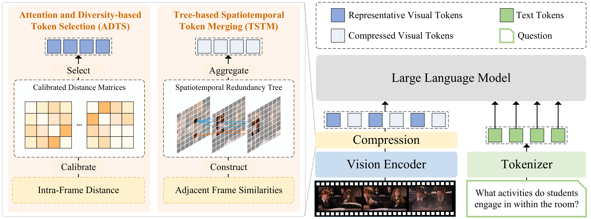
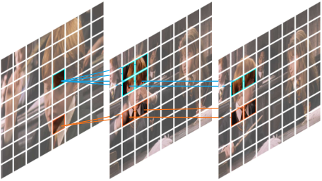

[TOC]

---

## 一、核心问题

许多时间合并方法只比较相邻帧的固定空间位置。但物体运动后，语义相同的 token 会出现在不同位置；空间冗余与时间冗余也不是彼此独立的。

FlashVID 使用两个互补模块：

- **ADTS**：先保留重要且多样的代表 token。
- **TSTM**：把剩余 token 组织成跨帧冗余树，再进行聚合。



它是一种 Training-free Before-LLM Compression：压缩完成后，原始 LLM 不需要修改。

---

## 二、Attention and Diversity-based Token Selection

只按注意力选 token，容易集中在少数显著区域；只追求特征多样性，又可能保留不重要的背景。ADTS 把两者结合。

### 1、帧内多样性

对第 $f$ 帧计算 token 两两余弦距离：

$$
D^{(f)}=1-\cos(E_v^{(f)},E_v^{(f)})
$$

Max-Min Diversity Problem 的目标是让已选 token 之间的最小距离尽可能大，避免预算都浪费在相似区域。

### 2、CLS Attention 校准

若视觉编码器没有显式 CLS token，则先计算：

$$
A=\operatorname{Softmax}\left(\frac{QK^T}{\sqrt d}\right)
$$

再对每个 token 从同帧其他 token 接收到的注意力取平均，得到 CLS-equivalent 分数。它负责强调单帧内部的重要区域。

### 3、事件相关性校准

先对每帧做全局平均池化：

$$
f_v=\operatorname{GAP}(E_v)\in\mathbb{R}^{F\times d}
$$

再计算每个 token 与整个视频事件的平均相关性：

$$
\bar{S}_e=\frac{1}{F}\sum_{i=1}^{F}(E_vf_v^T)[:,:,i]
$$

最终选择集合为：

$$
\mathcal{I}=\operatorname{MMDP}(D,A_{\text{CLS}},\bar{S}_e)
$$

因此一个 token 被保留，可能因为它足够显著、与整个事件相关，或者能补充已选集合缺少的视觉模式。

---

## 三、Tree-based Spatiotemporal Token Merging

ADTS 选出的 token 直接保留。对剩余 token，TSTM 在相邻帧之间建立连接。

设视频特征为 $E_v\in\mathbb{R}^{F\times N_v\times d}$，相邻帧的全连接余弦相似度矩阵为：

$$
S^{(f)}=\cos(E_v^{(f)},E_v^{(f+1)})
\in\mathbb{R}^{N_v\times N_v}
$$

对第 $f$ 帧中的每个 token，在前一帧寻找最相似 token：

$$
p^*=\arg\max_{p\in\mathcal{R}^{(f-1)}}\operatorname{sim}(r_i^{(f)},p)
$$

若相似度超过阈值 $T_\tau$，就在两者之间建立父子关系。连续执行后，语义相近但空间位置可能变化的 token 会形成一棵时空冗余树。



每棵树最终聚合成一个 token：

$$
c^{(i)}=\operatorname{Agg}(\mathcal{T}^{(i)})
$$

最终压缩结果由两部分组成：

$$
\hat{X}=\underbrace{\mathcal{C}}_{\text{树聚合结果}}
\cup
\underbrace{\left(\bigcup_{f=1}^{F}\mathcal{I}^{(f)}\right)}_{\text{ADTS 直接保留}}
$$

---

## 四、核心实现

```python
# Stage 1: ADTS
for frame in frames:
    distance = pairwise_cosine_distance(frame.tokens)
    attention = received_attention(frame)
    relevance = event_relevance(frame, frames)
    important[frame] = calibrated_max_min_select(
        distance, attention, relevance, budget
    )
    remaining[frame] = frame.tokens - important[frame]

# Stage 2: TSTM
forest = make_singleton_trees(remaining)
for f in range(1, num_frames):
    similarity = cosine_matrix(remaining[f], remaining[f - 1])
    parent = similarity.argmax(dim=-1)
    for token, p in zip(remaining[f], parent):
        if similarity[token, p] >= threshold:
            forest.connect(token, remaining[f - 1][p])

merged = [tree.mean() for tree in forest]
compressed = concat_in_order(important, merged)
```

??? example "移动物体如何形成冗余树"

    一辆车在三帧中的空间位置分别为左、中、右。固定位置比较会把三辆车当成不同 token。

    TSTM 对当前 token 与前一帧的**所有**候选 token 比较：

    ```text
    frame 1: car@left
                  ↑
    frame 2: car@center
                  ↑
    frame 3: car@right
    ```

    三个 token 虽然坐标不同，但语义相似度足够高，因此会进入同一棵树，最后聚合成一个时空表示。

---

## 五、特点与局限

| 特点 | 说明 |
| ---- | ---- |
| 时空联合建模 | 不要求相似 token 位于相同空间坐标 |
| 选择与合并互补 | ADTS 保护重要信息，TSTM 压缩剩余冗余 |
| 事件感知 | 不只关注单帧显著性，还考虑整个视频语境 |
| Before-LLM | 对 LLM 主体侵入较小，所有层都能受益 |

论文报告在 10% 视觉 token 保留率下，LLaVA-OneVision 保留 99.1% 的原始平均性能；在相同计算预算下，Qwen2.5-VL 可以处理更多帧。该数字依赖论文中的模型、帧数与评测设置。

局限：

- 相邻帧 token 两两比较需要 $N_v^2$ 级别的相似度计算。
- 阈值太低会把语义不同的 token 连入同一棵树，太高则压缩不足。
- 树聚合会弱化事件发生的精确时刻，需要依靠保留 token 补偿。
- 方法不依赖问题，适合复用视觉表示，但不会为具体问题动态改变选择结果。

---

## 六、资料

- [Paper: FlashVID](https://arxiv.org/abs/2602.08024)
- [OpenReview](https://openreview.net/forum?id=H6rDX4w6Al)
- [Official Repository](https://github.com/Fanziyang-v/FlashVID)
