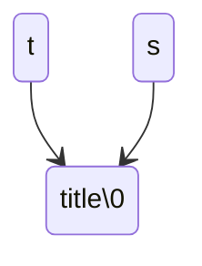
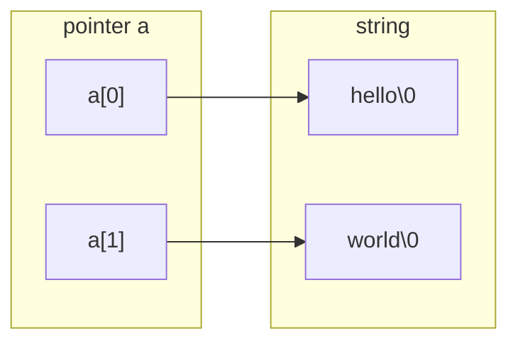

[TOC]

---

## 一、字符串与字符数组

### 1、字符数组

```c
char word[] = {'H', 'e', 'l', 'l', 'o', '!'};
```

```c
char word[] = {'H','e','l','l','o','!','\0'}; // 以0结尾
char word[] = {'H','e','l','l','o','!',0};    // 等价
char word[] = {'H','e','l','l','o','!','0'};  // ❌ 不等价
```

- 计算字符串长度时不包含这个 `0`
- 字符串以 ==数组== 形式存在，可用 **数组** 或 **指针** 访问
- `string.h` 中包含大量字符串处理函数

!!! question
	❓ 如果想在字符串中包含一个 `\0` 而又不终止字符串怎么办？

### 2、字符串变/常量

```c
char *str = "Hello";     // 定义一个指针 str，指向字符串常量区中的 "Hello"
                         // "Hello" 存放在只读存储区（常量区）
                         // ❌ 不能修改内容，如 str[0] = 'Y'; 会导致运行错误（段错误）
                         // ✅ 可以让 str 指向别的字符串：str = "World";

char word[] = "Hello";   // 定义一个字符数组 word，长度为 6（包含 '\0'）
                         // "Hello" 的内容被复制到栈上的数组中
                         // ✅ 可修改内容，例如 word[0] = 'Y'; 合法
                         // ❌ 但 word（数组名）本身不是指针变量，不能被重新赋值

char line[10] = "Hello"; // 定义一个长度为 10 的字符数组，内容为 "Hello\0" + 4 个 '\0'
                         // ✅ 可修改内容，如 line[0] = 'H'; line[5] = '!';
                         // 数组大小固定为 10，多余空间被自动填充为 '\0'
```

- `char *str` 指向只读常量；`char word[]` 拷贝可修改副本；`char line[10]` 是带空余的可修改缓冲区。

!!! note
    - C 语言的字符串以字符数组形式存在
    - **不能用运算符**对字符串运算
    - 只能通过数组或指针访问

------

## 二、字符串变量与内存

### 1、指针与数组的区别

```c
int main() {
    int i = 0;
    char *s  = "Hello World!";
    char *s2 = "Hello World!";

    printf("s  = %p\n", s);
    printf("s2 = %p\n", s2);
    printf("&i = %p\n", &i);
}
```

- `s` 和 `s2` 指向同一常量区，不能修改
- 实际上是 `const char *s`
- 若需修改内容，应使用数组：

```c
char s[] = "Hello, world!";
```

!!! tip "指针还是数组？"
	- **构造 → 数组**

	- **处理 → 指针**
	
	| 场景       | 建议形式                    |
	| ---------- | --------------------------- |
	| 构造字符串 | 数组 (`char s[] = "abc";`)  |
	| 处理字符串 | 指针 (`char *p = argv[i];`) |


???question "`char*` 是字符串吗？"

    - 字符串**可以是** `char*`
    - 但 `char*` **不一定**是字符串
    - 只有当结尾有 `\0` 时，它所指才是合法字符串

---

## 三、字符串输入与输出

### 1、指针赋值

```c
char *t = "title";
char *s;
s = t;
```



`s` 与 `t` 指向同一字符串。

### 2、`scanf` 输入字符串

```c
int main(void) {
    char word[8];
    scanf("%s", word); // hello world
    printf("%s##\n", word);
}
int main(void) {
    char word[8], word2[8];
    scanf("%s", word);
    scanf("%s", word2);
    printf("%s##%s##\n", word, word2);
}
```

- `scanf` 读到**空格、tab、回车**即停止
- `scanf` 不安全，因为可能越界


!!! tip "安全输入"
	使用 `%ns` 限定输入长度，防止溢出

```c
char word[8], word2[8];
scanf("%7s", word);
scanf("%7s", word2);
```

!!! warning "常见错误"
    ```c
    char *string;
    scanf("%s", string); // ❌ 未分配内存
    ```

    - `char*` 只是指针，未初始化无法写入
    - 应改用数组或动态分配：
    
    ```c
    char string[100];
    scanf("%s", string);
    ```

- 空字符串

```c
char buffer[100] = "";
// buffer[0] == '\0'
char buffer[] = "";
// 长度为1，仅含 '\0'
```

------

## 四、字符串数组与程序参数

!!! success
    - **字符串（`char[]`）的单位是“字”**，
    
    - **字符串数组（`char \*arr[]`）的单位是“词”**。
    
    ```c++
    char word[] = "Hello";         // 一个“单词”
    char *sentence[] = {"Hello", "World"}; // 一个“句子”
    
    /*
    word → [H][e][l][l][o][\0]
    
    sentence → ┌──────────┐
                │ ptr → "Hello\0" │
                │ ptr → "World\0" │
                └──────────┘
    */
    ```

### 1、字符串数组类型

| 定义形式      | 含义                             |
| ------------- | -------------------------------- |
| `char **a`    | a 是指向指针的指针               |
| `char a[][n]` | 固定列宽二维字符数组             |
| `char *a[]`   | 字符指针数组，每个元素指向字符串 |

- `char a[][10]` → 适合固定长度字符串
- `char *a[]` → 灵活，但要注意内存管理



???example "字符串数组"

    ```c
    int main() {
        // 定义一个字符串指针数组，每个元素指向一个月份名称
        const char *months[] = {
            "January","February","March","April",
            "May","June","July","August",
            "September","October","November","December"
        };
    
        int month;
        scanf("%d", &month); // 输入月份数字（1~12）
    
        if (month >= 1 && month <= 12)
            printf("%s\n", months[month - 1]); // 下标从0开始，故减1取对应字符串
        else
            printf("Invalid month.\n"); // 非法输入提示
    }
    ```

### 2、命令行参数

```c++
int main(int argc, char const *argv[]) {
    for (int i = 0; i < argc; i++)
        printf("%d: %s\n", i, argv[i]);
}
```

- **`argc`**（argument count）表示命令行参数个数
- **`argv`**（argument vector）是一个**字符串指针数组**，存放每个参数的内容

命令行输入：

```
./a.out hello world 123
```

程序中：

| 下标         | 内容        | 含义       |
| ------------ | ----------- | ---------- |
| `argv[0]`    | `"./a.out"` | 程序名     |
| `argv[1]`    | `"hello"`   | 第一个参数 |
| `argv[2]`    | `"world"`   | 第二个参数 |
| `argv[3]`    | `"123"`     | 第三个参数 |
| `argv[argc]` | `NULL`      | 结尾标志   |

输出：

```
0: ./a.out
1: hello
2: world
3: 123
```

> `argc` 是参数数量，`argv` 是保存参数的字符串数组。
>  `argv[0]` 是程序名，最后一个是 `NULL`。

------

## 五、字符与字符串函数

### 1、单字符输入输出

#### (1) `putchar`

```c
int putchar(int c);
```

- 向**标准输出**写一个字符
- 返回写入字符数，失败返回 `EOF(-1)`

#### (2) `getchar`

```c
int getchar(void);
```

- 从**标准输入**读取一个字符
- 返回 `int`（用于检测 `EOF(-1)`）
  - Windows → Ctrl-Z
  - Unix → Ctrl-D


```c
int ch;
while ((ch = getchar()) != EOF)
    putchar(ch);
printf("EOF\n");
```

!!! info "Shell"

    ```mermaid
    flowchart LR
        I/O --> B[Shell]
        B --> C[Program]
        C --> B
        B --> I/O
    ```
    
    **`I/O → Shell`**
     用户在键盘上输入字符（比如 `abc⏎`），这些输入**先进入 Shell**，而不是直接进程序。
    
    **`Shell → Program`**
     当程序运行（例如用 `./a.out`），Shell 会把输入**传给程序的标准输入流**。
    
    **`Program → Shell`**
     程序通过 `putchar()`、`printf()` 把输出写入**标准输出流**。
     这些输出**先返回给 Shell**。
    
    **`Shell → I/O`**
     最后 Shell 再把程序输出显示到**终端屏幕**。

!!! tip
	常用于字符流处理，如统计字符、大小写转换等。

### 2、函数 `strlen`

```c
#include <string.h>
size_t strlen(const char *s);
char line[] = "Hello";
printf("strlen=%lu\n", strlen(line)); // 5
printf("sizeof=%lu\n", sizeof(line)); // 6
```

!!! note
	`strlen` 不计 `\0`；`sizeof` 包含 `\0`。

自写 `strlen`

```c
int mystrlen(const char *s) {
    int i = 0;
    while (s[i]) i++;
    return i;
}
```

### 3、函数 `strcmp`

```c
char s1[] = "abc", s2[] = "Abc";
printf("%d\n", strcmp(s1, s2)); // 32

char s3[] = "abc", s4[] = "abc ";
printf("%d\n", strcmp(s3, s4)); // -32
```

!!! info
	相等返回 0；按字符 ASCII 比较，大小写有差。

自写 `strcmp`

```c
int mystrcmp(const char *s1, const char *s2) {
    while (*s1 == *s2 && *s1) s1++, s2++;
    return *s1 - *s2;
}
```

### 4、函数 `strcpy`

```c
char *strcpy(char *restrict dst, const char *restrict src);
```

!!! warning
	`restrict` 表示两地址不重叠（C99）；返回 `dst` 可链式使用。
	
	需确保目标空间足够，可改用 `strncpy`。

```c
char *dst = malloc(strlen(src) + 1);
strcpy(dst, src);
```

自写 `strcpy`

```c
char *mystrcpy(char *dst, const char *src) {
    char *ret = dst;
    while ((*dst++ = *src++));
    return ret;
}
```

### 5、函数 `strchr` 与 `strrchr`

```c
char *strchr(const char *str, int c);   // 从左查找
char *strrchr(const char *str, int c);  // 从右查找
```

- 找不到返回 `NULL`


??? example "简单操作"

    e.g. 寻找第二个字符
    
    ```c
    char s[] = "Hello";
    char *p = strchr(s, 'l');
    p = strchr(p + 1, 'l');
    printf("%s\n", p); // llo
    ```
    
    e.g. 复制找到的子串
    
    ```c
    char s[] = "Hello";
    char *p = strchr(s, 'l');
    char *t = malloc(strlen(p) + 1);
    strcpy(t, p);
    printf("%s\n", t);
    free(t);
    ```
    
    e.g. 打印匹配前缀
    
    ```c
    char s[] = "Hello";
    char *p = strchr(s, 'l');
    char c = *p;
    *p = '\0';
    printf("%s\n", s);
    *p = c;
    ```

### 6、函数 `strstr` 与 `strcasestr`

- `strstr` → 查找子串
- `strcasestr` → 忽略大小写查找

```c
char *p = strstr("Hello World", "lo");
printf("%s\n", p); // lo World
```

!!! tip
	常用于查找关键字、命令或特定模式。
