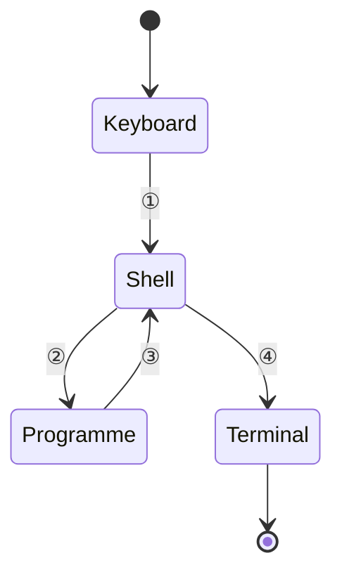

[TOC]

---

## 1、整数

- C语言变量必须
    - 提前定义
    - 确定类型


### （1）`sizeof`

- 静态运算符

  ```c
  int main() {
  
      int a = 6;
      printf("%ld", sizeof(a++));
      printf("%d", a); // 输出仍然是6，前一句中的a++只在那一句生效->静态运算
  
      return 0;
  }
  ```

### （2）整数类型

| 类型        | 大小说明                           |
| ----------- | ---------------------------------- |
| `char`      | 1 字节（8 比特）                   |
| `short`     | 2 字节                             |
| `int`       | 取决于编译器/CPU，通常表示“一个字” |
| `long`      | 取决于编译器/CPU，通常表示“一个字” |
| `long long` | 8 字节                             |

!!! note
	`int` 就是用来表示寄存器（reg）的

### （3）整数的内部表达

一个字节有 8 位，因此最多可以表示：

```
0000 0000 ~ 1111 1111 （即十进制 0 ~ 255，共 256 个数）
```

但在表示**有符号整数**（即包括正数和负数）时，需要一种方式来引入“负号”的概念。


!!! info
    === "符号位法"

        - 用最高位表示符号（0 为正，1 为负），其余位表示数值。
    
        - 示例：`1000 0001` 表示 -1，`0000 0001` 表示 +1
    
        - **问题**：不能正常进行加减法。例如：
    
          ```
          1000 0001（-1） + 0000 0001（+1） = 1000 0010（错误）
          ```
    
    === "中间值"
    
        - 把整个范围中的中间值当作 0，例如 `1000 0000` 表示 0，
          - 左边为负数，右边为正数。
        - **问题**：表示方法不直观、计算复杂，硬件处理不方便。
    
    === "✅补码表示法"
    
        - 正数的补码 = 原码
        - 负数的补码 = 反码 + 1
    
        这样，**加法可以直接使用补码运算实现**，无需区分正负号。

---

### （4）整数的范围

一个字节共有 8 位，因此可以表示：

```
0000 0000 ~ 1111 1111（即十进制 0 ~ 255，共 256 个值）
```
!!! info
    === "`signed char`"

        在默认情况下，`char` 是有符号的，其采用 **补码（two's complement）** 表示负数：
    
        - 正数范围：`0000 0001 ~ 0111 1111` → 十进制 `1 ~ 127`
        - 负数范围：`1111 1111 ~ 1000 0000` → 十进制 `-1 ~ -128`
        - 零：`0000 0000`
    
    === "`unsigned char`"
    
        - 全部用于表示正整数范围：`0000 0000 ~ 1111 1111` → 十进制 `0 ~ 255`

??? example "有符号数和无符号数"
    ```c++
    int main() {
        char c = 255;              // 被当作补码处理 → 实际是 -1
        int i = 255;               // 正常整型
        unsigned char e = 255;     // 强制当作无符号处理 → 255
    ```

        printf("c = %d, i = %d, e = %d\n", c, i, e);
        return 0;
    }
    
    /*
    c = -1, i = 255, e = 255
    */
    ```

!!! success "`int`的最大值"
    ```c
    int main() {
        int a = 0, b = 0;
        while (++a > 0)
            ;
        printf("The biggest number is int is :%d\n", a - 1); // 什么时候转过一圈即可知道最大的数字

        b++;
    
        while ((a = a / 10) != 0) {
            b++;
        }
    
        printf("The biggest digit in int is : %d\n", b);
    
        return 0;
    }
    ```
    
    ```c
    int main() {
        int a = 0;
        int bits = sizeof(int) * 8; // 获取 int 类型的总位数（单位：bit）
    
        printf("The biggest number in int is: %d\n", (1 << (bits - 1)) - 1);
        printf("The number of bits in int is: %d\n", bits);
        return 0;
    }
    
    ```

---

## 2、浮点数


### （1）浮点类型

| 类型     | 字长（位） | 数值范围                                       | 有效数字（十进制位） | `scanf` 格式 | `printf` 格式 |
| -------- | ---------- | ---------------------------------------------- | -------------------- | ------------ | ------------- |
| `float`  | 32         | ±1.20×10⁻³⁸ ~ ±3.40×10³⁸，含 0、±`inf`、`nan`  | 约 7 位              | `%f`         | `%f`, `%e`    |
| `double` | 64         | ±2.2×10⁻³⁰⁸ ~ ±1.79×10³⁰⁸，含 0、±`inf`、`nan` | 约 15 位             | `%lf`        | `%f`, `%e`    |

```c
#include <bits/stdc++.h>
int main() {
    double ff = 1E-10;
    printf("%E,%.16f\n", ff, ff);
    // %.16f表示输出位数：16位
    // %E表示科学计数法
    return 0;
}
```

### （2）浮点的精度和范围

```c
int main() {
    printf("%f\n", 12.0 / 0);
    printf("%f\n", -12.0 / 0);
    printf("%f\n", 0.0 / 0);
}

/*
inf
-inf
nan
*/
```
!!! warning 
    - 避免使用 `f1 == f2` 来比较两个浮点数，可能因为精度误差导致比较失败。
        - 推荐写法：`fabs(f1 - f2) < 1e-12`（对于 double），或适当调整阈值。
        - 注意字面量类型：
        - 默认带小数点的字面量（如 `1.23`）是 `double` 类型。
        - 如果需要表示 `float` 类型，请在数值后加 `f` 或 `F` 后缀，如：`1.23f`。

---

## 3、字符

### （1）字符类型

在 C 语言中，字符类型 `char` 实际上是一个整数类型，用来存储字符对应的 ASCII 编码值。

```c
#include <bits/stdc++.h>
int main() {
    if (49 == '1') {
        printf("Yep!\n");
    }
    return 0;
}
```


!!! success "大小写转换"
    - 大小写对应字母之间的编码差值是固定的：`'a' - 'A' = 32`。

    ```c++
    // 大写转小写
    char lower = a + ('a' - 'A');
    
    // 小写转大写
    char upper = a + ('A' - 'a');
    ```

### （2）转义字符

| 字符 | 意义                    |
| ---- | ----------------------- |
| `\b` | 退格（Backspace）       |
| `\t` | 水平制表符（Tab）       |
| `\n` | 换行（Newline）         |
| `\r` | 回车（Carriage Return） |
| `\"` | 双引号                  |
| `\'` | 单引号                  |
| `\\` | 反斜杠                  |




---

## 4、类型转换

### （1）自动类型转换

当表达式中不同类型的变量或值参与运算时，编译器会**自动将较小范围的类型转换为较大范围的类型**，以避免数据丢失。转换规则大致如下：

- 整数类型提升顺序（从小到大）：
   `char` → `short` → `int` → `long` → `long long`
- 整数与浮点数混合运算时，整数会先转换成浮点数：
   `int` → `float` → `double`

示例：

```c
char c = 10;
int i = c + 5;   // char 自动提升为 int，再参与加法
float f = i + 0.5; // int 自动提升为 float
```

### （2）强制类型转换

当你需要**强制将一个值转换为另一种类型**（通常是缩小类型或改变类型），可以使用“类型转换操作符”：

```c
(类型)值
```

示例：

```c
(int)10.1;       // 浮点数强制转成整数，结果为10
(short)32;       // 转成short类型
(short)32768;    // 超出short范围，结果为-32768（溢出）
```

> **注意**：强制转换不会自动检查范围溢出，可能导致数据截断或溢出。


!!! caution "优先级"
    - 强制类型转换的优先级高于四则运算。
    - 这意味着下面两个表达式的计算顺序不同：

    ```c
    int i = (int) a / b;      // 先将 a 强制转换为 int，再除以 b
    int i = (int)(a / b);     // 先计算 a/b，再将结果强制转换为 int
    ```

---

## 5、运算

### （1）逻辑类型（`bool`）

```c
#include <stdbool.h>

bool c = 6 > 5;  // true，逻辑表达式结果赋值给bool变量
bool t = true;   // 直接赋值true

t = 2;           // 虽然t是bool类型，但赋值为非零整数时，内部仍是1（true）
printf("%d\n", t); // 输出1（true），赋值0则输出0（false）
```

**说明：**
 布尔类型变量本质上是整数类型，非零即为 `true`，零为 `false`，输出时通常是 `0` 或 `1`。

------

### （2） 逻辑运算

| 运算符 | 描述   | 示例     | 结果说明                                                     |
| ------ | ------ | -------- | ------------------------------------------------------------ |
| `!`    | 逻辑非 | `!a`     | 如果 `a` 是 `true`，结果是 `false`；反之亦然                 |
| `&&`   | 逻辑与 | `a && b` | 如果 `a` 和 `b` 都为 `true`，结果为 `true`；否则为 `false`   |
| `||`   | 逻辑或 | `a || b` | 只要 `a` 或 `b` 有一个为 `true`，结果就是 `true`；两者都为 `false` 才是 `false` |

!!! caution "常见错误"
    
    ```c
    // 错误写法：4 < x < 6 总是 true（因为4 < x 是0或1，再与6比较总为真）
    if (4 < x < 6) {
        // 逻辑错误
    }
    

    // 正确写法：用 && 连接两个比较
    if (x > 4 && x < 6) {
        // 判断x是否在(4,6)之间
    }
    
    // 判断是否是大写字母
    if (c >= 'A' && c <= 'Z') {
        // 是大写字母
    }
    ```

!!! note "优先级"
	逻辑非 `!` 优先级最高，接着是逻辑与 `&&`，最低是逻辑或 `||`
	
	例如：`!done && (count > MAX)`

!!! note "短路求值"

    逻辑运算从左向右计算：
    
    - 对于 `&&`，如果左边是 `false`，右边不再计算。
    - 对于 `||`，如果左边是 `true`，右边不再计算。


!!! bug

    避免在逻辑表达式中混合赋值操作，尤其是复合赋值，
    ```c++
    a == 1 && b += 6
    ```
    这可能导致意料之外的副作用。

### （3）逗号运算符

逗号运算符 `,` 会依次执行多个表达式，结果为最后一个表达式的值。

常见用法：`for` 循环中多变量更新

```c
for (i = 1, j = 10; i < j; i++, j--) {
    // 循环体
}
```

---
