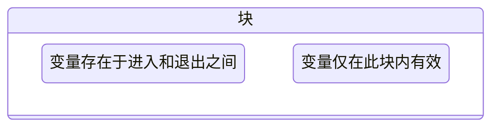

[TOC]

---

## 1、函数定义

“代码复制”是程序不良的表现 → 包装成函数

$$
y=f(x)
$$

和数学上函数类似：接受参数，返回值

```c++
// 函数头
返回类型 函数名(参数列表) {
    // 局部变量声明（可选）

    // 语句块：实现函数功能

    // return 返回值（如果有）
}
```

```c
// 函数头
void sum(int begin, int end) {
    int i;
    int sum = 0;
    for (i = begin; i <= end; i++) {
        sum += i;
    }
    printf("The sum of %d to %d is %d : ", begin, end, sum);
} // 函数体{}
```

!!! note "调用函数"
    - 函数名(参数值)
    
    - `()`起到表示函数调用的作用
        
        - 即使没有参数也要 `()`
    
    - 如果有参数，需要给出正确的数量和顺序

??? example
    ```c
    void cheer() {
        printf("Cheer!");
    }

    int main() {
        cheer(); // 注意要有()
        return 0;
    }
    ```
    
    ```c
    int sum(int begin, int end) {
    
        int i;
        int sum = 0;
        for (i = begin; i <= end; i++) {
            sum += i;
        }
        return sum;
    }
    
    int main() {
    
        printf("%d\n", sum(1, 10));
        return 0;
    }
    ```

---

### （1）函数返回

- `return` 停止函数执行，并送回一个值

```c
//两种写法
return;         // 无返回值，仅结束函数
return value;   // 有返回值，同时结束函数
```

- 一个函数中可以有多个return语句


```c
int max(int a, int b) {
    if (a > b) {
        return a;
    } else {
        return b;
    }
}
```

- 🚫 没有返回值的函数（`void` 类型）

```c++
void sayHello() {
    printf("Hello!\n");
    // return; 可省略
}
```

- **不能写 `return 值;`**
- **可以没有 `return;`**
- **调用时不能赋值：**

!!! danger
	如果函数声明了返回值类型（如 `int`），则必须使用 `return 值`; 返回相应类型的值！
	
!!! info  "`return 0;`" 

    | 平台      | 含义 / 行为                            |
    | --------- | -------------------------------------- |
    | Windows   | `if errorlevel 1` 用于判断程序是否成功 |
    | Unix Bash | `echo $?` 输出上一个程序的返回值       |
    | C Shell   | `echo $status` 显示退出状态            |
    
    `return 0;` 通常表示程序**正常退出**，非零值代表**异常/错误退出**。

---

### （2）函数原型

- 函数顺序关系：

  在 C 语言中，**编译器从上往下逐行分析代码**。

  如果先使用函数、后定义函数，会出现“未定义函数”错误。

!!! tip "函数声明"
    ```c++
    int max(int a, int b) { // 先定义
        return (a > b) ? a : b;
    }
    
    ```
    
    int main() {
        printf("The bigger one is: %d", max(10, 20)); // 后调用
        return 0;
    }
    ```

---

## 2、参数传递

### （1）类型不匹配

```c
int cheer(int i) {
    printf("cheer!%d\n", i);
}

int main() {
    cheer(2.4);
    return 0;
}
/*
cheer 2
*/
```

- C 语言传统上**容忍类型不匹配**。
- 编译器通常会**自动转换类型**（例如 float → int），**可能导致精度丢失**。
- 在 C++ / Java 等语言中，这类隐式转换会直接报错或强烈警告。

### （2）值传递

```c
void swap(int a, int b);  // 函数声明

int main() {
    int a, b;
    printf("Enter two numbers: ");
    scanf("%d %d", &a, &b);  // 👈 注意要加 & 取地址

    swap(a, b);
    printf("After swap: %d %d\n", a, b);  // 实际没有交换
    return 0;
}

void swap(int a, int b) {
    int t = b;
    b = a;
    a = t;
}
```

⚠️ 为什么不能交换？

> C 语言**只能进行值传递（Pass by Value）**。

- 实参的值会**复制一份**传给函数参数；
- 函数中对参数的修改**不会影响原变量**。

---

## 3、本地变量


- 每次函数调用时，会创建一个**独立的变量空间**
- 在函数内部定义的变量，称为**本地变量**
- **函数参数**也是一种本地变量

📅 生存期（Lifetime）& 📦 作用域（Scope）

- **生存期**：变量从创建到销毁的时间段
- **作用域**：变量在代码中可见/可访问的范围


> 对于本地变量：生存期 = 作用域 = **所在的块 `{}`**



!!! tip 

    - 可以定义在函数块中、语句块中，甚至随便一对 `{}` 中：
    
      ```c++
      {
          int x = 5;  // x 只在这个块内有效
      }
      ```
    
    - 在块**外部定义的变量**在内部依然有效：
    
      ```c
      int x = 10;
      void f() {
          printf("%d\n", x);  // 可访问
      }
      ```
    
    - **内部定义同名变量会掩盖外部变量**：
    
      ```c
      int x = 10;
      void f() {
          int x = 5;  // 内部x覆盖外部x
          printf("%d\n", x);  // 输出5
      }
      ```
    
    - **不能在同一个块中定义重名变量**
    
    - 本地变量**不会自动初始化**（值为随机）
    
    - 参数在调用函数时自动初始化（来自实参）

------

## 4、 规范

### （1）无参数情况

```c
void f();        // ❌ 不推荐：表示“参数不确定”
void f(void);    // ✅ 推荐：明确表示“无参数”
```

### （2）不嵌套定义

```c
int outer() {
    int inner() {   // 错误！C语言中函数不能嵌套定义
        return 1;
    }
    return 0;
}
```

> 所有函数必须在全局作用域下单独定义。

---

