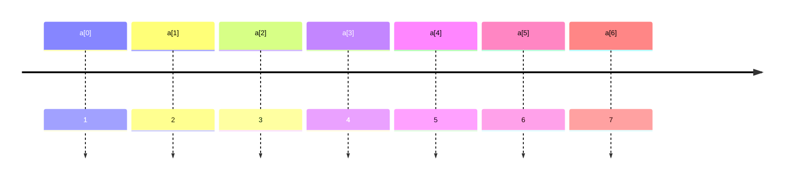

[TOC]

---


## 1、定义数组

```c
// <类型> 变量名称 [元素数量]
int grades[100];
double weight[20];
```

!!! tip
    - **所有元素数据类型必须相同**
    - 数组是定长的
    - **元素在内存中连续排列**，便于高效索引和遍历。
    - **下标从 0 开始**



!!! bug

    - 编译器和运行环境都 ==不会== 检查数组下标是否越界
    - 一旦程序运行，越界的数组访问可能造成问题，导致程序崩溃 → `segmentation fault`
    - 长度为 $0$ 的数组存在，但是无用


??? example "统计个数"

    ```c
    int main(void) {
        const int number = 10; // 数组大小
        int x;
        int count[number]; // 定义数组
        int i;
    
        // 数组初始化
        for (i = 0; i < number; i++) {
            count[i] = 0;
        }
    
        scanf("%d", &x);
        while (x != -1) {
            if (x > 0 && x <= 9) {
                count[x]++; // 数组参与运算
            }
    
            scanf("%d", &x);
        }
        // 遍历数组输出
        for (int i = 0; i < number; i++) {
            printf("%d:%d\n", i, count[i]);
        }
    
        return 0;
    }
    ```

---

## 2、数组运算

### （1）集成初始化

```c
int a[] = {2, 4, 6, 8, 9, 6, 5, 3};      // 自动推导大小为8
int a[12] = {2};                         // a[0]=2，其余a[1]~a[11]=0
```

### （2）定位初始化（C99 起支持）

```c
int a[12] = { [1]=2, 4, [5]=6 };
// 解释：
// a[1] = 2
// a[2] = 4
// a[5] = 6
// 其他元素默认初始化为0
```

!!! tip "数组大小"

    ```c
    sizeof(a) / sizeof(a[0])
    // 优点：无需手动更新遍历终点，即使数组初始值改变，循环逻辑仍正确
    ```

------

### （3）数组赋值

=== "❌"
    ```c
    int a[] = {1, 2, 3, 4, 5, 6};
    int b[] = a; // 编译错误：数组不能直接整体赋值
    ```

=== "✔️"
    ```c++
    int a[] = {1, 2, 3, 4, 5, 6};
    int b[6];
    for (int i = 0; i < 6; i++) {
        b[i] = a[i];
    }
    ```

!!! warning
    - 使用 `i <= length` 导致数组越界访问
	- 离开循环后继续使用 `i`，可能导致访问非法下标

### （4）作为函数参数

在函数中传递数组时，必须额外传入数组的大小。例如：

```c
void printArray(int arr[], int size) {
    for (int i = 0; i < size; i++) {
        printf("%d ", arr[i]);
    }
    printf("\n");
}
```

??? example "埃氏筛"
    - 令x为2
    
    - 将2x、3x、4x直至ax<n的数标记为非素数
    
    - 令x为下一个没有被标记为非素数的数，重复上一步；直到所有的数都已经尝试完毕
    
    ```c
    #include <stdio.h>
    #include <string.h>
    
    #define N 10000
    int isPrime[N]; // 标记数组：1 表示是素数，0 表示不是素数
    
    int main() {
        int n;
        scanf("%d", &n); // 输入需要筛选素数的上限 n
    
        // 初始化数组：memset 设置所有字节为 1，相当于全设为“是素数”状态
        memset(isPrime, 1, sizeof(isPrime));
        isPrime[0] = isPrime[1] = 0; // 0 和 1 不是素数，手动标记为 0
    
        for (int i = 2; i * i <= n; i++) {
            if (isPrime[i]) { // 如果 i 是素数
                // 把 i 的倍数都标记为非素数（从 i*i 开始标记，前面已经被标过了）
                for (int j = i * i; j <= n; j += i) {
                    isPrime[j] = 0;
                }
            }
        }
    
        // 输出所有在 [2, n] 范围内的素数
        for (int i = 2; i <= n; i++) {
            if (isPrime[i]) {
                printf("%d ", i);
            }
        }
    }
    ```

---

## 3、二维数组

```c
int a[3][5]; // 3行5列的二维整型数组
```

- `a[i][j]` 表示第 `i` 行第 `j` 列的元素，类型为 `int`
- 下标从 `0` 开始：有效范围为 `0 <= i < 3`，`0 <= j < 5`

### （1）一般初始化

```c
int a[][5] = {
    {0, 1, 2, 3, 4},
    {2, 3, 4, 5, 6},
};
```

!!! tip

    - **必须指定列数**，即 `[][5]` 是合法的，而 `[2][]` 是非法的
    - 每行用一对 `{}` 括起来，逗号分隔
    - 可以省略某些元素，不写的部分自动补零
    - 总行数可自动推导

### （2）`memset`

```c
int a[3][5];
memset(a, 0, sizeof(a));  // 将所有元素置为0
```

!!! failure
	初始化为非 0 值

---

