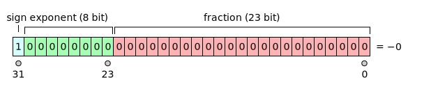
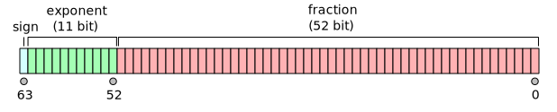

[TOC]

---

## 一、数制转换

$$
十进制\leftrightarrow 二进制 \leftrightarrow 十六进制
$$

|              | 十进制   | 二进制     | 十六进制 |
| ------------ | -------- | ---------- | -------- |
| **十进制**   | —        | 除二取余   | 除16取余 |
| **二进制**   | 按权展开 | —          | 四位分组 |
| **十六进制** | 按权展开 | 一位展四位 | —        |

---

## 二、`unsigned`

无符号整数是最简单的数字表示方法，超出表示范围就会回到初始值（即一个循环）

比如一个五位的无符号整数，超出 $32$ 之后就会回到 $0$ ，比 $0$ 小就会来到 $32$

---

## 三、负数表示？

### 1、符号＋数值

最高位表示符号：

$$
\begin{cases}
0 \rightarrow 正 \\[6pt]
1 \rightarrow 负
\end{cases}
$$

例如

```
+7 = 00000111
-7 = 10000111
```

!!! bug

    - 有两个 0
    
    ```
    +0 = 00000000
    -0 = 10000000
    ```
    
    - 硬件运算复杂
    
    - 自增可能变小

### 2、一补

负数：取反

例如

```
7  = 00111
-7 = 11000
```

问题：仍然存在 $\pm0$

### 3、二补

现代计算机全部使用。最高位还是符号位 $0$ 表示正数，$1$ 表示负数

计算方法：$负数 = 取反 + 1$ ，范围 $[-2^{N-1} , 2^{N-1}-1]$ （相当于借了一半正数给负数）

例：
$$
3 = 0011 \rightarrow 1100 \rightarrow 1101 \rightarrow -3
$$

!!! success "补码转十进制"

    对于 N 位数：
    
    $$
    v =
    \mathbf{-d_{N-1} \cdot 2^{N-1}}
    + \cdots
    + d_1 \cdot 2^1
    + d_0 \cdot 2^0
    $$
    
    例如：
    $$
    1101 = -8 + 4 + 0 + 1 = -3
    $$

## 四、浮点数

### 1、定点

小数点后的展开就是 $2^{-1},2^{-2}……$ 。可以看作没有小数点的，再除以 $2^{小数点左移}$

### 2、浮点（IEEE-754）

$$
6.02_{ten}\times10^{23}\\[6pt]
1.01_{two}\times2^{-1}
$$


二进制**科学计数法**与十进制类似，但是左边第一位永远是 $1$ ，并不存储。为了减少溢出问题，我们拓展位数即可，所以有了 double。

#### （1）正规数





!!! danger "Bias"

	存储的时候指数位是有偏移的。
		
	- 避免存负指数（硬件简单）
	- 保证指数大小顺序正确（方便比较和排序）
	- 预留特殊编码（$0、∞、NaN$）
	
	选择 `bias = 127` 因为指数位是 $8$ 位（$0\to255$），然后IEEE想让指数范围对称：（$-126 \to +127$）

$$
\boxed{x = (-1)^S \times \text(1.f)_B \times 2^{(\text{指数位} - 127)}}
$$

!!! info "特殊数字"
	
    $$
    \begin{array}{|c|c|c|c|}
    \hline
    \text{指数} & \text{Fraction} & \text{Value} & \text{说明} \\
    \hline
    0 & 0 & \pm 0 & \text{正零 / 负零} \\
    \hline
    0 & \neq 0 & \text{Denormal} & \text{非正规数（subnormal）} \\
    \hline
    1\sim254 & \text{anything} & \pm (-1)^S(1+f)2^{E-127} & \text{普通浮点数} \\
    \hline
    255 & 0 & \pm \infty & \text{正无穷 / 负无穷} \\
    \hline
    255 & \neq 0 & NaN & \text{Not a Number} \\
    \hline
    \end{array}
    $$

#### （2）非正规数

为了填补 $0$ 到最小正数中间的一段，引入**非正规数**来填补这段空缺（underflow）。

非正规数没有先导 $1$ ，$E=0$ 

$$
\boxed{x = (-1)^S \times (0.f)_B \times 2^{-126}}
$$

$$
MIN=2^{-23} \times 2^{-126} = 2^{-(23+126)} = 2^{-149}
$$

!!! tip 

	**靠近 0 很密，越远离 0 越稀疏。**这是因为 **有效位数固定，而指数在增长。**

### 3、误差舍入

$$
\begin{aligned}
x &= -1.5 \times 10^{38}, \quad
y = 1.5 \times 10^{38}, \quad
z = 1.0 \\[6pt]
x + (y + z)
&= -1.5 \times 10^{38} + (1.5 \times 10^{38} + 1.0) \\
&\approx -1.5 \times 10^{38} + 1.5 \times 10^{38} \\
&= 0.0 \\[10pt]
(x + y) + z
&= (-1.5 \times 10^{38} + 1.5 \times 10^{38}) + 1.0 \\
&= 0.0 + 1.0 \\
&= 1.0 \\[10pt]
\therefore \quad
x + (y + z) \ne (x + y) + z
\end{aligned}
$$

!!! tip "精度/准确度"

    - 精度：用了多少bit
    - 准确度：和真实值差多少
    
    ```cpp
    float pi = 3.14
    ```
    
    虽然 24bit 表示，但真实 $π = 3.1415926...$ ，所以精度高，准确度低

| 舍入模式                  | 规则                                                         | 特点                                |
| ------------------------- | ------------------------------------------------------------ | ----------------------------------- |
| ⭐**最接近值（偶数优先）** | 选择**最接近的数**；如果刚好在中间，选择**最低有效位为偶数**的数 | **IEEE-754 默认模式**，避免统计偏差 |
| **向 0 舍入**             | 直接截断，多余部分丢掉                                       | 类似整数除法                        |
| **向正无穷舍入**          | 向更大的数舍入                                               | 保证结果 ≥ 真值                     |
| **向负无穷舍入**          | 向更小的数舍入                                               | 保证结果 ≤ 真值                     |

