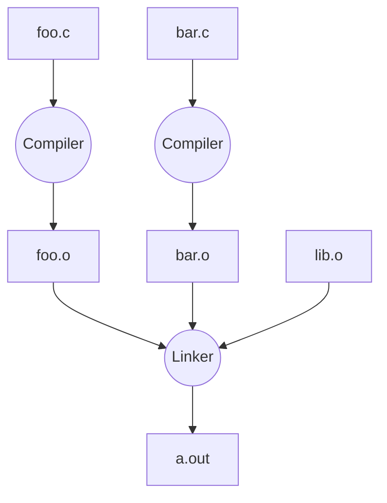
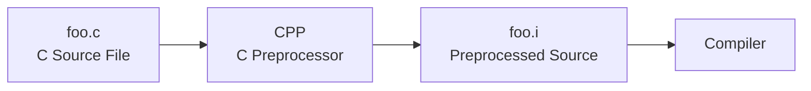

[TOC]

---

## 一、编译过程



对比其他语言：

| 语言   | 转换时间 |                              |
| ------ | -------- | ---------------------------- |
| C      | 编译时   | 源代码 → 机器码              |
| Java   | JVM运行  | 源代码 → bytecode → JVM      |
| Python | 运行时   | 源码 → bytecode → 运行时解释 |

### 1、C预处理器

常见指令：

```cpp
#include <stdio.h>
#define PI 3.14159
#if
#endif
```



!!! bug "#define"

    宏只是 文本替换。
    
    例：
    ```cpp
    #define min(X,Y) ((X)<(Y)?(X):(Y))
    ```
    
    调用：`min(w, foo(z))`
    
    展开：`((w)<(foo(z))?(w):(foo(z)))`
    
    如果 `foo(z)` 有副作用，会执行两次。