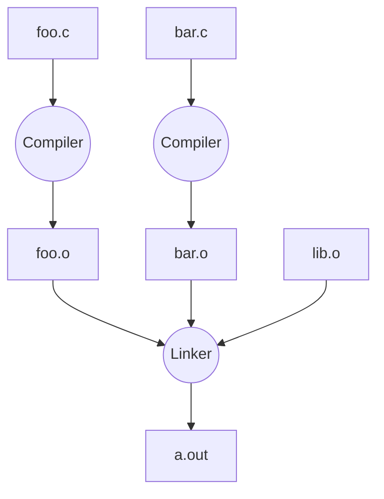
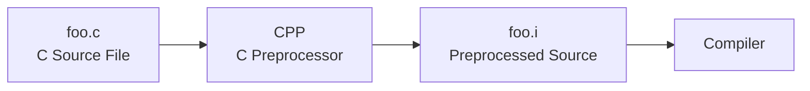
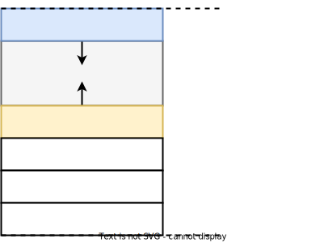

[TOC]

---

## 一、编译过程



对比其他语言：

| 语言   | 转换时间 |                              |
| ------ | -------- | ---------------------------- |
| C      | 编译时   | 源代码 → 机器码              |
| Java   | JVM运行  | 源代码 → bytecode → JVM      |
| Python | 运行时   | 源码 → bytecode → 运行时解释 |

### 1、C预处理器

常见指令：

```cpp
#include <stdio.h>
#define PI 3.14159
#if
#endif
```



!!! bug "#define"

    宏只是 文本替换。
    
    例：
    ```cpp
    #define min(X,Y) ((X)<(Y)?(X):(Y))
    ```
    
    调用：`min(w, foo(z))`
    
    展开：`((w)<(foo(z))?(w):(foo(z)))`
    
    如果 `foo(z)` 有副作用，会执行两次。

## 二、指针

这里对C语言指针章节简单复习，详见C语言文档。

```cpp
int *p; // p 是一个指针指向整数
p = &y; // p 的值是 y 的地址
z = *p; // 解指针得到 y 的值
```

### 1、修改变量

传指针：

```c++
void addOne(int *p){
   *p = *p + 1;
}
```

调用：

```
addOne(&y)
```

### 2、数组指针

> **数组几乎等价于指针**


!!! tip "等价关系"

    ```cpp
    ar[0] == *ar
    ar[2] == *(ar+2)
    ```
    
    因为：
    
    ```cpp
    ar = 数组首地址
    ```

### 3、指针运算

```
pointer + n
```

实际计算：

```
pointer + n*sizeof(type)
```

```
int *p
p+1
```

地址增加 `4 bytes`

因为 `sizeof(int) = 4`

??? example "函数指针"

    ```cpp
    #include <stdio.h>
    
    /*
     * 函数声明：
     * x10: 输入一个 int，返回它的 10 倍
     * x2 : 输入一个 int，返回它的 2 倍
     */
    int x10(int);
    int x2(int);
    
    /*
     * mutate_map:
     * A   -> 整数数组
     * n   -> 数组长度
     * fp  -> 函数指针，指向“输入 int，返回 int”的函数
     *
     * 作用：
     * 把数组 A 的每个元素都替换成 fp(原来的元素)
     */
    void mutate_map(int A[], int n, int (*fp)(int));
    
    /*
     * print_array:
     * 打印数组内容
     */
    void print_array(int A[], int n);
    
    /* 返回 n 的 2 倍 */
    int x2(int n) {
        return 2 * n;
    }
    
    /* 返回 n 的 10 倍 */
    int x10(int n) {
        return 10 * n;
    }
    
    /*
     * 对数组做“映射”操作
     * 比如：
     * 如果 fp 指向 x2，那么每个元素都乘 2
     * 如果 fp 指向 x10，那么每个元素都乘 10
     */
    void mutate_map(int A[], int n, int (*fp)(int)) {
        for (int i = 0; i < n; i++) {
            /*
             * A[i]         是当前数组元素
             * (*fp)(A[i])  表示调用 fp 指向的函数，并把 A[i] 作为参数传进去
             *
             * 例如：
             * fp = x2  时，相当于 A[i] = x2(A[i]);
             * fp = x10 时，相当于 A[i] = x10(A[i]);
             */
            A[i] = (*fp)(A[i]);
        }
    }
    
    /* 打印数组 */
    void print_array(int A[], int n) {
        for (int i = 0; i < n; i++) {
            printf("%d ", A[i]);
        }
        printf("\n");
    }
    
    int main(void) {
        /* 定义数组 A，内容是 3, 1, 4；n 是数组长度 */
        int A[] = {3, 1, 4};
        int n = 3;
    
        /* 先打印原数组 */
        print_array(A, n);      // 输出: 3 1 4
    
        /* 把数组每个元素都乘 2 */
        mutate_map(A, n, &x2);
        print_array(A, n);      // 输出: 6 2 8
    
        /* 再把数组每个元素都乘 10 */
        mutate_map(A, n, &x10);
        print_array(A, n);      // 输出: 60 20 80
    
        return 0;
    }
    ```

## 三、内存管理

### 1、`malloc`

#### （1） `malloc` 查找策略

| 分配策略                  | 思路                                               | 优点                         | 缺点                                                    |
| ------------------------- | -------------------------------------------------- | ---------------------------- | ------------------------------------------------------- |
| **首次适配（First Fit）** | 从头开始查找，找到 **第一个足够大的空闲块** 就分配 | 查找速度快，实现简单         | 容易产生较多 **外部碎片**                               |
| **最佳适配（Best Fit）**  | 在所有空闲块中找到 **最接近请求大小的块**          | 空间利用率较高，碎片相对较少 | 需要遍历很多空闲块，**查找速度慢**                      |
| **下次适配（Next Fit）**  | 类似首次适配，但 **从上一次查找结束的位置继续找**  | 避免总是从头搜索，分配更均匀 | 仍可能产生碎片，效率通常介于 First Fit 和 Best Fit 之间 |

```cpp
#include <stdio.h>
#include <stdlib.h>
#include <string.h>

/*
 * 定义链表节点结构
 *
 * 每个节点包含：
 * 1. value : 指向字符串的指针
 * 2. next  : 指向下一个节点
 */
struct Node {
    char *value;           // 存储字符串
    struct Node *next;     // 指向下一个节点
};

/*
 * typedef 的作用：
 * 给类型取别名
 *
 * List 实际上就是：
 * struct Node *
 *
 * 也就是说 List 是一个“指向 Node 的指针”
 */
typedef struct Node *List;


/*
 * 创建一个空链表
 *
 * 空链表的表示方法：
 * head = NULL
 */
List ListNew(void)
{
    return NULL;
}


/*
 * 在链表头部添加一个字符串
 *
 * 参数：
 * list   -> 当前链表头
 * string -> 要插入的字符串
 *
 * 返回：
 * 新的链表头
 */
List list_add(List list, char *string)
{
    /*
     * 第一步：在 heap 上申请一个 Node
     *
     * sizeof(struct Node)
     * 计算 Node 结构体所需要的字节数
     */
    struct Node *node =
        (struct Node*) malloc(sizeof(struct Node));

    /*
     * 第二步：给字符串分配空间
     *
     * strlen(string) + 1
     * +1 是给 '\0'
     */
    node->value =
        (char*) malloc(strlen(string) + 1);

    /*
     * 第三步：把字符串复制到新分配的空间
     */
    strcpy(node->value, string);

    /*
     * 第四步：把新节点连接到链表
     *
     * node -> next 指向旧链表头
     */
    node->next = list;

    /*
     * 第五步：返回新的链表头
     */
    return node;
}


/*
 * 打印链表
 */
void print_list(List list)
{
    struct Node *curr = list;   // 从链表头开始

    while (curr != NULL)        // 直到走到 NULL
    {
        printf("%s -> ", curr->value);
        curr = curr->next;      // 移动到下一个节点
    }

    printf("NULL\n");
}


int main()
{
    /*
     * 创建空链表
     */
    List list = ListNew();

    /*
     * 依次往链表中添加元素
     */
    list = list_add(list, "abc");
    list = list_add(list, "def");
    list = list_add(list, "ghi");

    /*
     * 打印链表
     */
    print_list(list);

    return 0;
}
```

### 2、内存结构



特点：

- **栈向下增长**
- **堆向上增长**

这样可以**最大化利用**内存空间。

#### （1）代码区

存储：程序的机器指令

| 特性     | 说明           |
| -------- | -------------- |
| 只读     | 不会改变       |
| 固定大小 | 程序加载时确定 |
| 生命周期 | 整个程序       |

#### （2）栈

用途：

- 函数调用
- 局部变量
- 参数
- 返回地址

| 特性     | 说明                                      |
| -------- | ----------------------------------------- |
| 自动管理 | 编译器                                    |
| 速度快   |                                           |
| 空间小   | 创建栈帧后会自动销毁（许多bug也与此有关） |
| LIFO     |                                           |

!!! bug

    ```c++
    #include <stdio.h>
    
    /*
     * 这个函数是错误示范
     *
     * 返回值类型是 int*，也就是“指向 int 的指针”
     */
    int *ptr() {
        /*
         * y 是局部变量
         * 局部变量存放在 stack（栈）上
         */
        int y;
    
        y = 3;
    
        /*
         * 返回 y 的地址
         *
         * 这里表面上看没问题：
         * &y 确实是一个 int* 类型
         *
         * 但问题在于：
         * y 属于 ptr() 的栈帧
         * 一旦 ptr() 结束，这块栈内存就失效了
         *
         * 所以这里返回的是“悬空指针”
         */
        return &y;
    }
    
    int main() {
        /*
         * stackAddr: 用来保存 ptr() 返回的地址
         * content  : 用来读取该地址中的值
         */
        int *stackAddr, content;
    
        /*
         * 调用 ptr()
         *
         * ptr() 中的 y = 3，返回 &y
         * 所以 stackAddr 会得到一个原本指向 y 的地址
         *
         * 但注意：
         * ptr() 一返回，y 所在的栈帧就已经被销毁了
         * 这个地址已经无效
         */
        stackAddr = ptr();
    
        /*
         * 第一次读取这个地址里的值
         *
         * 有时候你会“碰巧”读到 3，
         * 因为那块栈内存暂时还没被别的内容覆盖
         *
         * 但这只是偶然现象，不是合法行为
         */
        content = *stackAddr;
        printf("first read: %d\n", content);
    
        /*
         * 第二次再读同一个地址
         *
         * 在这期间，printf、自身局部变量、编译器生成的临时数据
         * 都有可能重新使用那块栈空间
         *
         * 所以这里读到的值可能已经不是 3 了，
         * 可能是随机数，也可能程序直接崩溃
         */
        content = *stackAddr;
        printf("second read: %d\n", content);
    
        return 0;
    }
    ```

!!! note "栈帧"

    每次函数调用都会创建**栈帧**，结束后自动销毁

    ```mermaid
    flowchart TB

    A[main]
    B[a]
    C[b]

    A --> B
    B --> C
    ```


    ```mermaid
    flowchart TB

    C[frame b]
    B[frame a]
    A[frame main]

    C --> B
    B --> A
    ```

    栈帧包含：

    - 参数
    - 局部变量
    - 返回地址


#### （3）堆

用途：动态内存分配

| 特性         | 说明       |
| ------------ | ---------- |
| 动态分配     | `malloc()` |
| 手动释放     | `free()`   |
| 生命周期灵活 |            |
| 空间较大     |            |

!!! danger "内存碎片"

    问题：`malloc` 和 `free` 顺序不可预测。
    
    示例：
    
    ```
    R1 = malloc(100)
    R2 = malloc(1)
    free(R1)
    R3 = malloc(50)
    ```
    
    内存可能变为：
    
    ```
    | free 50 | used 1 | free 50 |
    ```
    
    虽然总空间够，但没有连续空间。因此出现**外部碎片**。

------

