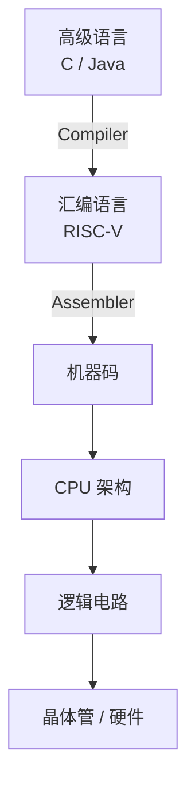

[TOC]

---

## 一、基础

计算机系统由多个抽象层组成，每一层都建立在下一层之上。同一段程序在不同层有不同表示方式。



CPU 的核心工作：**执行指令**。程序本质上就是一系列**指令**。CPU循环执行：取指令、解码、执行

### 1、指令集架构（ISA）

不同 CPU 支持不同的指令集合 ISA（Instruction Set Architecture）

常见 ISA：

| ISA        | 用途           |
| ---------- | -------------- |
| x86        | Intel / AMD PC |
| ARM        | 手机           |
| MIPS       | 教学           |
| **RISC-V** | 开源架构       |

RISC = Reduced Instruction Set Computing

核心理念：

- 指令 **尽量简单**
- 复杂操作由 **多条简单指令组合**

优点：

- 硬件更容易实现
- CPU可以更快
- 更适合流水线

------

### 2、汇编语言的特点

| 特性 | C / Java           | 汇编           |
| ---- | ------------------ | -------------- |
| 变量 | 有                 | 没有           |
| 类型 | int / char / float | 无类型         |
| 语句 | 一行可以很多操作   | 一行只一条指令 |
| 存储 | 内存               | 寄存器         |

在汇编中：

> **操作对象是寄存器**

------

### 3、寄存器

- CPU内部存储单元
- 访问速度非常快
- 数量有限

编号：`x0 ~ x31`

每个寄存器：`32 bit` 称为一个 `word`

!!! tip "x0是特殊寄存器"

    x0永远是 $0$
    
    ```sh
    add x3,x4,x0 # x3 = x4
    ```

---

## 二、基础语法

RISC-V 算术指令遵循统一格式：

```sh
op rd, rs1, rs2 # rd = rs1 op rs2
```

| 字段 | 含义       |
| ---- | ---------- |
| op   | 操作       |
| rd   | 结果寄存器 |
| rs1  | 寄存器1    |
| rs2  | 寄存器2    |

这种统一格式体现了 **RISC 的规则性设计原则**，使硬件实现更简单

### 1、加减法指令

```sh
add x1, x2, x3 # x1 = x2 + x3
sub x3, x4, x5 # x3 = x4 - x5
```

对应的 C 代码：`a = b + c;`

寄存器对应关系：

| C变量 | RISC-V寄存器 |
| ----- | ------------ |
| a     | x1           |
| b     | x2           |
| c     | x3           |

#### （1）立即数

没有立即数就必须把数存进寄存器再操作，这样多一条指令而且占用多一个寄存器。

```sh
addi x10, x10, 4 # x10 = x10 + 4
```

✳但是没有 `subi` 指令，因为可以通过加一个负数来实现

