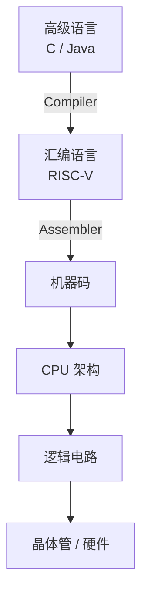
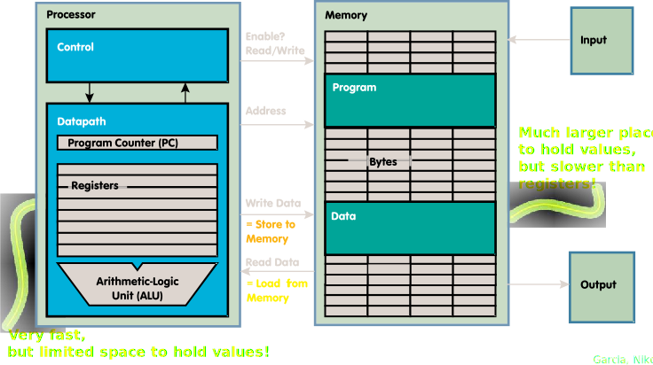

[TOC]

---

## 一、基础

计算机系统由多个抽象层组成，每一层都建立在下一层之上。同一段程序在不同层有不同表示方式。



CPU 的核心工作：**执行指令**。程序本质上就是一系列**指令**。CPU循环执行：取指令、解码、执行

### 1、指令集架构（ISA）

不同 CPU 支持不同的指令集合 ISA（Instruction Set Architecture）

常见 ISA：

| ISA        | 用途           |
| ---------- | -------------- |
| x86        | Intel / AMD PC |
| ARM        | 手机           |
| MIPS       | 教学           |
| **RISC-V** | 开源架构       |

RISC = Reduced Instruction Set Computing

核心理念：

- 指令 **尽量简单**
- 复杂操作由 **多条简单指令组合**

优点：

- 硬件更容易实现
- CPU可以更快
- 更适合流水线

------

### 2、汇编语言的特点

| 特性 | C / Java           | 汇编           |
| ---- | ------------------ | -------------- |
| 变量 | 有                 | 没有           |
| 类型 | int / char / float | 无类型         |
| 语句 | 一行可以很多操作   | 一行只一条指令 |
| 存储 | 内存               | 寄存器         |

在汇编中：

> **操作对象是寄存器**

------

### 3、寄存器

- CPU内部存储单元
- 访问速度非常快
- 数量有限

编号：`x0 ~ x31`

每个寄存器：一个word （`32 bit` 称为一个 `word`）

!!! tip "x0是特殊寄存器"

    x0永远是 $0$
    
    ```asm
    add x3,x4,x0 # x3 = x4
    ```

---

## 二、基础语法

RISC-V 算术指令遵循统一格式：

```asm
op rd, rs1, rs2 # rd = rs1 op rs2
```

| 字段 | 含义       |
| ---- | ---------- |
| op   | 操作       |
| rd   | 结果寄存器 |
| rs1  | 寄存器1    |
| rs2  | 寄存器2    |

这种统一格式体现了 **RISC 的规则性设计原则**，使硬件实现更简单

### 1、加减法指令

```asm
add x1, x2, x3 # x1 = x2 + x3
sub x3, x4, x5 # x3 = x4 - x5
```

对应的 C 代码：`a = b + c;`

寄存器对应关系：

| C变量 | RISC-V寄存器 |
| ----- | ------------ |
| a     | x1           |
| b     | x2           |
| c     | x3           |

#### （1）立即数

没有立即数就必须把数存进寄存器再操作，这样多一条指令而且占用多一个寄存器。

```asm
addi x10, x10, 4 # x10 = x10 + 4
```

✳但是没有 `subi` 指令，因为可以通过加一个负数来实现

---

## 三、内存中的地址

CPU内部只有 **寄存器**，但寄存器数量很少：

- RISC-V：32 个寄存器
- 每个 32 bit

总共只有：128 Bytes，而内存：2GB – 64GB



因此 CPU设计原则是：

- 计算 → 在寄存器
- 存储 → 在内存

如果要运算内存中的数字必须先load到寄存器上（RISC-V 就是 load-store 架构）

> **Memory 地址是按 byte 编号的**，不是按 word。

程序计数器（PC）指向下一条需要执行的指令

```bash
1 byte = 8 bits
1 word = 4 bytes = 32 bits
# word 地址间隔 = 4
```

------

### 1、大/小端序

小端序就是**最低有效字节存在最小地址。** 大端序与之相反。

```bash
1025 = 00000000 00000000 00000100 00000001
# 在小端序内存
address+0 : 00000001
address+1 : 00000100
address+2 : 00000000
address+3 : 00000000

# 在大端序的内存
address+0 : 00000000
address+1 : 00000000
address+2 : 00000100
address+3 : 00000001
```

RISC-V 使用的就是**小端序**

寄存器共有 32 个word 也就是 128 Byte

### 2、访问内存指令

#### （1）`lw`（从内存 → 寄存器）

`load-word`

```asm
lw rd, offset(rs1) # R[rd] = Memory[ R[rs1] + offset ]
```
!!! example

    ```cpp
    g = h + A[3];
    ```
    
    ```shell
    lw x10,12(x15)   # x10 = A[3] ，假设数组a起始地址是x15
    add x11,x12,x10  # g = h + A[3]
    ```
    
    !!! question "为什么 offset = 12？"
    
        ```
        A[3] = base + 3 * 4 = 12 bytes
        ```
    
        👉 **数组下标 × 4（word大小）**

#### （2）`sw`（寄存器 → 内存）

`store-word`

```asm
sw rs2, offset(rs1) # Memory[ R[rs1] + offset ] = R[rs2]
```

!!! example

    ```cpp
    A[10] = h + A[3];
    ```
    
    ```asm
    lw x10,12(x15)
    add x10,x12,x10
    sw x10,40(x15)
    ```

!!! tip "记忆"

    `lw` 命令是从右向左存（把逗号右边存到逗号左边的寄存器），`sw` 命令是从左向右寄（把逗号左边的内容存到右边的位置上）
    
    偏移一定是 $4$ 的整数倍

#### （3）`lb/lbu` Byte操作

`load-byte / load-byte-unsigned`

一个事实是如果一个有符号的二进制数向左拓展位数，如果拓展位数全为 $符号位$ ，那么这个数的大小不变。使用 $0$ 拓展那么这个数变为恒正

| 指令  | 扩展方式 | 结果     |
| ----- | -------- | -------- |
| `lb`  | 符号扩展 | 保持正负 |
| `lbu` | $0$ 扩展 | 一律变正 |

```asm
byte = 11111111
lb  → 11111111 11111111 11111111 11111111 = -1
lbu → 00000000 00000000 00000000 11111111 = 255
```

---

## 四、控制指令

### 1、判断指令

`branch if equal`

```asm
beq rs1, rs2, label # if (rs1 == rs2) jump to label
bne rs1, rs2, label # if (rs1 != rs2) jump to label
blt rs1, rs2, label  # < 
bge rs1, rs2, label  # >=
bltu rs1, rs2, label # 无符号 <
bgeu rs1, rs2, label # 无符号 >=
```

```cpp
if (i == j)
    f = g + h;
```

=== "使用 `beq`"

    ```asm
    beq x13, x14, Then
    j Exit
    Then:
    add x10, x11, x12
    Exit:
    ```

=== "使用 `bne`"

    ```asm
    bne x13, x14, Exit
    add x10, x11, x12
    Exit:
    ```

### 2、循环指令

```cpp
for (i = 0; i < 20; i++)
    sum += A[i];
```

```asm
Loop:
bge x11,x13,Done   # 结束条件

lw x12,0(x9)
add x10,x10,x12

addi x9,x9,4       # 指针移动
addi x11,x11,1

j Loop
```

---

## 五、逻辑指令

一般总有普通版本和**立即数版本**，比如 `and` 和 `andi`

### 1、基本按位运算

```asm
and x5, x6, x7   # x5 = x6 & x7
```

#### （1）立即数做mask

```asm
andi x5, x6, 0xFF # 保留最低八位，因为 FF 表示 1
```

!!! question "为什么没有 `not` 指令"

    异或 $1$ 即可等价于 `not`
    
    ```asm
    xor x5, x6, -1   # 全1
    ```

### 2、位移

#### （1）左移 `sll / slli`

```asm
slli x11, x12, 2 # x11 = x12 << 2，右边补 0
```

#### （2）右移

##### `srl`（逻辑右移）

```asm
srl x5, x6, 2 # 高位补 0
```

##### `sra`（算术右移）

```asm
sra x5, x6, 2 # 高位补符号位
```

!!! tip

    把乘数拆成 $2$ 的幂的和
    
    - 比如如果要实现 $\times 12$ ，那么可以拆成左移 $8$ + 左移 $4$ 

!!! info "寄存器别名"

    | 符号名 | 实际寄存器 | 含义           |
    | ------ | ---------- | -------------- |
    | zero   | x0         | 恒为0          |
    | ra     | x1         | return address |
    | a0–a7  | x10–x17    | 参数 / 返回值  |
    | s0–s11 | x8–x27     | 保存寄存器     |

!!! tip "伪指令"

    | 伪指令        | 含义       | 展开后的真实指令           |
    | ------------- | ---------- | -------------------------- |
    | `mv rd, rs`   | 赋值       | `addi rd, rs, 0`           |
    | `li rd, imm`  | 加载立即数 | `addi rd, x0, imm`（小数） |
    | `nop`         | 空操作     | `addi x0, x0, 0`           |
    | `not rd, rs`  | 按位取反   | `xori rd, rs, -1`          |
    | `neg rd, rs`  | 取负数     | `sub rd, x0, rs`           |
    | `seqz rd, rs` | rs==0 →1   | `sltiu rd, rs, 1`          |
    | `snez rd, rs` | rs≠0 →1    | `sltu rd, x0, rs`          |

---

## 六、函数调用指令

```
地址      指令
1000      mv a0, s0
1004      mv a1, s1
1008      jal sum
1012      （下一条指令）

2000      sum: add a0, a0, a1
2004           jr ra
```

当程序执行到 `PC = 1008` 的 `jal sum` 时，CPU 会先把“下一条指令地址”保存到 `ra`，也就是 `ra = 1012`，然后把程序计数器改为函数入口地址 `PC = 2000`，跳转去执行函数

接着在函数中执行 `add a0, a0, a1` 完成计算（结果放在 `a0`），执行到 `jr ra` 时，会把 `ra` 里的值取出来作为新的 PC，即 `PC = 1012`，从而跳回原来调用点的下一条指令继续执行。整个过程的本质就是**`jal` 负责“记录返回位置 + 跳过去”，`jr ra` 负责“跳回来”**。

⚠ 本质上用 `j` 指令也能做到，但是要保存之前跳转的地址（不方便）；而且一个函数有可能在**多处被调用**
