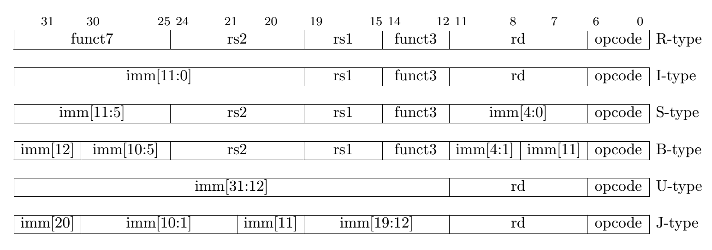
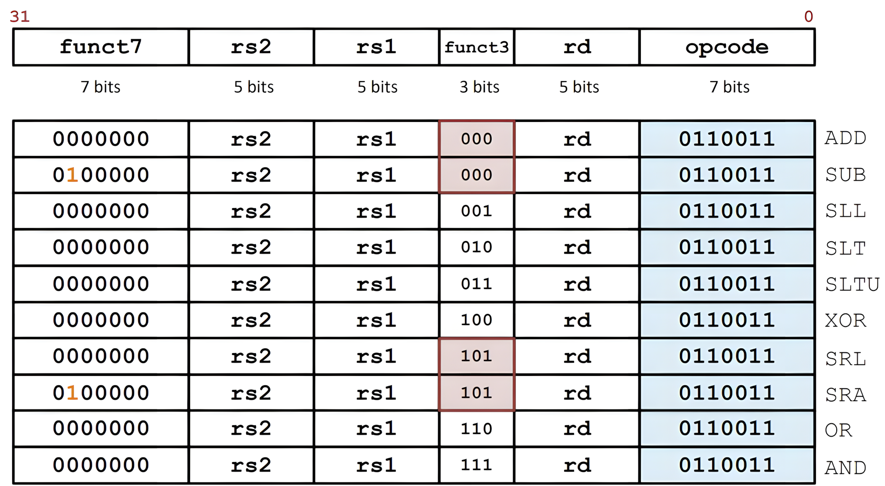

[TOC]

---

## 一、概述

本质：**一切都是数字**，都在内存储存内

程序可以像数据一样被修改

不需要重新接线（ENIAC → 现代计算机）

后果：

- 指令、数据都有地址；PC（Program Counter）存当前指令地址 
- 程序是二进制分发；新机器要**兼容**旧程序 

---

## 二、RISC-V 指令本质及格式

- RISC-V 设计理念就是简单，所有指令都是 **32 bit** 

- 优点在于**解码简单，pipeline 友好**

- 指令 = 字段（fields）

  一个指令被拆成多个字段：

  - `opcode`（操作类型）
  - `rs1 / rs2`（源寄存器）
  - `rd`（目标寄存器）
  - `funct3 / funct7`（细分操作）
  - `immediate`（立即数）



### 1、R-type（寄存器运算）



R-format 指令的opcode是0110011，func3+func7是存在冗余的，十个字节本来可以表示1024条指令但是这里只用表示大约10条指令

比如 

```asm
add x18, x19, x10
# 0000000	|01010	|10011	|000	|10010	|0110011
# add		|rs2=10	|rs1=19	|add	|rd=18	|Reg-Reg OP
```

再比如

```asm
add x4, x3, x2
# a. 4021 8233
# b. 0021 82b3
# c. 4021 82bb3
# d. 0021 8233
# e. 0021 8234
# 从首位和末尾可以迅速推出答案d
```

---

### 2、I-type（立即数 & load）

把func7和rs2合并成一个imm[11:0]，一共12位，范围[-2048~+2047]，imm会进行符号位拓展

比如

```asm
addi x15, x1, -50
# 111111001110	|00001	|000	|011111	|0010011
# imm=-50		|rs1=1	|add	|rd=15	|OP-Imm
```

