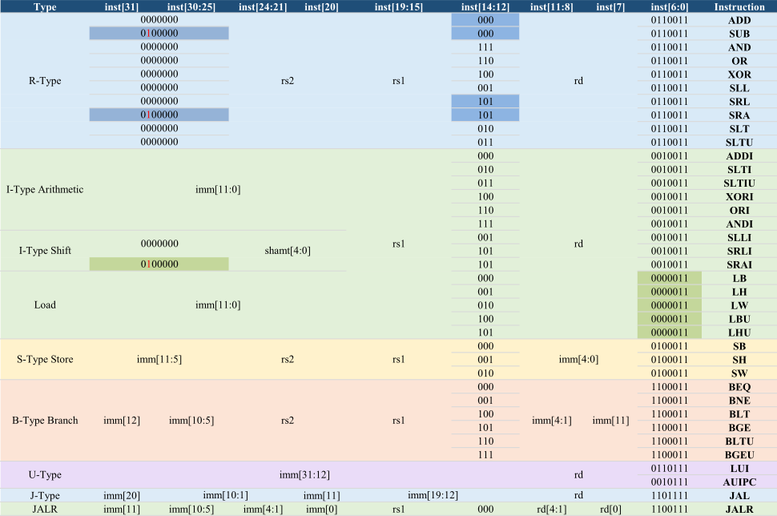

[TOC]

---

## 一、概述

本质：**一切都是数字**，都在内存储存内

程序可以像数据一样被修改

不需要重新接线（ENIAC → 现代计算机）

后果：

- 指令、数据都有地址；PC（Program Counter）存当前指令地址 
- 程序是二进制分发；新机器要**兼容**旧程序 

---

## 二、RISC-V 指令本质及格式

- RISC-V 设计理念就是简单，所有指令都是 **32 bit** 

- 优点在于**解码简单，pipeline 友好**

- 指令 = 字段（fields）

  一个指令被拆成多个字段：

  - `opcode`（操作类型）
  - `rs1 / rs2`（源寄存器）
  - `rd`（目标寄存器）
  - `funct3 / funct7`（细分操作）
  - `immediate`（立即数）


### 1、R-type（寄存器运算）


R-format 指令的opcode是0110011，func3+func7是存在冗余的，十个字节本来可以表示1024条指令但是这里只用表示大约10条指令

比如 

```asm
add x18, x19, x10
# 0000000	|01010	|10011	|000	|10010	|0110011
# add		|rs2=10	|rs1=19	|add	|rd=18	|Reg-Reg OP
```

再比如

```asm
add x4, x3, x2
# a. 4021 8233
# b. 0021 82b3
# c. 4021 82bb3
# d. 0021 8233
# e. 0021 8234
# 从首位和末尾可以迅速推出答案d
```

---

### 2、I-type（立即数 & load）

把func7和rs2合并成一个imm[11:0]，一共12位，范围[-2048~+2047]，imm会进行符号位拓展

比如

```asm
addi x15, x1, -50
# 111111001110	|00001	|000	|011111	|0010011
# imm=-50		|rs1=1	|add	|rd=15	|OP-Imm
lw x14, 8(x2)
# 000000001000	|00010	|010	|01110	|0000011
# imm=+8		|rs1=2	|lw		|rd=14	|LOAD
```

位移和load操作也是用的I-type指令

---

### 3、S-type（store）

这里没有 rd（因为不写寄存器），而且 immediate 被拆成两段

---

### 4、B-type（branch）

B-type是给 **条件跳转**用的。它的本质不是跳到某个绝对地址而是

```asm
如果条件成立：
    PC = PC + imm * 2
如果条件不成立：
    PC = PC + 4 # 下一条指令
```

但 RISC-V 实际设计为了兼容 **16-bit compressed instructions**，branch offset 是按 **2 bytes** 对齐的，也就是说 branch immediate 表示的是“半字节对齐单位”，不是完整 4-byte 指令单位

比如

```asm
beq x19, x10, +16
# 0000000 |01010 |10011 |000 |1000 |0 |1100011
# imm=+16 |rs2=10|rs1=19|beq |imm  | |BRANCH
blt x8, x9, +12
# 0000000 |01001 |01000 |100 |0110 |0 |1100011
# imm=+12 |rs2=9 |rs1=8 |blt |imm  | |BRANCH
bgeu x3, x4, -4
# 1111111 |00100 |00011 |111 |1110 |1 |1100011
# imm=-4  |rs2=4 |rs1=3 |bgeu|imm  | |BRANCH
```

---

### 5、U-type（大立即数）

用来构造 32-bit 常数，因为addi 只能放 12-bit 立即数（±2048），所以 $32bit 常数 = 高20位 + 低12位$

```asm
lui  rd, 高20位
addi rd, rd, 低12位
```

正常情况下直接拆就好，但是如果遇到拆出来低12位是负数就要特判

```asm
# 0x12345678
lui  x10, 0x12345
addi x10, x10, 0x678
# 0xDEADBEEF
lui  x10, 0xDEADC # 0xEEF = 1110 1110 1111 = -273
addi x10, x10, 0xEEF
```

