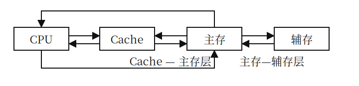
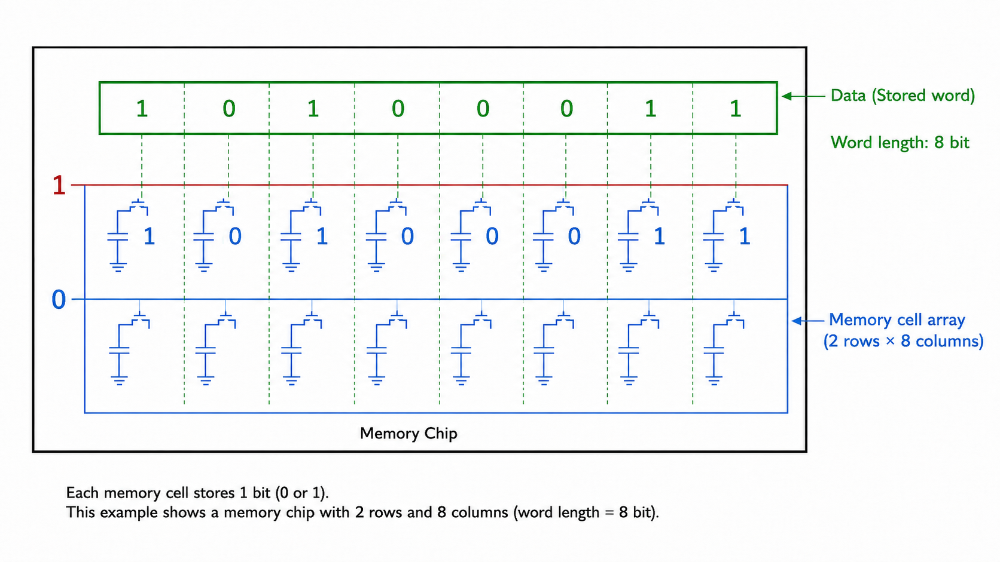
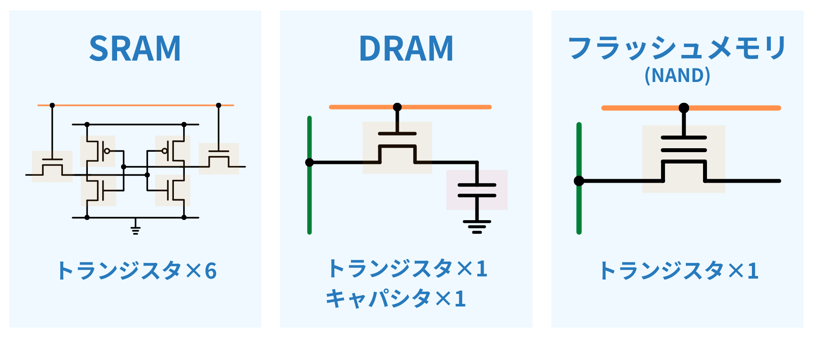
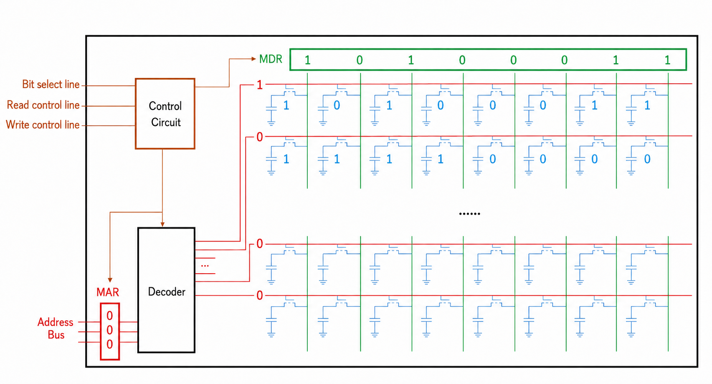

[TOC]

---

## 一、基本概念

### 1、分类

#### （1）按照层次

- 寄存器
- cache 高速缓冲存储器
- 内存 主存
- 辅存 磁盘
- 外存 光盘

容量越大 速度越慢 价格越低

- 主存辅存实现虚拟存储系统 解决主存容量不够的问题

- cache主存解决了主存 cpu 速度不匹配的问题

高速缓存和主存可以直接跟cpu交互，辅存需要调用到高速缓存或主存才行

#### （2）按储存介质

- 半导体
- 磁表面存储器
- 光存储器

#### （3）按存取方式

- 随机存取存储器 RAM（Random Access Memory)：读写任何一个存储单元需要的时间一样，和位置无关
- 顺序存取存储器 SAM（Sequential Access Memory）：读写一个取决于物理位置
- 直接存取存储器 DAM （Direct Access Memory）：既有随机性也有顺序性
- SAM DAM都是串行访问
- CAM 按照内容访问，RAM/SAM/DAM按照地址访问

#### （4）按信息可更改性

- 读写存储器
- 只读存储器 ROM：比如BIOS写在ROM

#### （5）按信息可保存性

- 易遗失性存储器：主存 cache
- 非易遗失性存储器：磁盘光盘
- 破坏性读出：DRAM
- 非破坏性读出：SRAM

### 2、性能指标

- 存储容量：存储字长 * 存储字数
- 单位成本：每位价格 = 总成本 / 总容量
- 存储速度：数据传输率 = 数据的宽度 / 存储周期 
- 存储时间 = 存取时间 + 恢复时间

---

## 二、主存储器基本组成

MOS管是一种电控开关，输入电压达到某个阈值就可以接通，输出或者写入某个值

### 1、存储芯片的基本原理

**控制电路**等待译码完毕才送出

n位地址 → $2^n$ 个存储单元 → $总容量 = 存储单元个数 \times 存储字长$

!!! tip "常见名词"

	$8\times8$ 位存储芯片：第一个8代表存储单元个数，第二个8代表**字长**，即 $2^3\times8$
	
	$8k\times8$ 位：即$2^{13}\times8$

### 2、寻址

总容量：1KB

- 按字节寻址：1k个单元，每个单元1B
- 按字寻址：256个单元，每个单元4B
- 按半字寻址：512个单元，每个单元2B
- 按双字寻址：128个单元，每个单元8B

---

## 三、SRAM/DRAM

### 1、栅极电容/双稳态触发器

DRAM（栅极电容）：读出1 MOS接通电容放电数据线产生电流，读出0 MOS接通数据线上无电流；**破坏性读出**需要**重写**；功耗低

SRAM：读出1 BLX低电平，读出来BL低电平；**非破坏性读出**；功耗高

| 类型特点                 | SRAM（静态 RAM）       | DRAM（动态 RAM）       |
| ------------------------ | ---------------------- | ---------------------- |
| 存储信息                 | 触发器                 | 电容                   |
| 破坏性读出               | 非                     | 是                     |
| 读出后需要重写？（再生） | 不用                   | 需要                   |
| 运行速度                 | 快                     | 慢                     |
| 集成度                   | 低                     | 高                     |
| 发热量                   | 大                     | 小                     |
| 存储成本                 | 高                     | 低                     |
| 易失/非易失性存储器？    | 易失（断电后信息消失） | 易失（断电后信息消失） |
| 需要“刷新”？             | 不需要                 | 需要                   |
| 送行列地址               | 同时送                 | 分两次送               |
| 常用作                   | **Cache**              | **主存**               |

### 2、DRAM刷新

- 刷新周期：2ms
- 每次刷新以**行**为单位，刷新**一行**存储单元

原来译码器接出来行数可能过多所以拆分为二维的有行有列，这样就排列成 $2^{n/2}\times2^{n/2}$ 的矩阵，减少选通线的数量

地址切分为一半一半，前半是行地址后半是列地址

!!! question "什么时候刷新"

	假设是 $128*128$ 的形式，读写周期是 $0.5\mu s$
	
	$2ms/0.5\mu s=4000$个周期
	
	思路一：分散刷新（每次读写完都刷新一行
	
	思路二：集中刷新（$2ms$安排时间集中刷新
	
	思路三：异步刷新（$2ms$内只要每行刷新一次即可 $2ms/128=15.6\mu s$ 每$15.6\mu s$刷新一次$0.5\mu s$

DRAM 地址线复用，行列地址分两次送，地址线更少引脚更少，只需要 $n/2$ 根

---

## 四、ROM

- MROM 掩膜式只读存储器
- PROM 可编程只读存储器：写入一次后不可更改
- EPROM 可擦除可编程只读存储器
- UVREPROM 紫外线照射可以全部擦除
- EEPROM 电可擦除，可以擦除部分
- Flash 可以多次快速擦写，写的速度一般比读快因为**要擦除**，只需要单个MOS管
- SSD 固态硬盘

---

## 五、存储器和CPU连接

### 1、字拓展

拓展主存字数

- 译码片选法：多出来的线接一个译码器，可以是3-8，2-4等等等等，多出 $2^n$ 
- 线选法：多出来每一条线接一个储存芯片，多出 $n$

### 2、位拓展

数据总线宽度>储存芯片字长，那么可以通过使用更多的存储单元来进行位拓展

- 字位同时拓展

MAR/MDR现在一般集成在CPU里

---

## 六、外存储器

### 1、磁盘存储器

-  磁头：有几个记录面就有几个磁头
- 柱面数：有多少条磁道就有几个柱面
- 扇区

### （1）性能指标

1. 容量：**格式化容量**是指按照某种特定记录格式能存储的信息总容量/**非格式化容**量会更大
2. 记录密度：
   - 道密度：半径方向上的磁道数
   - 位密度：单位长度上能记录的二进制代码位数，越靠近内侧位密度越大
   - 面密度：$道密度\times位密度$
3. 平均存储时间：$寻道时间+旋转延迟时间+传输时间$
4. 

