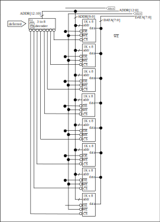
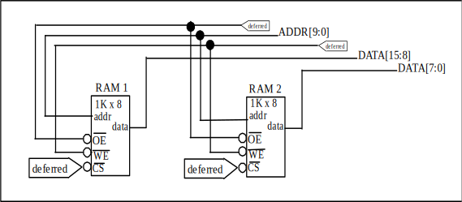
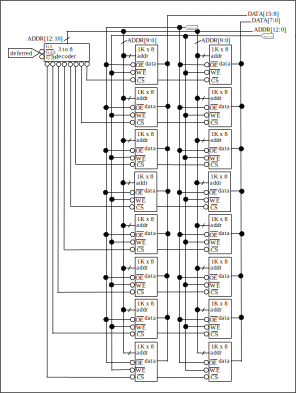
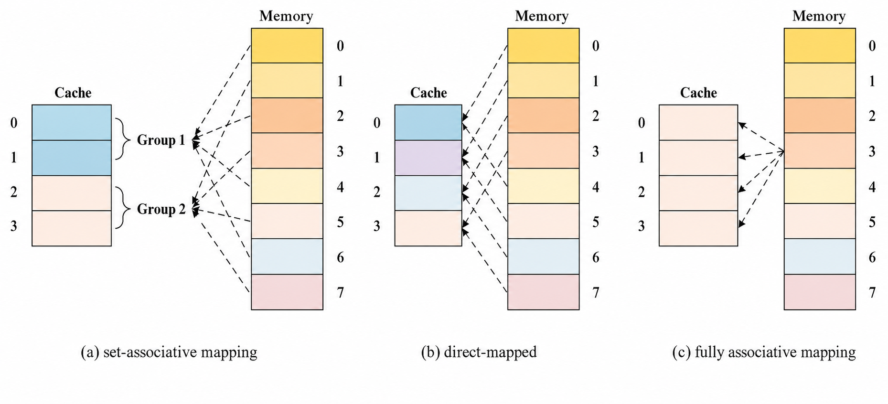

[TOC]

---

## 一、基本概念

### 1、分类

#### （1）按照层次

- 寄存器
- cache 高速缓冲存储器
- 内存 主存
- 辅存 磁盘
- 外存 光盘

容量越大 速度越慢 价格越低

- 主存辅存实现虚拟存储系统 解决主存容量不够的问题

- cache主存解决了主存 cpu 速度不匹配的问题

高速缓存和主存可以直接跟cpu交互，辅存需要调用到高速缓存或主存才行

#### （2）按储存介质

- 半导体
- 磁表面存储器
- 光存储器

#### （3）按存取方式

- 随机存取存储器 RAM（Random Access Memory)：读写任何一个存储单元需要的时间一样，和位置无关
- 顺序存取存储器 SAM（Sequential Access Memory）：读写一个取决于物理位置
- 直接存取存储器 DAM （Direct Access Memory）：既有随机性也有顺序性
- SAM DAM都是串行访问
- CAM 按照内容访问，RAM/SAM/DAM按照地址访问

#### （4）按信息可更改性

- 读写存储器
- 只读存储器 ROM：比如BIOS写在ROM

#### （5）按信息可保存性

- 易遗失性存储器：主存 cache
- 非易遗失性存储器：磁盘光盘
- 破坏性读出：DRAM
- 非破坏性读出：SRAM

### 2、性能指标

- 存储容量：存储字长 * 存储字数
- 单位成本：每位价格 = 总成本 / 总容量
- 存储速度：数据传输率 = 数据的宽度 / 存储周期 
- 存储时间 = 存取时间 + 恢复时间

---

## 二、主存储器基本组成

MOS管是一种电控开关，输入电压达到某个阈值就可以接通，输出或者写入某个值

### 1、存储芯片的基本原理

**控制电路**等待译码完毕才送出

n位地址 → $2^n$ 个存储单元 → $总容量 = 存储单元个数 \times 存储字长$

!!! tip "常见名词"

	$8\times8$ 位存储芯片：第一个8代表存储单元个数，第二个8代表**字长**，即 $2^3\times8$
	
	$8k\times8$ 位：即$2^{13}\times8$

### 2、寻址

总容量：1KB

- 按字节寻址：1k个单元，每个单元1B
- 按字寻址：256个单元，每个单元4B
- 按半字寻址：512个单元，每个单元2B
- 按双字寻址：128个单元，每个单元8B

---

### 3、SRAM/DRAM

#### （1）栅极电容/双稳态触发器

DRAM（栅极电容）：读出1 MOS接通电容放电数据线产生电流，读出0 MOS接通数据线上无电流；**破坏性读出**需要**重写**；功耗低

SRAM：读出1 BLX低电平，读出来BL低电平；**非破坏性读出**；功耗高

| 类型特点                 | SRAM（静态 RAM）       | DRAM（动态 RAM）       |
| ------------------------ | ---------------------- | ---------------------- |
| 存储信息                 | 触发器                 | 电容                   |
| 破坏性读出               | 非                     | 是                     |
| 读出后需要重写？（再生） | 不用                   | 需要                   |
| 运行速度                 | 快                     | 慢                     |
| 集成度                   | 低                     | 高                     |
| 发热量                   | 大                     | 小                     |
| 存储成本                 | 高                     | 低                     |
| 易失/非易失性存储器？    | 易失（断电后信息消失） | 易失（断电后信息消失） |
| 需要“刷新”？             | 不需要                 | 需要                   |
| 送行列地址               | 同时送                 | 分两次送               |
| 常用作                   | **Cache**              | **主存**               |

#### （2）DRAM刷新

- 刷新周期：2ms
- 每次刷新以**行**为单位，刷新**一行**存储单元

原来译码器接出来行数可能过多所以拆分为二维的有行有列，这样就排列成 $2^{n/2}\times2^{n/2}$ 的矩阵，减少选通线的数量

地址切分为一半一半，前半是行地址后半是列地址

!!! question "什么时候刷新"

	假设是 $128*128$ 的形式，读写周期是 $0.5\mu s$
	
	$2ms/0.5\mu s=4000$个周期
	
	思路一：分散刷新（每次读写完都刷新一行
	
	思路二：集中刷新（$2ms$安排时间集中刷新
	
	思路三：异步刷新（$2ms$内只要每行刷新一次即可 $2ms/128=15.6\mu s$ 每$15.6\mu s$刷新一次$0.5\mu s$

DRAM 地址线复用，行列地址分两次送，地址线更少引脚更少，只需要 $n/2$ 根

---

### 4、ROM

- MROM 掩膜式只读存储器
- PROM 可编程只读存储器：写入一次后不可更改
- EPROM 可擦除可编程只读存储器
- UVREPROM 紫外线照射可以全部擦除
- EEPROM 电可擦除，可以擦除部分
- Flash 可以多次快速擦写，写的速度一般比读快因为**要擦除**，只需要单个MOS管
- SSD 固态硬盘

---

## 三、存储器和CPU连接

### 1、字拓展

拓展主存字数

- 译码片选法：多出来的线接一个译码器，可以是3-8，2-4等等等等，多出 $2^n$ 
- 线选法：多出来每一条线接一个储存芯片，多出 $n$

### 2、位拓展

数据总线宽度>储存芯片字长，那么可以通过使用更多的存储单元来进行位拓展

- 字位同时拓展

MAR/MDR现在一般集成在CPU里

---

## 四、外存储器

### 1、磁盘存储器

-  磁头：有几个记录面就有几个磁头
- 柱面数：有多少条磁道就有几个柱面
- 扇区

### （1）性能指标

1. 容量：**格式化容量**是指按照某种特定记录格式能存储的信息总容量/**非格式化容**量会更大
2. 记录密度：
   - 道密度：半径方向上的磁道数
   - 位密度：单位长度上能记录的二进制代码位数，越靠近内侧位密度越大
   - 面密度：$道密度\times位密度$
3. 平均存储时间：$寻道时间+旋转延迟时间+传输时间$
4. 数据传输率：单位时间向主机传输的字节数（假设磁盘转速r，每个磁道N个字节，传输率D=rN

### 2、固态硬盘 SSD

固态硬盘 SSD 基于闪存技术 Flash Memory，属于电可擦除 ROM，即 EEPROM。SSD 内部通常由多个闪存芯片组成，每个闪存芯片又包含多个 block，每个 block 中包含多个 page。

SSD 中有一个重要结构叫做闪存翻译层，它负责把系统给出的逻辑块号转换成实际的物理位置，找到对应的 page。

- SSD 以 page 为单位进行读 / 写，page 可以类比为机械硬盘中的扇区。
- SSD 以 block 为单位进行擦除。一个擦干净的 block 中，每个 page 都可以写一次，读取次数一般不受限制。
- SSD 支持随机访问。系统给定逻辑地址后，闪存翻译层可以通过电路快速定位到对应的物理地址。
- SSD 读快、写慢。因为如果要写入的 page 原来已有数据，不能直接覆盖写入，需要先把该 block 中其他有效 page 复制到新的、已经擦除过的 block 中，再写入新的 page。

与机械硬盘相比，SSD 的主要特点是随机访问速度快。SSD 通过电路控制访问位置，而机械硬盘需要移动磁臂、旋转磁盘，因此机械硬盘存在寻道时间和旋转延迟。

| SSD 的优点     | SSD 的缺点                                |
| -------------- | ----------------------------------------- |
| 安静无噪音     | 造价较贵                                  |
| 耐摔抗震       | 闪存 block 有擦除次数限制                 |
| 能耗低         | 如果某个 block 被反复擦除，可能会提前损坏 |
| 读写速度快     |                                           |
| 随机访问性能高 |                                           |

为了解决 block 磨损不均的问题，SSD 使用磨损均衡技术。它的核心思想是：把擦除操作尽量平均分布在各个 block 上，从而提高 SSD 的使用寿命。

磨损均衡可以分为两类：

- 动态磨损均衡：写入数据时，优先选择累计擦除次数较少的闪存块。
- 静态磨损均衡：SSD 会自动进行数据分配和迁移，让老旧块主要承担读任务，让较新的块承担更多写任务，从而让各个 block 的磨损程度更加均匀。

---

## 五、Cache

### 1、Cache基本原理

cache集成在CPU内部，用SRAM实现，速度快但是成本高。

#### （1）局部性原理与 Cache

程序访问数据和指令时，通常具有**局部性原理**。也就是说，CPU 当前正在访问的地址附近的数据，或者最近刚访问过的数据，很可能在接下来还会继续被访问。

- > **空间局部性**：最近将要用到的信息，包括指令和数据，很可能与当前正在使用的信息在存储空间上是邻近的。 
  > 例如：数组元素、顺序执行的指令代码。

- > **时间局部性**：最近将要用到的信息，很可能就是现在正在使用的信息。 
  > 例如：循环结构中的指令代码。

基于局部性原理，系统可以把 CPU 当前访问地址“周围”的一部分数据提前放到 **Cache** 中。这样当 CPU 后续访问这些数据时，就可以直接从 Cache 中读取，而不必每次都访问速度较慢的主存，从而提高存储访问速度。

周围是用**块**来界定的，每次交换cache和主存中的块，也叫**行**

#### （2）※性能分析

- 命中率 $H$ ：CPU需要的信息已经在cache中的概率
- 缺失率：$M=1-H$
- 平均访问时间：$t=Ht_c+(1-H)(t_m+t_c)$ ，因为**先去cache**中找没找到就去内存里面找
  - 或者 $t=Ht_c+(1-H)t_m$ ，**同时在cache和主存里面寻找**

!!! question "性能分析"

	假设cache速度是主存的5倍，cache命中率95%，采用cache之后存储器性能提高多少？（设cache和主存同时被访问）
	
	使用cache： $T=0.95\times t+0.05\times5t=1.2t$
	
	不使用cache： $T=5t$
	
	性能：$\frac{5t}{1.2t}=4.17倍$

### 2、Cache和主存的映射

| 映射方式       | 主存块放入 Cache 的规则                                      | 主存地址结构           | 优点                                         | 缺点                                           |
| -------------- | ------------------------------------------------------------ | ---------------------- | -------------------------------------------- | ---------------------------------------------- |
| **全相联映射** | 主存块可以放到 Cache 的任意位置                              | 标记 + 块内地址        | Cache 存储空间利用充分，命中率高             | 查找“标记”最慢，可能需要和所有行的标记进行比较 |
| **直接映射**   | 主存块只能放到特定的 Cache 行，行号 = 主存块号 % Cache 总行数 | 标记 + 行号 + 块内地址 | 对任意一个地址，只需比较一个“标记”，速度最快 | Cache 存储空间利用不充分，命中率低             |
| **组相联映射** | 主存块可以放到特定分组中的任意位置，组号 = 主存块号 % Cache 总组数 | 标记 + 组号 + 块内地址 | 是全相联和直接映射的折中，综合效果较好       | 只能在对应组内查找，灵活性不如全相联           |

#### （1）全相联映射

主存块可以放在cache的任意位置

!!! question "随意放"

	假设某个计算机主存地址空间大小256MB，按字节编址，cache有8个cache行，行长64B
	
	$256MB=2^{28}B$ 总地址位数 $28$ 位，$8\times 64B=512B=2^8$
	
	$\frac{2^{28}}{2^8}=2^{22}$
	
	主存块号22位，块内地址6位
	
	|       主存块号 | 块内地址范围                              |
	| ---------: | ----------------------------------- |
	|          0 | `0...0000 000000 ~ 0...0000 111111` |
	|          1 | `0...0001 000000 ~ 0...0001 111111` |
	|          2 | `0...0010 000000 ~ 0...0010 111111` | 
	|        ... | ...                                 | 
	| $2^{22}-3$ | `1...1101 000000 ~ 1...1101 111111` |
	| $2^{22}-2$ | `1...1110 000000 ~ 1...1110 111111` |
	| $2^{22}-1$ | `1...1111 000000 ~ 1...1111 111111` |

!!! tip "如何访问？"

    ① 取主存地址的 **前 22 位**，与 Cache 中所有块的 **标记 Tag** 进行比较。
    
    ② 如果某一块的标记匹配，并且 **有效位 = 1**，则说明 **Cache 命中**。
    
    ③ 如果没有匹配的标记，或者虽然标记匹配但 **有效位 = 0**，则说明 **Cache 未命中**，需要正常访问主存。
    
    核心判断条件：$Cache 命中 = 标记匹配 且 有效位 = 1$

#### （2）直接映射

每个贮存快只能放到**特定**一个位置

$Cache块号 = 主存块号 \mod Cache总块数$

缺点：存在空闲cache块不能使用，空间利用不充分

⭐ $主存块号 \mod 8$ 相当于留下**最后三位**二进制 → cache总块数如果是 $2^n$ 只需要看末尾 $n$ 位的就知道位置

!!! tip "如何访问？"

	① 根据主存块号的 **后 3 位** 确定 Cache 行。
	
	② 若主存块号的 **前 19 位** 与该 Cache 行中的 **标记 Tag** 匹配，且 **有效位 = 1**，则 Cache 命中
	
	③ 若未命中，或有效位 = 0，则正常访问主存。

#### （3）组相联映射

Cache块被分组，每个贮存快放到特定分组里面的一个任意块

$组好 = 主存块号 \mod 分组数$

如果采用2路组相联映射，即2块为一组分 $8 / 2=4$ 组， $4=2^2$ 所以相当于保留**主存块号末尾两位**，访问流程和直接映射一样

---

### 3、Cache替换算法

| 映射方式       | 什么时候需要替换                | 说明                                                         |
| -------------- | ------------------------------- | ------------------------------------------------------------ |
| **全相联映射** | Cache 完全满了才需要替换        | 主存块可以放到 Cache 的任意位置，所以替换时也要在全局范围内选择被替换块 |
| **直接映射**   | 对应 Cache 行被占用时就必须替换 | 主存块只能放到固定 Cache 行，没有选择余地                    |
| **组相联映射** | 对应分组满了才需要替换          | 主存块只能放到指定组内，但组内有多个 Cache 行可选            |

假设有4个cache块，依次访问 ${1，2，3，4，1，2，5，1，2，3，4，5}$

#### （1）随机算法（RAND）

| 访问主存块  | 1    | 2    | 3    | 4    | 1    | 2    | 5    | 1    | 2    | 3    | 4    | 5    |
| ----------- | ---- | ---- | ---- | ---- | ---- | ---- | ---- | ---- | ---- | ---- | ---- | ---- |
| Cache #0    | 1    | 1    | 1    | 1    | 1    | 1    | 1    | 1    | 1    | 1    | 4    | 4    |
| Cache #1    |      | 2    | 2    | 2    | 2    | 2    | 2    | 2    | 2    | 2    | 2    | 2    |
| Cache #2    |      |      | 3    | 3    | 3    | 3    | 5    | 5    | 5    | 5    | 5    | 5    |
| Cache #3    |      |      |      | 4    | 4    | 4    | 4    | 4    | 4    | 3    | 3    | 3    |
| Cache命中？ | 否   | 否   | 否   | 否   | 是   | 是   | 否   | 是   | 是   | 否   | 否   | 是   |
| Cache替换？ | 否   | 否   | 否   | 否   | 否   | 否   | 是   | 否   | 否   | 是   | 是   | 否   |

#### （2）先进先出（FIFO）

| 访问主存块  | 1    | 2    | 3    | 4    | 1    | 2    | 5    | 1    | 2    | 3    | 4    | 5    |
| ----------- | ---- | ---- | ---- | ---- | ---- | ---- | ---- | ---- | ---- | ---- | ---- | ---- |
| Cache #0    | 1    | 1    | 1    | 1    | 1    | 1    | 5    | 5    | 5    | 5    | 4    | 4    |
| Cache #1    |      | 2    | 2    | 2    | 2    | 2    | 2    | 1    | 1    | 1    | 1    | 5    |
| Cache #2    |      |      | 3    | 3    | 3    | 3    | 3    | 3    | 2    | 2    | 2    | 2    |
| Cache #3    |      |      |      | 4    | 4    | 4    | 4    | 4    | 4    | 3    | 3    | 3    |
| Cache命中？ | 否   | 否   | 否   | 否   | 是   | 是   | 否   | 否   | 否   | 否   | 否   | 否   |
| Cache替换？ | 否   | 否   | 否   | 否   | 否   | 否   | 是   | 是   | 是   | 是   | 是   | 是   |

#### （3）近期最少使用（LRU）

为每一个cache块是设置一个**计数器**用于记录**多久没有被访问**，当cache满之后替换计数器最大的

#### （4）最近不经常使用（LFU）
