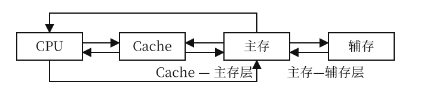
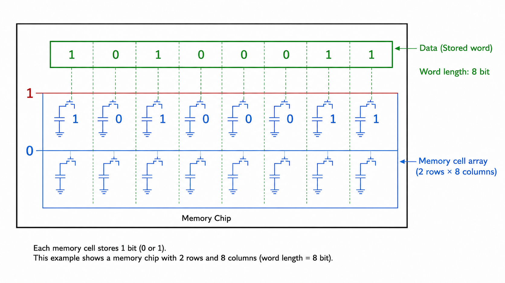
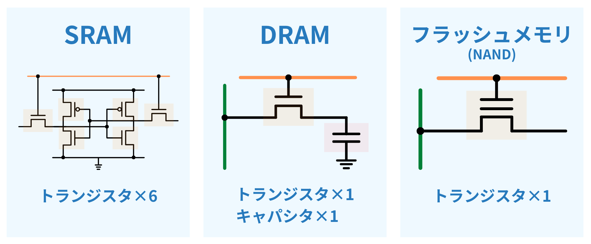
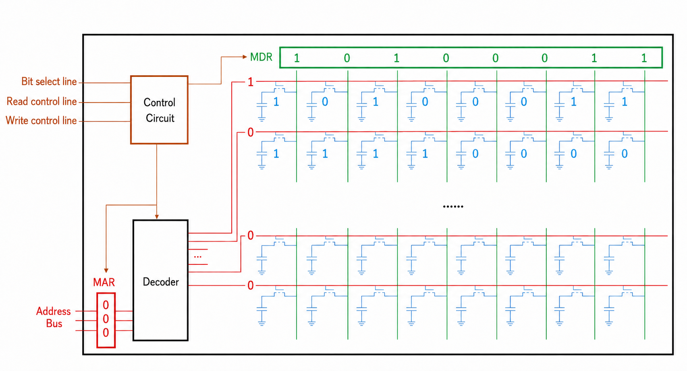
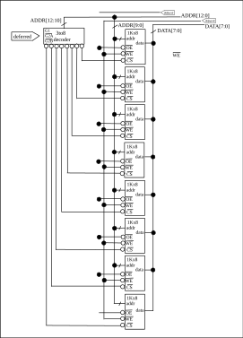
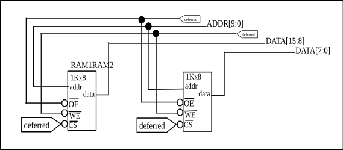
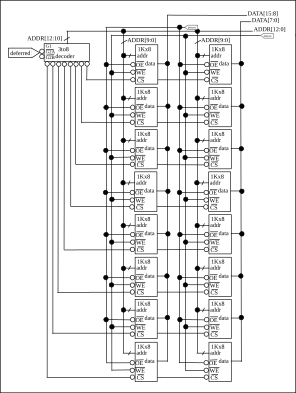
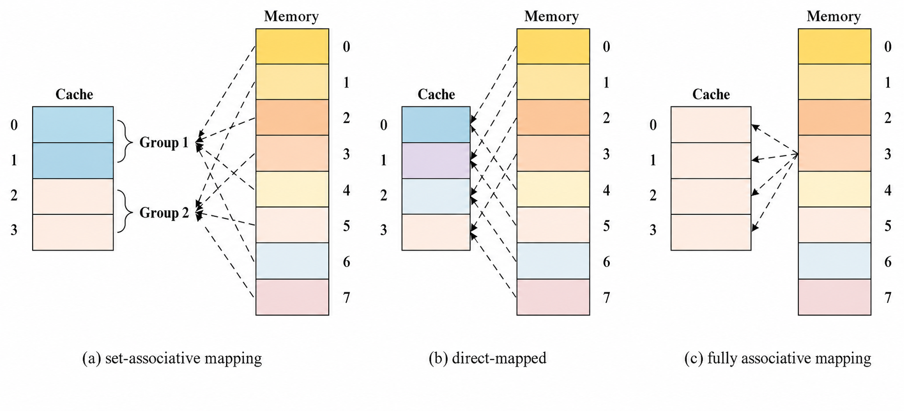

[TOC]

---

## 一、基本概念

### 1、分类

#### （1）按照层次

- 寄存器
- Cache（高速缓冲存储器）
- 主存（内存）
- 辅存（磁盘、固态硬盘等）
- 离线存储介质（光盘等）

从寄存器向下看，容量通常越来越大、速度越来越慢、每位成本越来越低。

- 主存和辅存共同构成虚拟存储系统，用来缓解主存容量不足的问题。
- Cache 和主存共同缓解 CPU 与主存之间的速度差异。

CPU 可以直接访问寄存器、Cache 和主存；辅存中的数据必须先调入主存，才能被 CPU 使用。

#### （2）按储存介质

- 半导体
- 磁表面存储器
- 光存储器

#### （3）按存取方式

- 随机存取存储器 RAM（Random Access Memory）：访问任意存储单元所需的时间与其物理位置无关。
- 顺序存取存储器 SAM（Sequential Access Memory）：访问时间取决于数据所处的物理位置，例如磁带。
- 直接存取存储器 DAM（Direct Access Memory）：先定位到某个区域，再在区域内顺序访问，例如磁盘。
- SAM 和 DAM 都属于串行访问存储器。
- CAM 按内容访问；RAM、SAM 和 DAM 按地址访问。

#### （4）按信息可更改性

- 读写存储器
- 只读存储器 ROM：例如，固件可以存放在 ROM 中。

#### （5）按信息可保存性

- 易失性存储器：主存、Cache，断电后数据丢失。
- 非易失性存储器：磁盘、固态硬盘、光盘，断电后仍能保存数据。
- 破坏性读出：DRAM
- 非破坏性读出：SRAM

### 2、性能指标

- 存储容量：$存储字数 \times 存储字长$
- 单位成本：每位价格 = 总成本 / 总容量
- 数据传输率：单位时间内传输的数据量。
- 存取时间：从发出访问请求到完成读出或写入所需的时间。
- 存储周期：连续两次独立访问之间所需的最短时间，通常包含存取时间和恢复时间。

---

## 二、主存储器基本组成

MOS 管可以看作一种受电压控制的开关，是半导体存储单元的基础器件。

### 1、存储芯片的基本原理

**控制电路**等待译码完毕才送出

$n$ 位地址可以选择 $2^n$ 个存储单元，因此：

$$
总容量 = 存储单元个数 \times 存储字长
$$

!!! tip "常见名词"

	$8\times8$ 位存储芯片：第一个 $8$ 表示存储单元个数，第二个 $8$ 表示**存储字长**，即 $2^3\times8$ 位。
	
	$8K\times8$ 位存储芯片共有 $2^{13}$ 个存储单元，每个单元存放 $8$ 位。

### 2、寻址

总容量：1KB

- 按字节寻址：$1K$ 个单元，每个单元 $1B$
- 按字寻址：$256$ 个单元，每个单元 $4B$
- 按半字寻址：$512$ 个单元，每个单元 $2B$
- 按双字寻址：$128$ 个单元，每个单元 $8B$

---

### 3、SRAM/DRAM

#### （1）栅极电容/双稳态触发器

DRAM 使用电容保存电荷。读取过程会破坏电容中原有的信息，因此读出后需要重写；单元结构简单、集成度高、成本低。

SRAM 使用双稳态触发器保存数据，读取不会破坏原有状态；速度快，但单元结构复杂、集成度较低、成本高。

| 类型特点                 | SRAM（静态 RAM）       | DRAM（动态 RAM）       |
| ------------------------ | ---------------------- | ---------------------- |
| 存储信息                 | 触发器                 | 电容                   |
| 破坏性读出               | 非                     | 是                     |
| 读出后需要重写？（再生） | 不用                   | 需要                   |
| 运行速度                 | 快                     | 慢                     |
| 集成度                   | 低                     | 高                     |
| 发热量                   | 大                     | 小                     |
| 存储成本                 | 高                     | 低                     |
| 易失/非易失性存储器？    | 易失（断电后信息消失） | 易失（断电后信息消失） |
| 需要“刷新”？             | 不需要                 | 需要                   |
| 送行列地址               | 同时送                 | 分两次送               |
| 常用作                   | **Cache**              | **主存**               |

#### （2）DRAM刷新

- 刷新周期：2ms
- 每次刷新以**行**为单位，刷新**一行**存储单元

为了减少译码和引脚数量，DRAM 通常把存储单元排列成二维矩阵，并把地址拆成行地址和列地址分两次传送。

如果总地址宽度为 $n$ 位，行地址和列地址各约占一半，因此芯片只需要约 $n/2$ 根复用地址线。

!!! question "什么时候刷新"

	假设存储矩阵为 $128\times128$，最大刷新间隔为 $2\text{ ms}$，读写周期为 $0.5\mu\text{s}$。
	
	$2\text{ ms}/0.5\mu\text{s}=4000$，即一个刷新周期内共有 $4000$ 个读写周期。
	
	- **分散刷新**：把刷新操作均匀插入正常读写周期，例如每次读写后刷新一行。
	
	- **集中刷新**：在最大刷新间隔内划出一段连续时间，集中刷新全部行。这段时间无法正常访问，称为“死时间”。
	
	- **异步刷新**：把各行刷新分散到整个刷新周期中。这里每隔 $2\text{ ms}/128\approx15.6\mu\text{s}$ 刷新一行，每次占用一个 $0.5\mu\text{s}$ 的周期。

因此，地址线复用减少了芯片引脚数量，刷新控制则保证电容中的数据不会因漏电而丢失。

---

### 4、ROM

- MROM 掩膜式只读存储器
- PROM 可编程只读存储器：写入一次后不可更改
- EPROM 可擦除可编程只读存储器
- UVREPROM 紫外线照射可以全部擦除
- EEPROM 电可擦除，可以擦除部分
- Flash 可以多次擦写。由于写入前通常需要先擦除，写入速度一般比读取慢。
- SSD 固态硬盘

---

## 三、存储器和CPU连接

### 1、字扩展

字扩展用于增加存储单元的数量，也就是扩大可寻址的字数。

- 译码片选法：把高位地址接入译码器，$n$ 根片选线最多选择 $2^n$ 组芯片。
- 线选法：每根片选线直接连接一组芯片，$n$ 根线最多选择 $n$ 组芯片。

### 2、位扩展

当数据总线宽度大于单个存储芯片的字长时，可以并联多片芯片进行位扩展。

字数和字长都不足时，可以同时进行字、位扩展。

MAR/MDR现在一般集成在CPU里

---

## 四、外存储器

### 1、磁盘存储器

-  磁头：有几个记录面就有几个磁头
- 柱面数：有多少条磁道就有几个柱面
- 扇区

#### （1）性能指标

1. 容量：**格式化容量**是按规定记录格式能够存储的有效信息量；**非格式化容量**还包含同步、校验等额外区域，因此更大。
2. 记录密度：
   - 道密度：半径方向上的磁道数
   - 位密度：单位长度上能记录的二进制代码位数，越靠近内侧位密度越大
   - 面密度：$道密度\times位密度$
3. 平均存储时间：$寻道时间+旋转延迟时间+传输时间$
4. 数据传输率：单位时间向主机传输的字节数。若磁盘转速为 $r$ 转/秒，每条磁道可存放 $N$ 字节，则数据传输率近似为 $D=rN$。

### 2、固态硬盘 SSD

固态硬盘 SSD 基于闪存技术 Flash Memory，属于电可擦除 ROM，即 EEPROM。SSD 内部通常由多个闪存芯片组成，每个闪存芯片又包含多个 block，每个 block 中包含多个 page。

SSD 中有一个重要结构叫做闪存翻译层（Flash Translation Layer，FTL），它负责把系统给出的逻辑块地址映射到实际的物理 page。

- SSD 以 page 为单位进行读 / 写，page 可以类比为机械硬盘中的扇区。
- SSD 以 block 为单位进行擦除。一个擦干净的 block 中，每个 page 都可以写一次，读取次数一般不受限制。
- SSD 支持随机访问。系统给定逻辑地址后，闪存翻译层可以通过电路快速定位到对应的物理地址。
- SSD 读取快、写入过程更复杂。Flash 不能直接覆盖已有 page；更新数据时，控制器通常要把仍然有效的数据迁移到其他 block，再擦除原 block。

与机械硬盘相比，SSD 的主要特点是随机访问速度快。SSD 通过电路控制访问位置，而机械硬盘需要移动磁臂、旋转磁盘，因此机械硬盘存在寻道时间和旋转延迟。

| SSD 的优点     | SSD 的缺点                                |
| -------------- | ----------------------------------------- |
| 安静无噪音     | 造价较贵                                  |
| 耐摔抗震       | 闪存 block 有擦除次数限制                 |
| 能耗低         | 如果某个 block 被反复擦除，可能会提前损坏 |
| 读写速度快     |                                           |
| 随机访问性能高 |                                           |

为了解决 block 磨损不均的问题，SSD 使用磨损均衡技术。它的核心思想是：把擦除操作尽量平均分布在各个 block 上，从而提高 SSD 的使用寿命。

磨损均衡可以分为两类：

- 动态磨损均衡：写入数据时，优先选择累计擦除次数较少的闪存块。
- 静态磨损均衡：控制器还会迁移长期不变的冷数据，让原本很少被擦写的 block 也参与轮换，从而使所有 block 的擦除次数更加接近。

---

## 五、Cache

### 1、Cache 基本原理

Cache 通常集成在 CPU 内部，使用 SRAM 实现。它的速度快，但容量小、单位成本高。

#### （1）局部性原理与 Cache

程序访问数据和指令时，通常具有**局部性原理**。也就是说，CPU 当前正在访问的地址附近的数据，或者最近刚访问过的数据，很可能在接下来还会继续被访问。

- > **空间局部性**：最近将要用到的信息，包括指令和数据，很可能与当前正在使用的信息在存储空间上是邻近的。 
  > 例如：数组元素、顺序执行的指令代码。

- > **时间局部性**：最近将要用到的信息，很可能就是现在正在使用的信息。 
  > 例如：循环结构中的指令代码。

基于局部性原理，系统可以把 CPU 当前访问地址“周围”的一部分数据提前放到 **Cache** 中。这样当 CPU 后续访问这些数据时，就可以直接从 Cache 中读取，而不必每次都访问速度较慢的主存，从而提高存储访问速度。

Cache 和主存以**块**为单位交换数据；一个主存块装入 Cache 后占据一个 Cache 行。

#### （2）※性能分析

- 命中率 $H$：CPU 所需信息已经位于 Cache 中的概率。
- 缺失率：$M=1-H$。
- 串行访问 Cache 和主存时：$t=Ht_c+(1-H)(t_c+t_m)$。
- 并行启动两者、未命中时以主存完成时间计时：$t=Ht_c+(1-H)t_m$。

!!! question "性能分析"

	假设 Cache 速度是主存的 $5$ 倍，Cache 命中率为 $95\%$。若 Cache 和主存同时开始访问，采用 Cache 后性能提高多少？
	
	使用 Cache：$T=0.95\times t+0.05\times5t=1.2t$
	
	不使用 Cache：$T=5t$
	
	性能提升：$\frac{5t}{1.2t}\approx4.17$ 倍。

### 2、Cache 和主存的映射

| 映射方式       | 主存块放入 Cache 的规则                                      | 主存地址结构           | 优点                                         | 缺点                                           |
| -------------- | ------------------------------------------------------------ | ---------------------- | -------------------------------------------- | ---------------------------------------------- |
| **全相联映射** | 主存块可以放到 Cache 的任意位置                              | 标记 + 块内地址        | Cache 存储空间利用充分，命中率高             | 查找“标记”最慢，可能需要和所有行的标记进行比较 |
| **直接映射**   | 主存块只能放到特定的 Cache 行，行号 = 主存块号 % Cache 总行数 | 标记 + 行号 + 块内地址 | 对任意一个地址，只需比较一个“标记”，速度最快 | Cache 存储空间利用不充分，命中率低             |
| **组相联映射** | 主存块可以放到特定分组中的任意位置，组号 = 主存块号 % Cache 总组数 | 标记 + 组号 + 块内地址 | 是全相联和直接映射的折中，综合效果较好       | 只能在对应组内查找，灵活性不如全相联           |

#### （1）全相联映射

主存块可以放在 Cache 的任意位置。

!!! question "随意放"

	假设某个计算机主存地址空间大小256MB，按字节编址，Cache有8个Cache行，行长64B
	
	$256MB=2^{28}B$ 总地址位数 $28$ 位，$8\times 64B=512B=2^8$
	
	$\frac{2^{28}}{2^8}=2^{22}$
	
	主存块号22位，块内地址6位
	
	|       主存块号 | 块内地址范围                              |
	| ---------: | ----------------------------------- |
	|          0 | `0...0000 000000 ~ 0...0000 111111` |
	|          1 | `0...0001 000000 ~ 0...0001 111111` |
	|          2 | `0...0010 000000 ~ 0...0010 111111` | 
	|        ... | ...                                 | 
	| $2^{22}-3$ | `1...1101 000000 ~ 1...1101 111111` |
	| $2^{22}-2$ | `1...1110 000000 ~ 1...1110 111111` |
	| $2^{22}-1$ | `1...1111 000000 ~ 1...1111 111111` |

!!! tip "如何访问？"

    ① 取主存地址的 **前 22 位**，与 Cache 中所有块的 **标记 Tag** 进行比较。
    
    ② 如果某一块的标记匹配，并且 **有效位 = 1**，则说明 **Cache 命中**。
    
    ③ 如果没有匹配的标记，或者虽然标记匹配但 **有效位 = 0**，则说明 **Cache 未命中**，需要正常访问主存。
    
    核心判断条件：$Cache 命中 = 标记匹配 且 有效位 = 1$

#### （2）直接映射

每个主存块只能放到 Cache 中的**特定**一行。

$Cache行号 = 主存块号 \bmod Cache总行数$

缺点：存在空闲Cache块不能使用，空间利用不充分

⭐ 当 Cache 行数为 $2^n$ 时，取模运算等价于保留主存块号最低的 $n$ 位。例如，$主存块号\bmod8$ 等价于保留最低三位。

!!! tip "如何访问？"

	① 根据主存块号的 **后 3 位** 确定 Cache 行。
	
	② 若主存块号的 **前 19 位** 与该 Cache 行中的 **标记 Tag** 匹配，且 **有效位 = 1**，则 Cache 命中
	
	③ 若未命中，或有效位 = 0，则正常访问主存。

#### （3）组相联映射

Cache 行被分组，每个主存块只能放入指定组中的任意一行。

$组号 = 主存块号 \bmod 分组数$

如果采用 2 路组相联映射，$8$ 个 Cache 行可以分成 $8/2=4$ 组。由于 $4=2^2$，组号由主存块号最低两位确定，然后再在对应组内比较标记。

---

### 3、Cache替换算法

| 映射方式       | 什么时候需要替换                | 说明                                                         |
| -------------- | ------------------------------- | ------------------------------------------------------------ |
| **全相联映射** | Cache 完全满了才需要替换        | 主存块可以放到 Cache 的任意位置，所以替换时也要在全局范围内选择被替换块 |
| **直接映射**   | 对应 Cache 行被占用时就必须替换 | 主存块只能放到固定 Cache 行，没有选择余地                    |
| **组相联映射** | 对应分组满了才需要替换          | 主存块只能放到指定组内，但组内有多个 Cache 行可选            |

假设有4个Cache块，依次访问 $\{1，2，3，4，1，2，5，1，2，3，4，5\}$

#### （1）随机算法（RAND）

| 访问主存块  | 1    | 2    | 3    | 4    | 1    | 2    | 5    | 1    | 2    | 3    | 4    | 5    |
| ----------- | ---- | ---- | ---- | ---- | ---- | ---- | ---- | ---- | ---- | ---- | ---- | ---- |
| Cache #0    | 1    | 1    | 1    | 1    | 1    | 1    | 1    | 1    | 1    | 1    | 4    | 4    |
| Cache #1    |      | 2    | 2    | 2    | 2    | 2    | 2    | 2    | 2    | 2    | 2    | 2    |
| Cache #2    |      |      | 3    | 3    | 3    | 3    | 5    | 5    | 5    | 5    | 5    | 5    |
| Cache #3    |      |      |      | 4    | 4    | 4    | 4    | 4    | 4    | 3    | 3    | 3    |
| Cache命中？ | 否   | 否   | 否   | 否   | 是   | 是   | 否   | 是   | 是   | 否   | 否   | 是   |
| Cache替换？ | 否   | 否   | 否   | 否   | 否   | 否   | 是   | 否   | 否   | 是   | 是   | 否   |

#### （2）先进先出（FIFO）

| 访问主存块  | 1    | 2    | 3    | 4    | 1    | 2    | 5    | 1    | 2    | 3    | 4    | 5    |
| ----------- | ---- | ---- | ---- | ---- | ---- | ---- | ---- | ---- | ---- | ---- | ---- | ---- |
| Cache #0    | 1    | 1    | 1    | 1    | 1    | 1    | 5    | 5    | 5    | 5    | 4    | 4    |
| Cache #1    |      | 2    | 2    | 2    | 2    | 2    | 2    | 1    | 1    | 1    | 1    | 5    |
| Cache #2    |      |      | 3    | 3    | 3    | 3    | 3    | 3    | 2    | 2    | 2    | 2    |
| Cache #3    |      |      |      | 4    | 4    | 4    | 4    | 4    | 4    | 3    | 3    | 3    |
| Cache命中？ | 否   | 否   | 否   | 否   | 是   | 是   | 否   | 否   | 否   | 否   | 否   | 否   |
| Cache替换？ | 否   | 否   | 否   | 否   | 否   | 否   | 是   | 是   | 是   | 是   | 是   | 是   |

#### （3）近期最少使用（LRU）

为每一个Cache块是设置一个**计数器**用于记录**多久没有被访问**，当Cache满之后替换计数器最大的

① **命中时**： 所命中的 Cache 行的计数器 **清零**，比<u>它低的计数器加 1，其余不变。</u>

② **未命中且还有空闲行时**：新装入的 Cache 行计数器置 0，其余非空闲行的计数器全加 1。

③ **未命中且无空闲行时**：计数值最大的 Cache 行被淘汰；新装入行的计数器置 0，其余行计数器全加 1。

这是考虑到了局部性原理，近期访问过的在不久也很有可能被访问，因此淘汰最久没被访问的是合理的。

#### （4）最近不经常使用（LFU）

为每一个Cache块设置一个计数器，用于记录被访问多少次，当Cache满之后替换计数器最小的

如果同样最小那么就可以按照**行号递增**或者**FIFO**的策略进行选择

曾经经常使用的主存块不一定在未来被使用，没有很好的遵循局部性原理，所以效果不如LRU

---

### 4、Cache写策略

#### （1）写命中

- 写回法：当CPU对Cache命中的时候，只修改Cache内容不立即写回主存，增加一个**脏位**，被替换的时候才写回。（存在数据不一致隐患）
- 全写法：当CPU对Cache命中的时候，同时修改主存和Cache内容，一般使用**写缓存**（SRAM实现的FIFO队列）

#### （2）写不命中

- 写分配法：当CPU对Cache不命中的时候，先从主存调入Cache，在Cache中修改后**再搭配写回法**
- 非写分配法：当CPU对Cache不命中的时候，只写入主存不调入Cache，**搭配全写法**

