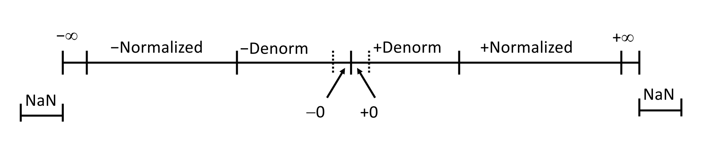

[TOC]

---

## 一、位运算

`|,&,~,^,<<,>>`

!!! danger
    vs 逻辑运算
    
     `&&,!,||`
    
     - `0` 为假，非`0` 为真
       - 只返回`0/1`

---

## 二、整数

$$
B2U(X) = \sum_{i=0}^{w-1} x_i \cdot 2^i
$$

$$
B2T(X) = -x_{w-1} \cdot 2^{w-1} + \sum_{i=0}^{w-2} x_i \cdot 2^i
$$

### 1、`unsigned`和`signed`

`unsigned`（无符号整数）：表示正数

`signed`（有符号整数）：第一位是负的，所以称为符号位，如果是`1`则是负数，需要使用**补码**

| **Unsigned Values** | **Two's Complement Values** |
| ------------------- | --------------------------- |
| UMin = 0            | TMin = $-2^{w-1}$           |
| UMax = $2^w - 1$    | TMax = $2^{w-1} - 1$        |
|                     | Minus 1 = 111...1           |

```c
// 死循环
for (unsigned i = n ; i >= 0 ; i--){
	
}
```

**表达式包含有符号和无符号整数**：当一个表达式中同时存在有符号（`signed`）和无符号（`unsigned`）整数时，会发生类型转换。

**`int` 被转换为无符号**：在这种情况下，默认的行为是将有符号整数类型（`int`）转换为无符号类型（`unsigned`）。

---

### 2、符号扩展

- **无符号（Unsigned）**: 在将短整型（short int）扩展为整型（int）时，添加零。
- **有符号（Signed）**: 在扩展时，进行**符号扩展**，保持符号位。

$$
\begin{aligned}(1011)=-5\\
(1111\text{ }1011)=-5\end{aligned}
$$

---

### 3、运算

**无符号**：截掉多出的位
$$
UAdd(u,v)=(u+v)\mod 2^w 
$$

$$
UMult(u,v)=u·v \mod 2^w
$$
**有符号**：

运算仍然截取多余位

$$
\begin{aligned}
-3 &= (1101) \\
5 &= (0101) \\
2 &= (0010)
\end{aligned}
$$
---

??? tip
    **无符号**：
    
    - `u << k` 与 $u \times 2^k$ 等同
      - `u >> k` 与 $u / 2^k$ 等同
    
     **有符号**：算术右移（补符号位）
    
    - $(1010)=-6$
      - $(1101)=-3$
      - $(1110)=-2$

!!! danger
    - 安全编码：`unsigned` 溢出之后又循环一圈
    ```c++
    unsigned i;
    // 0 - 1 → UMax
    for(i = cnt - 2; i < cnt; i--){
        a[i] += a[i+1];
    }
    // Better
    size_t i;
    ```

---

## 三、内存组织

| C Data Type | Typical 32-bit | Typical 64-bit | x86-64 |
| ----------- | -------------- | -------------- | ------ |
| char        | 1              | 1              | 1      |
| short       | 2              | 2              | 2      |
| int         | 4              | 4              | 4      |
| long        | 4              | 8              | 8      |
| float       | 4              | 4              | 4      |
| double      | 8              | 8              | 8      |
| long double | -              | -              | 10/16  |
| pointer     | 4              | 8              | 8      |

| 小端序                 | 大端序                 |
| ---------------------- | ---------------------- |
| 最低有效字节有最小地址 | 最低有效字节有最高地址 |

```c++
typedef unsigned char *pointer;

void show_bytes(pointer start, size_t length) {
    size_t i;
    for (i = 0; i < length; i++) {
        printf("%p\t0x%.2x\n", start + i, *(start + i));
    }
    printf("\n");
}

int main() {
    int a = 15123; // 15123 = 0x 3b 13
    show_bytes((pointer) &a, sizeof(a));
}
```

```
000000a463fff9bc        0x13
000000a463fff9bd        0x3b
000000a463fff9be        0x00
000000a463fff9bf        0x00
```

---


!!! warning
     取反加一变号
    
    $$
    \begin{aligned}
    (1011)_2 &= -5 \\
    (0101)_2 &= 5
    \end{aligned}
    $$
    
     → 不对称性：
    
    $$
    \begin{aligned}
    TMin = -2^{w-1} \\
    TMax=2^{w-1}-1
    \end{aligned}
    $$
    
     ∴ $-Tmin$ 仍然是最大负数
    
     ∴ $x\leq0 \not\Rightarrow -x\geq0$

---

## 四、浮点


!!! warning
    限制：
    
    - 只能表示形如$x/2^k$ 的数字，否则需要**循环小数**
     - 位数有限

---

### 1、浮点数表示

$$
(-1)^s·M·2^E
$$

- $S$ ：符号位，决定正负
- $M$ ：分数值$\in[1.0,2.0)$，编码**尾数位**

!!! info
    单精度（32位）：1+8+23

    双精度（64位）：1+11+52


**规格化值**：指数位不能是全 $0$ 全 $1$，化成 $1.xxxxxx$ 形式
$$
E=Exp-Bias
$$

- Exp：指数位当作无符号整数	
- 偏置量（Bias) ：$2^{k-1}-1$
  - 单精度：127
  - 双精度：1023

---

**非规格化值**：指数位全 $0$，化 $0.xxxxxx$ 形式
$$
E=1-Bias
$$

!!! info
    符号位为 $1$ 时，会出现 $-0$ 
    
    巧妙：规格化值的最小也是$1-Bias$，衔接规格化值和非规格化值

---

**特殊值**：指数位全 $1$

- 位数位全 $0$ ,表示无穷$\infty$
- 位数位不全 $0$，表示 $NaN$



---

### 2、舍入

- 银行家舍入法：**平衡**算法


!!! example
    $$
    \begin{aligned}
    7.8949999 =7.89\\
    7.8950001=7.90\\
    7.8950000=7.90\\
    7.8850000=7.88
    \end{aligned}
    $$
---

### 3、性质

- 加法、乘法均不满足结合律

```c
(3.14+1e10)-1e10 = 0   , 3.14+(1e10-1e10) = 3.14
(1e20*1e20)*1e-20= inf , 1e20*(1e20*1e-20)= 1e20
```

---

### 4、类型转换

`double/float → int`：截去小数部分

`int → double`：精确转换，只要`int`字长小于53

`int → float`：根据舍入模式舍入

!!! bug

    浮点数比较就是**单调**的，不像补码表示的整数会**溢出**然后**循环**一圈

