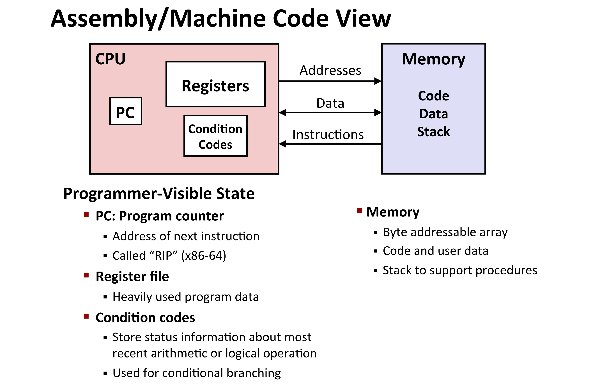
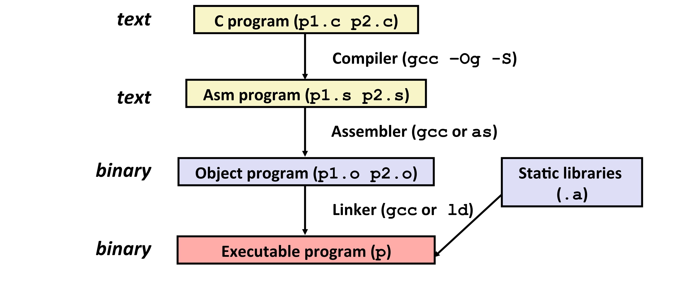
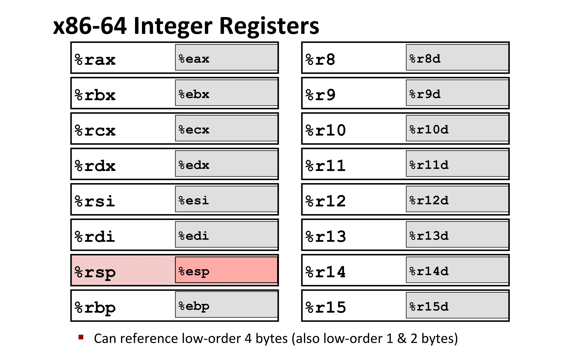

[TOC]

---

## 一、汇编 / 机器语言

### 1、基本概念

- 指令集架构（ISA）：Instruction Set Architecture
- 微结构：架构的具体实现



---

### 2、将`C`代码转换成汇编



```bash
gcc -Og -S sum.c
# -S:生成 sum.s 文件
# -Og: 优化
gcc -Og sum.c -o sum
# 生成可执行文件
```

??? info
    ※ 汇编中的数据类型

    - **整数**：
        - 可以是1、2、4或8字节
        - 用于存储数据值。
        - 也用于存储地址（无类型指针）
    
    - **浮点**：
        - 可以是4、8或10字节
  
    - **代码**：
        - 是一系列指令的字节序列

    - **没有聚合类型**：
        - 如数组或结构体
        - 内存中只有连续分配的字节

- 对比

```c
*dest = t;
```

```asm
movq %rax, (%rbx)
```

```objective-c
0x40059e: 48 89 03
```

---

!!! tip
    - 反汇编器：把机器码转换成汇编语言
    
    ```asm
    objdump -d .\sum.exe >sum.d
    ```
    
    - GDB
    
    
    ```asm
    gdb sum 
    disassemble sumstore
    ```
    

---

## 二、汇编基础

### 1、`×86-64` 寄存器



---

### 2、移动数据

```asm
movq Source,Dest
```

- **立即数**（Immediate）
    - 类似于 C 语言中的常量，但前面加上 `$` 符号，e.g.`$0x400`

- **寄存器**（Register）
    - 注：`%rsp`保留做特殊用处

- **内存**（Memory）
    - 由寄存器给出地址的连续 8 字节的内存，e.g.`(%rax)`


---

```asm
swap:
    movq    (%rdi), %rax	# t0 = *xp
    movq    (%rsi), %rdx	# t1 = *yp
    movq    %rdx, (%rdi)	# *xp = t1
    movq    %rax, (%rsi)	# *yp = t0
    ret
```

!!! note
    寄存器寄存地址，`(%rax)`相当于**解指针**操作

---

## 三、数学 / 逻辑运算

### 1、地址运算

| Expression        | Address Computation | Address   |
| ----------------- | ------------------- | --------- |
| `0x8(%rdx)`       | `0xf000 + 0x8`      | `0xf008`  |
| `(%rdx, %rcx)`    | `0xf000 + 0x100`    | `0xf100`  |
| `(%rdx, %rcx, 4)` | `0xf000 + 4*0x100`  | `0xf400`  |
| `0x80(, %rdx, 2)` | `2*0xf000 + 0x80`   | `0x1e080` |

---

### 2、指令

!!! example

    ```asm
    leaq Src,Dst
    ```
    
    类似`movq`，但是专门用于地址计算，不涉及数据移动，结果储存在寄存器中
    
    ```c++
    long m12(long x){
        return x * 12;
    }
    ```
    
    ```asm
    leaq (%rdi,%rdi,2), %rax  # %rdi + %rdi *2 -> %rax
    salq $2, %rax             # 左移两位 ×4
    ```

---

#### （1）双目运算

| 指令    | 计算                 |
| ------- | -------------------- |
| `addq`  | `Dest = Dest + Src`  |
| `subq`  | `Dest = Dest - Src`  |
| `imulq` | `Dest = Dest * Src`  |
| `salq`  | `Dest = Dest << Src` |
| `sarq`  | `Dest = Dest >> Src` |
| `shrq`  | `Dest = Dest >> Src` |
| `xorq`  | `Dest = Dest ^ Src`  |
| `andq`  | `Dest = Dest & Src`  |
| `orq`   | `Dest = Dest | Src`  |

#### （2）单目运算

| 指令   | 计算              |
| ------ | ----------------- |
| `incq` | `Dest = Dest + 1` |
| `decq` | `Dest = Dest - 1` |
| `negq` | `Dest = - Dest`   |
| `notq` | `Dest = ~Dest`    |

---
