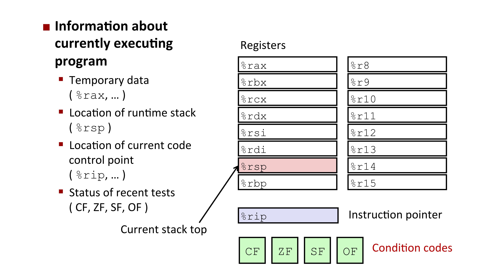
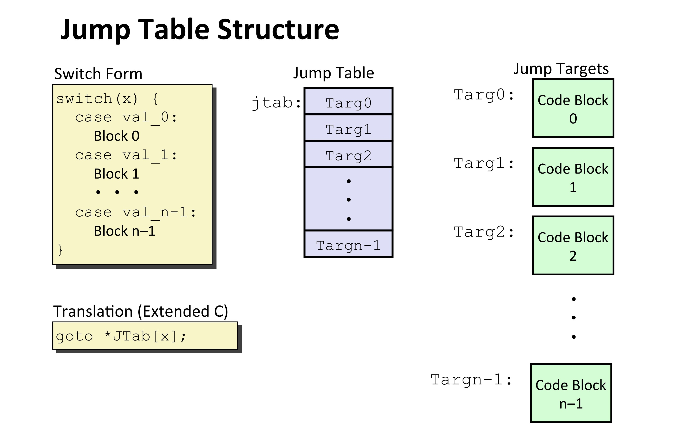

[TOC]

---

## 一、条件码



- `CF`：Carry Flag （无符号数）进位
- `ZF`：Zero Flag =0
- `SF`：Sign Flag（有符号数）<0
- `OF`：Overflow Flag（有符号数）补码溢出

---

### 1、具体条件

```asm
cmpq Src2, Src1
# 计算 Src1 - Src2，反过来的
```

```asm
testq Src2, Src1
# 计算 Src1 & Src2
```

---

### 2、`SetX`指令集

- **功能**：根据条件码的组合，将目标的最低字节设置为0或1，不会改变剩余的7个字节

| SetX 指令 | 条件码             | 描述                 |
| --------- | ------------------ | -------------------- |
| `sete`    | `ZF`               | 相等 / 零            |
| `setne`   | `~ZF`              | 不相等 / 非零        |
| `sets`    | `SF`               | 负数                 |
| `setns`   | `~SF`              | 非负数               |
| `setg`    | `~(SF ^ OF) & ~ZF` | 大于（有符号）       |
| `setge`   | `~(SF ^ OF)`       | 大于或等于（有符号） |
| `setl`    | `(SF ^ OF)`        | 小于（有符号）       |
| `setle`   | `(SF ^ OF)`        | 小于或等于（有符号） |
| `seta`    | `~CF & ~ZF`        | 大于（无符号）       |
| `setb`    | `CF`               | 小于（无符号）       |

???+ example

    ```c++
    int gt (long x, long y){
        return x > y;
    }
    ```
    
    ```asm
    cmpq  %rsi, %rdi   # Compare x:y
    setg  %al          # Set when >
    movzbl %al, %eax   # Zero rest of %rax
    ret
    ```
    
    | 寄存器 | 用途           |
    | ------ | -------------- |
    | `%rdi` | `x`            |
    | `%rsi` | `y`            |
    | `%rax` | `return value` |

---

## 二、条件分支

### 1、`jX`指令集

| jX 指令 | 条件码         | 描述                 |
|-------|----------------|----------------------|
| `jmp` | `1`            | 无条件跳转            |
| `je`  | `ZF`           | 相等/零               |
| `jne` | `~ZF`          | 不相等/非零           |
| `js`  | `SF`           | 负数                 |
| `jns` | `~SF`        | 非负数                |
| `jg`  | `~(SF^OF) & ~ZF` | 大于（有符号）        |
| `jge` | `~(SF^OF)`     | 大于或等于（有符号）  |
| `jl`  | `(SF^OF)`      | 小于（有符号）        |
| `jle` | `(SF^OF)` | ZF  |
| `ja`  | `~CF & ~ZF`  | 大于（无符号）        |
| `jb`  | `CF`           | 小于（无符号）        |

???+ example

    ```c++
    long absdiff(long x, long y){
        long result;
        if (x > y)
            result = x-y;
        else
            result = y-x;
        return result;
    }
    ```
    
    ```asm
    absdiff:
    .LFB2:
        .cfi_startproc
        cmpq	%rsi, %rdi	# x > y
        jle	.L4			    # Jump to .L4
        movq	%rdi, %rax
        subq	%rsi, %rax
        ret
    .L4:				    # x <= y
        movq	%rsi, %rax
        subq	%rdi, %rax
        ret
    ```
    
    | 寄存器 | 用途           |
    | ------ | -------------- |
    | `%rdi` | `x`            |
    | `%rsi` | `y`            |
    | `%rax` | `return value` |

    ```c++
    // 用 goto 语句模仿汇编逻辑
    // 区分出代码块，根据条件执行相应代码块
    long absdiff_j(long x, long y){
        long result;
        int ntest = x <= y;
        if (ntest) goto Else;
        result = x-y;
        goto Done;
     Else:
        result = y-x;
     Done:
        return result;
    }
    ```

---

### 2、条件移动指令

- 思想：计算出**所有分支**结果，之后选择哪一种来输出（**优化**算法）

```asm
absdiff:
	movq  %rdi, %rax     # x -> %rax
	subq  %rsi, %rax     # %rax（result = x - y）
	movq  %rsi, %rdx     # y -> %rdx
	subq  %rdi, %rdx     # %rdx（eval = y - x）
	cmpq  %rsi, %rdi     # cmp x, y
	cmovle %rdx, %rax    # 如果 x <= y（即 %rsi <= %rdi），则将 %rdx 的值移动到 %rax（result = eval）
	ret                 
```

!!! danger

    - 高计算成本：计算了所有分支

    - 有风险

        - 
          ```c++
          val = p ? *p : 0;	// 解空指针
          ```

    - 有副作用

        - 
            ```c++
            val = x > 0 ? x*=7 : x+=3;	// 两个值都被计算
            ```

---

## 三、循环

!!! tip
    
    原循环翻译成汇编与`goto`语句翻译成汇编，原语句不同，汇编一致，且逻辑为跳转`goto`的逻辑

### 1、`do-whlie` 循环

```c++
loop:
	Body
	if(Test)
		goto loop
```

???+ example

    ```c++
    long pcount_do(unsigned long x) {
        long result = 0;
        do {
        result += x & 0x1;
        x >>= 1;
        } while (x);
        return result;
    }
    long pcount_goto_dw(unsigned long x) {
        long result = 0;
        if (!x)
        goto done;
     loop:
        result += x & 0x1;
        x >>= 1;
        if (x)
        goto loop;
     done:
        return result;
    }
    ```
    
    ```asm
    pcount_do:
    .LFB12:
        .cfi_startproc
        movl	$0, %eax
    .L2:
        movq	%rdi, %rdx
        andl	$1, %edx
        addq	%rdx, %rax
        shrq	%rdi
        jne	.L2
        rep; ret
        .cfi_endproc
    .LFE12:
        .size	pcount_do, .-pcount_do
        .globl	pcount_goto
        .type	pcount_goto, @function
    pcount_goto:
    .LFB13:
        .cfi_startproc
        movl	$0, %eax
    .L5:
        movq	%rdi, %rdx
        andl	$1, %edx
        addq	%rdx, %rax
        shrq	%rdi
        jne	.L5
        rep; ret
    pcount_goto_dw:
    .LFB15:
        .cfi_startproc
        movl	$0, %eax
        testq	%rdi, %rdi
        je	.L11
    .L12:
    .L13:
        movq	%rdi, %rdx
        andl	$1, %edx
        addq	%rdx, %rax
        shrq	%rdi
        jne	.L13
    .L11:
        rep; ret
    ```

---

### 2、`while` 循环

```c++
	goto test;
loop:
	Body
	if(Test)
		goto loop
done:
```
???+ example

    ```c++
    long pcount_while(unsigned long x) {
        long result = 0;
        while (x) { 
            result += x & 0x1; 
            x >>= 1;
        }
        return result; 
    }
    long pcount_goto_jtm(unsigned long x) {
        long result = 0;
        goto test;
     loop:
        result += x & 0x1;
        x >>= 1;
     test:
        if (x)
        goto loop;
        return result;
    }
    ```
    
    ```asm
    pcount_while:
    .LFB14:
        .cfi_startproc
        movl	$0, %eax
        jmp	.L8
    .L9:
        movq	%rdi, %rdx
        andl	$1, %edx
        addq	%rdx, %rax
        shrq	%rdi
    .L8:
        testq	%rdi, %rdi
        jne	.L9
        rep; ret
    pcount_goto_jtm:
    .LFB16:
        .cfi_startproc
        movl	$0, %eax
        jmp	.L17
    .L18:
        movq	%rdi, %rdx
        andl	$1, %edx
        addq	%rdx, %rax
        shrq	%rdi
    .L17:
        testq	%rdi, %rdi
        jne	.L18
        rep; ret
    ```

---

### 3、`for` 循环

```c++
for (Init; Test; Update)
	Body
```

???+ example
    ```c++
    long pcount_for(unsigned long x) {
        size_t i;
        long result = 0;
        for (i = 0; i < WSIZE; i++) {
            unsigned bit = (x >> i) & 0x1;
            result += bit;
        }
        return result;
    }
    long pcount_for_goto_dw(unsigned long x) {
        size_t i;
        long result = 0;
        i = 0;
        if (!(i < WSIZE))
            goto done;
        loop:
        {
            unsigned bit = (x >> i) & 0x1;
            result += bit;
        }
        i++;
        if (i < WSIZE)
            goto loop;
        done:
        return result;
    }
    ```
    
    ```asm
    pcount_for:
    .LFB17:
        .cfi_startproc
        movl	$0, %eax
        movl	$0, %ecx
        jmp	.L20
    .L21:
        movq	%rdi, %rdx
        shrq	%cl, %rdx
        andl	$1, %edx
        addq	%rdx, %rax
        addq	$1, %rcx
    .L20:
        cmpq	$63, %rcx
        jbe	.L21
        rep; ret
    pcount_for_goto_dw:
    .LFB18:
        .cfi_startproc
        movl	$0, %eax
        movl	$0, %ecx
    .L23:
        movq	%rdi, %rdx
        shrq	%cl, %rdx
        andl	$1, %edx
        addq	%rdx, %rax
        addq	$1, %rcx
        cmpq	$63, %rcx
        jbe	.L23
        rep; ret
    .L24:
        .cfi_endproc
    .LFE18:
        .size	pcount_for_goto_dw, .-pcount_for_goto_dw
        .globl	pcount_for_goto_jtm
        .type	pcount_for_goto_jtm, @function
    pcount_for_goto_jtm:
    .LFB19:
        .cfi_startproc
        movl	$0, %eax
        movl	$0, %ecx
        jmp	.L27
    .L28:
        movq	%rdi, %rdx
        shrq	%cl, %rdx
        andl	$1, %edx
        addq	%rdx, %rax
        addq	$1, %rcx
    .L27:
        cmpq	$63, %rcx
        jbe	.L28
        rep; ret
    ```

---

## 四、`Switch`语句



### 1、跳转表

- 降低复杂度，$O(1)$，优于一连串`if-else`

???+ example
    
    | 寄存器 | 用途           |
    | ------ | -------------- |
    | `%rdi` | `x`            |
    | `%rsi` | `y`            |
    | `%rdx` | `z`            |
    | `%rax` | `return value` |
    
    ```c++
    long switch_eg(long x, long y, long z) {
        long w = 1;
        switch(x) {
            case 1:
                w = y*z;
                break;
            case 2:
                w = y/z;
                /* Fall through */
            case 3:
                w += z;
                break;
            case 5:
            case 6:
                w -= z;
                break;
            default:
                w = 2;
        }
        return w;
    }
    ```
    
    ```asm
    switch_eg:
    .LFB34:
        .cfi_startproc
        movq	%rdx, %rcx
        cmpq	$6, %rdi
        ja	.L8		# ja 用于 unsigned 比较，但如果出现 signed ,被当成很大的正数也会跳转（ signed 应该要用 jg 比较，这里属于trick）
        jmp	*.L4(,%rdi,8) # goto *JTab[x] ，跳转到由 %rdi 索引的跳转表地址（乘以8是因为指针大小）
        .section	.rodata
        .align 8
    .L4:
        .quad	.L8 # x = 0 default
        .quad	.L3 # x = 1
        .quad	.L5	# x = 2
        .quad	.L9 # x = 3
        .quad	.L8 # x = 4 default
        .quad	.L7 # x = 5
        .quad	.L7	# x = 6
        .text
    .L3:
        movq	%rsi, %rax	# y
        imulq	%rdx, %rax	# y * z
        ret
    .L5:	# Case 2
        movq	%rsi, %rax
        cqto
        idivq	%rcx
        jmp	.L6	# goto merge
    .L9:
        movl	$1, %eax	# w = 1
    .L6:	# merge
        addq	%rcx, %rax	# w += z
        ret
    .L7:
        movl	$1, %eax
        subq	%rdx, %rax
        ret
    .L8:
        movl	$2, %eax
        ret
    ```

---

