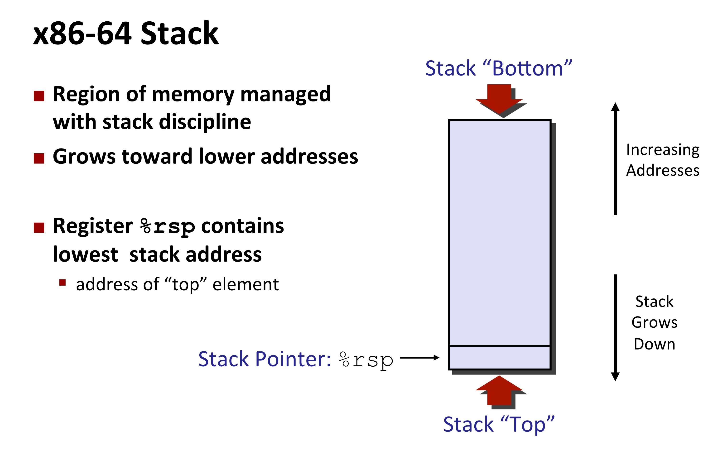
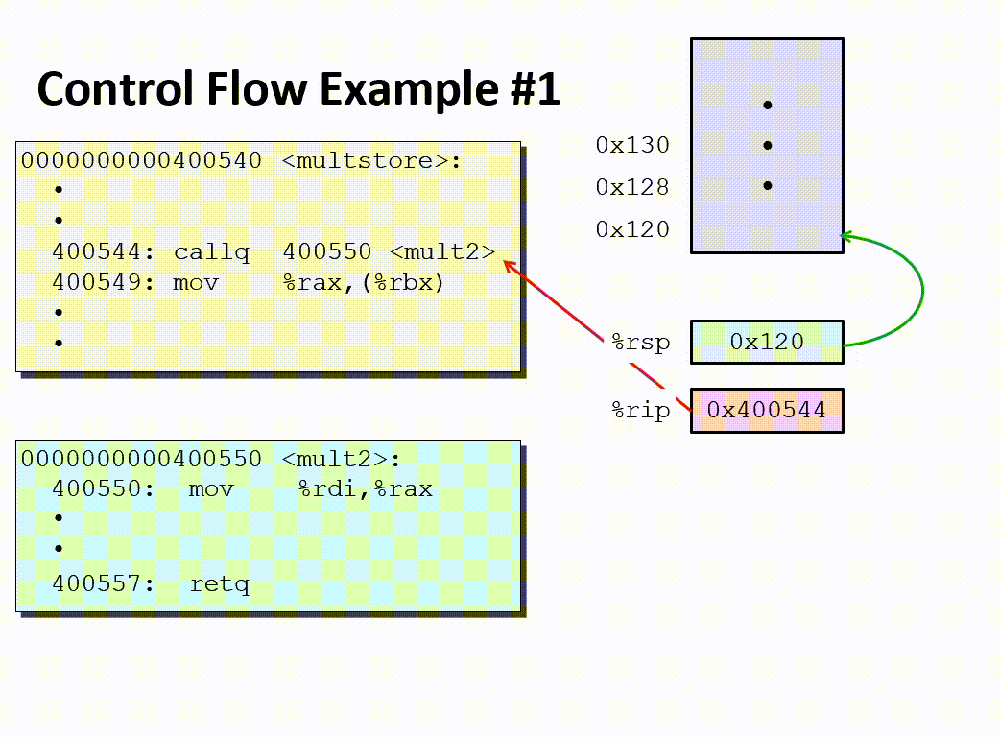
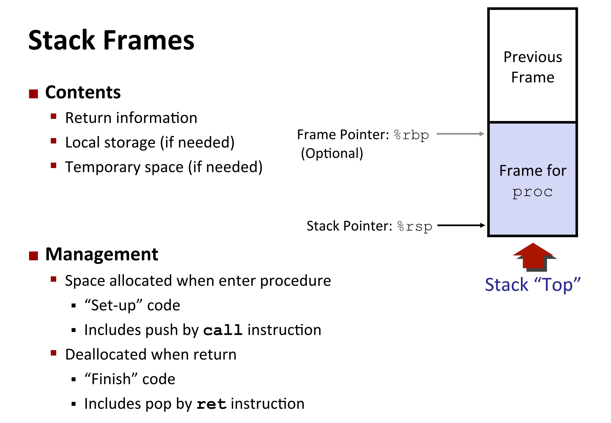

[TOC]


## 一、栈结构



栈指针拥有**很大**的初始地址，分配更多空间，栈指针**减小**

---

### 1、`pushq` / `popq`

- `pushq Src` 每次对`%rsp`减小 $8$

- `popq Dst` 每次对`%rsp`增加 $8$，目标必须是寄存器

---

## 二、调用约定

### 1、控制传递

`callq`：减小栈指针 $8$（压入栈）；将调用之后的指令地址写入**栈顶**

`ret`：`callq`的逆过程

1. **`%rip`（Instruction Pointer）**
   `%rip` 是指令指针寄存器，用于存储下一条将要执行的指令的地址。在函数调用中，`call` 指令会将当前的 `%rip` 值（即下一条指令的地址）压入栈中，然后跳转到目标函数的入口地址。当函数执行完毕后，`ret` 指令会从栈中弹出这个地址，并将其加载到 `%rip` 中，从而返回到调用函数的下一条指令继续执行。
2. **`%rsp`（Stack Pointer）**
   `%rsp` 是栈指针寄存器，指向当前栈顶的位置。



---

### 2、数据传递

通过寄存器来访问传递参数（寄存器只能存放**六个**参数，如果一个函数罕见的超过六个参数，多余的参数需要在栈，即内存中进行传递），寄存器访问速度较内存相比快得多。寄存器**顺序**是固定的。

在x86-64架构中，函数**调用约定**定义了如何使用寄存器来传递参数和返回值。

| 寄存器 | 用途       |
| ------ | ---------- |
| `%rdi` | 第一个参数 |
| `%rsi` | 第二个参数 |
| `%rdx` | 第三个参数 |
| `%rcx` | 第四个参数 |
| `%r8`  | 第五个参数 |
| `%r9`  | 第六个参数 |
| `%rax` | 返回值     |

---

### 3、管理本地数据

栈帧：栈上用于特定`call`的每块内存

栈的原则仍然是被调用的需要比调用的函数先返回



???+ example
      ```c
      long incr(long *p, long val) {
          long x = *p;
          long y = x + val;
          *p = y;
          return x;
      }
      long call_incr() {
          long v1 = 15213;
          long v2 = incr(&v1, 3000);
          return v1+v2;
      }
      ```
      
      ```asm
      incr:
      movq	(%rdi), %rax
      addq	%rax, %rsi
      movq	%rsi, (%rdi)
      ret
      call_incr:
      subq	$16, %rsp	# 分配16字节
      movq	$15213, 8(%rsp)	# 栈指针减小8
      movl	$3000, %esi	# 使用 movl 至 %esi，因为32位已经够了
      leaq	8(%rsp), %rdi
      call	incr
      addq	8(%rsp), %rax
      addq	$16, %rsp	#栈指针指回返回地址
      ret
      ```
      
      | 寄存器 | 地址             |
      | ------ | ---------------- |
      | `%rdi` | `p`              |
      | `%rsi` | `val,y`          |
      | `%rax` | `x,return value` |

---

#### ※ 寄存器保存约定

- **调用者保存寄存器**（Caller-saved registers）是指那些在函数调用过程中由调用者负责保存和恢复的寄存器。这种机制确保了在函数调用结束后，调用者的环境（包括寄存器的值）能够恢复到调用之前的状态，从而不会影响到调用者后续的执行。

- **被调用者保存寄存器**（Callee-saved registers）是指在函数调用过程中，由被调用的函数负责保存和恢复的寄存器。这些寄存器的值在函数调用之前可能对调用者来说是重要的，因此被调用者需要确保在函数执行过程中不会无意中修改这些寄存器的值，或者如果修改了，需要在函数结束前将它们恢复到原始状态。

---

## 三、递归调用

```c
long pcount_r(unsigned long x) {
    if (x == 0)
	return 0;
    else
	return
	    (x & 1) + pcount_r(x >> 1);
}
```

```asm
pcount_r:
movl	$0, %eax
testq	%rdi, %rdi
je	.L6
pushq	%rbx
movq	%rdi, %rbx
andl	$1, %ebx
shrq	%rdi
call	pcount_r
addq	%rbx, %rax
popq	%rbx
.L6:
rep; ret
```

