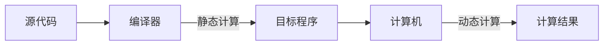
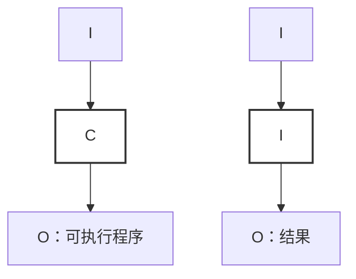
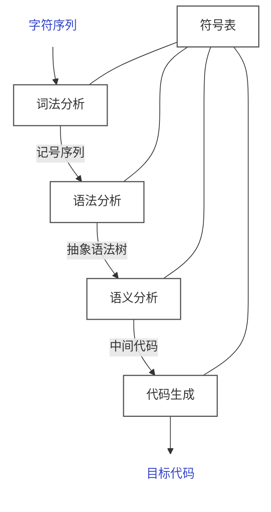

[TOC]

---

## 一、基础

- <u>编译器</u>是一个**程序**，把**源代码**变成**目标代码**
    - 源代码是指比如C++，Java
    - 目标代码是指比如×86，ARM，MIPS



- <u>解释器</u>也是一种程序，但是输出和编译器不一样



## 二、结构

编译器是由多个阶段构成的**流水线**结构



<p align="center">没有优化的编译器</p>



<p align="center">更加复杂的编译器</p>

```mermaid
flowchart TB
    S["源代码"] --> A["词法分析"]
    A -->|记号| B["语法分析"]
    B -->|动作| C["语法树构造"]
    C -->|抽象语法树| D["语义分析"]

    D -->|中间树| E["翻译"]
    E -->|中间树| F["正规化"]
    F -->|中间树| G["指令选择"]
    G -->|抽象汇编| H["控制流分析"]

    H -->|控制流图| I["数据流分析"]
    I -->|寄存器分配| J["代码生成"]
    J -->|汇编代码| K["汇编器"]
    K -->|可重定位目标代码| L["连接器"]
    L --> T["可执行代码"]

    style S fill:none,stroke:none
    style T fill:none,stroke:none

    style A fill:#fff,stroke:#222,stroke-width:2px
    style B fill:#fff,stroke:#222,stroke-width:2px
    style C fill:#fff,stroke:#222,stroke-width:2px
    style D fill:#fff,stroke:#222,stroke-width:2px
    style E fill:#fff,stroke:#222,stroke-width:2px
    style F fill:#fff,stroke:#222,stroke-width:2px
    style G fill:#fff,stroke:#222,stroke-width:2px
    style H fill:#fff,stroke:#222,stroke-width:2px
    style I fill:#fff,stroke:#222,stroke-width:2px
    style J fill:#fff,stroke:#222,stroke-width:2px
    style K fill:#fff,stroke:#222,stroke-width:2px
    style L fill:#fff,stroke:#222,stroke-width:2px
```

!!! example "把表达式 `1+2+3` 编译成栈式计算机指令"

    首先，编译器前端对源程序进行词法、语法和语义分析，构造抽象语法树。由于加法通常按左结合处理，因此表达式会被解析为：
    
    ```text
    (1 + 2) + 3
    ```
    
    对应的抽象语法树为：
    
    ```text
            +
           / \
          +   3
         / \
        1   2
    ```
    
    随后，代码生成器按抽象语法树的**后序遍历**顺序生成栈式指令
    
    ```text
    push 1
    push 2
    add
    push 3
    add
    ```
    
    执行过程是：先将 `1` 和 `2` 压栈，执行 `add` 得到 `3`；再将常量 `3` 压栈，再次执行 `add`，最终栈顶结果为 `6`

## 三、简单实例

### 1、源语言

加法表达式语言 `Sum`

- 两种语法形式
    - 整形数字 $n$
    - 加法 $e_1+e_2$

### 2、栈式计算机 `Stack`

- 一个操作数栈
- 两条指令
    - 压栈指令：`push n`
    - 加法指令： `add`
