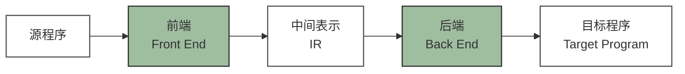
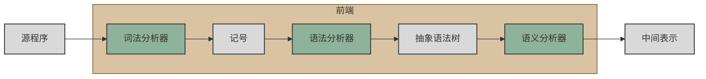
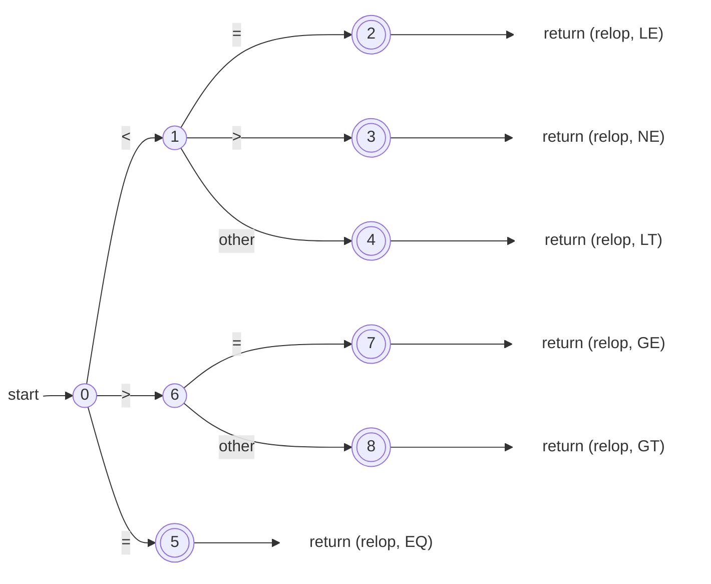
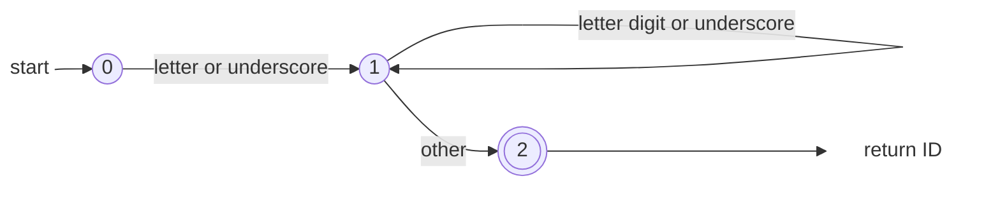
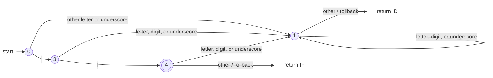
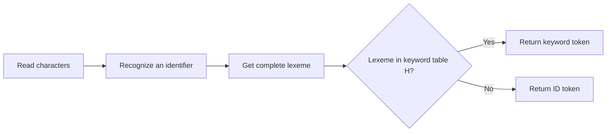

[TOC]

---

## 一、词法分析器的任务



靠近源程序的一侧叫**前端**；靠近目标机器的一侧叫**后端**；中间表示 IR 是两者的接口



<p align="center">前端</p>

!!! example "**词法分析器把源代码字符流转换成记号序列**"

    ```c
    if (x > 5)
        y = "hello";
    else
        z = 1;
    ```
    
    词法分析器并不直接判断整个 `if-else` 结构是否合法，而是从左到右扫描字符，把连续字符归类成一个个 Token
    
    ```text
    if          → IF
    (           → LPAREN
    x           → IDENT(x)
    >           → GT
    5           → INT(5)
    )           → RPAREN
    
    y           → IDENT(y)
    =           → ASSIGN
    "hello"     → STRING("hello")
    ;           → SEMICOLON
    
    else        → ELSE
    
    z           → IDENT(z)
    =           → ASSIGN
    1           → INT(1)
    ;           → SEMICOLON
    
    文件结束    → EOF
    ```
    
    其中各记号的含义是：
    
    | 记号              | 含义               |
    | ----------------- | ------------------ |
    | `IF`              | 关键字 `if`        |
    | `ELSE`            | 关键字 `else`      |
    | `LPAREN`          | 左括号 `(`         |
    | `RPAREN`          | 右括号 `)`         |
    | `IDENT(x)`        | 标识符，名字是 `x` |
    | `GT`              | 大于号 `>`         |
    | `INT(5)`          | 整数常量 `5`       |
    | `ASSIGN`          | 赋值符号 `=`       |
    | `STRING("hello")` | 字符串常量         |
    | `SEMICOLON`       | 分号 `;`           |
    | `EOF`             | 输入结束标志       |
    
    一个 Token 通常包含两部分（记号类型 + 属性值），例如`IDENT(x)`
    
    因此，词法分析器不仅告诉后续阶段“这是一个整数”，还会保存其具体值
    
    源代码中的空格、缩进和换行通常只用于分隔记号，因此词法分析器识别后会将其忽略
    
    例如 `x>5` 和 `x   >   5` 都会得到同样的 Token `IDENT(x) GT INT(5)`
    
    不过在 Python 这种缩进具有语法意义的语言中，缩进可能被转换成特殊 Token，如 `INDENT` 和 `DEDENT`

总之，词法分析器的任务就是把**字符流**（ASCII，Unicode等）转换成**记号流**（编译器内部定义的数据结构）

---

## 二、手工构造法

词法分析器通常有两种实现方案：

- 手工编码实现
    - 实现相对复杂
    - 容易出现编码错误
    - 对实现者要求较高
    - 可以精确控制性能、错误处理和特殊规则
    - 比如 GCC / LLVM / Clang
- 使用词法分析器生成器
    - 可以快速构建原型
    - 代码量较少
    - 生成过程自动化
    - 对底层细节的控制较弱
    - 比如 Lex / Flex

!!! note
    “手工实现”是指程序员直接编写词法分析器的源代码，而不是人工逐个分析源程序。最终程序仍然由计算机执行

### 1、转移图

这个例子说的是**词法分析器如何识别关系运算符**



从状态 `0` 开始，根据读到的字符转移：

- 读到 `<`：进入状态 `1`
    - 后面是 `=`，识别为 `<=`，返回 `LE`
    - 后面是 `>`，识别为 `<>`，返回 `NE`
    - 后面是其他字符，识别为 `<`，返回 `LT`，并把多读的字符退回
- 读到 `=`：直接识别为 `=`，返回 `EQ`
- 读到 `>`：进入状态 `6`
    - 后面是 `=`，识别为 `>=`，返回 `GE`
    - 后面是其他字符，识别为 `>`，返回 `GT`，并把多读的字符退回

图中的双圆表示**接受状态**，也就是已经成功识别出一个完整的关系运算符。`*` 表示需要回退一个字符。

```
function nextToken():
    c ← getChar()

    switch c:
        case '<':
            c ← getChar()
            if c = '=':
                return Token(RELOP, LE)
            else if c = '>':
                return Token(RELOP, NE)
            else:
                rollback()
                return Token(RELOP, LT)

        case '=':
            return Token(RELOP, EQ)

        case '>':
            c ← getChar()
            if c = '=':
                return Token(RELOP, GE)
            else:
                rollback()
                return Token(RELOP, GT)

        case EOF:
            return Token(EOF)

        default:
            return Token(ERROR, c)
```

---

这个例子讲的是**词法分析器怎么识别一个标识符ID**



- 首字符只能是字母或下划线：`[a-zA-Z_]`
- 后续字符可以是字母、数字或下划线：`[a-zA-Z0-9_]`
- `other` 表示读到不属于标识符的字符
- `rollback` 表示回退这个多读的字符

```
function nextToken():
    c ← getChar()

    if c ∈ [a-zA-Z_]:
        lexeme ← c
        c ← getChar()

        while c ∈ [a-zA-Z0-9_]:
            lexeme ← lexeme + c
            c ← getChar()

        rollback()
        return Token(ID, lexeme)

    return Token(ERROR, c)
```

### 2、标识符和关键字

从词法分析角度，关键字是标识符的子集，那么如何识别关键字？

#### （1）关键字直接识别法



#### （2）关键字表法

先把所有单词都按标识符识别，再去关键字哈希表中查询

例如扫描到 `if` 先得到 `ID("if")` ，然后查关键字表 `"if" ∈ H` ，因此最终返回 `IF` ，而扫描到 `if1` 查表后发现它不是关键字，因此返回 `ID("if1")`



如果哈希表设计合理，查询平均可以在 $O(1)$ 时间完成。相比为每个关键字单独设计状态转移路径，这种方法更简单，也更容易增加或删除关键字

---

## 三、正则表达式

### 1、语法糖

语法糖就是用更短的写法表示原本较长的正则表达式**

| 写法      | 含义               | 等价形式                             |
| --------- | ------------------ | ------------------------------------ |
| `[c1-cn]` | 字符范围           | `c1|c2|...|cn`                       |
| `e+`      | 一个或多个 `e`     | `ee*`                                |
| `e?`      | 零个或一个 `e`     | `ε|e`                                |
| `"a*"`    | 匹配字面量 `a*`    | `*` 不再表示闭包                     |
| `e{i,j}`  | `e` 重复 i 到 j 次 | 如 `a{2,4}` 匹配 `aa`、`aaa`、`aaaa` |
| `.`       | 任意字符           | 通常不包括换行符 `\n`                |

例如 

- `[0-9]+` 表示一个或多个数字，即无符号整数
- `[a-zA-Z_][a-zA-Z0-9_]*` 表示标识符。

要注意 `a*` 表示零个或多个 `a`；`"a*"` 表示字面字符串 `a*`。

---

“声明式的规范”就是只描述

- 什么样的字符串是标识符
- 什么样的字符串是整数
- 哪些是关键字
- 哪些字符需要忽略
- ……

比如

```
[a-zA-Z_][a-zA-Z0-9_]*  → ID
[0-9]+                   → INT
"if"                     → IF
[ \t\n]+                 → 忽略空白
```

然后把这些规则交给 Lex / Flex 一类生成器

---

给定字符集 $\Sigma={c_1,c_2,\ldots,c_n}$

正则表达式可以按下面规则构造：

1. 空串 $\varepsilon$ 是正则表达式
2. 任意字符 $c\in\Sigma$ 是**正则表达式**
3. 若 $M,N$ 是正则表达式，则：

|      | 写法      | 含义           | 例子                              |
| ---- | --------- | -------------- | --------------------------------- |
| 选择 | $M\mid N$ | 二选一         | `a`                               |
| 连接 | $MN$      | 前后连接       | `ab` 表示先 `a` 后 `b`            |
| 闭包 | $M^*$     | 重复零次或多次 | `a*` 表示空串、`a`、`aa`、`aaa`…… |

!!! question "写一个正则表达式"

    对于 $\Sigma={a,b}$ ，可以怎么构造正则表达式
    
    - 空串： $\varepsilon$
    - 字符集里的单个字符： $a,\quad b$
    - 对已有正则表达式做“选择”：  $\varepsilon\mid \varepsilon,\quad\varepsilon\mid a,\quad a\mid b , ……$
    - 做“连接”： $\varepsilon a,\quad \varepsilon b,\quad ab,\quad aa$
    - 还可以继续连接更复杂的表达式： $a(\varepsilon\mid a)$
    - 做“闭包”： $\varepsilon^*,\quad a^*,\quad \bigl(a(\varepsilon\mid a)\bigr)^*$
    - ……

!!! question "标识符"

    C 语言标识符规则是
    
    - 第一个字符：字母或下划线
    - 后续字符：字母、数字或下划线，可出现零次或多次
    
    因此正则表达式写成
    
    $$
    (a|b|\cdots|z|A|B|\cdots|Z|_)(a|b|\cdots|z|A|B|\cdots|Z|0|1|\cdots|9|_)^*
    $$
    
    ```text
    [a-zA-Z_]       第一个字符
    [a-zA-Z0-9_]*   后续零个或多个字符
    ```
    
    - 第一个字符有 $26+26+1=53$ 种选择
    - 后续每个字符有 $26+26+10+1=63$ 种选择

!!! question "无符号整数"

    无符号整数就是**由一个或多个数字组成**
    
    因此正则表达式写成
    
    $$
    (0|1|2|\cdots|9)(0|1|2|\cdots|9)^*
    $$
    
    也可以写成更常见的 `[0-9]+` ，其中第一个 `[0-9]`：至少要有一个数字，后面的 `*`：后续数字可以出现零次或多次
    
    如果规定**不能有前导零**，则写成：`0|[1-9][0-9]*` ，这样 `0` 合法，`123` 合法，但 `0012` 不合法