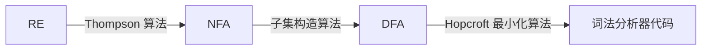
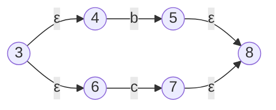
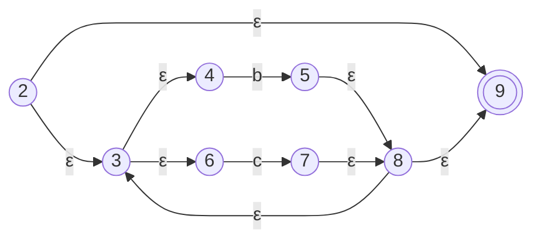
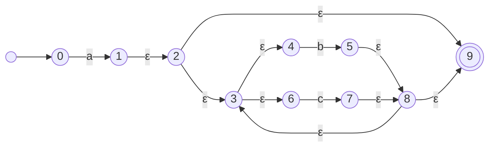

[TOC]

---



??? question "为什么先把正则表达式变成 NFA？"

    因为正则表达式里经常有“多种可能”。$a(b|c)^*$
    
    这里：
    
    - $(b|c)$：可以选 $b$，也可以选 $c$
    - $^*$：可以重复任意多次
    
    NFA 很适合表示这种“不确定选择”。一个状态读入字符后，可以同时有多个可能的下一状态。

??? question "为什么还要把 NFA 变成 DFA？"

    NFA 运行时可能需要同时记录多个状态. $\delta(q_0,a)={q_0,q_1}$ ，表示读入 $a$ 后，可能在 $q_0$，也可能在 $q_1$。
    
    DFA 会把这一组状态 $\{q_0,q_1\}$ 整体当成一个新的状态，例如记为 $B$ ，于是 $B=\{q_0,q_1\}$
    
    这样 DFA 每次读入一个字符后，只需要进入一个确定的状态，执行起来更方便。这种方法叫作**子集构造法**。

------

## 一、$Thompson$ 算法

- 把正则表达式拆成最小结构，每种结构都有固定的 NFA 模板拼起来

| 正则结构           | 构造方法                                          |
| ------------------ | ------------------------------------------------- |
| 单个字符 $a$       | 建立两个状态，中间用 $a$ 连接                     |
| 空串 $\varepsilon$ | 建立两个状态，中间用 $\varepsilon$ 连接           |
| 连接 $e_1e_2$      | 用 $\varepsilon$ 连接 $e_1$ 的终点和 $e_2$ 的起点 |
| 选择 $e_1\mid e_2$ | 增加新起点和新终点，用 $\varepsilon$ 分叉和汇合   |
| 闭包 $e^*$         | 增加跳过、进入、重复和退出的 $\varepsilon$ 转移   |

!!! note "基本形式"

    $e \to \varepsilon$
    
    ```mermaid
    flowchart LR
        s0(( )) --> q0(( ))
        q0 -->|ε| q1((( )))
    ```
    
    ------
    
    $e \to c$
    
    ```mermaid
    flowchart LR
        s0(( )) --> q0(( ))
        q0 -->|c| q1((( )))
    ```
    
    ------
    
    $e \to e_1 \mid e_2$
    
    ```mermaid
    flowchart LR
        s0(( )) --> q0(( ))
        q0 -->|ε| q1(( ))
        q0 -->|ε| q3(( ))
    
        q1 -->|e1| q2(( ))
        q3 -->|e2| q4(( ))
    
        q2 -->|ε| q5((( )))
        q4 -->|ε| q5
    ```
    
    ------
    
    $e \to e_1e_2$
    
    ```mermaid
    flowchart LR
        s0(( )) --> q0(( ))
        q0 -->|e1| q1(( ))
        q1 -->|ε| q2(( ))
        q2 -->|e2| q3((( )))
    ```
    
    ------
    
    $e \to e_1^*$
    
    ```mermaid
    flowchart LR
        s0(( )) --> q0(( ))
    
        q0 -->|ε| q1(( ))
        q0 -->|ε| q3((( )))
    
        q1 -->|e1| q2(( ))
    
        q2 -->|ε| q1
        q2 -->|ε| q3
    ```

$$
a(b∣c)^∗
$$

> 先出现一个 $a$，后面再出现零个或多个 $b$ 或 $c$

所以它能接受 $a,\ ab,\ ac,\ abb,\ abc,\ acbc$ ；不能接受 $\varepsilon,\ b,\ ba,\ aa$ 。

最外层其实是两个部分的连接 $\underbrace{a}_{第一部分}\quad\underbrace{(b|c)^*}_{第二部分}$
第二部分还可以继续拆 $(b|c)^*$ ；先构造 $b|c$ ；然后再对整体加星号 $(b|c)^*$









---

## 二、子集构造算法

