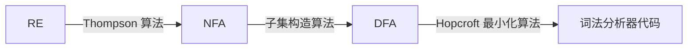
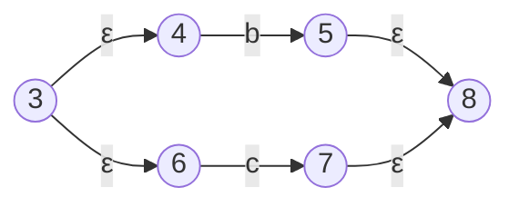
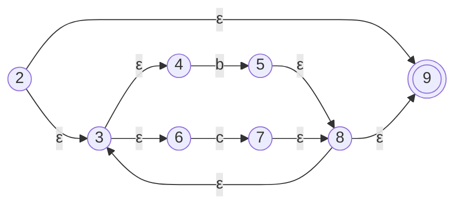
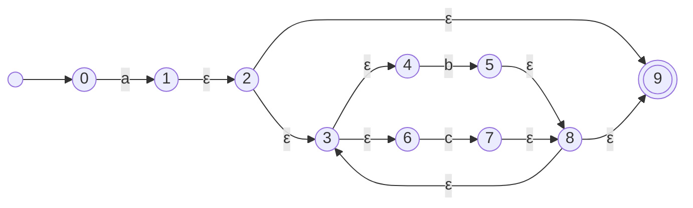
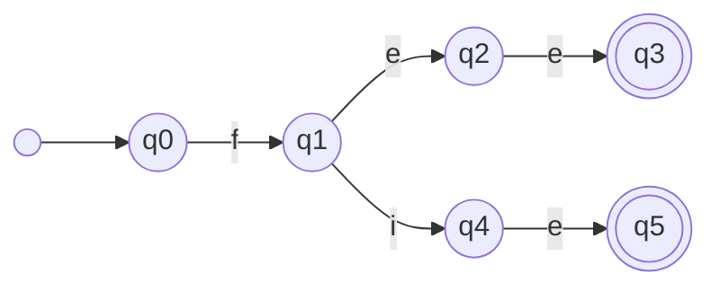
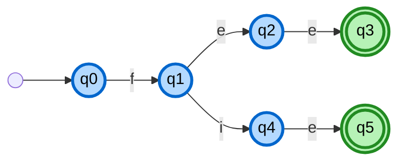
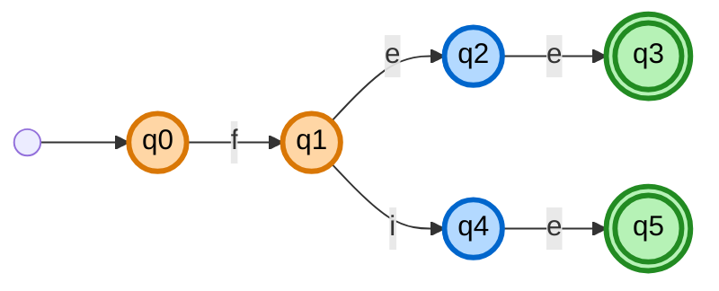
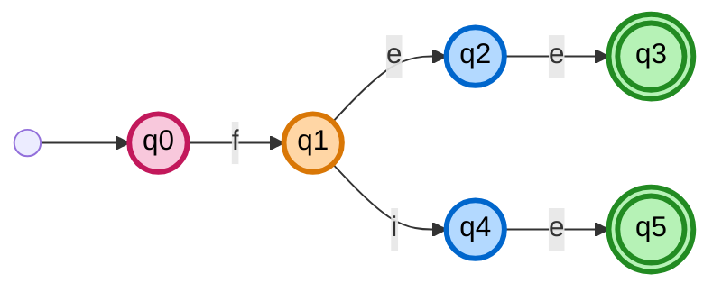
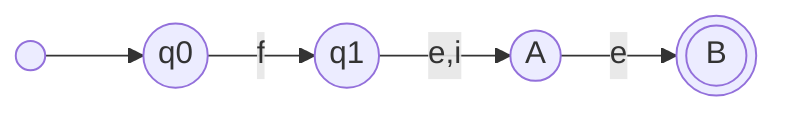

- [TOC]


---


```mermaid
flowchart LR
    RE[RE] -->|Thompson 算法| NFA[NFA]
    NFA -->|子集构造算法| DFA[DFA]
    DFA -->|Hopcroft 最小化算法| CODE[词法分析器代码]
```

??? question "为什么先把正则表达式变成 NFA？"

    因为正则表达式里经常有“多种可能”。$a(b|c)^*$
    
    - $(b|c)$：可以选 $b$，也可以选 $c$
    - $^*$：可以重复任意多次
    
    NFA 很适合表示这种“不确定选择”。一个状态读入字符后，可以同时有多个可能的下一状态。

??? question "为什么还要把 NFA 变成 DFA？"

    NFA 运行时可能需要同时记录多个状态. $\delta(q_0,a)={q_0,q_1}$ ，表示读入 $a$ 后，可能在 $q_0$，也可能在 $q_1$。
    
    DFA 会把这一组状态 $\{q_0,q_1\}$ 整体当成一个新的状态，例如记为 $B$ ，于是 $B=\{q_0,q_1\}$
    
    这样 DFA 每次读入一个字符后，只需要进入一个确定的状态，执行起来更方便。这种方法叫作**子集构造法**。

------

## 一、$Thompson$ 算法

- 把正则表达式拆成最小结构，每种结构都有固定的 NFA 模板拼起来

| 正则结构           | 构造方法                                          |
| ------------------ | ------------------------------------------------- |
| 单个字符 $a$       | 建立两个状态，中间用 $a$ 连接                     |
| 空串 $\varepsilon$ | 建立两个状态，中间用 $\varepsilon$ 连接           |
| 连接 $e_1e_2$      | 用 $\varepsilon$ 连接 $e_1$ 的终点和 $e_2$ 的起点 |
| 选择 $e_1\mid e_2$ | 增加新起点和新终点，用 $\varepsilon$ 分叉和汇合   |
| 闭包 $e^*$         | 增加跳过、进入、重复和退出的 $\varepsilon$ 转移   |

!!! note "基本形式"

    $e \to \varepsilon$
    
    ```mermaid
    flowchart LR
        s0(( )) --> q0(( ))
        q0 -->|ε| q1((( )))
    ```
    
    ------
    
    $e \to c$
    
    ```mermaid
    flowchart LR
        s0(( )) --> q0(( ))
        q0 -->|c| q1((( )))
    ```
    
    ------
    
    $e \to e_1 \mid e_2$
    
    ```mermaid
    flowchart LR
        s0(( )) --> q0(( ))
        q0 -->|ε| q1(( ))
        q0 -->|ε| q3(( ))
    
        q1 -->|e1| q2(( ))
        q3 -->|e2| q4(( ))
    
        q2 -->|ε| q5((( )))
        q4 -->|ε| q5
    ```
    
    ------
    
    $e \to e_1e_2$
    
    ```mermaid
    flowchart LR
        s0(( )) --> q0(( ))
        q0 -->|e1| q1(( ))
        q1 -->|ε| q2(( ))
        q2 -->|e2| q3((( )))
    ```
    
    ------
    
    $e \to e_1^*$
    
    ```mermaid
    flowchart LR
        s0(( )) --> q0(( ))
    
        q0 -->|ε| q1(( ))
        q0 -->|ε| q3((( )))
    
        q1 -->|e1| q2(( ))
    
        q2 -->|ε| q1
        q2 -->|ε| q3
    ```

$$
a(b∣c)^∗
$$

> 先出现一个 $a$，后面再出现零个或多个 $b$ 或 $c$

所以它能接受 $a,\ ab,\ ac,\ abb,\ abc,\ acbc$ ；不能接受 $\varepsilon,\ b,\ ba,\ aa$ 。

最外层其实是两个部分的连接 $\underbrace{a}_{第一部分}\quad\underbrace{(b|c)^*}_{第二部分}$
第二部分还可以继续拆 $(b|c)^*$ ；先构造 $b|c$ ；然后再对整体加星号 $(b|c)^*$



```mermaid
flowchart LR
    q3((3)) -->|ε| q4((4))
    q3 -->|ε| q6((6))

    q4 -->|b| q5((5))
    q6 -->|c| q7((7))

    q5 -->|ε| q8((8))
    q7 -->|ε| q8
```



```mermaid
flowchart LR
    q2((2)) -->|ε| q3((3))
    q2 -->|ε| q9(((9)))

    q3 -->|ε| q4((4))
    q3 -->|ε| q6((6))

    q4 -->|b| q5((5))
    q6 -->|c| q7((7))

    q5 -->|ε| q8((8))
    q7 -->|ε| q8

    q8 -->|ε| q3
    q8 -->|ε| q9
```


```mermaid
flowchart LR
    start(( )) --> q0((0))
    q0 -->|a| q1((1))
    q1 -->|ε| q2((2))

    q2 -->|ε| q3((3))
    q2 -->|ε| q9(((9)))

    q3 -->|ε| q4((4))
    q3 -->|ε| q6((6))

    q4 -->|b| q5((5))
    q6 -->|c| q7((7))

    q5 -->|ε| q8((8))
    q7 -->|ε| q8

    q8 -->|ε| q3
    q8 -->|ε| q9
```

---

## 二、子集构造算法

NFA 读入一个字符后，可能同时处于多个状态，$\delta(q_0,a)=\{q_0,q_1\}$

DFA 不允许同时处于多个状态，所以把这一组 NFA 状态  $\{q_0,q_1\}$ 整体当作 DFA 的一个状态。因此，$\boxed{\text{DFA 的一个状态 = NFA 的一个状态子集}}$ ，这就是“子集构造”的来源

### 1、步骤

假设 NFA 的初始状态是 $q_0$

DFA 的初始状态不是简单的 $\{q_0\}$，而是 $D_0=\varepsilon\text{-closure}({q_0})$ ，也就是先把所有能通过空转移到达的状态都找出来。

对于当前 DFA 状态 $T$，读入字符 $a$ 后的新状态为
$$
U=
\varepsilon\text{-closure}
\left(
\operatorname{move}(T,a)
\right)
$$
如果 $U$ 之前没有出现过，就把它加入 DFA 状态集合。不断重复，直到没有新的状态集合产生。

如果一个 DFA 状态集合中包含任意 NFA 接受状态，那么它就是 DFA 的接受状态。
$$
T\cap F_{\text{NFA}}\neq\varnothing
$$
则 $T$ 是 DFA 接受状态。

---

!!! example

    ```mermaid
    flowchart LR
        start(( )) --> n0((n0))
        n0 -->|a| n1((n1))
        n1 -->|ε| n2((n2))
    
        n2 -->|ε| n3((n3))
        n2 -->|ε| n9(((n9)))
    
        n3 -->|ε| n4((n4))
        n3 -->|ε| n6((n6))
    
        n4 -->|b| n5((n5))
        n6 -->|c| n7((n7))
    
        n5 -->|ε| n8((n8))
        n7 -->|ε| n8
    
        n8 -->|ε| n3
        n8 -->|ε| n9
    ```
    
    原 NFA 的初始状态为 $n_0$，终结状态为 $n_9$，输入字母表为 $\Sigma=\{a,b,c\}$。子集构造时，每次计算都遵循
    
    $$
    \delta_{\mathrm{DFA}}(D_i,x)
    =
    \varepsilon\text{-closure}
    \left(
    \operatorname{move}(D_i,x)
    \right)
    $$
    
    即：**先读入字符 $x$，再把所有能够通过 $\varepsilon$ 边到达的状态加入集合。**
    
    ---
    
    **构造初始状态 $D_0$**
    
    初始 DFA 状态为 $D_0=\varepsilon\text{-closure}(\{n_0\})=\{n_0\}$，因为 $n_0$ 没有 $\varepsilon$ 转移。
    
    ```mermaid
    flowchart LR
        n0((n0)) -->|a| n1((n1))
        n1 -->|ε| n2((n2))
        n2 -->|ε| n3((n3))
        n2 -->|ε| n9(((n9)))
        n3 -->|ε| n4((n4))
        n3 -->|ε| n6((n6))
        n4 -->|b| n5((n5))
        n6 -->|c| n7((n7))
        n5 -->|ε| n8((n8))
        n7 -->|ε| n8
        n8 -->|ε| n3
        n8 -->|ε| n9
    
        classDef cur fill:#ffb3b3,stroke:#cc0000,stroke-width:3px,color:#000;
        classDef acc fill:#ffe680,stroke:#cc9900,stroke-width:3px,color:#000;
    
        class n0 cur;
        class n9 acc;
    ```
    
    从 $n_0$ 读入 $a$，有 $n_0\xrightarrow{a}n_1$，所以先得到 $\operatorname{move}(D_0,a)=\{n_1\}$。
    
    ```mermaid
    flowchart LR
        n0((n0)) -->|a| n1((n1))
        n1 -->|ε| n2((n2))
        n2 -->|ε| n3((n3))
        n2 -->|ε| n9(((n9)))
        n3 -->|ε| n4((n4))
        n3 -->|ε| n6((n6))
        n4 -->|b| n5((n5))
        n6 -->|c| n7((n7))
        n5 -->|ε| n8((n8))
        n7 -->|ε| n8
        n8 -->|ε| n3
        n8 -->|ε| n9
    
        classDef cur fill:#ffb3b3,stroke:#cc0000,stroke-width:3px,color:#000;
        classDef nxt fill:#b3d9ff,stroke:#0066cc,stroke-width:3px,color:#000;
        classDef acc fill:#ffe680,stroke:#cc9900,stroke-width:3px,color:#000;
    
        class n0 cur;
        class n1 nxt;
        class n9 acc;
    ```
    
    但是还不能停止，还要从 $n_1$ 继续沿所有 $\varepsilon$ 边移动，因此
    
    $$
    D_1=\varepsilon\text{-closure}(\{n_1\})
    =\{n_1,n_2,n_3,n_4,n_6,n_9\}
    $$
    
    所以 DFA 中有 $D_0\xrightarrow{a}D_1$。
    
    ```mermaid
    flowchart LR
        n0((n0)) -->|a| n1((n1))
        n1 -->|ε| n2((n2))
        n2 -->|ε| n3((n3))
        n2 -->|ε| n9(((n9)))
        n3 -->|ε| n4((n4))
        n3 -->|ε| n6((n6))
        n4 -->|b| n5((n5))
        n6 -->|c| n7((n7))
        n5 -->|ε| n8((n8))
        n7 -->|ε| n8
        n8 -->|ε| n3
        n8 -->|ε| n9
    
        classDef clo fill:#b6f2b6,stroke:#228b22,stroke-width:3px,color:#000;
        classDef acc fill:#ffe680,stroke:#cc9900,stroke-width:3px,color:#000;
    
        class n1,n2,n3,n4,n6 clo;
        class n9 acc;
    ```
    
    从 $D_0$ 读入 $b$ 或 $c$ 时都没有对应转移，因此 $D_0\xrightarrow{b}\varnothing$，$D_0\xrightarrow{c}\varnothing$。
    
    ---
    
    **处理状态 $D_1$**
    
    当前状态集合为 $D_1=\{n_1,n_2,n_3,n_4,n_6,n_9\}$。
    
    先看字符 $b$。检查 $D_1$ 中所有状态，只有 $n_4$ 有 $b$ 转移，即 $n_4\xrightarrow{b}n_5$，所以 $\operatorname{move}(D_1,b)=\{n_5\}$。
    
    ```mermaid
    flowchart LR
        n0((n0)) -->|a| n1((n1))
        n1 -->|ε| n2((n2))
        n2 -->|ε| n3((n3))
        n2 -->|ε| n9(((n9)))
        n3 -->|ε| n4((n4))
        n3 -->|ε| n6((n6))
        n4 -->|b| n5((n5))
        n6 -->|c| n7((n7))
        n5 -->|ε| n8((n8))
        n7 -->|ε| n8
        n8 -->|ε| n3
        n8 -->|ε| n9
    
        classDef cur fill:#ffb3b3,stroke:#cc0000,stroke-width:3px,color:#000;
        classDef nxt fill:#b3d9ff,stroke:#0066cc,stroke-width:3px,color:#000;
        classDef acc fill:#ffe680,stroke:#cc9900,stroke-width:3px,color:#000;
    
        class n1,n2,n3,n4,n6 cur;
        class n5 nxt;
        class n9 acc;
    ```
    
    然后从 $n_5$ 继续沿 $\varepsilon$ 边移动，得到
    
    $$
    D_2=\varepsilon\text{-closure}(\{n_5\})
    =\{n_3,n_4,n_5,n_6,n_8,n_9\}
    $$
    
    所以 DFA 中有 $D_1\xrightarrow{b}D_2$。
    
    ```mermaid
    flowchart LR
        n0((n0)) -->|a| n1((n1))
        n1 -->|ε| n2((n2))
        n2 -->|ε| n3((n3))
        n2 -->|ε| n9(((n9)))
        n3 -->|ε| n4((n4))
        n3 -->|ε| n6((n6))
        n4 -->|b| n5((n5))
        n6 -->|c| n7((n7))
        n5 -->|ε| n8((n8))
        n7 -->|ε| n8
        n8 -->|ε| n3
        n8 -->|ε| n9
    
        classDef clo fill:#b6f2b6,stroke:#228b22,stroke-width:3px,color:#000;
        classDef acc fill:#ffe680,stroke:#cc9900,stroke-width:3px,color:#000;
    
        class n3,n4,n5,n6,n8 clo;
        class n9 acc;
    ```
    
    再看字符 $c$。检查 $D_1$ 中所有状态，只有 $n_6$ 有 $c$ 转移，即 $n_6\xrightarrow{c}n_7$，所以 $\operatorname{move}(D_1,c)=\{n_7\}$。
    
    ```mermaid
    flowchart LR
        n0((n0)) -->|a| n1((n1))
        n1 -->|ε| n2((n2))
        n2 -->|ε| n3((n3))
        n2 -->|ε| n9(((n9)))
        n3 -->|ε| n4((n4))
        n3 -->|ε| n6((n6))
        n4 -->|b| n5((n5))
        n6 -->|c| n7((n7))
        n5 -->|ε| n8((n8))
        n7 -->|ε| n8
        n8 -->|ε| n3
        n8 -->|ε| n9
    
        classDef cur fill:#ffb3b3,stroke:#cc0000,stroke-width:3px,color:#000;
        classDef nxt fill:#b3d9ff,stroke:#0066cc,stroke-width:3px,color:#000;
        classDef acc fill:#ffe680,stroke:#cc9900,stroke-width:3px,color:#000;
    
        class n1,n2,n3,n4,n6 cur;
        class n7 nxt;
        class n9 acc;
    ```
    
    然后从 $n_7$ 继续沿 $\varepsilon$ 边移动，得到
    
    $$
    D_3=\varepsilon\text{-closure}(\{n_7\})
    =\{n_3,n_4,n_6,n_7,n_8,n_9\}
    $$
    
    所以 DFA 中有 $D_1\xrightarrow{c}D_3$。
    
    ```mermaid
    flowchart LR
        n0((n0)) -->|a| n1((n1))
        n1 -->|ε| n2((n2))
        n2 -->|ε| n3((n3))
        n2 -->|ε| n9(((n9)))
        n3 -->|ε| n4((n4))
        n3 -->|ε| n6((n6))
        n4 -->|b| n5((n5))
        n6 -->|c| n7((n7))
        n5 -->|ε| n8((n8))
        n7 -->|ε| n8
        n8 -->|ε| n3
        n8 -->|ε| n9
    
        classDef clo fill:#b6f2b6,stroke:#228b22,stroke-width:3px,color:#000;
        classDef acc fill:#ffe680,stroke:#cc9900,stroke-width:3px,color:#000;
    
        class n3,n4,n6,n7,n8 clo;
        class n9 acc;
    ```
    
    $D_1$ 中没有状态具有字符 $a$ 的转移，因此 $D_1\xrightarrow{a}\varnothing$。
    
    ---
    
    **处理状态 $D_2$**
    
    当前状态集合为 $D_2=\{n_3,n_4,n_5,n_6,n_8,n_9\}$。
    
    从 $D_2$ 读入 $b$ 时，只有 $n_4\xrightarrow{b}n_5$，所以 $\operatorname{move}(D_2,b)=\{n_5\}$。求 $\{n_5\}$ 的 $\varepsilon$-闭包后仍然得到 $D_2$，因此 $D_2\xrightarrow{b}D_2$。
    
    从 $D_2$ 读入 $c$ 时，只有 $n_6\xrightarrow{c}n_7$，所以 $\operatorname{move}(D_2,c)=\{n_7\}$。求 $\{n_7\}$ 的 $\varepsilon$-闭包后得到 $D_3$，因此 $D_2\xrightarrow{c}D_3$。
    
    $D_2$ 中没有状态具有字符 $a$ 的转移，因此 $D_2\xrightarrow{a}\varnothing$。
    
    ---
    
    **处理状态 $D_3$**
    
    当前状态集合为 $D_3=\{n_3,n_4,n_6,n_7,n_8,n_9\}$。
    
    从 $D_3$ 读入 $b$ 时，只有 $n_4\xrightarrow{b}n_5$，求 $\{n_5\}$ 的 $\varepsilon$-闭包后得到 $D_2$，因此 $D_3\xrightarrow{b}D_2$。
    
    从 $D_3$ 读入 $c$ 时，只有 $n_6\xrightarrow{c}n_7$，求 $\{n_7\}$ 的 $\varepsilon$-闭包后仍然得到 $D_3$，因此 $D_3\xrightarrow{c}D_3$。
    
    $D_3$ 中没有状态具有字符 $a$ 的转移，因此 $D_3\xrightarrow{a}\varnothing$。
    
    ---
    
    **处理死状态**
    
    将空集记作死状态 $D_{\varnothing}=\varnothing$。死状态中没有任何 NFA 状态，因此读入任意字符后仍然是死状态，即 $D_{\varnothing}\xrightarrow{a}D_{\varnothing}$，$D_{\varnothing}\xrightarrow{b}D_{\varnothing}$，$D_{\varnothing}\xrightarrow{c}D_{\varnothing}$。
    
    最终得到：
    
    | DFA 状态 | 对应的 NFA 状态集合 | 输入 $a$ | 输入 $b$ | 输入 $c$ | 是否为终结状态 |
    |---|---|---|---|---|---|
    | $D_0$ | $\{n_0\}$ | $D_1$ | $D_{\varnothing}$ | $D_{\varnothing}$ | 否 |
    | $D_1$ | $\{n_1,n_2,n_3,n_4,n_6,n_9\}$ | $D_{\varnothing}$ | $D_2$ | $D_3$ | 是 |
    | $D_2$ | $\{n_3,n_4,n_5,n_6,n_8,n_9\}$ | $D_{\varnothing}$ | $D_2$ | $D_3$ | 是 |
    | $D_3$ | $\{n_3,n_4,n_6,n_7,n_8,n_9\}$ | $D_{\varnothing}$ | $D_2$ | $D_3$ | 是 |
    | $D_{\varnothing}$ | $\varnothing$ | $D_{\varnothing}$ | $D_{\varnothing}$ | $D_{\varnothing}$ | 否 |
    
    最终 DFA：
    
    ```mermaid
    flowchart LR
        start(( )) --> D0((D0))
    
        D0 -->|a| D1(((D1)))
        D0 -->|b,c| X((∅))
    
        D1 -->|a| X
        D1 -->|b| D2(((D2)))
        D1 -->|c| D3(((D3)))
    
        D2 -->|a| X
        D2 -->|b| D2
        D2 -->|c| D3
    
        D3 -->|a| X
        D3 -->|b| D2
        D3 -->|c| D3
    
        X -->|a,b,c| X
    ```
    
    整个过程可以概括成：
    
    $$
    D_i
    \xrightarrow{\text{读字符}}
    \operatorname{move}(D_i,x)
    \xrightarrow{\varepsilon\text{-closure}}
    D_j
    $$
    
    不断处理新产生的 $D_j$，直到不再出现新的状态集合。

## 三、$Hopcroft$ 算法

子集构造出来的 DFA 可能有很多**实际上一样**的状态，把这些等价状态合并掉。


```mermaid
flowchart LR
    start(( )) --> q0((q0))
    q0 -->|f| q1((q1))
    q1 -->|e| q2((q2))
    q1 -->|i| q4((q4))
    q2 -->|e| q3(((q3)))
    q4 -->|e| q5(((q5)))
```

其中终结状态为 $F=\{q_3,q_5\}$，其余状态为非终结状态。Hopcroft 的核心思想是：**先把状态粗略分组，然后不断检查同一组中的状态是否真的具有相同行为；如果不同就继续拆分。**

第一次分组：**终结状态和非终结**状态
$$
P_0=
\{
\{q_3,q_5\},
\{q_0,q_1,q_2,q_4\}
\}
$$

因为终结状态和非终结状态肯定不能等价，蓝色是一组非终结状态，绿色是一组终结状态。


```mermaid
flowchart LR
    start(( )) --> q0((q0))
    q0 -->|f| q1((q1))
    q1 -->|e| q2((q2))
    q1 -->|i| q4((q4))
    q2 -->|e| q3(((q3)))
    q4 -->|e| q5(((q5)))

    classDef normal fill:#b3d9ff,stroke:#0066cc,stroke-width:3px,color:#000;
    classDef accept fill:#b6f2b6,stroke:#228b22,stroke-width:3px,color:#000;

    class q0,q1,q2,q4 normal;
    class q3,q5 accept;
```


**拆分非终结状态**：现在检查 $\{q_0,q_1,q_2,q_4\}$ 中的状态。$q_2$ 和 $q_4$ 都有相同的行为：读入 $e$ 后都会进入终结状态组。
$$
q_2\xrightarrow{e}q_3
$$

$$
q_4\xrightarrow{e}q_5
$$

而 $q_3$ 和 $q_5$ 本来就在同一个终结状态组中，因此目前无法区分 $q_2$ 和 $q_4$，它们可以留在同一组。但是 $q_0$ 和 $q_1$ 的行为与它们不同，因此分组可以细化为：

$$
P_1=
\{
\{q_3,q_5\},
\{q_2,q_4\},
\{q_0,q_1\}
\}
$$


```mermaid
flowchart LR
    start(( )) --> q0((q0))
    q0 -->|f| q1((q1))
    q1 -->|e| q2((q2))
    q1 -->|i| q4((q4))
    q2 -->|e| q3(((q3)))
    q4 -->|e| q5(((q5)))

    classDef A fill:#ffd6a5,stroke:#d97706,stroke-width:3px,color:#000;
    classDef B fill:#b3d9ff,stroke:#0066cc,stroke-width:3px,color:#000;
    classDef C fill:#b6f2b6,stroke:#228b22,stroke-width:3px,color:#000;

    class q0,q1 A;
    class q2,q4 B;
    class q3,q5 C;
```

---

再检查 $q_0$ 和 $q_1$，虽然 $q_0$ 和 $q_1$ 都是非终结状态，但它们的行为不同，$q_0$ 读入 $f$ 会到达 $q_1$：
$$
q_0\xrightarrow{f}q_1
$$

而 $q_1$ 读入 $e$ 或 $i$ 会进入 $\{q_2,q_4\}$ 这一组：

$$
q_1\xrightarrow{e}q_2
$$

$$
q_1\xrightarrow{i}q_4
$$

所以 $q_0$ 和 $q_1$ 也不能合并，需要拆开：

$$
P_2=
\{
\{q_3,q_5\},
\{q_2,q_4\},
\{q_1\},
\{q_0\}
\}
$$


```mermaid
flowchart LR
    start(( )) --> q0((q0))
    q0 -->|f| q1((q1))
    q1 -->|e| q2((q2))
    q1 -->|i| q4((q4))
    q2 -->|e| q3(((q3)))
    q4 -->|e| q5(((q5)))

    classDef Q0 fill:#f8c8dc,stroke:#c2185b,stroke-width:3px,color:#000;
    classDef Q1 fill:#ffd6a5,stroke:#d97706,stroke-width:3px,color:#000;
    classDef Q24 fill:#b3d9ff,stroke:#0066cc,stroke-width:3px,color:#000;
    classDef Q35 fill:#b6f2b6,stroke:#228b22,stroke-width:3px,color:#000;

    class q0 Q0;
    class q1 Q1;
    class q2,q4 Q24;
    class q3,q5 Q35;
```

此时已经无法继续拆分，因此 Hopcroft 算法结束。

最终等价状态为：

$$
q_2\equiv q_4
$$

$$
q_3\equiv q_5
$$

所以可以把 $q_2,q_4$ 合并成一个状态 $A$，把 $q_3,q_5$ 合并成一个终结状态 $B$。

---

最小化后的 DFA


```mermaid
flowchart LR
    start(( )) --> q0((q0))
    q0 -->|f| q1((q1))
    q1 -->|e,i| A((A))
    A -->|e| B(((B)))
```

其中

$$
A=\{q_2,q_4\}
$$

$$
B=\{q_3,q_5\}
$$

所以原来的 6 个状态可以减少为 4 个状态

