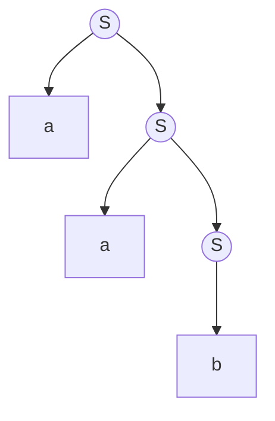
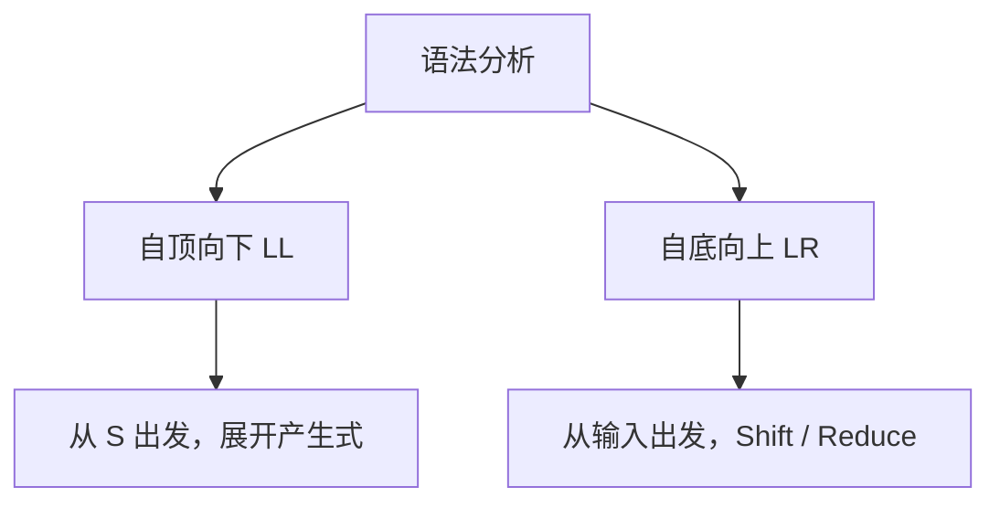

[TOC]

---

## 一、上下文无关文法（CFG）

### 1、基本概念

CFG（Context-Free Grammar）用于描述程序语言的语法规则，写作
$$
G=(V,T,P,S)
$$

- $V$ 为非终结符，可以继续展开
- $T$ 为终结符，不能继续展开
- $P$ 为产生式，即替换规则
- $S$ 为开始符号

例如

```
E → E + T | T
T → T * F | F
F → (E) | id
```

`E`、`T`、`F` 是非终结符，`+`、`*`、`id` 等是终结符。`|` 表示或者。

### 2、推导与语法树

考虑文法

```
S → aS | b
```

要生成 `aab`，可以这样推导
$$
S\Rightarrow aS\Rightarrow aaS\Rightarrow aab
$$
不能一开始就选择 `S → b`，因为这样只能得到 `b`，无法继续生成 `aab`。

对应的语法树如下



从左到右读取叶子节点，就得到 `aab`。

语法分析就是反过来，给定输入 `aab`，判断它能否由文法生成。

## 二、自顶向下分析

自顶向下从开始符号出发，不断选择产生式，尝试生成输入串，也就是从语法树的根向叶子分析。

### 1、递归下降

递归下降把每个非终结符写成一个函数。

例如

```
S → aS | b
```

对应

```py
def S():
    if next_token() == 'a':
        match('a')
        S()
    elif next_token() == 'b':
        match('b')
    else:
        raise SyntaxError
```

`match()` 负责匹配并消费一个 Token，`S()` 则继续分析非终结符。整个输入还必须恰好消费完毕。

递归下降的问题在于，有时无法立即决定使用哪条产生式。

例如

```
A → aB | aC
```

看到 `a` 时，两条规则都有可能成立，某些实现就需要回溯。

### 2、LL 分析

LL 是一种<u>**自顶向下**</u>分析方法。

- 第一个 L 表示从左到右扫描输入
- 第二个 L 表示最左推导，每次展开最左边的非终结符
- LL(1) 中的 1 表示只向前看一个 Token

例如

```
S → aA | bB
```

| 下一个 Token | 选择的产生式 |
| ------------ | ------------ |
| `a`          | `S → aA`     |
| `b`          | `S → bB`     |

只看一个 Token 就能确定规则，因此不需要回溯。

LL(1) 使用 FIRST、FOLLOW 和预测分析表来完成选择。

**（1）FIRST 集**

表示某个符号能够**推导出的字符串**，开头可能是什么。

```
A → aB | bC
```

因此
$$
FIRST(A)={a,b}
$$
**（2）FOLLOW 集**

表示某个非终结符后面可能紧跟哪些终结符。

```
S → a A b
```

因此 `b` 属于 `FOLLOW(A)`。

如果一个非终结符可以推导为空串 `ε`，FOLLOW 就能帮助判断什么时候应该选择空产生式。

**（3）LL(1) 分析表**

分析器根据当前非终结符和下一个 Token 查表，确定使用哪条产生式。如果同一个表格位置需要填入两条不同的产生式，就产生冲突，说明该文法不能直接进行 LL(1) 分析。

### 3、左递归

普通的 LL 预测分析不能直接处理左递归。

例如

```
E → E + T | T
```

分析 `E` 时又立即分析 `E`，会无限递归。

可以改写为

```
E  → T E'
E' → + T E' | ε
```

其中 `ε` 表示空串，即什么都不生成。

改写后相当于先识别一个 `T`，再识别零个或多个 `+ T`。

## 三、自底向上分析

自底向上与前面相反，从输入串出发，不断归约，最终得到开始符号。

例如

```
S → aS | b
```

输入为 `aab`，归约过程是
$$
aab\Rightarrow aaS\Rightarrow aS\Rightarrow S
$$
也就是从语法树的叶子向根分析。

### 1、LR 分析

LR 是典型的自底向上分析算法。

- L 表示从左到右扫描输入
- R 表示最右推导的逆过程

LR 主要有两个操作。

**（1）Shift（移进）**

从输入中读取一个 Token，放入分析栈。

**（2）Reduce（归约）**

根据产生式，把栈顶已经识别出的部分替换成非终结符。

例如

```
T → id
```

可以把栈顶的 `id` 归约为 `T`。

### 2、LR 分析过程

仍然使用

```
S → aS | b
```

输入为 `aab`。

| 步骤 | 栈（省略状态） | 剩余输入 | 操作            |
| ---- | -------------- | -------- | --------------- |
| 1    | 空             | `aab$`   | 开始            |
| 2    | `a`            | `ab$`    | Shift           |
| 3    | `aa`           | `b$`     | Shift           |
| 4    | `aab`          | `$`      | Shift           |
| 5    | `aaS`          | `$`      | Reduce `S → b`  |
| 6    | `aS`           | `$`      | Reduce `S → aS` |
| 7    | `S`            | `$`      | Reduce `S → aS` |
| 8    | `S`            | `$`      | Accept          |

`$` 表示输入结束。

实际 LR 分析器还会通过 ACTION 表决定何时 Shift、Reduce 或 Accept，通过 GOTO 表决定归约后的状态，而不是看到匹配的符号就立即归约。

### 3、为什么叫最右推导的逆过程？

例如

```
E → E + T | T
T → id
```

最右推导是每次展开最右边的非终结符。

```
E ⇒ E + T ⇒ E + id ⇒ T + id ⇒ id + id
```

LR 的归约则按相反的顺序进行

```
id + id ⇒ T + id ⇒ E + id ⇒ E + T ⇒ E
```

注意，LR 仍然从左向右读取输入，R 并不表示从右向左扫描。

## 四、LL 与 LR 的比较

| 对比     | LL           | LR               |
| -------- | ------------ | ---------------- |
| 分析方向 | 自顶向下     | 自底向上         |
| 出发点   | 开始符号     | 输入串           |
| 核心操作 | 预测产生式   | Shift / Reduce   |
| 推导方式 | 最左推导     | 最右推导的逆过程 |
| 左递归   | 不能直接处理 | 可以处理         |
| 分析能力 | 相对较弱     | 通常更强         |
| 实现难度 | 较简单       | 较复杂           |



LL 与 LR 的主要区别在于，LL 较早地预测该使用哪条产生式，而 LR 先读取输入，再结合已有结构决定何时归约。
