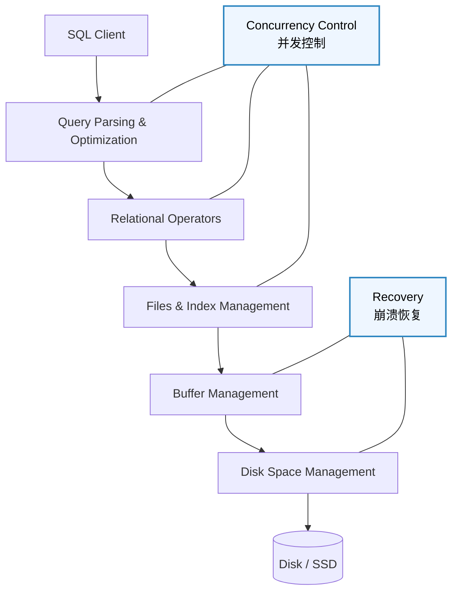
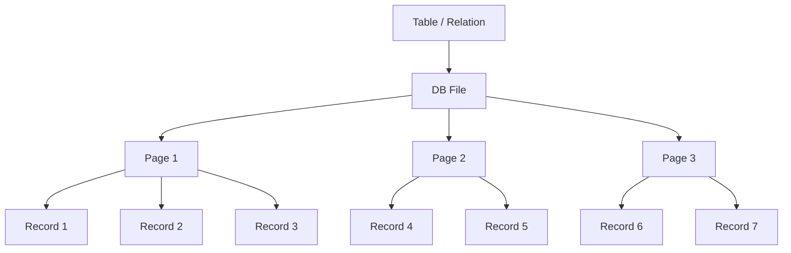
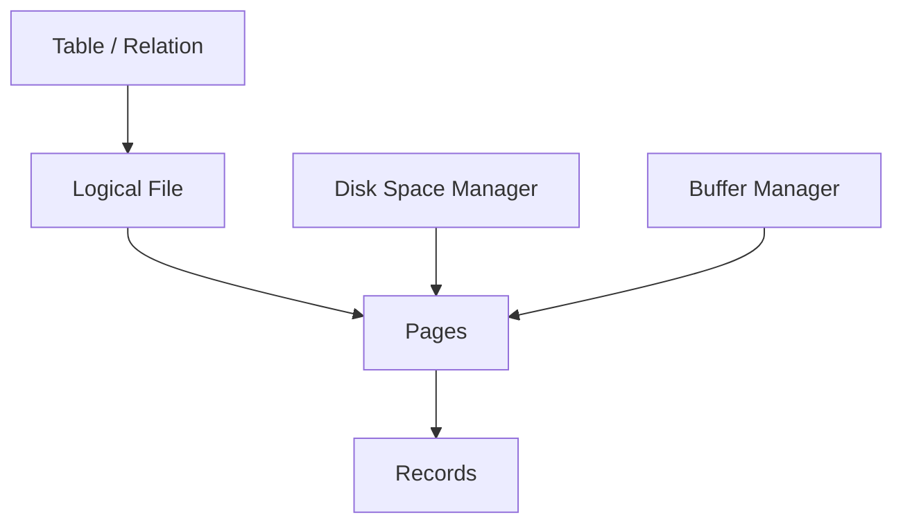
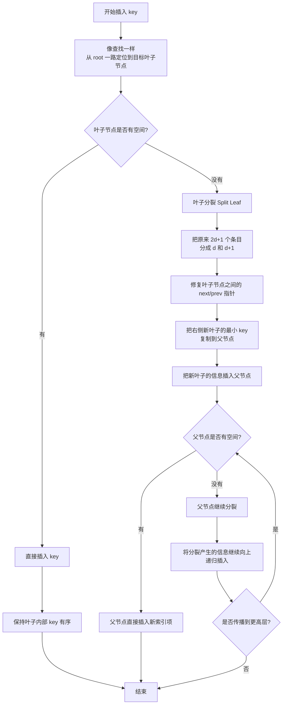
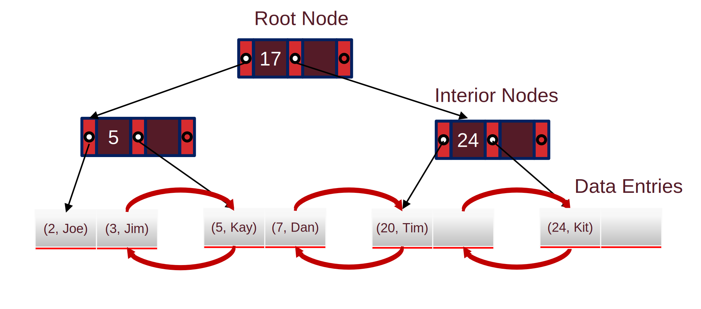
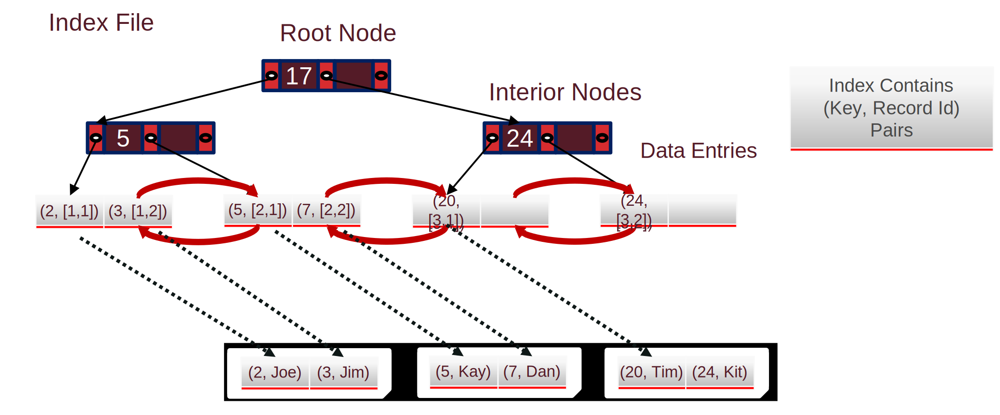
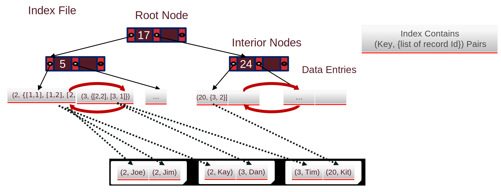

[TOC]

---

## 一、基础

### 1、DBMS结构与存储

!!! tip "DBMS设计"
	
	从这里可以看出数据库的设计是基于磁盘的，所以要考虑到磁盘的各种特性



数据库读取数据：一次读一个 page，不是一次读一条记录。

磁盘特点：**非常慢，必须减少 I/O**；且**顺序读写**比随机读写**快**👍，因此数据库设计原则**尽量顺序读取**

---

### 2、存储结构

表在磁盘上存成 file，file 由很多 page 组成，每个 page 里有很多 record



Pages 在磁盘上由 Disk Space Manager 管理，在内存中由 Buffer Manager 管理。



### 3、文件组织方式

数据库中文件可以有多种存储方式：

| 方式                                  | 途径                         |
| ------------------------------------- | ---------------------------- |
| **堆文件 / 无序文件**（Heap File）    | 记录没有顺序                 |
| **聚簇堆文件**（Clustered Heap File） | 按某种规则把相关记录放在一起 |
| **排序文件**（Sorted File）           | 按某个 key 排序存储          |
| **索引文件**（Index File）            | 通过索引结构访问数据         |

| ❌**堆文件**链表实现                                          | 🌟**堆文件**的**页目录**实现（Page Directory）                |
| ------------------------------------------------------------ | ------------------------------------------------------------ |
|    |  |
| 问题：如果要插入一个20bytes的record，如果是链表必须一个一个page找，效率很低。 | 建立一个 **目录页（Directory / Header Page）**，记录 **每个 page 剩余多少空间**。找一个空间够的page，直接读取Page插入记录。因为header page经常访问通常会**被缓存**，所以**IO 更少** |

---

## 二、页内部结构

!!! question "设计页结构时需要解决几个问题"

	- 使用**紧密/非紧密**排列
	
	- 使用**定长/变长**来记录数据

### 1、排列方式

|      | 紧密排列                                                     | 非紧密排列                                                   |
| ---- | ------------------------------------------------------------ | ------------------------------------------------------------ |
|      |                |            |
| 优点 | 空间利用率高，没有空洞                                       | **不移动记录的位置**，而是使用 **bitmap 或 slot 标记记录是否存在**。 |
| 缺点 | 当删除记录时，需要把后面的记录整体向前移动。Record ID（RID）改变，如果其他数据结构（例如 **索引**）引用了这个记录，就会产生问题。 |                                                              |

------

### 2、槽式页（slotted page）

| 删除                                                     | 插入                                                         |
| -------------------------------------------------------- | ------------------------------------------------------------ |
|  |      |
| 删除槽的指针，中间空间即空缺                             | 插入时中间空缺先不去管他，因为slotted page本来就允许 **page内部记录不连续**。直到**总空闲空间不够**或者系统整理页面时才会进行文件碎片调整 |


!!! tip "槽结构"

    槽目录位于 page 的底部，并且会随着记录数量增加而**向上增长**。记录从 page 的顶部开始**向下存放**，因此 page 中间会形成一块**空闲空间**。两者相遇的时候说明磁盘满了
    
    当插入一条新的 record 时：
    
    1. 将 record 写入当前的 free space 区域；
    2. 在 slot directory 中新增一个 slot entry，该 entry 记录该 record 的位置和长度。

## 三、记录内部结构

目标：

- **节省空间**
- **快速访问字段**

### 1、固定长度字段

如果字段都是固定长度，例如：

```
INT
FLOAT
DATE
```

记录可以直接顺序存储：

```
| id | age | score |
```

那么 record 的布局是：

```
offset 0   -> id
offset 4   -> age
offset 8   -> score
```

访问第 i 个字段只需要：

```
offset = base + i × field_size
```

!!! bug "固定长度的一个问题：NULL"

    如果字段是 NULL：
    
    ```
    Student(id, name, age)
    (1001, NULL, 20)
    ```
    
    如果仍然给 name 分配空间，会浪费空间。
    
    所以数据库通常会加 NULL bitmap 表示 NULL

### 2、变长字段

```
name VARCHAR
description TEXT
```

记录：

```
(1001, "Alice")
(1002, "Christopher")
```

长度不同：

```
Alice        = 5 bytes
Christopher  = 11 bytes
```

所以字段位置不固定，数据库无法通过公式计算 offset。

| 方法                              | 优缺点                                                       |
| --------------------------------- | ------------------------------------------------------------ |
| 填充（Padding）❌                  | 把 VARCHAR 固定长度。给出冗余空间保证变量可以被存储。缺点就是空间利用率低下 |
| 分隔符（Delimiter / CSV）❌        | 使用逗号分割变量。问题一是如果文本里有逗号会混乱；二是找第 i 个字段需要扫描 |
| 头指针 / 偏移表（Record Header）✅ | Record Header 记录每个字段的 offset以及 NULL bitmap。 |

---

## 四、成本模型

**Heap / Sorted / Clustered file** 是在说“真实数据文件怎么组织”；
 **B+ Tree / Hash index** 是在说“索引结构怎么组织”。

| 符号 | 含义                |
| ---- | ------------------- |
| $B$  | 数据块数量          |
| $R$  | 每个 block 的记录数 |
| $D$  | 读取一个 block 时间 |

| 操作     |              | 堆文件（Heap File）                             | 排序文件（Sorted File）                                      |
| -------- | ------------ | ----------------------------------------------- | ------------------------------------------------------------ |
| 扫描     | 扫描整张表   | $B\times D$                                     | $B\times D$                                                  |
| 等值查询 | 查某个具体值 | $(B\times D)/2$                                 | $(\log_2 B)\times D$<br>**二分查找**                         |
| 范围查询 | 查某个区间   | $B\times D$                                     | $(\log_2 B + pages)\times D$                                 |
| 插入     |              | $2\times D$ <br>（**读**最后 page+**写** page） | $(\log_2 B + B)\times D$<br>必须**移动后面所有记录**所以 $+B$ |
| 删除     |              | $(B/2+1)\times D$<br>$+1$ 是因为要写入          | $(\log_2 B + B)\times D$                                     |

---

## 五、索引和B+树

!!! question "为什么不用二分查找直接找？"

    但问题是数据库是**磁盘结构**。
    
    如果树是**二叉**的会非常深 $\log_2(B)$
    
    例如：$\log_2(1000000) ≈ 20$ ，意味着20次I/O，太慢。

用排序的 key→(PageID, RecordID) 作为索引可以加速查找，但由于 **fan-out 小**、维护成本高、**I/O 多**，因此不适合作为高效索引结构。

通过对 key lookup pages 递归建立索引，将线性结构转化为多层**高扇出**树结构，从而显著降低**查找深度和 I/O 成本**，这是 **B+ 树**的基本思想雏形。

### 1、B+树

**小于分隔键的走左边；大于等于分隔键的走右边。**

- 高 fan-out → 降低高度 → 降低 I/O
- 平衡 → 查询稳定
- 高效插入删除 → 当树变高时新的一层加在“上面”


中间是**左闭右开**

※占用不变量

- 每个节点**至少一半满，最多装满** $d ≤ entries ≤ 2d$
- 指针数量 $\#pointers = entries + 1$
  - 用至少50%填充保证树始终矮胖，从而降低磁盘I/O
- **根节点不需要**满足这个要求

!!! tip

	高度为 $3$ ，$d = 2$ ，可存记录 $2d\times (2d+1)^h = 4\times 5^3$

!!! success "为什么实用"
	
	Page size = 128KB，每个 (key, pointer) ≈ 40B，因此 $128KB / 40B ≈ 3200$，一个节点大约能放约 3200 个 key。由于 B+ 树中 $max(entries) = 2d$，所以 2d ≈ 3200，得到 d ≈ 1600，对应 fan-out = 2d + 1 ≈ 3201。
	
	实际中节点不会完全填满，若假设填充率约为 67%，则平均 $average fan-out ≈ 2144$。
	
	在这种情况下，树的容量增长非常快：当 $Height = 1$ 时，约为 $2144² ≈ 4,596,736$ 条记录；当 $Height = 2$ 时，约为 $2144³ ≈ 9,855,401,984$ 条记录

### 2、操作

#### （1）查找

- 从 root 开始
- 在当前节点里用二分查找，确定 key 落在哪个区间
- 顺着对应指针往下一层走
- 重复这个过程直到到达叶子节点
- 在叶子节点找到 key，对应得到 recordId

时复 $O(log_F N)$

#### （2）插入



| 普通插入      | 批量加载                                 |
| ------------- | ---------------------------------------- |
| 一条一条插    | 一次性建                                 |
| 每次都走 root | 不走                                     |
| 随机 I/O      | 顺序 I/O                                 |
| 频繁 split    | 很少 split，**加载完毕就不动那部分树了** |
| 慢            | 快                                       |

---

### 3、索引

B+树既支持等值，也支持范围

```
Age = 31 AND Salary = 400   ✔
Age = 55 AND Salary > 200   ✔
Age > 31 AND Salary = 400   ❌
```

B+树只能高效处理“前缀连续”的查询

```
<Age, Salary>
```

排序：字典序

1. 先按 Age 排
2. Age 相同 → 按 Salary 排

#### （1）索引存什么



方案一：按值存

索引叶子里直接存完整记录。

特点：

不需要再去数据文件里找，查到叶子就拿到数据。

缺点：

如果有多个索引，就会复制多份完整数据，更新很麻烦。



方案二：按引用存

索引叶子里存：

$<key, recordId>$

这里 $recordId$ 指向真实数据在数据页中的位置。

这是前面 B+ 树例子里一直使用的形式。



方案三：按引用列表存

索引叶子里存：

$<key, [recordId_1, recordId_2, \dots]>$

特点：

适合重复键很多的情况。
 比方案二更紧凑。
 但如果某个键对应很多记录，列表可能跨多个页。

#### （2）索引怎么存

| 类型       | 数据文件是否按 key 排列 | 等值查询 | 范围查询 |
| ---------- | ----------------------- | -------- | -------- |
| 聚簇索引   | 是，大体有序            | 快       | 很快     |
| 非聚簇索引 | 否，数据乱放            | 快       | 可能很慢 |

| 操作         | 堆文件 | 排序文件      | 聚簇索引      |
| ------------ | ------ | ------------- | ------------- |
| 扫描所有记录 | $O(B)$ | $O(B)$        | $O(B)$        |
| 等值查找     | $O(B)$ | $O(\log_2 B)$ | $O(\log_F B)$ |
| 范围查找     | $O(B)$ | $O(\log_2 B)$ | $O(\log_F B)$ |
| 插入         | $O(1)$ | $O(B)$        | $O(\log_F B)$ |
| 删除         | $O(B)$ | $O(B)$        | $O(\log_F B)$ |

!!! tip "成本"

    **扫描所有记录**
    
    如果扫描聚簇索引对应的数据文件，不需要索引，因为要读所有数据页，直接扫即可。但由于聚簇文件通常只填 $2/3$，所以实际页数变成：$\frac{B}{2/3} = 1.5B$，因此成本是：$1.5BD$
    
    **等值查询成本**
    
    等值查询分两步。
    
    第一步，搜索索引：$(\log_F(BR/E) + 1)D$
    
    $BR$ 是总记录数。
     $E$ 是每个叶子页平均数据项数。
     $BR/E$ 是叶子页数量。
     $\log_F(BR/E)$ 是从内部节点层级下降的高度。
     $+1$ 是为了把根等层级成本算进去。
    
    第二步，根据记录编号去数据页取真实记录：
    
    $1D$
    
    所以总成本是：
    
    $(\log_F(BR/E) + 2)D$
    
    **范围查询成本**
    
    范围查询也分几步。
    
    第一步，搜索索引找到范围起点：
    
    $(\log_F(BR/E)+1)D$
    
    第二步，顺着叶子层扫描范围内的数据项。
    
    第三步，根据记录编号读取真实数据页。
    
    对聚簇索引来说，真实数据大体连续，所以访问数据页是顺序的。由于页只填 $2/3$，访问真实数据页成本大约是：$\frac{3}{2}pages \cdot D$
    
    扫描叶子层也近似按同样方式估算：$\frac{3}{2}pages \cdot D$
    
    所以两部分合起来大约是：$3pages \cdot D$
    
    总成本近似为：$(\log_F(BR/E) + 3pages)D$

!!!danger "为什么索引不一定总是更快"

    如果查询访问的数据页太多，直接顺序扫描可能比用索引更快。
    
    原因是索引访问可能带来大量随机 I/O，顺序扫描虽然读得多，但连续读很快。可以粗略认为一次随机 I/O 的时间相当于**很多次顺序 I/O**，所以使用 B+ 树最好要求查询非常有选择性，比如访问不到约 $1\%$ 的页。
