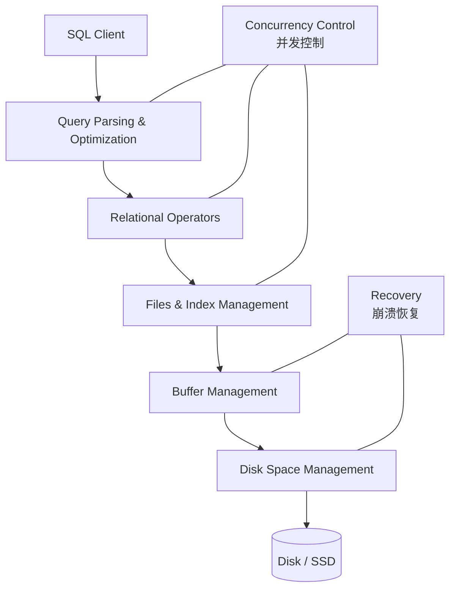
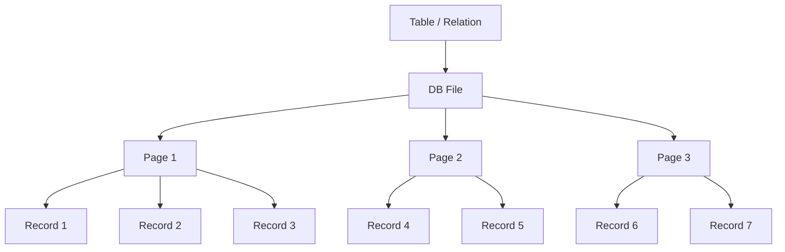
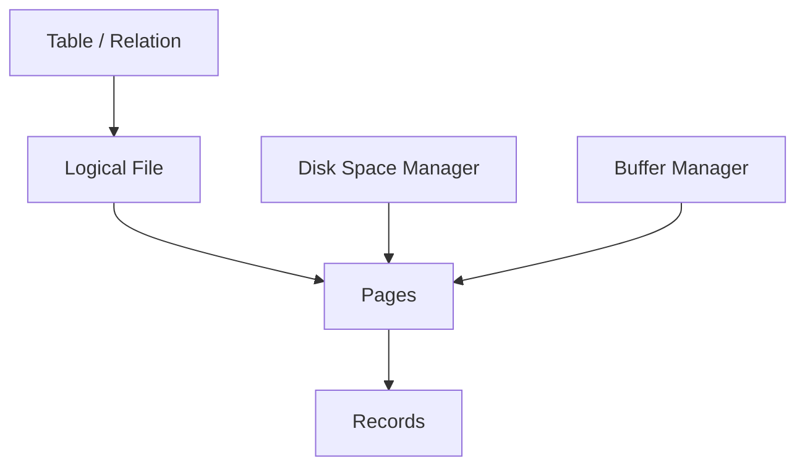

[TOC]

---

## 一、基础

### 1、DBMS结构与存储

!!! tip "DBMS设计"
	
	从这里可以看出数据库的设计是基于磁盘的，所以要考虑到磁盘的各种特性

数据库读取数据：一次读一个 page，不是一次读一条记录。

磁盘特点：**非常慢，必须减少 I/O**；且**顺序读写**比随机读写**快**，因此数据库设计原则**尽量顺序读取**

---

### 2、存储结构

表在磁盘上存成 file，file 由很多 page 组成，每个 page 里有很多 record

Pages 在磁盘上由 Disk Space Manager 管理，在内存中由 Buffer Manager 管理。

---

## 二、数据库文件结构

数据库中信息可以有多种存储方式：

| 方式                                  | 途径                         |
| ------------------------------------- | ---------------------------- |
| **堆文件 / 无序文件**（Heap File）    | 记录没有顺序                 |
| **聚簇堆文件**（Clustered Heap File） | 按某种规则把相关记录放在一起 |
| **排序文件**（Sorted File）           | 按某个 key 排序存储          |
| **索引文件**（Index File）            | 通过索引结构访问数据         |
