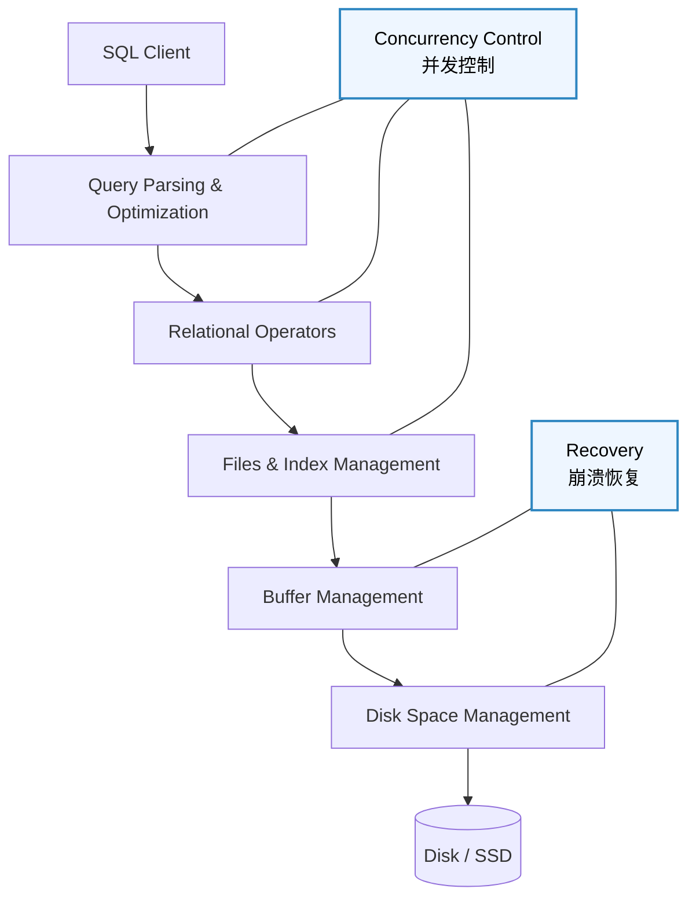
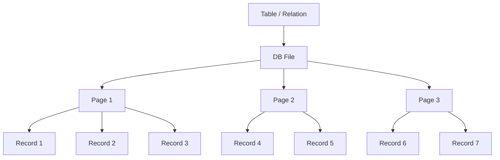
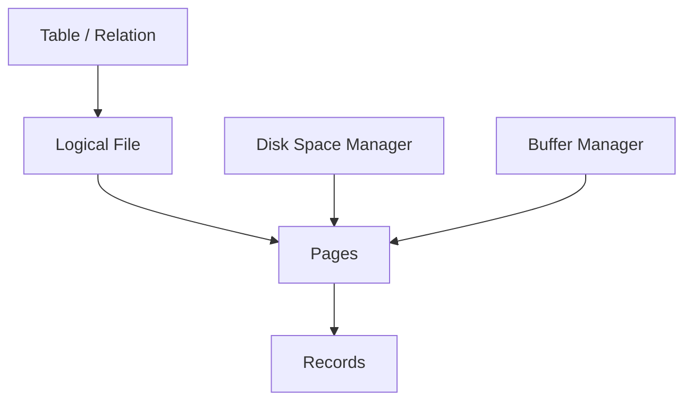
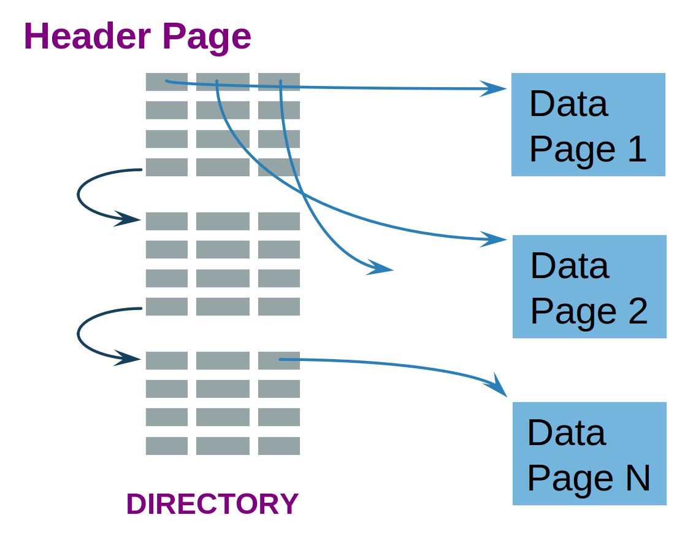
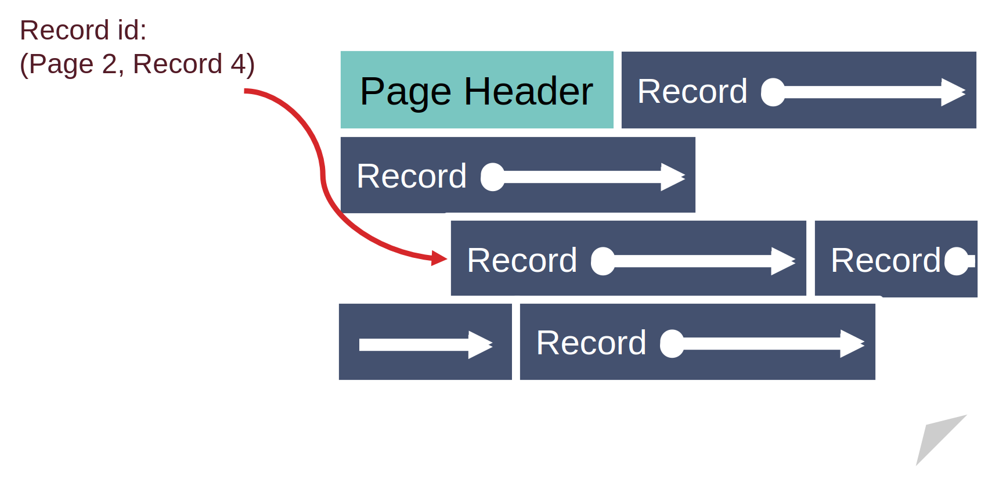
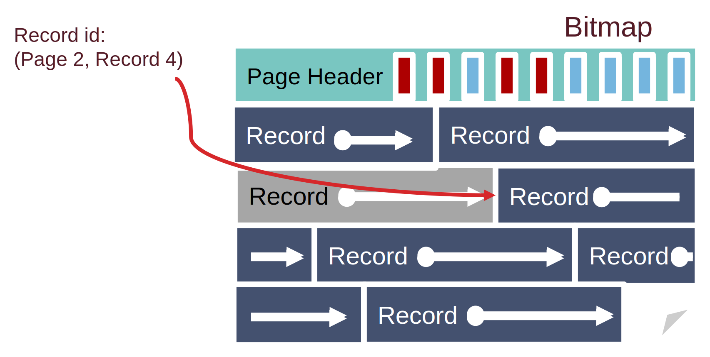
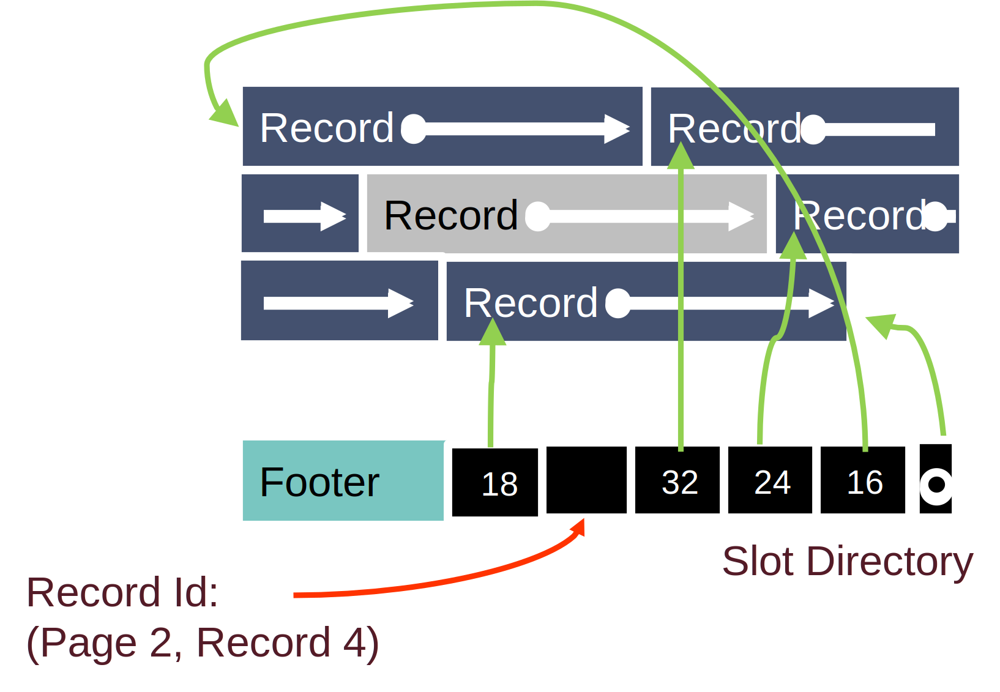
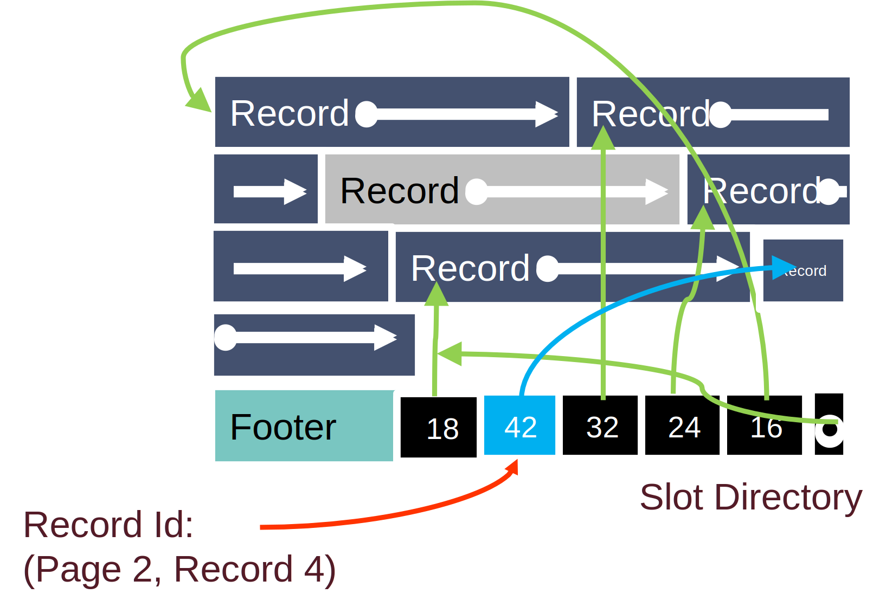
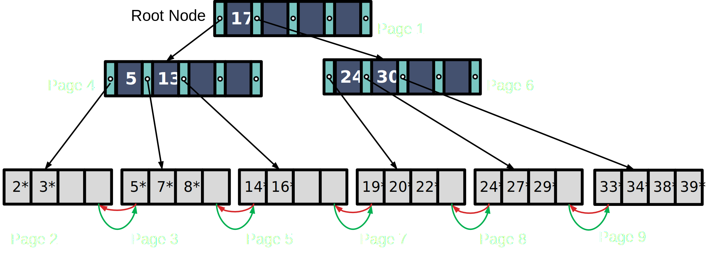

[TOC]

---

## 一、基础

### 1、DBMS结构与存储

!!! tip "DBMS设计"
	
	从这里可以看出数据库的设计是基于磁盘的，所以要考虑到磁盘的各种特性



数据库读取数据：一次读一个 page，不是一次读一条记录。

磁盘特点：**非常慢，必须减少 I/O**；且**顺序读写**比随机读写**快**👍，因此数据库设计原则**尽量顺序读取**

---

### 2、存储结构

表在磁盘上存成 file，file 由很多 page 组成，每个 page 里有很多 record



Pages 在磁盘上由 Disk Space Manager 管理，在内存中由 Buffer Manager 管理。



### 3、文件组织方式

数据库中文件可以有多种存储方式：

| 方式                                  | 途径                         |
| ------------------------------------- | ---------------------------- |
| **堆文件 / 无序文件**（Heap File）    | 记录没有顺序                 |
| **聚簇堆文件**（Clustered Heap File） | 按某种规则把相关记录放在一起 |
| **排序文件**（Sorted File）           | 按某个 key 排序存储          |
| **索引文件**（Index File）            | 通过索引结构访问数据         |

| ❌**堆文件**链表实现                                          | 🌟**堆文件**的**页目录**实现（Page Directory）                |
| ------------------------------------------------------------ | ------------------------------------------------------------ |
|    |  |
| 问题：如果要插入一个20bytes的record，如果是链表必须一个一个page找，效率很低。 | 建立一个 **目录页（Directory / Header Page）**，记录 **每个 page 剩余多少空间**。找一个空间够的page，直接读取Page插入记录。因为header page经常访问通常会**被缓存**，所以**IO 更少** |

---

## 二、页内部结构

!!! question "设计页结构时需要解决几个问题"

	- 使用**紧密/非紧密**排列
	
	- 使用**定长/变长**来记录数据

### 1、排列方式

|      | 紧密排列                                                     | 非紧密排列                                                   |
| ---- | ------------------------------------------------------------ | ------------------------------------------------------------ |
|      |                |            |
| 优点 | 空间利用率高，没有空洞                                       | **不移动记录的位置**，而是使用 **bitmap 或 slot 标记记录是否存在**。 |
| 缺点 | 当删除记录时，需要把后面的记录整体向前移动。Record ID（RID）改变，如果其他数据结构（例如 **索引**）引用了这个记录，就会产生问题。 |                                                              |

------

### 2、槽式页（slotted page）

| 删除                                                     | 插入                                                         |
| -------------------------------------------------------- | ------------------------------------------------------------ |
|  |      |
| 删除槽的指针，中间空间即空缺                             | 插入时中间空缺先不去管他，因为slotted page本来就允许 **page内部记录不连续**。直到**总空闲空间不够**或者系统整理页面时才会进行文件碎片调整 |


!!! tip "槽结构"

    槽目录位于 page 的底部，并且会随着记录数量增加而**向上增长**。记录从 page 的顶部开始**向下存放**，因此 page 中间会形成一块**空闲空间**。两者相遇的时候说明磁盘满了
    
    当插入一条新的 record 时：
    
    1. 将 record 写入当前的 free space 区域；
    2. 在 slot directory 中新增一个 slot entry，该 entry 记录该 record 的位置和长度。

## 三、记录内部结构

目标：

- **节省空间**
- **快速访问字段**

### 1、固定长度字段

如果字段都是固定长度，例如：

```
INT
FLOAT
DATE
```

记录可以直接顺序存储：

```
| id | age | score |
```

那么 record 的布局是：

```
offset 0   -> id
offset 4   -> age
offset 8   -> score
```

访问第 i 个字段只需要：

```
offset = base + i × field_size
```

!!! bug "固定长度的一个问题：NULL"

    如果字段是 NULL：
    
    ```
    Student(id, name, age)
    (1001, NULL, 20)
    ```
    
    如果仍然给 name 分配空间，会浪费空间。
    
    所以数据库通常会加 NULL bitmap 表示 NULL

### 2、变长字段

```
name VARCHAR
description TEXT
```

记录：

```
(1001, "Alice")
(1002, "Christopher")
```

长度不同：

```
Alice        = 5 bytes
Christopher  = 11 bytes
```

所以字段位置不固定，数据库无法通过公式计算 offset。

| 方法                              | 优缺点                                                       |
| --------------------------------- | ------------------------------------------------------------ |
| 填充（Padding）❌                  | 把 VARCHAR 固定长度。给出冗余空间保证变量可以被存储。缺点就是空间利用率低下 |
| 分隔符（Delimiter / CSV）❌        | 使用逗号分割变量。问题一是如果文本里有逗号会混乱；二是找第 i 个字段需要扫描 |
| 头指针 / 偏移表（Record Header）✅ | Record Header 记录每个字段的 offset以及 NULL bitmap。 |

---

## 四、成本模型

| 符号 | 含义                |
| ---- | ------------------- |
| $B$  | 数据块数量          |
| $R$  | 每个 block 的记录数 |
| $D$  | 读取一个 block 时间 |

| 操作                        |              | 堆文件（Heap File）                             | 排序文件（Sorted File）                                      |
| --------------------------- | ------------ | ----------------------------------------------- | ------------------------------------------------------------ |
| 扫描（Scan）                | 扫描整张表   | $B\times D$                                     | $B\times D$                                                  |
| 等值查询（Equality Search） | 查某个具体值 | $(B\times D)/2$                                 | $(\log_2 B)\times D$<br>**二分查找**                         |
| 范围查询（Range Search）    | 查某个区间   | $B\times D$                                     | $(\log_2 B + pages)\times D$                                 |
| 插入（Insert）              |              | $2\times D$ <br>（**读**最后 page+**写** page） | $(\log_2 B + B)\times D$<br>必须**移动后面所有记录**所以 $+B$ |
| 删除（Delete）              |              | $(B/2+1)\times D$<br>$+1$ 是因为要写入          | $(\log_2 B + B)\times D$                                     |

---

## 五、索引和B+树

!!! question "为什么不用二分查找直接找？"

    但问题是数据库是**磁盘结构**。
    
    如果树是**二叉**的会非常深 $\log_2(B)$
    
    例如：$\log_2(1000000) ≈ 20$ ，意味着20次I/O，太慢。

用排序的 key→(PageID, RecordID) 作为索引可以加速查找，但由于 **fan-out 小**、维护成本高、**I/O 多**，因此不适合作为高效索引结构。

通过对 key lookup pages 递归建立索引，将线性结构转化为多层**高扇出**树结构，从而显著降低**查找深度和 I/O 成本**，这是 **B+ 树**的基本思想雏形。

### 1、B+树

- 高 fan-out → 降低高度 → 降低 I/O
- 平衡 → 查询稳定
- 高效插入删除 → 当树变高时新的一层加在“上面”



中间是**左闭右开**