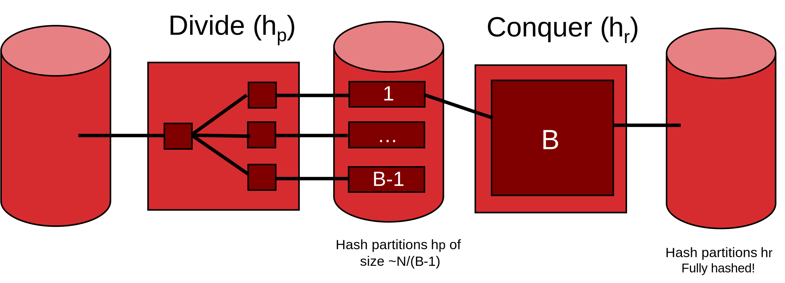
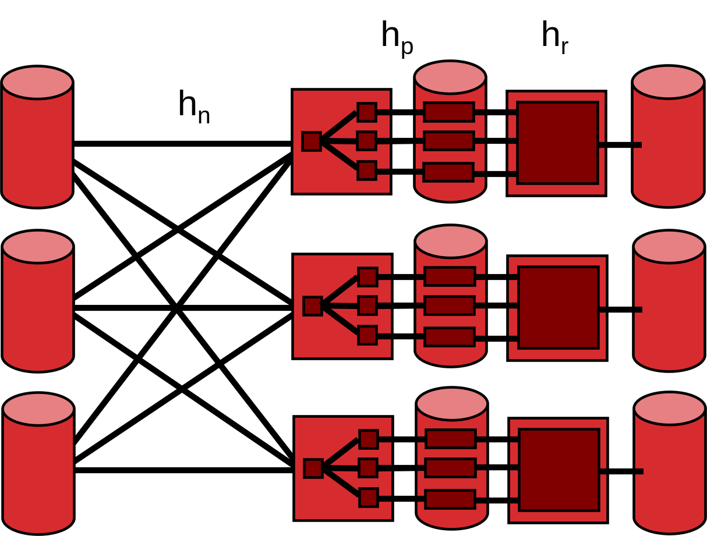

[TOC]

---

## 一、基础

- 页：数据库磁盘上的基本读写单位，上层API请求的是页
- 帧：缓冲池中用于存放页的内存槽位
- 缓冲池：数据库启动时在内存里分配的一大块空间，由很多帧组成。
- 脏页：如果一个页在内存中被修改了，但还没有写回磁盘
- 脏位：缓冲区管理器用脏位记录某个页是否被修改过

磁盘很慢，内存很快。数据库不能每次访问一个记录都直接去磁盘读写，否则性能会非常差。

缓冲区管理器的目标是：

- 把常用页留在内存里
- 需要页面时尽量从内存命中
- 内存满时选择合适页面替换出去
- 页面被修改后，正确写回磁盘

### 1、替换策略

没有一种替换策略永远最好，LRU适合随机访问、有热点页的情况，MRU适合某些反复顺序扫描。

所以实际会结合查询执行器的信息来做更智能的缓冲管理，现代数据库常使用**混合策略**，例如对索引特殊处理，对其他情况使用更复杂的策略。

#### （1）LRU

和计组中的cache章节一致，会替换**最久没有被使用过**的页面

但是实现成本较高，因为要追踪每个帧最后一次使用时间**并找到最小值**。所以实际系统常使用近似实现，例如**时钟策略**。

#### （2）时钟策略

- 引用位：表示这个页面最近是否被访问过，如果页面被访问，设为 $1$

如果当前帧被固定，跳过；

如果当前帧未固定，但引用位是 $1$，把引用位清 $0$，然后跳过；

如果当前帧未固定，引用位也是 $0$，选择它作为替换对象。⭐

#### （3）MRU

会替换最近刚刚使用过的页面。这听起来反直觉但对某些顺序扫描很有用，因为**顺序扫描**中，**刚读过的页面通常短期内不会再用**

### 2、顺序泛洪

当文件页数大于缓冲池帧数时，如果反复顺序扫描大文件，最近最少使用策略可能产生 $0%$ 命中率。

!!! question "为什么最近最多使用策略在这个例子中更好"

    对于顺序扫描，刚读过的页往往短期内不会再用,所以最近最多使用策略淘汰刚刚用过的页，反而可以保留下一轮很快会访问到的旧页。
    
    对于顺序扫描加最近最多使用策略，在 $B$ 个缓冲帧、文件有 $N>B$ 页时，极限命中率约为 $\frac{B-1}{N-1}$

### 3、预取

当请求某一页时，系统顺便提前请求后面连续的几页

- 可以摊薄随机 I/O 开销。
- 磁盘和 CPU 可以并行工作。CPU 处理当前页时，磁盘后台读取后面的页。

## 二、排序和哈希

排序在数据库里非常常见，不只是为了 `ORDER BY`

| 用途           | 为什么需要排序                    |
| -------------- | --------------------------------- |
| 去重           | `DISTINCT` 需要把相同值放到一起   |
| 分组聚合       | `GROUP BY` 需要把同组记录聚到一起 |
| 排序输出       | `ORDER BY` 要求结果有序           |
| 排序归并连接   | 连接算法需要两边按连接键排序      |
| 批量加载 B+ 树 | 先排序再顺序建叶子，效率更高      |

外存算法问题

> 如果数据有 $100GB$，但内存只有 $1GB$，怎么排序？

---

### 1、外存的基本思想

当数据太大，不能一次放进内存时，算法必须围绕磁盘 I/O 设计

| 思想         | 含义                                 |
| ------------ | ------------------------------------ |
| 单趟流式处理 | 数据一块一块读入内存，处理后再写出   |
| 分治         | 把大文件切成内存能处理的小块，再合并 |

#### （1） 单趟流式处理

最简单的情况是：

读一块输入页到输入缓冲区，处理其中记录，把结果放到输出缓冲区。**输入缓冲区用完，就读下一块；输出缓冲区满了，就写回磁盘。**

这种方式的优点是：

- 内存占用小
- 顺序 I/O 多
- 适合扫描、映射、过滤等操作

#### （2）双缓冲

双缓冲的目的是**让计算和 I/O 并行**，这样可以减少 CPU 等磁盘的时间

- 主线程处理一组缓冲区中的数据
- I/O 线程同时填充或写出另一组缓冲区
- 处理完后交换缓冲区

---

### 2、排序算法

#### （1）二路外部归并排序

- 每次读入 $1$ 页，在内存中排序，写回磁盘，产生很多长度为 $1$ 页的有序段。

- 之后每一轮把两个有序段合并成更长的有序段。

  - 第一轮后：长度 $1$ 页
   - 第二轮后：长度 $2$ 页
   - 第三轮后：长度 $4$ 页

每一轮都需要读完整个文件一次 + 写完整个文件一次，所以每一轮成本是 $2N$

总成本是 $2N·(\log_2{N}+1)$

#### （2）一般外部归并排序

一般外部归并排序利用 $B$ 个缓冲页。

不是每次只排 $1$ 页，而是每次读入 $B$ 页，在内存中排序，再写回磁盘。

所以 Pass 0 后，每个有序段长度是 $B$ 页，有序段数量是 $\left\lceil \frac{N}{B} \right\rceil$

合并时需要：

- $B-1$ 个输入缓冲页
- **$1$ 个输出缓冲页**

**所以一次最多合并 $B-1$ 个有序段。**

一般外部归并排序的总轮数是 $1 + \left\lceil \log_{B-1}\left(\left\lceil \frac{N}{B} \right\rceil\right) \right\rceil$

- 前面的 $1$ 是 Pass 0
- 后面是归并需要的轮数

每一轮读 $N$ 页、写 $N$ 页，所以每轮成本是 $2N$ ，总成本是 $2N \cdot \left(1 + \left\lceil \log_{B-1}\left(\left\lceil \frac{N}{B} \right\rceil\right) \right\rceil\right)$

!!!example

    > 给定 $N = 108$ ， $B = 5$
    
    Pass 0：每个有序段最多 $5$ 页。
    
    有序段数 = $\left\lceil \frac{108}{5} \right\rceil = 22$
    
    后续每轮最多合并 $B-1 = 4$ 个有序段。
    
    所以轮数= $1 + \left\lceil \log_4 22 \right\rceil = 1 + 3 = 4$
    
    总 I/O= $2N \cdot 4 = 216 \cdot 4 = 864$
    
    所以排序 $108$ 页文件、$5$ 个缓冲页时，总成本是 $864$ 次 I/O

#### （3）两趟排序

两趟排序的意思是

- Pass 0 生成有序段
- Pass 1 一次性合并所有有序段

Pass 0 后有序段数量是 $\left\lceil \frac{N}{B} \right\rceil$ ；Pass 1 最多能合并 $B-1$ 个有序段。

所以两趟排序条件是 $\left\lceil \frac{N}{B} \right\rceil \leq B-1$ ，近似写成 $N \leq B(B-1)$ ，这说明如果内存有 $B$ 页，那么两趟排序大约能处理 $B^2$ 规模的数据页。

---

### 3、哈希

有些操作不需要全局有序，只需要把相同 key 的记录聚到一起（比如去重，分组，某些连接算法

这时排序不是唯一选择，哈希也可以做到“相同 key 汇合”

------

#### （1）外部哈希的基本思想

外部哈希也使用**分治**思想

第一步，用哈希函数把输入记录分成多个分区

由于内存有 $B$ 个缓冲页，通常可以使用 $B-1$ 个输出分区，因为还需要 $1$ 个输入缓冲页。

- 读入原始文件，对每条记录计算 hash，写入对应分区

分区完成后，每个分区都比原文件小。如果每个分区都能放进内存，就可以读入一个分区，在内存中哈希处理，输出结果

> 例如去重时，只要在每个分区内部去重即可，因为相同 key 一定会进入同一个分区，不会分散到别的分区

**递归哈希分区能处理很多不同 key 导致的分区过大，但不能处理同一个 key 重复太多导致的分区过大**（分区倾斜）

#### （2）并行化

##### Ⅰ哈希

哈希并行化时，用哈希函数把记录 shuffle 到不同机器，使相同 key 汇聚到同一机器；排序并行化时，不能用哈希，而要按 key 的范围把数据发到不同机器，这样每台机器排序后拼接起来才是全局有序。但范围切分必须均衡，否则会产生数据倾斜

> - $h_n$ 决定每条记录应该发到哪台机器
> - $h_p$ 把收到的数据再分成本地小分区
> - $h_r$ 当某个本地分区可以放进内存后，再用 $h_r$ 建内存哈希表，完成最终处理

比如你要按 `dept` 做分组

- 所有 `CS` 记录必须到同一台机器
- 所有 `Math` 记录必须到同一台机器
- 所有 `EE` 记录必须到同一台机器

这样每台机器就可以独立处理自己收到的数据，不需要再和别的机器协调

---

##### Ⅱ排序

所以不能用普通哈希来决定发到哪台机器，因为哈希会打乱顺序。并行排序要用 **范围分区**。

比如把 key 分成：

$[-\infty, 10]$

$[11, 100]$

$[101, \infty]$

然后第一台机器负责最小范围，第二台机器负责中间范围，第三台机器负责最大范围。这样每台机器本地排序后，把机器 1、机器 2、机器 3 的结果拼起来，就是全局有序

!!! danger "数据倾斜"

    比如
    
    $[-\infty, 10]$
    
    $[11, 100]$
    
    $[101, \infty]$
    
    看起来有三个范围，但数据不一定平均。如果大部分数据都在 $[11,100]$，那么第二台机器会特别忙其他机器很空

|                  | 并行哈希             | 并行排序                |
| ---------------- | -------------------- | ----------------------- |
| 分发依据         | 哈希函数 $h_n$       | key 的范围              |
| 目标             | 相同 key 到同一机器  | 不同 key 范围到不同机器 |
| 适合操作         | 分组、去重、哈希连接 | 排序、范围输出          |
| 是否保证全局有序 | 不保证               | 保证                    |
| 主要风险         | 热点 key、重复 key   | 范围切分不均，数据倾斜  |
