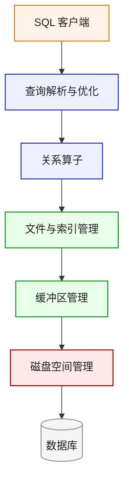
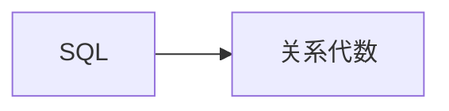

[TOC]

---

## 一、基础

- SQL 是声明式语言，不用管数据库怎么执行。

- 关系代数是操作式语言，它把查询拆成一系列算子：

    - 选择

    - 投影

    - 连接

    - 并

    - 差

    - 笛卡尔积

    - 重命名

数据库优化器会把 SQL 翻译成关系代数，再进一步变成物理执行计划。

## 二、算子

### 1、一元算子

一元算子只作用在一个关系上。

#### （1）选择 $\sigma$

选择对应 SQL 里的 WHERE，挑出满足条件的行。

- 形式：$\sigma_{condition}(R)$
- $\sigma_{rating>8}(Sailors)$ → 从 Sailors 中选出 rating 大于 8 的行。
- 特点：
  - 只减少行
  - 不改变列
  - 输出模式和输入模式相同

#### （2）投影 $\pi$

投影对应 SQL 里的 SELECT 列表，作用是保留指定列，丢掉其他列。

- 形式：$\pi_{columns}(R)$
- $\pi_{sname, age}(Sailors)$ → 只保留水手名字和年龄两列。
- 特点：

    - 只减少列
    - 在集合语义下，可能会去重，例如原来有两个人 age 都是 20，投影 age 后只剩一个 20。

#### （3）重命名 $\rho$

重命名用于修改关系名或属性名。

- 形式：$\rho(R') (R)$ ,或者重命名列：$\rho_{Temp(a,b,c)}(R)$

- 它常用于：

    - 自连接

    - 避免列名冲突

    - 给中间结果命名

### 2、二元算子

二元算子作用在两个关系上。

#### （1）并 $\cup$

并对应 SQL 里的 UNION。

- 形式：$R \cup S$

- 含义：返回在 $R$ 中或在 $S$ 中的元组。

- 要求：两个关系必须兼容。

    - 列数相同

    - 对应列的类型相同

#### （2）差 $-$

差对应 SQL 里的 EXCEPT。

- 形式：$R - S$

- 含义：返回在 $R$ 中但不在 $S$ 中的元组；同样要求两个关系兼容。

#### （3）笛卡尔积 $\times$

- 形式：$R \times S$

- 含义：把 $R$ 的每一行和 $S$ 的每一行配对。

    - 如果：$|R| = m$ ，$|S| = n$
  
  
    - 那么：$|R \times S| = mn$

- 笛卡尔积本身通常会产生很多无意义组合，所以经常和选择一起使用，形成连接。

------

### 3、复合算子

复合算子可以由基本算子组合出来，但因为太常用，所以单独命名。

#### （1）交 $\cap$

- 形式：$R \cap S$

- 含义：返回同时在 $R$ 和 $S$ 中的元组。

    - 交可以用差表示：$R \cap S = R - (R - S)$

#### （2）条件连接 $\bowtie_{\theta}$

- 形式：$R \bowtie_{\theta} S$

- 含义：先做笛卡尔积，再选出满足条件的组合。

- 等价于：$\sigma_{\theta}(R \times S)$

    - $Sailors \bowtie_{Sailors.sid=Reserves.sid} Reserves$ ，把水手和预约记录按照 sid 匹配起来。

#### （3）自然连接 $\bowtie$

- 形式：$R \bowtie S$

- 含义：自动按照两个关系中同名属性做相等连接，并且结果中同名列只保留一份。

例如两个表都有 sid，自然连接默认用 sid 匹配。

注意：自然连接虽然写起来方便，但如果同名列不是你想连接的列，可能出错。

!!!question "找 rating 大于 $8$ 的水手名字"

    关系代数 $\pi_{sname}(\sigma_{rating>8}(Sailors))$
    
    执行顺序是：
    
    1. 先用 $\sigma$ 选出 rating 大于 8 的行
    2. 再用 $\pi$ 保留 sname 列
    
    不能反过来，因为如果先投影 sname，就没有 rating 列了，后面无法判断 rating 是否大于 8。
