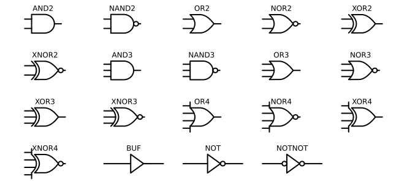
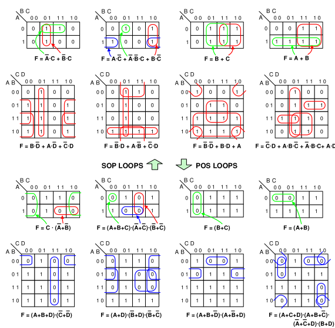
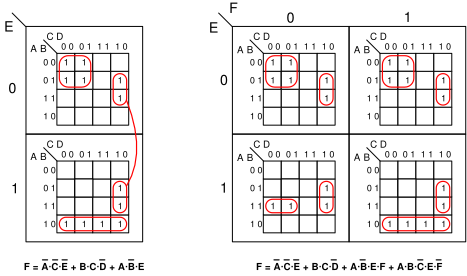
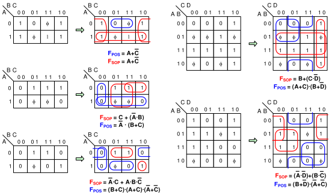

[TOC]

---

## 一、基础

- 输入确定，输出也唯一确定
$$
F=f(A,B,C)
$$

- 三种基本运算：**与（逻辑乘），或（逻辑加），非（逻辑反）**
- 表示方式：**真值表**

| 逻辑运算 | 表达式     |
| -------- | ---------- |
| 与       | $F=A·B$    |
| 或       | $F=A+B$    |
| 非       | $F=\bar A$ |

### 1、定律

- 交换，结合，分配均成立

- 反演律（De Morgan）

$$
\overline{A \cdot B} = \bar{A} + \bar{B}
$$

$$
\overline{A + B} = \bar{A} \cdot \bar{B}
$$

---

### 2、规则

- **代入规则**：把某个变量用逻辑式代替仍旧成立

- **反演规则**：变量换成反变量（$\overline{A} \leftrightarrow A$）；与或互变；常量 “0” “1”互换，

$$
F = \overline{AB + C} \cdot D + AC
$$

$$
\overline{F} = [\overline{[(\overline A +\overline B)\overline C]}+\overline D]·(\overline A+
\overline C)
$$

- **对偶规则**：变量不变；与或互变；常量 “0” “1”互换

!!! note "合并律"

    $$
    A·\overline B+A·B=A
    $$
    
    $$
    A\overline BC+ABC=AC
    $$

!!! note "吸收律"

    $$
    AB + \overline{A}C + BC = AB + \overline{A}C
    $$
    它的作用是：**当第三项可以由前两个“覆盖”时，第三项是冗余的，可以省略**。

------

### 3、复合

| 名称         | 英文缩写 | 逻辑表达式                                                | 真值特性                          |
| ------------ | -------- | --------------------------------------------------------- | --------------------------------- |
| **与非门**   | NAND     | $\overline{A \cdot B}$                                    | 除了 $A=B=1$ 时输出 0，其余全是 1 |
| **或非门**   | NOR      | $\overline{A + B}$                                        | 只有 $A=B=0$ 时输出 1，其余全是 0 |
| **异或门**   | XOR      | $A \oplus B = \overline{A}B + A\overline{B}$              | 输入不同 → 输出 1，相同 → 输出 0  |
| **同或门**   | XNOR     | $\overline{A \oplus B} = AB + \overline{A}\,\overline{B}$ | 输入相同 → 输出 1，不同 → 输出 0  |
| **与或非门** | AOI      | $\overline{(A \cdot B) + (C \cdot D)}$ （一般形式）       | 先做“与”，再做“或”，最后整体取反  |

!!! note "完备集"

	- 异或，同或互为反函数，互为对偶函数
	- 与或非是**完备集**，但不是最好的
	- **与非/或非是最好的完备集**
	
	??? example
	    | 构造门         | 使用 NAND                                                            | 使用 NOR                                                      | 公式/说明                   |
	    | ----------- | ------------------------------------------------------------------ | ----------------------------------------------------------- | ----------------------- |
	    | **NOT**   | A NAND A                                                           | A NOR A                                                     | NAND/NOR 自身两个输入相同即可实现取反 |
	    | **AND** | (A NAND B) NAND (A NAND B)                                         | (A NOR A) NOR (B NOR B)                                     | 利用德摩根律或双重取反             |
	    | **OR**  | (A NAND A) NAND (B NAND B)                                         | (A NOR B) NOR (A NOR B)                                     | 利用德摩根律将 NAND/NOR 转为 OR  |
	    | **NAND**    | 原门直接使用                                                             | ( (A NOR A) NOR (B NOR B) ) NOR ( (A NOR A) NOR (B NOR B) ) | NOR 构造 NAND 时需两次组合      |
	    | **NOR**     | ( (A NAND A) NAND (B NAND B) ) NAND ( (A NAND A) NAND (B NAND B) ) | 原门直接使用                                                      | NAND 构造 NOR 时需两次组合      |

------

### 4、数制

- 8421 BCD码（有权码）：用四位二进制表示一位十进制（e.g. $10 \rightarrow 0001\text{ }0000$
- 余3码（无权码）：在8421基础上加上 $(0011)_B$ 的结果，也就是加上3

---

## 二、逻辑函数

### 1、表达式

与或式，或与式，与或非式，与非与非式，或非或非式

- 最小项：每个变量都以原变量或者反变量出现一次构成的**与项**，$n$ 变量共有 $2^n$ 个最小项
      - 全部最小项和恒为1
      - 任意两个最小项乘积为0
      - $n$ 变量有 $n$ 个相邻项，可以**合并并消去**一个因子
- 最大项：每个变量都以原变量或者反变量出现一次构成的**或项**，$n$ 变量共有 $2^n$ 个最小项
      - 只有一组取值让最大项为0
      - 全部最大项乘积为0
      - $M_i+M_j=1$

??? question "化成最小项标准式"

	- 展开把缺项补成 $(X + \overline X)$
	
	$$
	\begin{align*}
	F &= AB + \overline{A}C \\
	  &= AB(C + \overline{C}) + \overline{A}(B + \overline{B})C \\
	  &= ABC + AB\overline{C} + \overline{A}BC + \overline{A}\overline{B}C \\
	  &= m_7 + m_1 + m_3 + m_6 \\
	  &= \sum m(1,3,6,7)
	\end{align*}
	$$
	
	- 这里下标就是看是原变量然后那一位为1，比如 $AB\overline C$ 就是 $110$ ，就是 $m_6$

??? question "化成最大项标准式"

    - 先写出反函数的最小项表达式，再求反（利用最小项和最大项互补）
    
    | A    | B    | F    | $\overline F$ |
    | ---- | ---- | ---- | ------------- |
    | 0    | 0    | 0    | 1             |
    | 0    | 1    | 1    | 0             |
    | 1    | 0    | 1    | 0             |
    | 1    | 1    | 0    | 1             |
    
    $$
    \begin{align*}
    \overline{F} &= \overline{A}\,\overline{B} + AB \\
    \overline{\overline{F}} &= \overline{\overline{A}\,\overline{B} + AB} \\
    &= \overline{m_3 + m_0} \\
    \therefore \quad F &= M_3 \cdot M_0
    \end{align*}
    $$

!!! question "根据真值表凑表达式"

	- **SOP (积之和)**：关注**输出为 1** 的行。变量为 1 写自己，变量为 0 写非，**相乘**，然后把所有项相加。（**最小项标准式/最简与或式**）
	- **POS (和之积)**：关注**输出为 0** 的行。变量为 0 写自己，变量为 1 写非，**相加**，然后把所有项相乘。（**最大项标准式/最简或与式**）
	
	| A    | B    | F    |
	| ---- | ---- | ---- |
	| 0    | 0    | 0    |
	| 0    | 1    | 1    |
	| 1    | 0    | 1    |
	| 1    | 1    | 1    |
	
	$SOP:F=\overline A\overline B·0+\overline AB+A\overline B+AB=\sum m(0,2,3)$
	
	$POS:F=(A+B)=\prod M(3)$

------

### 2、卡诺图

- 相邻项只有一位不同，格雷码
- $n$ 变量有 $2^n$ 个方格，有 $n$ 个相邻项
- 任何**几何相邻**的都**逻辑相邻**
      - 几何相邻：相接，相对，相重
      - 逻辑相邻：只有一个变量取值不同

!!! note "格雷码"

	- 格雷码 → 二进制： `a ^ (a >> 1)`
	    - 1011 → 1011 ^ 101 → 1110
	- 二进制 → 格雷码：格雷码对应位异或二进制上一位

!!! tip "逻辑函数 → 卡诺图"

	- 给**最小项**标准式：构成逻辑函数的最小项在卡诺图上对应的方格填1，其余不填
	- 给**最大项**标准式：构成逻辑函数的最大项在卡诺图上对应的方格填0，其余不填

!!! tip "卡诺图化简"

    - 本质就是逻辑相邻的可以化简
    
    $F=AB\overline CD+AB\overline C \overline D=AB\overline C$
    
    - 向某个方向（上/左）看然后消去不同的变量
    - 卡诺圈只含 $2^i$ 格子，且矩形，消去 $i$ 个变量
    - 圈 $1$ 相乘再相加就是**最小项**标准式，圈 $0$ 相加再相乘就是**最大项**标准式
    - 如果一个卡诺圈里面所有 $1$ 都被其他圈圈过，这是一个多余圈
      
    
    
    - 与或表达式写成电路以后所有与门换成与非门也成立（根据De-Morgan）

------

### 3、含无关项

| A    | B    | C    | F    |
| ---- | ---- | ---- | ---- |
| 0    | 0    | 0    | 0    |
| 0    | 0    | 1    | 1    |
| 0    | 1    | 0    | 0    |
| 0    | 1    | 1    | ×    |
| 1    | 0    | 0    | 0    |
| 1    | 0    | 1    | ×    |
| 1    | 1    | 0    | ×    |
| 1    | 1    | 1    | ×    |

$$
F(A,B,C) = \sum m(1) + \sum d(0,3,5,6,7)
$$

或者写成最大项形式：

$$
F(A,B,C) = \prod M(2,4) \cdot \prod d(0,3,5,6,7)
$$

