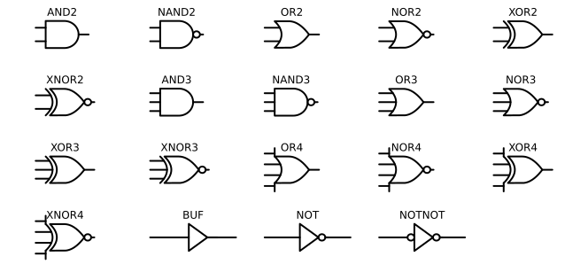
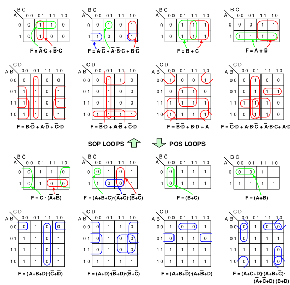
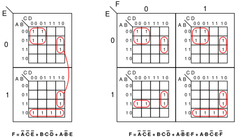
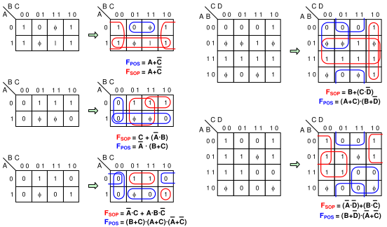

[TOC]

---

## 一、基础

- 输入确定，输出也唯一确定
$$
F=f(A,B,C)
$$

- 三种基本运算：**与（逻辑乘），或（逻辑加），非（逻辑反）**
- 表示方式：**真值表**

| 逻辑运算 | 表达式     |
| -------- | ---------- |
| 与       | $F=A·B$    |
| 或       | $F=A+B$    |
| 非       | $F=\bar A$ |

### 1、常见等值式

1）双重否定律  
$$
A \equiv \overline{\overline{A}}
$$

2）幂等律  
$$
A + A \equiv A
$$

$$
A \cdot A \equiv A
$$

3）交换律  
$$
A + B \equiv B + A
$$

$$
A \cdot B \equiv B \cdot A
$$

4）结合律  
$$
(A + B) + C \equiv A + (B + C)
$$

$$
(A \cdot B) \cdot C \equiv A \cdot (B \cdot C)
$$

5）分配律  
$$
A + (B \cdot C) \equiv (A + B) \cdot (A + C)
$$

$$
A \cdot (B + C) \equiv (A \cdot B) + (A \cdot C)
$$

6）德摩根律  
$$
\overline{A + B} \equiv \overline{A} \cdot \overline{B}
$$

$$
\overline{A \cdot B} \equiv \overline{A} + \overline{B}
$$

7）吸收律  
$$
A + (A \cdot B) \equiv A
$$

$$
A \cdot (A + B) \equiv A
$$

8）零律（支配律）  
$$
A + 1 \equiv 1
$$

$$
A \cdot 0 \equiv 0
$$

9）同一律（恒等律）  
$$
A + 0 \equiv A
$$

$$
A \cdot 1 \equiv A
$$

10）排中律  
$$
A + \overline{A} \equiv 1
$$

11）矛盾律  
$$
A \cdot \overline{A} \equiv 0
$$

---

### 2、规则

- **代入规则**：把某个变量用逻辑式代替仍旧成立

- **反演规则**：变量换成反变量（$\overline{A} \leftrightarrow A$）；与或互变；常量 “0” “1”互换，

$$
F = \overline{AB + C} \cdot D + AC
$$

$$
\overline{F} = [\overline{[(\overline A +\overline B)\overline C]}+\overline D]·(\overline A+
\overline C)
$$

- **对偶规则**：变量不变；与或互变；常量 “0” “1”互换

$$
F = A + (B \cdot C)
$$

$$
F_d = A \cdot (B + C)
$$

------

### 3、复合

| 名称         | 英文缩写 | 逻辑表达式                                                | 真值特性                          |
| ------------ | -------- | --------------------------------------------------------- | --------------------------------- |
| **与非门**   | NAND     | $\overline{A \cdot B}$                                    | 除了 $A=B=1$ 时输出 0，其余全是 1 |
| **或非门**   | NOR      | $\overline{A + B}$                                        | 只有 $A=B=0$ 时输出 1，其余全是 0 |
| **异或门**   | XOR      | $A \oplus B = \overline{A}B + A\overline{B}$              | 输入不同 → 输出 1，相同 → 输出 0  |
| **同或门**   | XNOR     | $\overline{A \oplus B} = AB + \overline{A}\,\overline{B}$ | 输入相同 → 输出 1，不同 → 输出 0  |
| **与或非门** | AOI      | $\overline{(A \cdot B) + (C \cdot D)}$ （一般形式）       | 先做“与”，再做“或”，最后整体取反  |

!!! note "完备集"

	- 异或，同或互为反函数，互为对偶函数
	- 与或非是**完备集**，但不是最好的
	- **与非/或非是最好的完备集**
	
	??? example
	    | 构造门         | 使用 NAND                                                            | 使用 NOR                                                      | 公式/说明                   |
	    | ----------- | ------------------------------------------------------------------ | ----------------------------------------------------------- | ----------------------- |
	    | **NOT**   | A NAND A                                                           | A NOR A                                                     | NAND/NOR 自身两个输入相同即可实现取反 |
	    | **AND** | (A NAND B) NAND (A NAND B)                                         | (A NOR A) NOR (B NOR B)                                     | 利用德摩根律或双重取反             |
	    | **OR**  | (A NAND A) NAND (B NAND B)                                         | (A NOR B) NOR (A NOR B)                                     | 利用德摩根律将 NAND/NOR 转为 OR  |
	    | **NAND**    | 原门直接使用                                                             | ( (A NOR A) NOR (B NOR B) ) NOR ( (A NOR A) NOR (B NOR B) ) | NOR 构造 NAND 时需两次组合      |
	    | **NOR**     | ( (A NAND A) NAND (B NAND B) ) NAND ( (A NAND A) NAND (B NAND B) ) | 原门直接使用                                                      | NAND 构造 NOR 时需两次组合      |

------

### 4、数制

- 8421 BCD码（有权码）：用四位二进制表示一位十进制（e.g. $10 \rightarrow 0001\text{ }0000$
- 余3码（无权码）：在8421基础上加上 $(0011)_B$ 的结果，也就是加上3

---

## 二、逻辑函数化简

与或式（最小项表达式），或与式（最大项表达式），与或非式，与非与非式，或非或非式  

- 最小项：每个变量都以原变量或者反变量出现一次构成的与项，$n$ 变量共有 $2^n$ 个最小项
  - 全部最小项和恒为 1
    -任意两个最小项乘积为 0
    - $n$ 变量有 $n$ 个相邻项，可以合并消去一个因子  

- 最大项：每个变量都以原变量或者反变量出现一次构成的或项，$n$ 变量共有 $2^n$ 个最小项
  - 只有一组取值让最大项为 0
    - 全部最大项乘积为 0
    - $M_i + M_j = 1$

### 1、等值演算法

等值演算就是利用上面的等值式对于表达式进行化简即可。

!!! question "等值演算法"

	求 $F=AB+\overline{A}C$ 的最小项表达式（标准与或式）
	
	- 展开把缺项补成 $(X + \overline X)$
	
	$$
	\begin{align*}
	F &= AB + \overline{A}C \\
	  &= AB(C + \overline{C}) + \overline{A}(B + \overline{B})C \\
	  &= ABC + AB\overline{C} + \overline{A}BC + \overline{A}\overline{B}C \\
	  &= m_7 + m_1 + m_3 + m_6 \\
	  &= \sum m(1,3,6,7)
	\end{align*}
	$$
	
	- 这里下标就是看是原变量然后那一位为1，比如 $AB\overline C$ 就是 $110$ ，就是 $m_6$

!!! danger "与非-与非式"

    先化成最小项，再两次取反
    
    $$
    \begin{align}
    F = A(B + C) + BC
    &= AB + AC + BC
    &= \overline{\overline{AB + AC + BC}}
    &= \overline{\overline{AB} \cdot \overline{AC} \cdot \overline{BC}}
    \end{align}
    $$

------

### 2、真值表法

真值表法：最小项就是表达式值为 $1$ 的求和，最大项就是表达式值为 $0$ 的求积。

!!! question "真值表法"
	求 $F = A + BC$ 的最小/大项表达式  

    | A | B | C | A+BC |
    |---|---|---|------|
    | 0 | 0 | 0 | 0 |
    | 0 | 0 | 1 | 0 |
    | 0 | 1 | 0 | 0 |
    | 0 | 1 | 1 | 1 |
    | 1 | 0 | 0 | 1 |
    | 1 | 0 | 1 | 1 |
    | 1 | 1 | 0 | 1 |
    | 1 | 1 | 1 | 1 |
    
    ∴ $F = \sum m(3,4,5,6,7) = \prod M(0,1,2)$

---

### 3、卡诺图法

#### （1）一般卡诺图

给出逻辑函数，在卡诺图中标出所有符合要求的最小项，然后开始圈卡诺圈

- 相邻项只有一位不同，格雷码
- $n$ 变量有 $2^n$ 个方格，有 **$n$ 个相邻项**
- **🌟同写异不写**
- 任何**几何相邻**的都**逻辑相邻**
      - 几何相邻：相接，相对，相重
      - 逻辑相邻：只有一个变量取值不同

??? note "格雷码"

	- 格雷码 → 二进制： `a ^ (a >> 1)`
	    - 1011 → 1011 ^ 101 → 1110
	- 二进制 → 格雷码：格雷码对应位异或二进制上一位

!!! tip "逻辑函数 → 卡诺图"

	- 给**最小项**标准式：构成逻辑函数的最小项在卡诺图上对应的方格填1，其余不填
	- 给**最大项**标准式：构成逻辑函数的最大项在卡诺图上对应的方格填0，其余不填

!!! tip "卡诺图化简"

    - 本质就是逻辑相邻的可以化简
    
    $F=AB\overline CD+AB\overline C \overline D=AB\overline C$

    - 卡诺圈只含 $2^i$ 格子，且矩形，消去 $i$ 个变量
    - 圈 $1$ 相乘再相加就是**最小项**标准式，圈 $0$ 相加再相乘就是**最大项**标准式
    - 如果一个卡诺圈里面所有 $1$ 都被其他圈圈过，这是一个多余圈
      
    
    
    - 与或表达式写成电路以后所有与门换成与非门也成立（根据De-Morgan）

#### （2）含无关项/约束项

约束项标 “X” ，可以当 $0$ 或者 $1$ 用，也可以不用圈完

