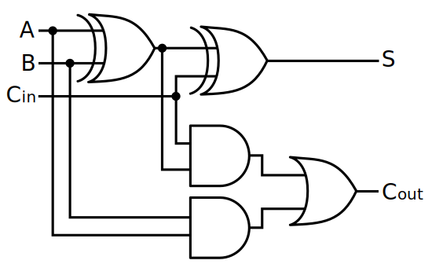

[TOC]

---

## 一、基础

- 从输入到输出，主机推到**逻辑函数**表达式
- 列出**真值表**，用**文字概括**电路逻辑功能

!!! example "全加器"

    
    
    | A    | B    | \(C_{in}\) | S (和) | \(C_{out}\) (进位) |
    | ---- | ---- | ---------- | ------ | ------------------ |
    | 0    | 0    | 0          | 0      | 0                  |
    | 0    | 0    | 1          | 1      | 0                  |
    | 0    | 1    | 0          | 1      | 0                  |
    | 0    | 1    | 1          | 0      | 1                  |
    | 1    | 0    | 0          | 1      | 0                  |
    | 1    | 0    | 1          | 0      | 1                  |
    | 1    | 1    | 0          | 0      | 1                  |
    | 1    | 1    | 1          | 1      | 1                  |
    
    - **和 (S)**  
      三输入异或：
    $$
    S = A \oplus B \oplus C_{in}
    $$
    
    - **进位 (Cout)**  
      至少两个输入为 1 时产生进位：
    
    $$
    C_{out} = (A \cdot B) + (A \cdot C_{in}) + (B \cdot C_{in})
    $$

- 器件数最少，连线最简单 → 最小化电路
- 级数少延迟低，功耗小

---

