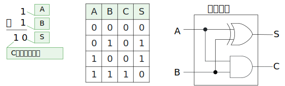
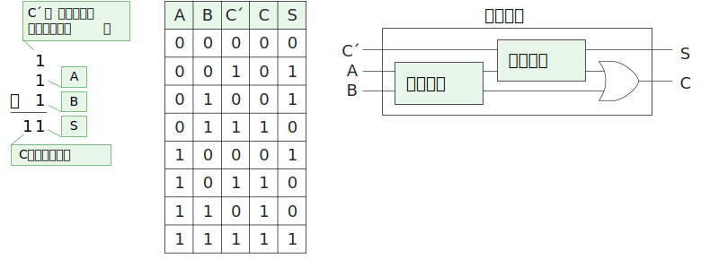
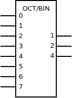
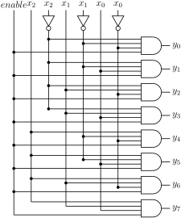
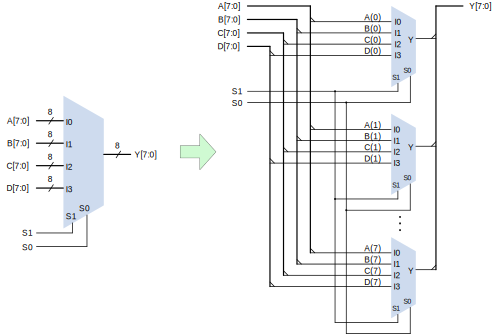

[TOC]

---

## 一、基础

- **定义**：组合逻辑电路是指**电路的输出仅依赖于当前输入状态，而不依赖于过去的输入或电路的历史状态**的逻辑电路。

!!! tip "电路分析"

    - 从输入到输出，逐级推到**逻辑函数**表达式
    - 列出**真值表**，用**文字概括**电路逻辑功能

------

## 二、常见组合逻辑电路

### 1、加法器

$$
S = A \oplus B
$$

$$
C = AB
$$

**半加器**反应二进制加法本质：和是取**异或**，进位是取**与**

**全加器**拓展一个输入，是来自上一个全加器的**进位输入**，串联多个全加器就能实现**多位加法器**

| A    | B    | \(C_{in}\) | S (和) | \(C_{out}\) (进位) |
| ---- | ---- | ---------- | ------ | ------------------ |
| 0    | 0    | 0          | 0      | 0                  |
| 0    | 0    | 1          | 1      | 0                  |
| 0    | 1    | 0          | 1      | 0                  |
| 0    | 1    | 1          | 0      | 1                  |
| 1    | 0    | 0          | 1      | 0                  |
| 1    | 0    | 1          | 0      | 1                  |
| 1    | 1    | 0          | 0      | 1                  |
| 1    | 1    | 1          | 1      | 1                  |

$$
S = A \oplus B \oplus C_{in}
$$

至少两个输入为 $1$ 时产生进位：

$$
C_{out} = (A \cdot B) + (A \cdot C_{in}) + (B \cdot C_{in})
$$

??? question  "BCD → 余3码"

	减3即可

??? question  "BCD两位十进制加法"

	最简单方法：输入8位，输出8位，列出 $2^8$ 行的真值表然后写出逻辑函数
	
	优化方案：
		$0 \sim 9$ 不需要转换， $10 \sim 18$ 需要转换 
	
	| $Bin$                   | $BCD$      |
	| ----------------------- | ---------- |
	| $0 \sim 9$              | $0 \sim 9$ |
	| $10 = (0001\;0000)_{2}$ | $16$       |
	| $11 = (0001\;0001)_{2}$ | $17$       |
	| $\cdots$                | $\cdots$   |

---

### 2、编码器

**定义**：编码器是一种**把多路输入信号转换为二进制输出信号**的组合逻辑电路。

**功能**：输入里只有一个是“有效的1”，电路就会输出这个输入所对应的二进制编号。

输入一般比输出多，因为编码就是为了便于传输

- 二进制编码器：$n$ 可以对 $2^n$ 个一般信号进行编码；任意时刻**只允许一个**有效信号

    - 8线-3线编码器：

- 二-十进制编码器：它的输入是代表0—9这10个数字的状态信号，有效信号为1（即某信号为1时，则表示要对它进行编码），输出是相应的BCD码，因此也称10线—4线编码器。和二进制编码器特点一样，任何时刻只允许输入一个有效信号。

- 优先编码器：允许**多个输入信号**同时有效，但只按其中优先级别最高的有效输入信号编码，对级别较低的输入信号不予理睬。

------

### 3、译码器

中规模器件（MSI）可能会有使能和片选机制

输入一般比输出少，就是解码过程

- 二进制译码器（全译码器）：输入为 $n$ 位二进制，输出为 $2^n$ 为控制信息，且仅一位是有效信息
    - 3-8 译码器：
    - 使能端有效情况下：$\boxed{Y_i=M_i=\overline{m_i}}$
    - 应用：**地址译码；实现逻辑函数**

??? question "地址译码"

	要求使用一个3-8译码器设计一个地址译码电路。有效地址范围： `2E0H ~ 2EFH`
	
	也就是从 $10;1110;0000 \sim 10;1110;1111$，数字当作 $\overline{A_3A_2A_1A_0}$
	
	把第一位 `A3` 连接到使能端控制两片74138是否工作，然后后三位接到两片上，就完全实现了译码电路（这里必须要有**使能端**多片拼接才有拓展功能）

!!! tip "译码器实现逻辑函数"
	
    二进制译码器输出方程：
    
    $$
    Y_i = \overline{m_i} = M_i
    $$
    
    $F_1 = \sum {m(0,4,7)} = m_0+m_4+m_7 = \overline{\overline{m_0+m_4+m_7}} = \overline{Y_0Y_4Y_7}$
    
    也就是输出端使用与非门连接 0，4，7 接口
    
    - 使用 3-8译码器实现逻辑函数：就是写出**最小项标准式用与非门**连接输出端，或者写出**最大项标准式用与门**连接输出端

------

### 4、数据选择器

数据选择器MUX： $n$ 位地址输入，$2^n$ 位数据输入，$1$ 位输出

$$
Y=\sum_{i=0}^{2^n - 1} {m_i·d_i}
$$

- 你有 4 条道路（数据输入 $d_0, d_1, d_2, d_3$），但是出口只有 1 个。地址信号就像交通信号灯，它告诉你哪条路可以通行。

- 地址输入经过译码器，会生成 4 个选择信号 $m_0, m_1, m_2, m_3$。每次只有一个 $m_i = 1$，代表“这条路通行”，其他为 0。“乘法” $m_i d_i$：如果这条路被选中（$m_i=1$），就把路上的数据 $d_i$ 传到出口。“加法” $+$：把所有可能的数据放在一起，实际上只会输出被选中的那一条，因为其他的 $m_i = 0$ → 不输出。

- 应用：**数据分时传送；实现逻辑函数；并-串转换；产生序列信号**

!!! example "MUX 4-1"

    $$
    MUX4-1:Y=m_0d_0+m_1d_1+m_2d_2+m_3d_3=\sum_i{m_id_i}
    $$
    
    | A1   | A0   | D0   | D1   | D2   | D3   | Y    |
    | ---- | ---- | ---- | ---- | ---- | ---- | ---- |
    | 0    | 0    | D0   | X    | X    | X    | D0   |
    | 0    | 1    | X    | D1   | X    | X    | D1   |
    | 1    | 0    | X    | X    | D2   | X    | D2   |
    | 1    | 1    | X    | X    | X    | D3   | D3   |
    
    $$
    低电平有效：Y = D_0 \overline{A_1} \, \overline{A_0} + D_1 \overline{A_1} A_0 + D_2 A_1 \overline{A_0} + D_3 A_1 A_0
    $$
    
    改为高电平有效就是：
    
    $$
    Y =S \sum_{i=0}^{3} {m_id_i}
    $$
    
    前面乘以 $S$ 即可

!!! tip "MUX实现逻辑函数"
    
    - $2^lto1$ 数据选择器实现 $n$ 变量逻辑函数

    ① $l= n$ ：化成形式相似，待定系数
    
    ??? question 
        $F=AB+\overline{A}\overline{B}$
    
        $Y=d_0(AB)+d_1(A\overline{B})+d_2(\overline{A}B)+d_3(\overline{A}\overline{B})$
    
        ${d_0,d_1,d_2,d_3={1,0,0,1}}$
    
    ② $l< n$ ：把不用的输入端固定高电平或者低电平
    
    ③ $l>n$ ：列出真值表，代入，结果含变量，多余变量放到数据输入端
    
    ??? question
        $F = \Sigma m(1,2,3,4,5,7)$
    
        $F = \overline{A}\,\overline{B}C + \overline{A}BC + A\overline{B}C + A\overline{B}\,\overline{C} + AB\overline{C} + ABC$
    
        由于 4-to-1 多路选择器有 **2 个选择输入（S1, S0）**，所以要把 3 个变量中的 2 个用作选择输入。
         这里选 $A, B$ 作为选择输入，即：
    
        $S_1 = A, \quad S_0 = B$
    
        那么输出就写成：
    
        $F = m_0 D_0 + m_1 D_1 + m_2 D_2 + m_3 D_3$
    
        其中 $D_i$ 是数据输入端口，取决于变量 $C$。
    
        - **AB = 00**：只考虑 minterm(1) = $\overline{A}\,\overline{B}C$
           ⇒ $D_0 = C$
        - **AB = 01**：minterm(2,3) = $\overline{A}BC + \overline{A}B\overline{C}$
           ⇒ $D_1 = 1$
        - **AB = 10**：minterm(4,5) = $A\overline{B}\,\overline{C} + A\overline{B}C$
           ⇒ $D_2 = 1$
        - **AB = 11**：minterm(7) = $ABC$
           ⇒ $D_3 = C$

