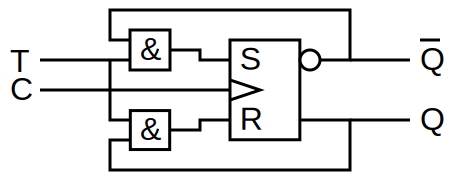

[TOC]

------

## 一、基本RS触发器

.svg)

$$
\begin{cases}
P = \overline{R \cdot {Q}} \\
Q = \overline{S \cdot \overline{Q}}
\end{cases}
$$

| $S_D$ | $R_D$ | $Q$                | $P$           |         |
| ----- | ----- | ------------------ | ------------- | ------- |
| 0     | 0     | 1                  | 1             | 不允许❌ |
| 0     | 1     | 1                  | 0             | 置数    |
| 1     | 0     | 0                  | 1             | 复位    |
| 1     | 1     | $\overline P({Q})$ | $\overline Q$ | 保持    |

- 触发器输出必须**互斥**

- 现态$Q^n$：输入信号作用前的状态

- 次态$Q^{n+1}$：输入信号输入后的状态

- 状态转移真值表（状态表）：$Q^{n+1}=f(x,Q^n)$

### 1、描述方式

- 真值表（状态表）
- 卡诺图（特征方程）
- 状态转移图（激励表）：看末尾状态来确定激励
- 波形图（时序波形）

!!! danger
	现态 $0 0$ ，次态 $1 1$ ，这时不确定输出

------

## 二、钟控的触发器

$$
\begin{cases}
CP=1，工作\\
CP=0，保持\\
\end{cases}
$$
已知：

\[
R_D = \overline{R \cdot CP}, \quad S_D = \overline{S \cdot CP}
\]

带入：

\[
\begin{cases}
Q^{n+1} = \overline{S_D} + R_D{Q^n} \\
S_D + R_D = 1
\end{cases}
\]

得到**钟控 RS 触发器**的特征方程为：

\[
\begin{cases}
Q^{n+1} = S + \overline{R} Q^n \\
R·S = 0 \quad (\text{约束条件})
\end{cases}
\]

其中 \( RS = 0 \) 表示 \( R \) 与 \( S \) 不能同时为 1。

### 1、D触发器（Delay）

- **在时钟信号的触发瞬间**，把输入端 D 的信号“锁存”到输出 Q。

D 触发器的逻辑关系极为简单：
$$
\boxed{Q_{n+1} = D}
$$
也就是说：下一时刻的输出 **等于** 当前输入 D 的值。

| 应用               | 说明                           |
| ------------------ | ------------------------------ |
| 寄存器（Register） | 存储单个二进制位               |
| 数据同步           | 在时钟边沿采样输入，防止亚稳态 |
| 计数器/移位寄存器  | 串联多个 D 触发器              |
| 状态机（FSM）      | 记录状态变量                   |

### 2、T触发器（Toggle）

**T 触发器**的名字来自 **Toggle（翻转）**，意思是：

> 当输入 T=1 时，输出 Q 在每个时钟沿**翻转一次（0→1 或 1→0）**；
>  当输入 T=0 时，输出 **保持不变**。

简言之，它的行为规则是：

| T    | 下一状态 $Q_{n+1}$ | 说明 |
| ---- | ------------------ | ---- |
| 0    | $Q_n$              | 保持 |
| 1    | $\overline{Q_n}$   | 翻转 |

$$
\boxed{Qn+1=T⊕Qn}
$$

### 3、JK触发器

| J    | K    | 下一状态 ( Q_{n+1} ) | 行为说明       |
| ---- | ---- | -------------------- | -------------- |
| 0    | 0    | $Q_n$                | 保持           |
| 0    | 1    | 0                    | 复位（Reset）  |
| 1    | 0    | 1                    | 置位（Set）    |
| 1    | 1    | $\overline{Q_n}$     | 翻转（Toggle） |

RS 触发器的方程为：
$$
Q_{n+1} = S + \overline{R}Q_n
$$
若在 S、R 的输入端加上反馈（即令）：
$$
S = J \overline{Q_n}, \quad R = K Q_n
$$
代入上式：
$$
\boxed{Q_{n+1} = J \overline{Q_n} + \overline{K Q_n} }
$$
这正是 JK 触发器的特征方程。 因此它相当于 **RS 加入反馈修正，消除非法状态**。

!!! note

    $\boxed{J=K=T}$ ，就是T触发器
    
    $\boxed{\begin{cases}J = D \overline{Q_n} \\K = \overline{D} Q_n\end{cases}}$ ，就是D触发器

------

## 三、集成触发器

### 1、边沿触发器

> 它只在 **时钟的上升沿** 或 **下降沿** 采样输入，在其他时间保持锁存（输出不变）。

| 类型                                      | 触发条件        | 波形标识 | 说明                           |
| ----------------------------------------- | --------------- | -------- | ------------------------------ |
| **上升沿触发（Positive Edge-Triggered）** | CLK 从 0→1 时刻 | ↑        | 最常用                         |
| **下降沿触发（Negative Edge-Triggered）** | CLK 从 1→0 时刻 | ↓        | 常用于双边沿系统中相位错开采样 |

------

## 四、逻辑符号和时序图