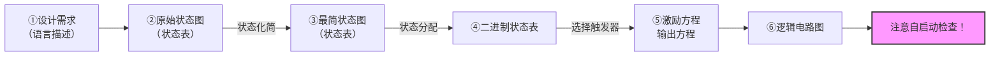

[TOC]

------

## 一、时序电路概述


$$
输出方程：Z=F(X,Q) \\
$$

$$
激励方程：Y=G(X,Q) \\
$$

$$
状态方程：Q_{n+1}=H(Y,Q)
$$

### 1、分类

- 根据时钟：
    - 同步：一个钟
    - 异步：多个钟
- 根据输出：
    - 米里（Mealy）：输出**依赖当前状态 + 输入**，==输出状态方程含输入 $x$== $Z=f(x,Q)$
    - 摩尔（Moore）：输出**只依赖当前状态**，$Z=f(Q)$

没有外部输入：摩尔型

Moore型电路的输出将比Mealy型电路晚一个时钟周期。

### 2、电路分析


$x=0$ ，实现的是 $\mod 4$ 加法，$x=1$ 实现 $\mod 4$ 减法

- 如果构成一个环，就是 $\mod x$ 计数器，因为时序电路状态永远可数
- 有效状态：环里
- 无效状态：环外
- 自启动：经过有限时间**能进入环**
- 波形图根据状态转移图绘制即可

!!! tip "分析方法"

    ```mermaid
    flowchart LR
        A[逻辑电路] --> B[① 输出方程<br/>激励方程]
        B --> C[② 状态方程]
        C --> D[③ 状态转移图]
        D --> E[逻辑功能<br/>时序波形]
    ```

### 3、典型时序逻辑电路

#### （1）寄存器（Register）

- 单拍寄存器是在 **一个时钟有效沿（上升沿或下降沿）** 完成一次数据锁存与更新的寄存器。
   特点是：
    - **一次时钟脉冲只触发一次存储动作**；
    - 电路结构简单、时序清晰；
    - 在边沿到来时瞬间采样输入，其余时间保持稳定。
- 两拍寄存器由 **两个交替导通的锁存器（主锁存器 Master + 从锁存器 Slave）** 串联构成。
   特点是：
    - 输入数据先被主锁存器锁存，再由从锁存器在下一相位输出；
    - **等效为边沿触发，但利用两相非重叠时钟控制**；
    - 能避免毛刺，提高时序稳定性。


!!! example "移位寄存器（Shift-Register）"

    - **数据移位（左移 / 右移）**
    - **串入并出 / 并入串出转换**
    - **数据暂存与延时**
    - **序列产生与序列检测**

#### （2）计数器（Counter）

计数器是一种由触发器组成的时序电路，在时钟驱动下按预定规律 **对二进制数进行自动加一、减一或按特定序列变化**。

它的主要功能是：

- **计数（加计数 / 减计数）**
- **分频**
- **产生状态序列**
- **事件/脉冲计量**

计数器的每个触发器代表计数值的一位，时钟脉冲使计数器在各状态之间自动循环。

!!! tip

	$n$ 进制计数器就要 $m$ 个计数器，$2^m\geq n$，如果大于那就需要检查是否自启动

---

## 二、时序电路设计




!!! example "设计"

    - 设计111序列检测
    - 设计余三码误码检测器
    	<svg xmlns="http://www.w3.org/2000/svg" width="800" height="480" viewBox="0 0 800 480"><defs><marker id="arrow" viewBox="0 0 10 10" refX="9" refY="5" markerWidth="6" markerHeight="6" orient="auto-start-reverse"><path d="M0 0L10 5L0 10z"/></marker><style>.state{fill:#f9fce5;stroke:#000;stroke-width:1.3;}.label{font-family:"Times New Roman",serif;font-size:18px;}.edge-label{font-family:"Times New Roman",serif;font-size:16px;}.out-label{font-family:"Times New Roman",serif;font-size:14px;}</style></defs><rect x="0" y="0" width="800" height="480" fill="#e6f5ff"/><line x1="400" y1="95" x2="250" y2="135" stroke="#000" stroke-width="1.5" marker-end="url(#arrow)"/><text x="315" y="110" class="edge-label">0/0</text><line x1="400" y1="95" x2="550" y2="135" stroke="#000" stroke-width="1.5" marker-end="url(#arrow)"/><text x="485" y="110" class="edge-label">1/0</text><line x1="250" y1="175" x2="175" y2="215" stroke="#000" stroke-width="1.5" marker-end="url(#arrow)"/><text x="205" y="190" class="edge-label">0/0</text><line x1="250" y1="175" x2="325" y2="215" stroke="#000" stroke-width="1.5" marker-end="url(#arrow)"/><text x="280" y="190" class="edge-label">1/0</text><line x1="550" y1="175" x2="475" y2="215" stroke="#000" stroke-width="1.5" marker-end="url(#arrow)"/><text x="505" y="190" class="edge-label">0/0</text><line x1="550" y1="175" x2="625" y2="215" stroke="#000" stroke-width="1.5" marker-end="url(#arrow)"/><text x="580" y="190" class="edge-label">1/0</text><line x1="175" y1="265" x2="140" y2="305" stroke="#000" stroke-width="1.5" marker-end="url(#arrow)"/><text x="145" y="280" class="edge-label">0/0</text><line x1="175" y1="265" x2="210" y2="305" stroke="#000" stroke-width="1.5" marker-end="url(#arrow)"/><text x="185" y="280" class="edge-label">1/0</text><line x1="325" y1="265" x2="290" y2="305" stroke="#000" stroke-width="1.5" marker-end="url(#arrow)"/><text x="295" y="280" class="edge-label">0/0</text><line x1="325" y1="265" x2="360" y2="305" stroke="#000" stroke-width="1.5" marker-end="url(#arrow)"/><text x="330" y="280" class="edge-label">1/0</text><line x1="475" y1="265" x2="440" y2="305" stroke="#000" stroke-width="1.5" marker-end="url(#arrow)"/><text x="450" y="280" class="edge-label">0/0</text><line x1="475" y1="265" x2="510" y2="305" stroke="#000" stroke-width="1.5" marker-end="url(#arrow)"/><text x="485" y="280" class="edge-label">1/0</text><line x1="625" y1="265" x2="590" y2="305" stroke="#000" stroke-width="1.5" marker-end="url(#arrow)"/><text x="595" y="280" class="edge-label">0/0</text><line x1="625" y1="265" x2="660" y2="305" stroke="#000" stroke-width="1.5" marker-end="url(#arrow)"/><text x="630" y="280" class="edge-label">1/0</text><line x1="140" y1="355" x2="140" y2="420" stroke="#000" stroke-width="1.5" marker-end="url(#arrow)"/><text x="120" y="380" class="out-label">0/1</text><text x="120" y="400" class="out-label">1/1</text><line x1="210" y1="355" x2="210" y2="420" stroke="#000" stroke-width="1.5" marker-end="url(#arrow)"/><text x="190" y="380" class="out-label">0/1</text><text x="190" y="400" class="out-label">1/0</text><line x1="290" y1="355" x2="290" y2="420" stroke="#000" stroke-width="1.5" marker-end="url(#arrow)"/><text x="270" y="380" class="out-label">0/0</text><text x="270" y="400" class="out-label">1/0</text><line x1="360" y1="355" x2="360" y2="420" stroke="#000" stroke-width="1.5" marker-end="url(#arrow)"/><text x="340" y="380" class="out-label">0/0</text><text x="340" y="400" class="out-label">1/0</text><line x1="440" y1="355" x2="440" y2="420" stroke="#000" stroke-width="1.5" marker-end="url(#arrow)"/><text x="420" y="380" class="out-label">0/0</text><text x="420" y="400" class="out-label">1/0</text><line x1="510" y1="355" x2="510" y2="420" stroke="#000" stroke-width="1.5" marker-end="url(#arrow)"/><text x="490" y="380" class="out-label">0/0</text><text x="490" y="400" class="out-label">1/0</text><line x1="590" y1="355" x2="590" y2="420" stroke="#000" stroke-width="1.5" marker-end="url(#arrow)"/><text x="570" y="380" class="out-label">0/0</text><text x="570" y="400" class="out-label">1/1</text><line x1="660" y1="355" x2="660" y2="420" stroke="#000" stroke-width="1.5" marker-end="url(#arrow)"/><text x="640" y="380" class="out-label">0/1</text><text x="640" y="400" class="out-label">1/1</text><circle class="state" cx="400" cy="70" r="28"/><text x="400" y="76" text-anchor="middle" class="label" fill="red">S₀</text><circle class="state" cx="250" cy="150" r="28"/><text x="250" y="156" text-anchor="middle" class="label">S₁</text><circle class="state" cx="550" cy="150" r="28"/><text x="550" y="156" text-anchor="middle" class="label">S₂</text><circle class="state" cx="175" cy="240" r="28"/><text x="175" y="246" text-anchor="middle" class="label">S₃</text><circle class="state" cx="325" cy="240" r="28"/><text x="325" y="246" text-anchor="middle" class="label">S₄</text><circle class="state" cx="475" cy="240" r="28"/><text x="475" y="246" text-anchor="middle" class="label">S₉</text><circle class="state" cx="625" cy="240" r="28"/><text x="625" y="246" text-anchor="middle" class="label">S₁₀</text><circle class="state" cx="140" cy="330" r="28"/><text x="140" y="336" text-anchor="middle" class="label">S₅</text><circle class="state" cx="210" cy="330" r="28"/><text x="210" y="336" text-anchor="middle" class="label">S₆</text><circle class="state" cx="290" cy="330" r="28"/><text x="290" y="336" text-anchor="middle" class="label">S₇</text><circle class="state" cx="360" cy="330" r="28"/><text x="360" y="336" text-anchor="middle" class="label">S₈</text><circle class="state" cx="440" cy="330" r="28"/><text x="440" y="336" text-anchor="middle" class="label">S₁₁</text><circle class="state" cx="510" cy="330" r="28"/><text x="510" y="336" text-anchor="middle" class="label">S₁₂</text><circle class="state" cx="590" cy="330" r="28"/><text x="590" y="336" text-anchor="middle" class="label">S₁₃</text><circle class="state" cx="660" cy="330" r="28"/><text x="660" y="336" text-anchor="middle" class="label">S₁₄</text></svg>


### 1、状态化简

状态简化的目的：减少触发器数目；简化组合逻辑电路 → **状态等价就可化简**
$$
2^{n-1}\leq M\leq 2^n
$$
**状态等价**：两个电路如果在相同输入下，从现在开始到永远，输出都一模一样，那么它们就是状态等价。

- 次态等同
- 次态**交错**
- 次态**互为隐含**

### 2、状态分配

