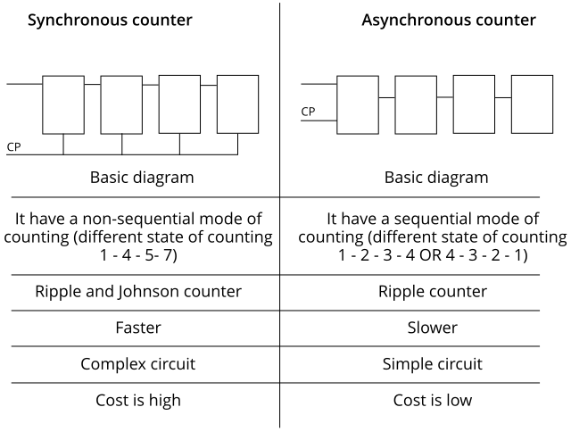
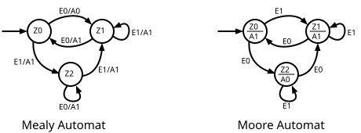
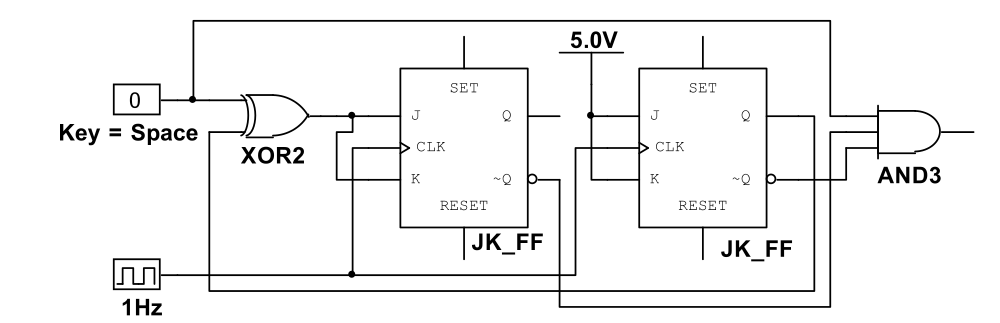
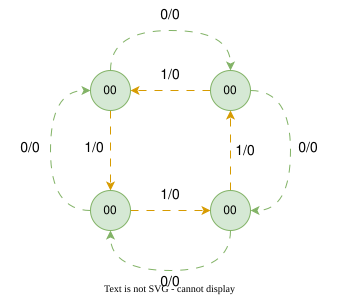
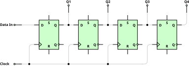
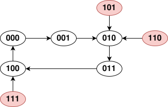
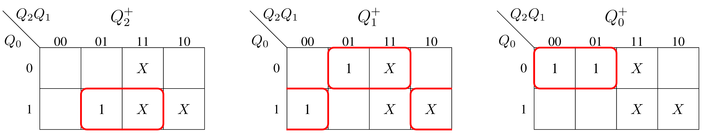
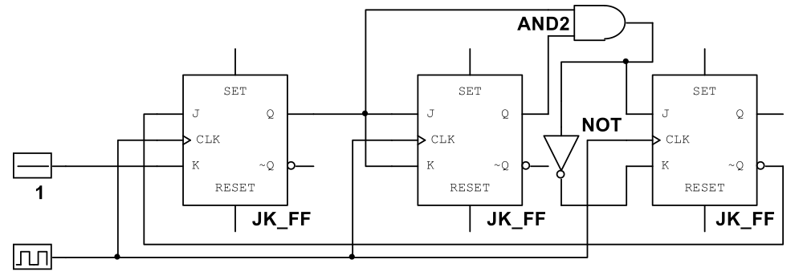
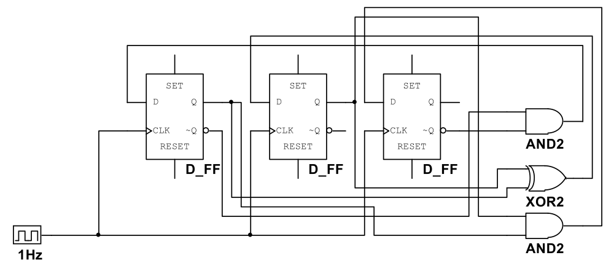

[TOC]

------

## 一、时序电路概述


$$
输出方程：Z=F(X,Q) \\
$$

$$
激励方程：Y=G(X,Q) \\
$$

$$
状态方程：Q_{n+1}=H(Y,Q)
$$


### 1、分类

- 根据时钟：
  
  

  - **同步**：一个钟
  - **异步**：多个钟

- 根据输出：
  
  
  
  - 米里（Mealy）：输出**依赖当前状态 + 输入**，==输出状态方程含输入 $x$== $Z=f(x,Q)$
  - 摩尔（Moore）：输出**只依赖当前状态**，$Z=f(Q)$

没有外部输入：Moore型

Moore型电路的输出将比Mealy型电路晚一个时钟周期。


## 二、电路分析

!!! tip "分析方法"

    ```mermaid
    flowchart LR
        A[逻辑电路] --> B[① 输出方程<br/>激励方程]
        B --> C[② 状态方程]
        C --> D[③ 状态转移图]
        D --> E[逻辑功能<br/>时序波形]
    ```

!!! success
    
    
    
    $$
    \begin{aligned}
    \text{驱动方程：}\quad
    & J_0 = K_0 = 1, \\
    & J_1 = K_1 = x \oplus Q_0
    \\[6pt]
    \text{状态方程：}\quad
    & Q_0^{+} = \overline{Q_0}, \\
    & Q_1^{+} = x \oplus Q_0 \oplus Q_1
    \\[6pt]
    \text{输出方程：}\quad
    & Z = x\,\overline{Q_1}\,\overline{Q_0}
    \end{aligned}
    $$
    
    |      | $Q_1^+Q_0^+/Z$ | $Q_1^+Q_0^+/Z$ |
    | ---- | ------------ | ---- |
    | $Q_1Q_0$ | $x=0$ | $x=1$ |
    | 00 | 01/0 | 11/1 |
    | 01 | 10/0 | 00/0 |
    | 10 | 11/0 | 01/0 |
    | 11 | 00/0 | 10/0 |
    
    
    
    $$
    f(x)=
    \begin{cases}
    x=0, & \text{四进制加法计数器}\\[6pt]
    x=1, & \text{四进制减法计数器}\\[6pt]
    \end{cases}
    $$


- 如果构成一个环，就是 $\mod x$ 计数器，因为时序电路状态永远可数
- 有效状态：环里
- 无效状态：环外
- **自启动**：经过有限时间**能进入环**
- 波形图根据**状态转移图**绘制即可


---

## 三、典型时序逻辑电路

### 1、移位寄存器（Register）

- 存储功能：存放一组二进制代码
- 移位功能：在移位脉冲作用下依次左移或者右移
- 可以实现串行输入，**串/并行输出**
- 常见集成移位寄存器 74194 见下一章



### 2、计数器（Counter）

计数器是一种由触发器组成的时序电路，在时钟驱动下按预定规律**对二进制数进行自动加一、减一或按特定序列变化**。在后面一章常用时序集成逻辑器件中也有详细介绍。

它的主要功能是：

- **计数（加计数 / 减计数）**
- **序列信号发生**

!!! tip

	$n$ 进制计数器就要 $m$ 个计数器，$2^m\geq n$，如果**大于**那就需要检查是否 ==自启动==

$$
f(\Delta)=
\begin{cases}
\text{置数}, & \text{同步}\\[6pt]
\text{清零}, & \begin{cases}\text{同步}\\[6pt]
\text{异步}
\end{cases}
\end{cases}
$$

- 谈到**同步/异步**计数器，指的是清零方式的不同，**置数方式都是同步**的。比如，常见的同步计数器（74160,74162）、异步计数器（74161，74163）
- 比如十二进制，异步清零就是接到清零端CLR $12(1100)$ ，如果是接到置数端LOAD就是 $11(1011)$ （要减一） ，因为置数永远是同步的

---

## 四、🌟时序电路设计

- 这里是使用**简单逻辑门和触发器**设计计数器，后面一张还会介绍使用集成器件设计计数器


```mermaid
flowchart LR
    A[①设计需求</br>（语言描述）] --> B[②原始状态图</br>（状态表）]
    B -->|状态分配| C[③卡诺图写方程]
    C -->|代入触发器方程| D[④激励方程 </br> 输出方程]
    D --> E[⑥逻辑电路图]

```


$$
2^{n-1}\leq M\leq 2^n\\[6pt](M表示状态数,n表示所要使用触发器数量)
$$


!!! tip

	① 给每个状态一个二进制表示
	
	② 把次态现态标到卡诺图中
	
	③ 化简卡诺图
	
	④ 化成所要使用触发器的式子
	
	⑤ 连接电路

!!! example "JK触发器设计五进制计数器"

    - 给每一个状态用二进制表示
    
    
    
    | 现态 $Q_2 Q_1 Q_0$ | 次态 $Q_2^{+} Q_1^{+} Q_0^{+}$ |
    | ------------------ | ------------------------------ |
    | 000                | 001                            |
    | 001                | 010                            |
    | 010                | 011                            |
    | 011                | 100                            |
    | 100                | 000                            |
    | 101                | X X X                          |
    | 110                | X X X                          |
    | 111                | X X X                          |
    
    - 挑出**次态**为 $1$ 的行，把**现态**标到卡诺图中去（比如 $Q_2+$ 为 $1$ 时，现态为 011，即在 011 框中填 $1$）
      - 化简卡诺图
    
    
    
    $$
    \begin{array}{c@{\qquad}c@{\qquad}c}
    \begin{aligned}
    Q_2^{n+1} &= Q_1 Q_0 \\
    Q_2^{n+1} &= J_2\,\overline{Q_2} + \overline{K_2}\,Q_2 \\
    \Rightarrow\;
    J_2 &= Q_1 Q_0 \\
    K_2 &= \overline{Q_1 Q_0}
    \end{aligned}
    &
    \begin{aligned}
    Q_1^{n+1} &= Q_1 \overline{Q_0} + \overline{Q_1} Q_0 \\
    Q_1^{n+1} &= J_1\,\overline{Q_1} + \overline{K_1}\,Q_1 \\
    \Rightarrow\;
    J_1 &= Q_0 \\
    K_1 &= Q_0
    \end{aligned}
    &
    \begin{aligned}
    Q_0^{n+1} &= \overline{Q_2}\,Q_0 \\
    Q_0^{n+1} &= J_0\,\overline{Q_0} + \overline{K_0}\,Q_0 \\
    \Rightarrow\;
    J_0 &= \overline{Q_2} \\
    K_0 &= 1
    \end{aligned}
    \end{array}
    $$
    
    - 接着把空状态代入以上方程解X（确保**自启动**）
      - 然后代入所要用的触发器表达式**解未知数**


    
    
    ??? question "用D触发器呢？"
    	$$
        \begin{array}{c@{\qquad}c@{\qquad}c}
        \begin{aligned}
        Q_2^{n+1} &= D_2 \\
        D_2 &= Q_1 Q_0
        \end{aligned}
        &
        \begin{aligned}
        Q_1^{n+1} &= D_1 \\
        D_1 &= Q_1 \overline{Q_0} + \overline{Q_1} Q_0
        \end{aligned}
        &
        \begin{aligned}
        Q_0^{n+1} &= D_0 \\
        D_0 &= \overline{Q_2}\, Q_0
        \end{aligned}
        \end{array}
        $$
    
        
