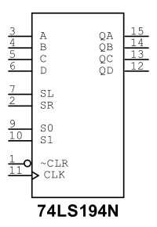
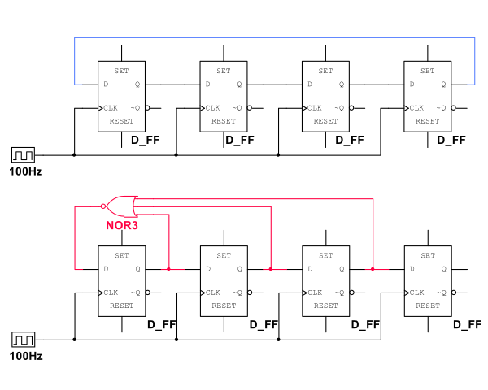

[TOC]

---

## 一、集成计数器

$$
f(\Delta)=
\begin{cases}
\text{置数}, & \text{同步}\rightarrow S_{n-1}\\[6pt]
\text{清零}, & \begin{cases}\text{同步}\rightarrow S_n\\[6pt]
\text{异步}\rightarrow S_{n-1}
\end{cases}
\end{cases}
$$

- 谈到**同步/异步**计数器，指的是清零方式的不同，**置数方式都是同步**的。比如，常见的同步计数器（74162,74163）、异步计数器（74160，74161）
- 比如十二进制，异步清零就是接到清零端CLR $12(1100)$ ，如果是接到置数端LOAD就是 $11(1011)$ （要减一） ，因为置数永远是同步的

### 1、异步计数器 74160/74161

- 注意区别：**74160是10进制，74161是16进制**，后续计算超过 $16$ 进制时需要注意
- 设计 $M$ 进制计数器时如果 $M>N$ 一般有**串行**和**并行**进位两种方法（并行进位法较容易）

| 串行进位法                            | 并行进位法                                |
| ------------------------------------- | ----------------------------------------- |
| 钟只连低位片                          | 钟同时连两片                              |
| 低位片进位输出 → 高位片的时钟输入信号 | 低位片进位输出 → 高位片的工作状态控制信号 |

#### （1）🌟并行进位法

##### **Ⅰ 清零法**

将 $\overline{Q_DQ_CQ_BQ_A}$ 视作二进制数，要几进制将其通过与非门连接回CLR清零

如果要输出**进位信号**就是 $\overline{Q_DQ_CQ_BQ_A}-1$ 时输出

---

##### **Ⅱ 置数法**

核心：$\overline{Q_DQ_CQ_BQ_A}-\overline{DCBA}+1=进制数$ ，然后将 $\overline{Q_DQ_CQ_BQ_A}$ 中为1的通过与非门连回LOAD置数（一般取 $\overline{DCBA}=0$ ，所以 $\overline{Q_DQ_CQ_BQ_A}=进制数-1$）

!!! tip "进制大于16怎么办？（**并行进位**）"
    **Ⅰ 清零法**

    拆成高位和低位，$60=6\times10+0$ ，因此高位置 $6$ ，低位置 $0$ ，低位的 RCO 进位接到高位的使能端
    
    注：如果使用74161，则拆成 $60=16\times3+12$ ，因为是16进制计数器，高位置 $3(0011)$ ，低位置 $12(1100)$
    
    
    
    **Ⅱ 置数法**
    
    拆成 $60-1=59=5\times10+9$,即 $高位=5(0101)$ ， $低位=9(1001)$
    
    

#### （2）串行进位法

- 并行进位是拆成两位然后分别置零，**串行**进位是用**低位的清零信号**触发高位的进位（**当作高位的钟**）

!!! danger "进制大于16怎么办？（**串行进位**）"
      这里举例 $47$ 进制计数器
      
      - 因为十进制所以先用两位的与非门连接低位的 $10(1010)$ ，并且连接到高位 CLK 端当作时钟信号
      - 把高位 $4(0100)$ ，低位 $7(0111)$ ，用四位与非门连接作为清零信号
      - 清零信号直接连接高位清零端 CLR
      - 清零信号和低位的十进制清零信号用与门连接再接回低位清零端 CLR
    
      

---

### 2、同步计数器 74162/74163

!!! tip
    这里会发现**同步计数器**无论是**清零法**还是**置数法**的与非门接法是一模一样的

-----

### 3、7490

- 自带**二、五、十**进制计数器
- R01、R02角高电平且R91、R92角有一个低电平**置零**
- R91、R92角高电平**置九**

- 左侧图示把 QA（÷2 的输出）接给 CLKB（÷5 的时钟输入），就得到：$整体分频 = 2 \times 5 = 10$
- 右侧图示在作图基础上增加两条蓝线实现模 $6$ 计数器：本质和74161置零法一样， $\overline{Q_DQ_CQ_BQ_A}=6=0110$ 时置零

---

## 二、集成寄存器

### 1、74194

- 74LS194 可以把 4 位数据**向左移、向右移、保持不变，或一次性并行装载**

| S1   | S0   | 功能                               |
| ---- | ---- | ---------------------------------- |
| 0    | 0    | **保持**（不变）                   |
| 0    | 1    | **右移**（SR → Q3 → Q2 → Q1 → Q0） |
| 1    | 0    | **左移**（SL → Q0 → Q1 → Q2 → Q3） |
| 1    | 1    | **并行装载（加载 D0~D3）**         |

| 引脚       | 说明                     |
| ---------- | ------------------------ |
| **A-D**    | 并行数据输入             |
| **Q0–Q3**  | 输出                     |
| **SR**     | 右移输入（Serial Right） |
| **SL**     | 左移输入（Serial Left）  |
| **CLK**    | 时钟                     |
| **S1, S0** | 模式选择                 |
| **CLR**    | 低电平清零（异步）       |

#### （1）环形计数器

- 环形计数器就是把 1 在一圈里不停地跑

- `1000 → 0100 → 0010 → 0001 → 1000 → …`

#### （2）扭环计数器

- 扭环计数器是在环形计数器的基础上多加一个“反相反馈”。

- 它不是一个 1 在跑，而是 $0$ 和 $1$ 的长度在变化，能产生 $2n$ 个状态。

- `0000 → 1000 → 1100 → 1110 → 1111 → 0111 → 0011 → 0001 → 0000 → …`

