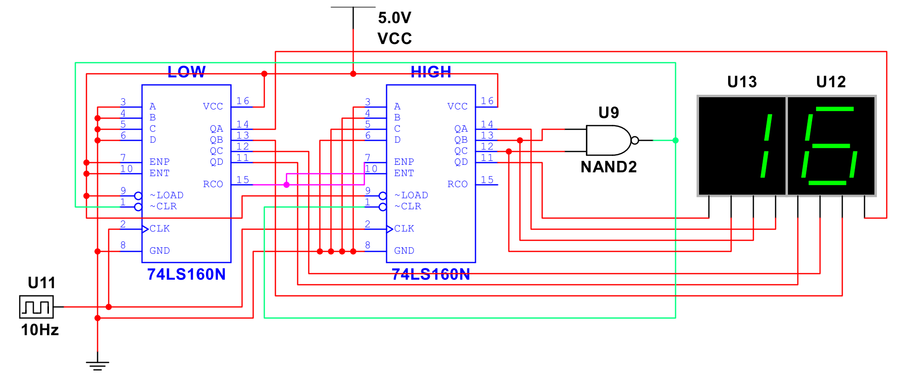
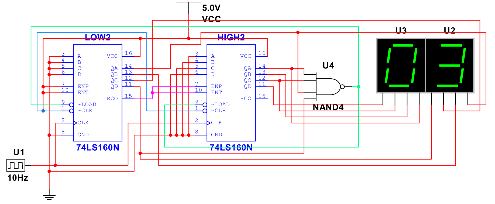

[TOC]

---

## 一、74LS161N/74160N

### 1、构造任意进制计数器

- 注意区别：**74160是10进制，74161是16进制**，后续计算超过 $16$ 进制时需要注意

**Ⅰ 清零法**

将 $\overline{Q_DQ_CQ_BQ_A}$ 视作二进制数，要几进制将其通过与非门连接回CLR清零

---

**Ⅱ 置数法**

核心：$\overline{Q_DQ_CQ_BQ_A}-\overline{DCBA}+1=进制数$ ，然后将 $\overline{Q_DQ_CQ_BQ_A}$ 中为1的通过与非门连回LOAD置数

!!! tip "进制大于16怎么办？"
    **Ⅰ 清零法**

    拆成高位和低位，$60=6\times10+0$ ，因此高位置 $6$ ，低位置 $0$ ，低位的 RCO 进位接到高位的使能端
    
    注：如果使用74161，则拆成 $60=16\times3+12$ ，因为是16进制计数器，高位置 $3(0011)$ ，低位置 $12(1100)$
    
    
    
    **Ⅱ 置数法**
    
    拆成 $60=5\times10+(10-1)$ ，不能拆成 $60=6\times10+(0-1)$ 因为低位不可能凑出 $-1$
    
    即 $高位=5(0101)$ ， $低位=9(1001)$
    
    

-----

## 二、74LS194N

- 74LS194 可以把 4 位数据**向左移、向右移、保持不变，或一次性并行装载**

| S1   | S0   | 功能                               |
| ---- | ---- | ---------------------------------- |
| 0    | 0    | **保持**（不变）                   |
| 0    | 1    | **右移**（SR → Q3 → Q2 → Q1 → Q0） |
| 1    | 0    | **左移**（SL → Q0 → Q1 → Q2 → Q3） |
| 1    | 1    | **并行装载（加载 D0~D3）**         |

| 引脚       | 说明                     |
| ---------- | ------------------------ |
| **A-D**    | 并行数据输入             |
| **Q0–Q3**  | 输出                     |
| **SR**     | 右移输入（Serial Right） |
| **SL**     | 左移输入（Serial Left）  |
| **CLK**    | 时钟                     |
| **S1, S0** | 模式选择                 |
| **CLR**    | 低电平清零（异步）       |

### 1、环形计数器

- 环形计数器就是把 1 在一圈里不停地跑

- `1000 → 0100 → 0010 → 0001 → 1000 → …`

### 2、扭环计数器

- 扭环计数器是在环形计数器的基础上多加一个“反相反馈”。

- 它不是一个 1 在跑，而是 $0$ 和 $1$ 的长度在变化，能产生 $2n$ 个状态。

- `0000 → 1000 → 1100 → 1110 → 1111 → 0111 → 0011 → 0001 → 0000 → …`

