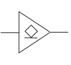

[TOC]

---

## 一、CMOS

### 1、传输门

⭐CMOS 独有

- 下 $1$ 上 $0$ 可以导通，反之不行

### 2、三态门

- 除了输出 0 和 1，它还可以输出“高阻态 Z”，相当于不参与、不拉电路、不占线。

- $$
  Y=\begin{cases}
  EN=1，Y=A\\
  EN=0，Y=Z（高阻态）\\
  \end{cases}
  $$

  

### 3、开漏门（OD）

- 当晶体管导通：输出 → 被拉到 0V
- 当晶体管截止：输出不接地 → 上拉电阻拉到 +5V → 高电平

门电路本身 **不会主动输出 1**。

!!! danger "注意"

	- CMOS 多余输入端**不能悬空**：TTL 不接相当于接高电平，CMOS 不接相当于接低电平
	
	- OD/OC门可以实现线与（把多个输出脚直接用“线”连在一起，它们的逻辑作用等价于一个 AND）

---

## 二、TTL

### 1、集电极开路门（OC）

### 2、三态门（TSL）

- 和CMOS中性质相同

$$
Y=\begin{cases}
EN=1，Y=A\\
EN=0，Y=Z（高阻态）\\
\end{cases}
$$

|        | TTL  | CMOS |
| ------ | ---- | ---- |
| 传输门 | ×    | √    |
| 三态门 | √    | √    |
| 开路门 | OC   | OD   |

---

