<h1>
    概述
</h1>

数据结构是在计算机中存储、组织数据的方式。小到变量、数组，大到线段树、平衡树，都是数据结构。

程序运行离不开数据结构，不同的数据结构又各有优劣，能够处理的问题各不相同，而根据具体问题选取合适的数据结构，可以大大提升程序的效率。所以，学习各种各样的数据结构是很有必要的。

---

[TOC]

---

## 一、数据结构基本概念

!!! note
    
    -  数据的存储结构会影响存储空间分配的方便程度
    
    -  数据的存储结构会影响对数据运算的速度 

!!!info

    🌟抽象数据类型
    
    -  **抽象数据类型**
    
        抽象数据类型(Abstract Data Type,**ADT**)是抽象数据组织及与之相关的操作👉不涉及具体实现。

---

## 二、算法基本概念

$$
程序=数据结构+算法
$$

### 算法特性

|      | 特性   | 描述                                                         |
| :--- | :----- | :----------------------------------------------------------- |
| ①    | 有穷性 | 程序可以是无穷的（这个描述似乎有误，有穷性意味着程序在有限时间内结束） |
| ②    | 确定性 | 相同输入得到相同输出                                         |
| ③    | 可行性 | 输入：0/多个；输出：1/多个                                   |
| ④    | 输入   |                                                              |
| ⑤    | 输出   |                                                              |

## 三、总结

!!!tip
	时间/空间复杂度的衡量

---
