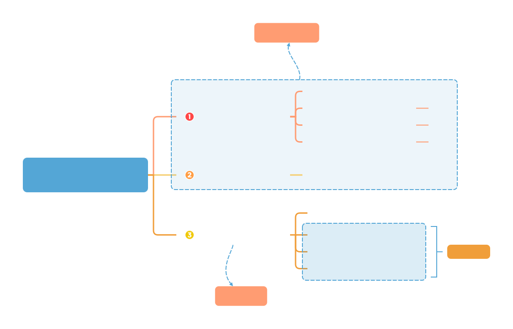
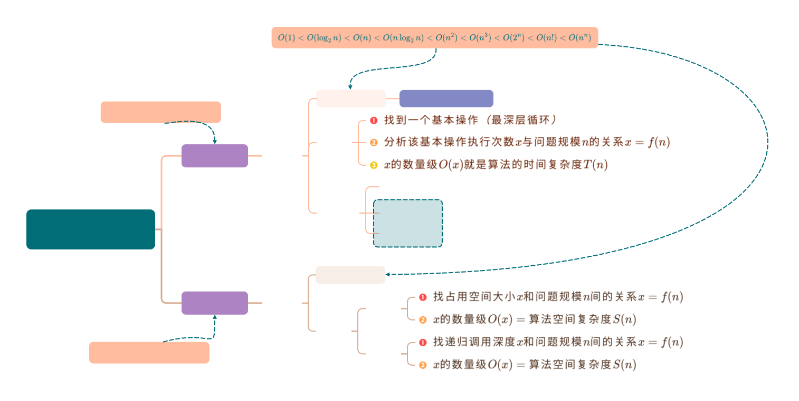

数据结构是在计算机中存储、组织数据的方式。小到变量、数组，大到线段树、平衡树，都属于数据结构。

不同的数据结构适合解决不同的问题。根据数据特点和操作需求选择合适的结构，可以显著降低程序的时间或空间开销。

---

[TOC]

---

## 一、数据结构基本概念

!!! note
    数据结构包含三个要素：**逻辑结构、存储结构和数据运算**。

    - 存储结构会影响空间分配方式。
    - 存储结构也会影响查找、插入和删除等操作的效率。

!!! info "抽象数据类型"
    抽象数据类型（Abstract Data Type，ADT）描述数据的逻辑结构以及允许执行的操作，但不规定这些操作的具体实现。

---

## 二、算法基本概念

$$
程序=数据结构+算法
$$

### 算法特性

|      | 特性   | 描述                                                   |
| :--- | :----- | :----------------------------------------------------- |
| ①    | 有穷性 | 执行有限个步骤后结束                                   |
| ②    | 确定性 | 每条指令含义明确，相同输入按照同一过程得到相同输出     |
| ③    | 可行性 | 每个步骤都能通过有限次基本运算完成                     |
| ④    | 输入   | 可以有零个或多个输入                                   |
| ⑤    | 输出   | 至少产生一个输出                                       |

## 三、总结

!!! tip "时间与空间复杂度"
    分析算法时，重点关注输入规模增大后，运行时间和额外空间如何增长，而不是只比较某一次运行的绝对耗时。

---
