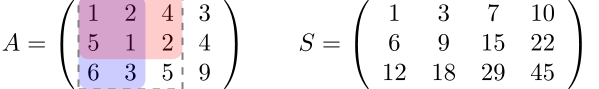

<h1>
    前缀和
</h1>

[TOC]

---

## 一、解释

```c++
// 原始数组：
coins[] = {0, 3, 5, 2, 1, 4}

// 前缀和计算过程：
prefix[1] = prefix[0] + coins[1] = 0 + 3 = 3
prefix[2] = prefix[1] + coins[2] = 3 + 5 = 8
prefix[3] = prefix[2] + coins[3] = 8 + 2 = 10
prefix[4] = prefix[3] + coins[4] = 10 + 1 = 11
prefix[5] = prefix[4] + coins[5] = 11 + 4 = 15

// 求区间[L,R]的和的公式：
sum = prefix[R] - prefix[L-1]

//例如求[2,4]的和：
sum = prefix[4] - prefix[1] = 11 - 3 = 8
```

## 二、一维前缀和

```c++
// 一维前缀和的标准模板
const int N = 100010;
int a[N];     // 原始数组
int s[N];     // 前缀和数组
int n;        // 数组长度

// 1. 构建前缀和
s[0] = 0;  // 初始化，防止越界（重要！）
for(int i = 1; i <= n; i++) {
    s[i] = s[i-1] + a[i];
}

// 2. 区间和查询
// 查询区间[l,r]的和
int query(int l, int r) {
    return s[r] - s[l-1];
}
```

!!! tip
	用来计算**连续**数字的和👉提高效率

## 三、二维前缀和


```c++
// 二维前缀和模板
const int N = 1010;
int a[N][N];    // 原始数组
int s[N][N];    // 前缀和数组

// 构建二维前缀和
void init(int n, int m) {
    for(int i = 1; i <= n; i++) {
        for(int j = 1; j <= m; j++) {
            s[i][j] = s[i-1][j] + s[i][j-1] - s[i-1][j-1] + a[i][j];
        }
    }
}

// 查询子矩阵和 (x1,y1)到(x2,y2)
int query(int x1, int y1, int x2, int y2) {
    return s[x2][y2] - s[x2][y1-1] - s[x1-1][y2] + s[x1-1][y1-1];
}
```

---

## 例题

### e.g.18【深进1.例1】求区间和

题目描述

给定 $n$ 个正整数组成的数列 $a_1, a_2, \cdots, a_n$ 和 $m$ 个区间 $[l_i,r_i]$，分别求这 $m$ 个区间的区间和。

对于所有测试数据，$n,m\le10^5,a_i\le 10^4$

输入格式

第一行，为一个正整数 $n$ 。

第二行，为 $n$ 个正整数 $a_1,a_2, \cdots ,a_n$

第三行，为一个正整数 $m$ 。

接下来 $m$ 行，每行为两个正整数 $l_i,r_i$ ，满足$1\le l_i\le r_i\le n$

输出格式

共 $m$ 行。

第 $i$ 行为第 $i$ 组答案的询问。

样例 

样例输入 

```
4
4 3 2 1
2
1 4
2 3
```

样例输出 

```
10
5
```

提示

样例解释：第 $1$ 到第 $4$ 个数加起来和为 $10$。第 $2$ 个数到第 $3$ 个数加起来和为 $5$。

对于 $50 \%$ 的数据：$n,m\le 1000$；

对于 $100 \%$ 的数据：$1 \le n, m\le 10^5$，$1 \le a_i\le 10^4$

```c++
#include <bits/stdc++.h>
using namespace std;
int main() {
    int n, m;
    cin >> n;
    int arr[100000];
    int s[100000];
    for (int i = 1; i <= n; i++) {
        cin >> arr[i];
    }
    for (int i = 1; i <= n; i++) {
        s[i] = s[i - 1] + arr[i]; // 前缀和
    }
    cin >> m;
    while (m--) {
        int l, r;
        cin >> l >> r;
        cout << s[r] - s[l - 1] << endl;
    }
    return 0;
}
```

---

### e.g.19 [蓝桥杯 2022 省 A] 求和

题目描述

给定 $n$ 个整数 $a_{1}, a_{2}, \cdots, a_{n}$, 求它们两两相乘再相加的和，即

$$
S=a_{1} \cdot a_{2}+a_{1} \cdot a_{3}+\cdots+a_{1} \cdot a_{n}+a_{2} \cdot a_{3}+\cdots+a_{n-2} \cdot a_{n-1}+a_{n-2} \cdot a_{n}+a_{n-1} \cdot a_{n}
$$

输入格式

输入的第一行包含一个整数 $n$ 。

第二行包含 $n$ 个整数 $a_{1}, a_{2}, \cdots a_{n}$ 。

输出格式

输出一个整数 $S$，表示所求的和。请使用合适的数据类型进行运算。

样例 

样例输入 

```
4
1 3 6 9
```

样例输出 

```
117
```

提示

对于 $30 \%$ 的数据, $1 \leq n \leq 1000,1 \leq a_{i} \leq 100$ 。

对于所有评测用例, $1 \leq n \leq 2\times10^5,1 \leq a_{i} \leq 1000$ 。 

蓝桥杯 2022 省赛 A 组 C 题。

```c++
#include <bits/stdc++.h>
using namespace std;
typedef long long ll;
ll n, ans, a[1000000], s[1000000];
int main() {
    int n;
    cin >> n;
    for (int i = 1; i <= n; i++) {
        cin >> a[i];
    }
    for (int i = 1; i <= n; i++) { // 循环计算前缀和
        s[i] = s[i - 1] + a[i];    // 前缀和s[i]是当前元素a[i]加上前一个前缀和s[i-1]
    }
    for (int i = 1; i <= n; i++) {   // 循环计算最终结果
        ans += a[i] * (s[n] - s[i]); // 对于每个元素a[i]，计算其与剩余所有元素的和的乘积，累加到ans
    }
    cout << ans;
}
```

---

### e.g.20 可获得的最小值

问题描述

妮妮学姐手头有一个长度为 $n$ 的数组 $a$，她想进行 $k$ 次操作来取出数组中的元素。每次操作必须选择以下两种操作之一：

- 取出数组中的最大元素。
- 取出数组中的最小元素和次小元素。

妮妮学姐希望在进行完 $k$ 次操作后，取出的数的和最小。她感觉有些困难，于是请擅长贪心的你帮助她解决这个问题。

输入格式

第一行输入两个整数$n$和$k$ ，表示数组长度和操作次数。

第二行输入$n$个整数表示数组 $a$ 。

数据范围保证 $3≤n≤2×10^5，1≤a_i≤10^9，1≤k≤99999，2k<n$ 。

输出格式

样例输入

```
5 1
2 5 1 10 6
```

样例输出

```
3
```

说明

对于样例，我们通过操作 $2$取出 $1$ 和 $2$ 可以获得最小值

```c++
#include <bits/stdc++.h>
using namespace std;
typedef long long ll;
const int N = 2e5 + 10;
ll n, k, ans, a[N], s[N];
int main() {
    cin >> n >> k;
    for (int i = 1; i <= n; i++)
        cin >> a[i];
    sort(a + 1, a + 1 + n);
    for (int i = 1; i <= n; i++)
        s[i] = s[i - 1] + a[i];
    ll ans = 1e18;
    for (int i = 0; i <= k; i++)
        ans = min(ans, s[n] - s[n - i] + s[2 * k - 2 * i]);
    cout << ans << endl;
    return 0;
}
```

---

### e.g.21 [蓝桥杯 2024 省 A] 训练士兵

题目描述

在蓝桥王国中，有 $n$ 名士兵，这些士兵需要接受一系列特殊的训练，以提升他们的战斗技能。对于第 $i$ 名士兵来说，进行一次训练所需的成本为 $p_i$ 枚金币，而要想成为顶尖战士，他至少需要进行 $c_i$ 次训练。  
为了确保训练的高效性，王国推出了一种组团训练的方案。该方案包含每位士兵所需的一次训练，且总共只需支付 $S$ 枚金币（组团训练方案可以多次购买，即士兵可以进行多次组团训练）。  
作为训练指挥官，请你计算出最少需要花费多少金币，才能使得所有的士兵都成为顶尖战士？

输入格式

输入的第一行包含两个整数 $n$ 和 $S$，用一个空格分隔，表示士兵的数量和进行一次组团训练所需的金币数。  
接下来的 $n$ 行，每行包含两个整数 $p_i$ 和 $c_i$，用一个空格分隔，表示第 $i$ 名士兵进行一次训练的金币成本和要成为顶尖战士所需的训练次数。

输出格式

输出一行包含一个整数，表示使所有士兵成为顶尖战士所需的最少金币数。

样例 

样例输入 

```
3 6
5 2
2 4
3 2
```

样例输出 

```
16
```

提示

花费金币最少的训练方式为：进行 $2$ 次组团训练，花费 $2 × 6 = 12$ 枚金币，此时士兵 $1, 3$ 已成为顶尖战士；再花费 $4$ 枚金币，让士兵 $2$ 进行两次训练，成为顶尖战士。总花费为 $12 + 4 = 16$。

对于 $40\%$ 的评测用例，$1 ≤ n ≤ 10^3，1 ≤ p_i
, c_i ≤ 10^5，1 ≤ S ≤ 10^7$。

对于所有评测用例，$1 ≤ n ≤ 10^5，1 ≤ p_i
, c_i ≤ 10^6，1 ≤ S ≤ 10^{10}$。

---

### e.g.22 领地选择

题目描述

作为在虚拟世界里统帅千军万马的领袖，小 Z 认为天时、地利、人和三者是缺一不可的，所以，谨慎地选择首都的位置对于小 Z 来说是非常重要的。

首都被认为是一个占地 $C\times C$ 的正方形。小 Z 希望你寻找到一个合适的位置，使得首都所占领的位置的土地价值和最高。

输入格式

第一行三个整数 $N,M,C$，表示地图的宽和长以及首都的边长。

接下来 $N$ 行每行 $M$ 个整数，表示了地图上每个地块的价值。价值可能为负数。

输出格式

一行两个整数 $X,Y$，表示首都左上角的坐标。

样例 

样例输入 

```
3 4 2
1 2 3 1
-1 9 0 2
2 0 1 1
```

样例输出 

```
1 2
```

提示

对于 $60\%$ 的数据，$N,M\le 50$。

对于 $90\%$ 的数据，$N,M\le 300$。

对于 $100\%$ 的数据，$1\le N,M\le 10^3$，$1\le C\le \min(N,M)$。

```c++
#include <bits/stdc++.h>
using namespace std;
const int n = 1005;
int N, M, C, a[n][n], s[n][n], ansX, ansY;
int main() {
    cin >> N >> M >> C;
    for (int i = 1; i <= N; i++) {
        for (int j = 1; j <= M; j++) {
            cin >> a[i][j];
        }
    }
    // 构建二维前缀和
    for (int i = 1; i <= N; i++) {
        for (int j = 1; j <= M; j++) {
            s[i][j] = s[i - 1][j] + s[i][j - 1] - s[i - 1][j - 1] + a[i][j];
        }
    }
    /*
    思路：
    x2=x1+C-1
    y2=y1+C-1
    return s[x2][y2] - s[x2][y1-1] - s[x1-1][y2] + s[x1-1][y1-1];
    */
    int maxVal = -1e9;
    for (int x1 = 1; x1 <= N - C + 1; x1++) { // 千万注意截至边界
        for (int y1 = 1; y1 <= M - C + 1; y1++) {
            int temp = s[x1 + C - 1][y1 + C - 1] - s[x1 + C - 1][y1 - 1] - s[x1 - 1][y1 + C - 1] + s[x1 - 1][y1 - 1];
            if (temp > maxVal) {
                maxVal = temp;
                ansX = x1;
                ansY = y1;
            }
        }
    }
    cout << ansX << " " << ansY;
}
```

