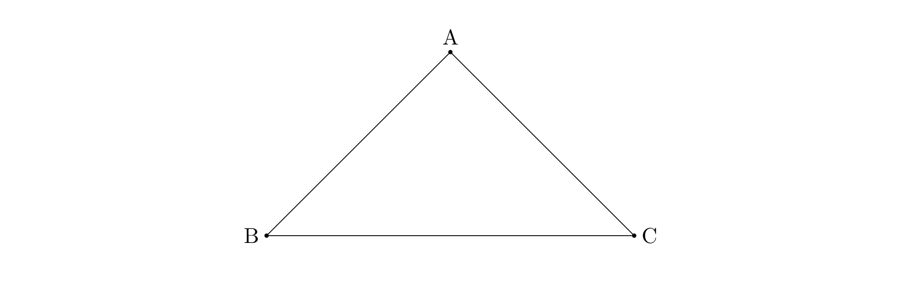

<h1>
    最小生成树
</h1>


[TOC]

---

## 1、概念

- 生成树：用$n-1$条边连接$n$个点
- 最小生成树：连接的边权值之和最小，且不成环

---

## 2、两种算法（贪心）

### （1）$Kruskal$算法

!!! tip
     排序＋并查集

把权值从小到大排序，检查是否在同一棵树上，不是则连接，是则继续遍历其余权值

复杂度：$m\log n\Rightarrow 适用于稀疏图$

### （2）$Prim$算法

任意起点，寻找和该整体连接的最小权值

复杂度：$n\log m\Rightarrow 适用于稠密图（点少边多）$

!!! note
     边很多，$Kruskal$复杂度略差

---

## 例题

### e.g.68 【模板】最小生成树

题目描述

如题，给出一个无向图，求出最小生成树，如果该图不连通，则输出 `orz`。

输入格式

第一行包含两个整数 $N,M$，表示该图共有 $N$ 个结点和 $M$ 条无向边。

接下来 $M$ 行每行包含三个整数 $X_i,Y_i,Z_i$，表示有一条长度为 $Z_i$ 的无向边连接结点 $X_i,Y_i$。

输出格式

如果该图连通，则输出一个整数表示最小生成树的各边的长度之和。如果该图不连通则输出 `orz`。

样例 

样例输入 

```
4 5
1 2 2
1 3 2
1 4 3
2 3 4
3 4 3
```

样例输出 

```
7
```

提示

数据规模：

对于 $20\%$ 的数据，$N\le 5$，$M\le 20$。

对于 $40\%$ 的数据，$N\le 50$，$M\le 2500$。

对于 $70\%$ 的数据，$N\le 500$，$M\le 10^4$。

对于 $100\%$ 的数据：$1\le N\le 5000$，$1\le M\le 2\times 10^5$，$1\le Z_i \le 10^4$。


=== "$Kruskal$"
    ```c++
    #include <bits/stdc++.h>
    using namespace std;
    const int N = 5e3 + 10, M = 2e5 + 10;
    struct edge {
        int x, y, w;
    } e[M];
    int n, m, ans, cnt, s[N];
    bool cmp(edge e1, edge e2) {
        return e1.w < e2.w;
    }
    // 并查集路径压缩
    int find_set(int k) {
        if (k != s[k])
            s[k] = find_set(s[k]);
        return s[k];
    }
    int main() {
        cin >> n >> m;
        for (int i = 1; i <= m; i++)
            cin >> e[i].x >> e[i].y >> e[i].w;
        sort(e + 1, e + 1 + m, cmp); // 按权值排序
        for (int i = 1; i <= n; i++)
            s[i] = i;
        // Kruskal算法
        for (int i = 1; i <= m; i++) {
            int nx = find_set(e[i].x), ny = find_set(e[i].y);
            if (nx != ny) {
                s[nx] = ny;
                ans += e[i].w, cnt++;
            }
        }
        if (cnt == n - 1)
            cout << ans << endl;
        else
            cout << "orz" << endl;
        return 0;
    }
    ```
=== "$Prim$"
    ```c++
    #include <bits/stdc++.h>
    using namespace std;
    typedef pair<int, int> pii;
    const int N = 5e3 + 10, M = 2e5 + 10;
    int n, m, ans, cnt, dis[N];
    bool vis[N];
    vector<pii> v[N];
    priority_queue<pii, vector<pii>, greater<pii>> q;
    int main() {
        cin >> n >> m;
        for (int i = 1; i <= m; i++) {
            int x, y, w;
            cin >> x >> y >> w;
            v[x].push_back({w, y});
            v[y].push_back({w, x});
        }
        memset(dis, 0x3f, sizeof(dis));
        dis[1] = 0;
        q.push({0, 1});
        while (!q.empty()) {
            pii now = q.top();
            q.pop();
            int x = now.second;
            if (vis[x])
                continue;
            vis[x] = 1;
            ans += now.first;
            cnt++;
            for (int i = 0; i < v[x].size(); i++) {
                int nx = v[x][i].second;
                int w = v[x][i].first;
                if (dis[nx] > w) {
                    dis[nx] = w;
                    if (vis[nx] == 0)
                        q.push({dis[nx], nx});
                }
            }
        }
        cnt--;
        if (cnt == n - 1)
            cout << ans << endl;
        else
            cout << "orz" << endl;
        return 0;
    }
    ```

---

### e.g.69 无线通讯网

题目描述

国防部计划用无线网络连接若干个边防哨所。2 种不同的通讯技术用来搭建无线网络；

每个边防哨所都要配备无线电收发器；有一些哨所还可以增配卫星电话。

任意两个配备了一条卫星电话线路的哨所（两边都有卫星电话）均可以通话，无论他们相距多远。而只通过无线电收发器通话的哨所之间的距离不能超过 $D$，这是受收发器的功率限制。收发器的功率越高，通话距离 $D$ 会更远，但同时价格也会更贵。

收发器需要统一购买和安装，所以全部哨所只能选择安装一种型号的收发器。换句话说，每一对哨所之间的通话距离都是同一个 $D$。你的任务是确定收发器必须的最小通话距离 $D$，使得每一对哨所之间至少有一条通话路径（直接的或者间接的）。

输入格式

第一行，$2$ 个整数 $S$ 和 $P$，$S$ 表示可安装的卫星电话的哨所数，$P$ 表示边防哨所的数量。

接下里 $P$ 行，每行两个整数 $x，y$ 描述一个哨所的平面坐标 $(x, y)$，以 km 为单位。

输出格式

第一行，$1$ 个实数 $D$，表示无线电收发器的最小传输距离，精确到小数点后两位。

样例 

样例输入 

```
2 4
0 100
0 300
0 600
150 750
```

样例输出 

```
212.13
```

提示

数据范围及约定

- 对于 $20\%$ 的数据：$P = 2，S = 1$；
- 对于另外 $20\%$ 的数据：$P = 4，S = 2$；
- 对于 $100\%$ 的数据保证：$1 ≤ S ≤ 100$，$S < P ≤ 500$，$0 ≤ x,y ≤ 10000$。

??? tip
    > 求最大的边的权值，有卫星电话的权值为0

```c++
#include <bits/stdc++.h>
using namespace std;
typedef pair<int, int> pii;
const int N = 505, M = 3e5 + 10;
struct edge {
    int x, y;
    double w;
} e[M];
int k, n, cnt, s[N];
double ans[M];
pii p[N];
bool cmp(edge e1, edge e2) {
    return e1.w < e2.w;
}
int find_set(int k) {
    if (k != s[k])
        s[k] = find_set(s[k]);
    return s[k];
}
int main() {
    cin >> k >> n;
    for (int i = 1; i <= n; i++)
        cin >> p[i].first >> p[i].second;
    for (int i = 1; i <= n; i++)
        for (int j = i + 1; j <= n; j++) {
            e[++cnt].x = i, e[cnt].y = j;
            e[cnt].w = sqrt((p[i].first - p[j].first) * (p[i].first - p[j].first) +
                            (p[i].second - p[j].second) * (p[i].second - p[j].second));
        }
    sort(e + 1, e + 1 + cnt, cmp);
    for (int i = 1; i <= n; i++)
        s[i] = i;
    int num = 0;
    for (int i = 1; i <= cnt; i++) {
        int nx = find_set(e[i].x), ny = find_set(e[i].y);
        if (nx != ny) {
            s[nx] = ny;
            ans[++num] = e[i].w;
        }
    }
    if (k == 1)
        printf("%.2lf", ans[num]);
    else
        printf("%.2lf", ans[max(0, num - k + 1)]);
    return 0;
}
```

---

### ⭐e.g.70 公路修建

题目描述

某国有 $n$ 个城市，它们互相之间没有公路相通，因此交通十分不便。为解决这一“行路难”的问题，政府决定修建公路。修建公路的任务由各城市共同完成。

修建工程分若干轮完成。在每一轮中，每个城市选择一个与它最近的城市，申请修建通往该城市的公路。政府负责审批这些申请以决定是否同意修建。

政府审批的规则如下：

1. 如果两个或以上城市申请修建同一条公路，则让它们共同修建；
2. 如果三个或以上的城市申请修建的公路成环。如下图，A 申请修建公路 AB，B 申请修建公路 BC，C 申请修建公路 CA。则政府将否决其中最短的一条公路的修建申请； 
3. 其他情况的申请一律同意。



一轮修建结束后，可能会有若干城市可以通过公路直接或间接相连。这些可以互相连通的城市即组成“城市联盟”。在下一轮修建中，每个“城市联盟”将被看作一个城市，发挥一个城市的作用。

当所有城市被组合成一个“城市联盟”时，修建工程也就完成了。

你的任务是根据城市的分布和前面讲到的规则，计算出将要修建的公路总长度。

输入格式

第一行一个整数 $n$，表示城市的数量。（$n \leq 5000$）

以下 $n$ 行，每行两个整数 $x$ 和 $y$，表示一个城市的坐标。（$-10^6 \leq x,y \leq 10^6$）

输出格式

一个实数，四舍五入保留两位小数，表示公路总长。（保证有唯一解）

样例 

样例输入 

```
4
0 0
1 2
-1 2
0 4
```

样例输出 

```
6.47
```

提示

修建的公路如图所示：


```c++
#include <bits/stdc++.h>
using namespace std;
typedef long long ll;
typedef pair<double, ll> pii;
const int N = 5e3 + 10;
struct node {
    ll x, y;
} e[N];
ll n;
double ans, dis[N];
bool vis[N];
priority_queue<pii, vector<pii>, greater<pii>> q;
double cal(int i, int j) {
    return sqrt((e[i].x - e[j].x) * (e[i].x - e[j].x) + (e[i].y - e[j].y) * (e[i].y - e[j].y));
}
int main() {
    cin >> n;
    for (int i = 1; i <= n; i++)
        cin >> e[i].x >> e[i].y;
    for (int i = 1; i <= n; i++)
        dis[i] = 1e18;
    dis[1] = 0;
    q.push({0, 1});
    while (!q.empty()) {
        pii now = q.top();
        q.pop();
        int x = now.second;
        if (vis[x])
            continue;
        vis[x] = 1;
        ans += now.first;
        for (int i = 1; i <= n; i++) {
            if (!vis[i] && dis[i] > cal(x, i)) {
                dis[i] = cal(x, i);
                q.push({dis[i], i});
            }
        }
    }
    printf("%.2lf", ans);
    return 0;
}
```