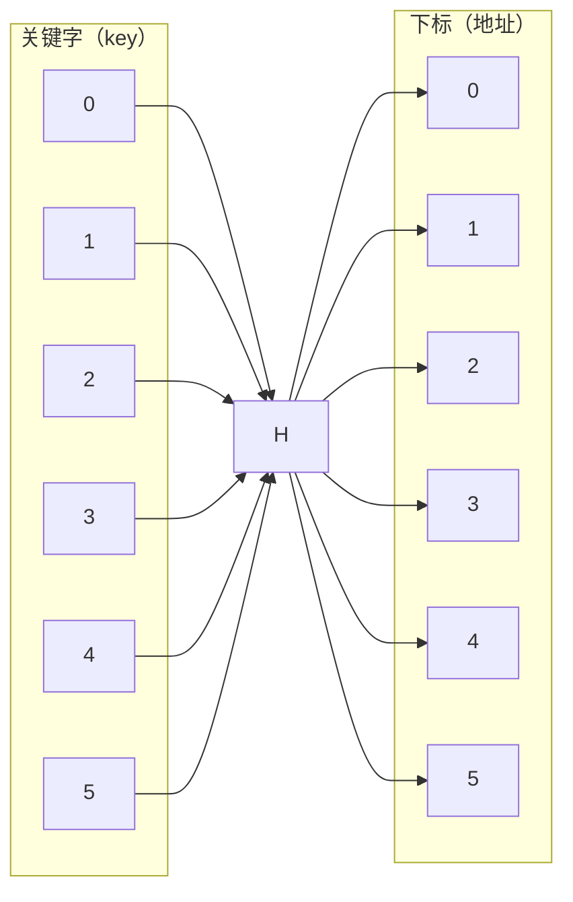

<h1>
    散列查找
</h1>

[TOC]

---

## 一、散列表

- 普通查找 $O(n)$ 复杂度
- 散列查找 $O(1)$ 复杂度

---

## 二、散列函数

### （1）恒等函数

- 会造成**空间浪费**

### （2）直接定址法

- 关键字连续更好

- $$
  H(key)=a\times key+b
  $$

  

### （3）除留余数法

- $p$ 取小于表长的**最大质数**

- $$
  H(key)=key \%p
  $$

- **同义词**会产生**冲突**

- **装填因子** $\alpha$：表中元素数量/表长

    - 装填因子越大，越容易冲突
    - 装填因子越小，越不容易冲突

---

## 三、冲突处理 - 开放定址法

### （1）线性探测法

- 冲突后一次探测下一个空闲位置
- 插值和插入时一样：先用除留余数法找到那个位置，如果不等依次向后比较，直到**第一个空位置**的就说明不存在

!!! example "ASL"

    这里用 $key\mod11$ 举例

    | H(key) | 0  | 1  | 2 | 3  | 4 | 5 | 6 | 7 | 8  | 9 | 10 | 11 | 12 |
    |--------|----|----|---|----|---|---|---|---|----|---|----|----|----|
    | key    | 11 | 30 |   | 47 |   |   |   | 7 | 29 | 9 | 84 | 54 | 20 |
    | 冲突次数   | 0  | 6  |   | 0  |   |   |   | 0 | 1  | 0 | 3  | 1  | 3  |
    
    - **ASLs（成功查找）**：查找的元素**在表中存在**时的平均比较次数。
    
    - **ASLu（不成功查找）**：查找的元素**不在表中**时，探测到表满或确认不存在所需的平均比较次数。
    
    - 成功查找时，每个元素查找时所需比较次数为：**冲突次数 + 1**
    
    - 对所有**元素**的查找次数求平均：
    
    $\text{ASLs} = \frac{1+7+1+1+2+1+4+2+4}{9} = \frac{23}{9} ≈ \boxed{2.56}$
    
    - 不成功查找表示关键字不在表中。
      
    - 要统计**对所有空位置的探测长度**平均。
      
    - 对于表长取平均
    
    $\text{ASLu} = \frac{3+2+1+2+1+1+1+9+8+7+6+5+4}{13} = \frac{50}{13} ≈ \boxed{3.85}$

---

