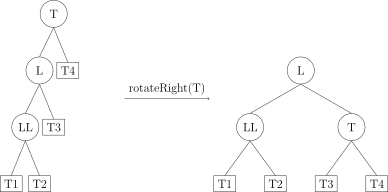
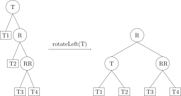
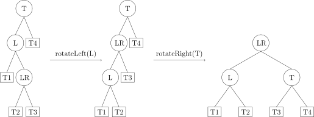

[TOC]

---

## 1、概念

- 前提：二叉搜索树
- 对于任意节点：

$$
平衡因子=|左子树高度-右子树高度|\leq 1
$$

- 操作：**左旋、右旋**
    - 左旋：冲突的左孩变成右孩
    - 右旋：冲突的右子变成左孩
    
---

## 2、失衡类型
- LL 型：T 的左孩子的左子树过长导致平衡性破坏。



- RR 型：与 LL 型类似，T 的右孩子的右子树过长导致平衡性破坏。



- LR 型：T 的左孩子的右子树过长导致平衡性破坏。



- RL 型：与 LR 型类似，T 的右孩子的左子树过长导致平衡性破坏。


  | 类型   | 标志                                | 操作                 |
  | ------ | ----------------------------------- | -------------------- |
  | **LL** | 失衡节点：2<br>失衡节点左孩子：1    | 右旋                 |
  | **RR** | 失衡节点：-2<br/>失衡节点右孩子：-1 | 左旋                 |
  | **LR** | 失衡节点：2<br/>失衡节点左孩子：-1  | 左旋左孩子，然后右旋 |
  | **RL** | 失衡节点：-2<br/>失衡节点右孩子：1  | 右旋右孩子，然后左旋 |

  ```mermaid
  graph LR
      A[失衡结点<br>平衡因子=2] --> B[L型]
      B --> C1[左孩子<br>平衡因子=1]
      C1 --> D1[LL型]
      B --> C2[左孩子<br>平衡因子=-1]
      C2 --> D2[LR型]
  
      E[失衡结点<br>平衡因子=-2] --> F[R型]
      F --> G1[右孩子<br>平衡因子=1]
      G1 --> H1[RL型]
      F --> G2[右孩子<br>平衡因子=-1]
      G2 --> H2[RR型]
  
  ```


!!! tip
    **插入**时遇到多个节点失衡，调整距离插入节点最接近的失衡节点即可

---

## 例题

### e.g. 平衡二叉树的插入

编写程序实现平衡二叉树AVL树。

输入：第一行为一个正整数N代表二叉树序列长度；第二行为N个数字，中间用空格分开，代表输入的N个二叉树顺序。

输出：生成的平衡二叉树序列，先序排列，以#表示空结点。

样例

样例输入

```
9
25 16 30 -5 20 28 20 42 35
```

样例输出

```
25 16 -5 # # 20 20 # # # 30 28 # # 42 35 # # #
```

样例输入

```
16
3 2 1 4 5 6 7 16 15 14 13 12 11 10 8 9
```

样例输出

```
7 4 2 1 # # 3 # # 6 5 # # # 13 11 9 8 # # 10 # # 12 # # 15 14 # # 16 # # 
```

```c++
#include <bits/stdc++.h>
using namespace std;

// 结构体存放二叉搜索树
struct TreeNode {
    int data;
    struct TreeNode *left;
    struct TreeNode *right;
    int height; // 当前节点高度，用于计算平衡因子
};

// 计算节点的高度
int height(TreeNode *node) {
    return node ? node->height : 0;
}
int getHeight(TreeNode *node) {
    node->height = max(height(node->left), height(node->right)) + 1;
    return node->height;
}

int getBalance(TreeNode *node) {
    return height(node->left) - height(node->right);
}

// 创建空二叉搜索树
TreeNode *createTree(int data) {
    TreeNode *node = new TreeNode;
    node->data = data;
    node->left = node->right = NULL;
    node->height = 1;
    return node;
}

// 左旋函数
TreeNode *leftRotate(TreeNode *root) {
    TreeNode *temp1 = root->right;
    TreeNode *temp2 = temp1->left;

    temp1->left = root;
    root->right = temp2;

    root->height = max(height(root->left), height(root->right)) + 1;
    temp1->height = max(height(temp1->left), height(temp1->right)) + 1;

    return temp1;
}

// 右旋函数
TreeNode *rightRotate(TreeNode *root) {
    TreeNode *temp1 = root->left;
    TreeNode *temp2 = temp1->right;

    temp1->right = root; // 左孩子的右孩子变为根节点
    root->left = temp2;  // 根节点的左孩子变为左孩子的右孩子

    root->height = max(height(root->left), height(root->right)) + 1;
    temp1->height = max(height(temp1->left), height(temp1->right)) + 1;

    return temp1; // 返回新的根节点temp1
}

// 二叉搜索树的插入，具有平衡性的
TreeNode *insert(TreeNode *root, int data) {
    if (!root) {
        root = createTree(data);
        return root;
    }
    if (data > root->data) {
        root->right = insert(root->right, data);
    }
    if (data <= root->data) {
        root->left = insert(root->left, data);
    }

    getHeight(root);                // 更新节点高度
    int balance = getBalance(root); // 计算平衡因子

    // LL
    if (balance > 1 && data < root->left->data) {
        return rightRotate(root);
    }
    // RR
    if (balance < -1 && data > root->right->data) {
        return leftRotate(root);
    }
    // LR
    if (balance > 1 && data > root->left->data) {
        root->left = leftRotate(root->left);
        return rightRotate(root);
    }
    // RL
    if (balance < -1 && data < root->right->data) {
        root->right = rightRotate(root->right);
        return leftRotate(root);
    }
    return root;
}

// 先序遍历
void preorder(TreeNode *root) {
    if (!root) {
        cout << "# ";
        return; // 是空节点也不能往下走了
    }
    cout << root->data << " ";
    preorder(root->left);
    preorder(root->right);
}

int main() {
    int N;
    cin >> N;
    TreeNode *root = nullptr;
    for (int i = 0; i < N; i++) {
        int data;
        cin >> data;
        root = insert(root, data); // 一定是root，因为要返回根节点
    }
    preorder(root);
}
```

---

